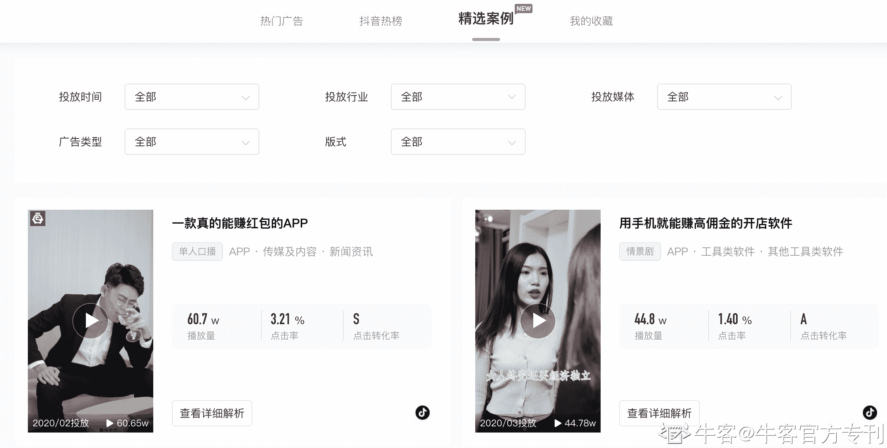

# 第二章 第 2 节 商业产品运营的定义

> 原文：[`www.nowcoder.com/tutorial/10040/bb890ea2184744f78bc6c91cb75cb4e4`](https://www.nowcoder.com/tutorial/10040/bb890ea2184744f78bc6c91cb75cb4e4)

## 关注的指标上，与用户产品运营大体相同，但会额外关注效果指标

要说与用户产品运营有什么区别，那大体还是相同的，比如核心关注的运营指标，大体都是“客户数”、“客户渗透率”、“客户留存”等。

但与用户产品不同，商业产品往往满足客户特定的需求，所以还会有独特关注的产品效果指标，如广告投放产品特有的指标：计费比（客户收入/客户成本）、ARPU（每客户平均利润）、ROI（投资回报率）。除了运营指标，商业产品运营还需要监测与产品效果相关的指标，从中寻找产品的迭代点和增长机会点。

## 能力要求上，往往要求有一定的商业思维和数据分析能力

商业产品运营中，需要通过商业视角，借助数据分析结论来指导运营动作的场景，比比皆是，比如腾讯广告产品：

*   **为什么近期某个行业收入上涨：**上涨是普遍上涨还是个别客户上涨？上涨的原因如何归因？是否具有可持续性？A 行业的收入上涨是否积压了其他行业的收入空间（主要在广告行业）？如果存在挤压，兑换比有多少？是否值得？……
*   **我想要重点提升某个行业的收入：**我们有什么商业产品面向这个行业的客户？满足了什么需求？从客户的生意链路来看，行业客户有哪些需求我们还没满足？为什么其他竞品不提供这方面的解决方案？我们有什么解决方案可以满足客户需求？收入能有多大增量？有多少开发和维护成本？哪怕亏损，这个业务是否值得我们强介入？……
*   **验证一个新需求**：这个功能/产品满足了客户的什么需求？有多少客户有这种需求？需求上线后的客户数天花板有多高？（即适配的客户群最大能有多大）能给公司带来多大的收入增量？实现这个需求有多大的改造成本？
*   **验证运营动作是否有效：**我这次宣推触达了多少人？留存有多少，如何跟踪？留存不高，是否因为宣推链路上存在断点？除了我的宣推动作，还有哪些因素影响了最终的效果？客户数的上涨有多少可以归因到我的动作上？

可以看出，无论是出于什么目的做运营动作，都需要从公司、行业、客户多个视角进行分析，并用翔实的数据佐证你的决策。在“Talk is cheap，Show me the data”的氛围下，有基础的商业分析思维和数据分析能力，能够让你在准备入行时，手上多几块敲门砖。如果你想体验一下商业产品运营的工作思路，不妨选几个你认为的商业产品，从“产品”和“受众”两个角度来思考，如：

### 

*   产品角度

1.  为什么有这款产品？它有哪些功能？分别在什么场景下发挥？用什么特殊的资源满足了什么需求？
2.  这款产品历史上发生过什么迭代？为什么需要进行这样的迭代？

### 

*   受众角度

1.  这个产品现在面向的受众是谁，满足了他们的什么需求？有什么需求没有被满足？
2.  产品现在的受众是怎么样的？他们对什么敏感？有什么渠道可以接触他们？
3.  还有哪些领域/行业，存在我这个产品的潜在受众？
4.  产品的受众从诞生到现在，有没有发生过改变？产品有没有进行过什么迭代？
5.  这些受众有什么需求没有被满足？值不值得迭代现有产品去覆盖更多的需求？

#### 举个例子：广告创意产品

商业产品种类繁多，不同产品运营的工作内容也各自不同。考虑到“广告”是互联网中最成熟、最通用的变现方式，这里我以广告产品中，较好理解的创意产品来举个例子。

客户在进行广告投放前，需要设上传广告创意（即用户可以看到的文案、图片、视频）。以字节跳动的巨量引擎广告投放平台为例，在广告主撰写创意脚本时，有专门的创意灵感工具，搜集分行业热门创意，并拆解对应的关键因素，产出创意脚本供广告主参考；在广告主制作时，还提供各类图片、视频创意制作工具，帮助广告主高效生产创意素材。如果广告主没有自己的创意生产团队，巨量引擎还提供创意服务市场，通过联动市面上优秀的创意生产团队，针对广告主需求，提供一站式方案。

| 创意灵感工具 | 创意制作工具 | 创意服务市场 |
|   |   |   |

 如果你是创意服务市场的产品运营，那你的主要目标可能是：日订单量 XX 单，客单价 XX 元，日盈利 XX 元；同时还可能有次要目标：客户复购率 XX%，客户反馈大于 XX 分。

为了达到该目标，你需要为平台设定几个关键节点，为达成阶段性目标规划自己的运营动作，如：

#### 

*   短期：为平台引入种子用户，包括 X 家服务商以及 X 家客户，跑通平台运转流程

1.  市场及竞对：整个创意服务市场盘子有多大，有没有新的增量子领域？在存量市场里有哪些主要竞对？他们的优势是什么？我们拿什么和竞对抢用户？
2.  服务商：如何圈选服务商，如何设立激励政策（返点等）引入服务商
3.  客户：如何判断哪些客户需要该服务，如何触达，如何引入
4.  服务：如何设立规范的交付流程，确保第一批交易顺畅
5.  产品：如何发现产品的迭代点（设立 Oncall 群、定期跟进客户/服务商等）
6.  盈利：在这一阶段是否有盈利目标，是否可以接受短期亏损

#### 

*   中期：确保平台有稳定订单量，基于此继续扩大日订单量达 XX 单，如

1.  收支分析：目前的订单量可达多少流水？是否有其他客单价更高的领域可以跨入？……
2.  产能分析：目前还有哪些行业/哪些素材样式缺产能？有哪些产能过剩的服务商缺订单？……

#### 

*   后期：在存量“蛋糕”上争取做到盈利，并寻找其他增量机会

1.  盈利：目前的营收缺口在哪里？如何在平稳过渡的基础上，缩小缺口？
2.  机会增量：创意服务、或者是更大的领域上，是否还存在增量需求未被满足？

## 无论开展什么运营动作，“盈利”都是最终的追求

通过上面的例子，你大概能感受到商业产品运营，与用户产品运营的一大区别，就是对于“盈利”的持续关注。并不是说用户产品不用考虑成本与收益，正如一位百度商业产品同行所说：“你们负责改变世界，我们来挣钱”——商业产品运营对收支会更为敏感。

稳定的盈利能力是一个公司生存的关键，而能否盈利又涉及“市场环境”“产品现状”“公司规划”等多个因素影响。如何在多个变量中，冲着长期盈利的目标，找到并执行最优解，对从业者对流量平台的规则和玩法、经济学知识、广告相关知识、以及对市场的洞察，都有着比较高的要求。所以，什么是商业产品运营？实际上，和用户产品运营一样，商业产品运营的目的都是：“吸引用户”“留住用户”，并“反馈迭代产品”。不同的点，主要是所运营的是“商业产品”，以及面向的对象是“客户”。这两点不同，也就对运营的要求，工作内容有所区别。