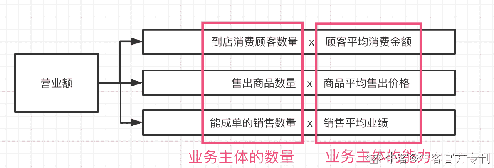
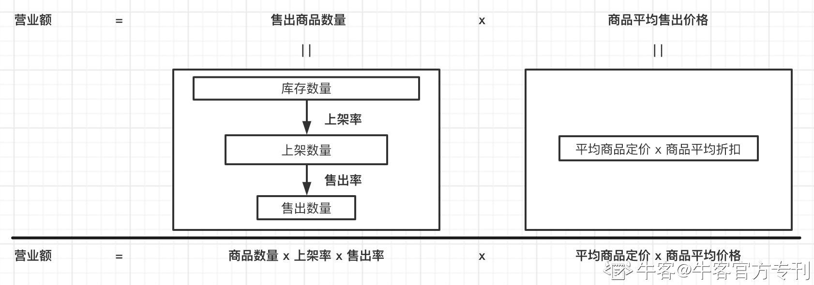
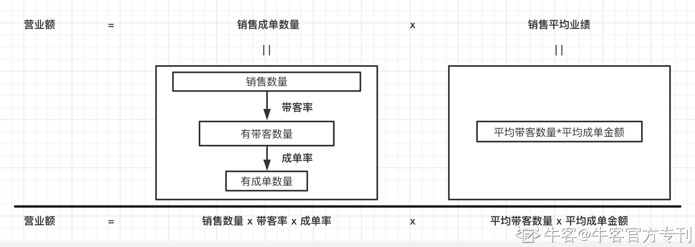
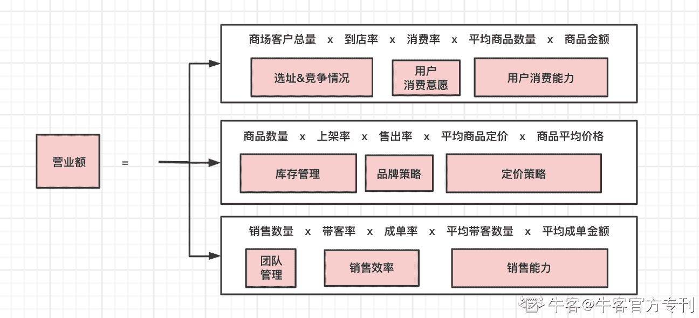

# 第三章 第 1 节 变现拆解

> 原文：[`www.nowcoder.com/tutorial/10040/daf4565223f9419b8575da1561b777ed`](https://www.nowcoder.com/tutorial/10040/daf4565223f9419b8575da1561b777ed)

## 拆解能力是职场中最为核心的能力之一

想必大家肯定都被问到过这类问题：“请估算一下快手全年的广告收入”、“全北京有多少辆出租车”、“地铁口的煎饼摊一天能卖出多少个煎饼”…要是同学第一次遇到这种问题，可能会有些摸不着头脑，只能盲猜一个数字；又或者在心里吐槽“这些问题有什么意义”。这类问题被称为“费米问题”，经常用于考察候选人在面对复杂问题时的拆解能力，也确实非常贴合工作内容。实际的工作场景中，要达到的目标都是复杂且抽象的。比如“今年的营收目标是 100 亿，如何达成？”，或者是“为什么这个月的营业额环比下降了 20%？”…进行细致的拆解，可以确保你的分析结论是理性的，也能更高效，更容易发现问题。同时，如果你希望未来成为团队 Leader，拆解能力也是必不可少的。Leader 的一大价值，是能够将公司的大目标，拆解为可执行的小目标，分发给团队成员执行。这个能力的高低，也间接决定了你的职业天花板——是止步于只能执行的一线小兵，还是能成为运筹帷幄的公司中高层。

## 怎么才算有效的拆解？

其实上文已经剧透了——拆解的核心之一是“可执行”。

经常能够在面试中听到一些反例，比如目标是“你是一个电话销售，今年销售额达到 100 万”，候选人的第一反应可能是“那就可以拆解为每天 3000 元的销售额，全年目标就达到了”。但实际上这只能叫“拆分”，而不能叫“拆解”，因为只不过是将大问题变成小问题，依旧没有可执行的思路——我怎么才能完成一天 3000 元的销售额呢？

“可执行”意味着有明确思路，拆解完就知道现在应该做什么。还是上面那个问题，可行的思路是将营业额的构成拆分出来，分析哪一个环节存在短板。比如拆分为“营业额=电访次数*意愿率*转化率*客单价”，然后分析自己在每个环节的表现：

*   整体分析：我现在平均日销售额为 2000 元，还要提升 50%才能够达到目标。目前我一天能打 80 个电话，意愿率能够有 40%（每 10 个客户中，有 4 个表示对产品感兴趣），转化率约为 50%（每 10 个有兴趣的客户，有 5 个都会购买产品），客单价大约 125 元（客户平均下单金额为 125 元）
*   电访次数：团队的销售冠军一天能打 100 个电话，我过去一天只打 80 个。别人能做到，我也能做到，如果我能够让其他指标保持稳定，这里就有 20%的提升空间。
*   意愿率：40%的意愿率已经不低，提升空间不大。如果想提升，可以改善自己的话术，比如将卖点前置；或者提升线索质量度，让外部销售重点挖掘更为适配我们产品的 XX 行业客户。
*   转化率：通过观察，了解到流失客户的主要顾虑是价格过高，可以在话术中强调“免费试用”、“长期优惠”等重点信息，预计可以提升 10%的转化率。
*   客单价：通过分析，客单价较低的原因，是客户群体中新客户占比较高，而新客户的下单金额较低。可以通过“老客回访，促进老客复购”的方式，让自己的客单价提升 20%。

通过这样一轮拆分，自己的薄弱环节、以及目标的实现路径也非常清晰。如果分析和执行都到位，那么日销售额提升 50%则不那么海市蜃楼；如果没实现，也可以回头对照自己的拆解，分析是执行不到位，还是拆分时过于乐观。

## 拆解的标准动作

可能你已经对目标拆解有了基础了解，但换一个实际问题，你依旧不知道怎么做。没关系，我总结了一套可复用的三步拆解方法，让你在实践时有迹可循。
光看图可能不太好理解，再举个例子：假设你是一个店长，你需要分析为什么这个月的营业额环比下降了 20%。

#### **1、明确主体与核心指标：能拆成什么样，直接体现了你对业务的理解程度。**

比如你希望提升的主体是“营业额”，那“营业额”和什么指标有关系呢？可以拆解如下：
如果你足够细心，你会发现这里的拆解是有规律的：左边是业务所涉及的主体的数量，右边是这些主体的参与能力。在思考拆解方向时，可以从这个角度入手。

业务主体的思考，体现了对业务的了解程度。如果有同学遇到「不清楚业务有哪些主体」，可以从「业务链条上有哪些角色」来遍历。比如互联网广告业务的业务逻辑，是「用户在 App 内浏览内容-在内容里填充广告-将广告位售卖给客户」，那么里面就包括了「用户、广告位、客户」三个主体。业务不同，对应的主体就不同，需要您根据自己所负责的业务进行熟悉和拆解。

#### **2、明确指标的漏斗关系：拆分到最细粒度，明细业务价值**

以「营业额=到店消费顾客数量*顾客平均消费金额」为例，「消费客户数量」和「消费金额」都是漏斗的结果指标，实际上都能拆解为更细粒度的组成项，如拆解为「（商场客户总量*到店率*消费率）*（平均购买商品数量*商品单价）」，如下图：

第二条“商品视角”的路径也是如此，可以拆解为「（商品数量*上架率*售出率）*（商品平均定价*商品平均折扣）」，如下图：

同理，第三条“销售视角”的路径拆解如下：
可能有同学会问：这些指标拆解出来以后，又有什么用呢？实际上，每一层拆解出来的指标，都有非常明确的业务意义，且往往同时涉及多个业务部门的问题。比如这次的拆解子项中，在业务上对应了「店铺选址」「库存管理」「品牌策略」「定价策略」等多个业务内容，哪一个指标出了问题，也就意味着对应的业务模块需要做调整。同时在拆解时，也要注意拆解的指标是否具有业务价值，不要为了拆解而拆解。

#### 3、指标下钻：找到具体波动的子维度，指导业务迭代在明确了指标后，还需要明确维度

如通过「性别、会员、年龄」等维度分析，你发现营业额下降的主要维度，是「女性+会员+35~45 岁」。在这一维度中，你可以通过上面拆解的指标，代入进行分析，如「从客户视角上看（链路一），该群体的到店率有所下降」。到了这一步，已经明确定位出问题所在，所需的就是产出解决方案了。如「进行用户调研，了解下降的原因是对其他品牌更感兴趣」，进而判断「是否需要更新产品的品牌策略」，或者是「通过会员优惠/促销活动吸引复购」。
每一条路径，都可以计算出总营业额，只是视角不同。将每一条路径都捋清楚，是为了不错过任何可能存在问题的环节，但最终要从哪个视角分析，取决于异动的数据存在于哪个拆解维度中。像上文举的例子，就不是销售或者供应链出现问题。
通过细致拆解得出的解决方案，虽然不能保证一定有效，但能确保方向不跑偏——因为问题分析和方案产出的每一步，都有严谨的逻辑和细致的数据支撑。同时，明确了“为什么要这样做”之后，哪怕后续效果不好，相比“迷迷糊糊做了一个动作”的情况，更能针对性地反思总结，复用到下次运营动作中。