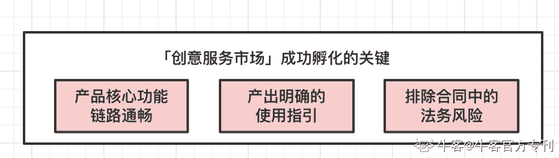
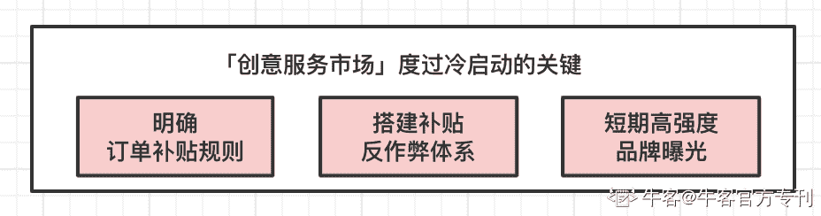
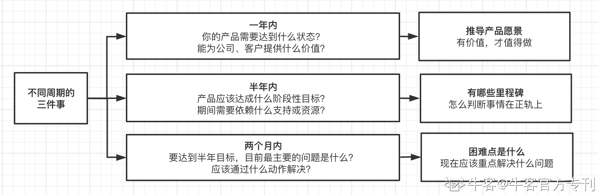

# 第三章 第 2 节 抓大放小

> 原文：[`www.nowcoder.com/tutorial/10040/d2dea874b08545a6900425eba5b13e0c`](https://www.nowcoder.com/tutorial/10040/d2dea874b08545a6900425eba5b13e0c)

## 琐碎，是运营工作的常态

虽然运营关注的指标比较统一，但达成目标的路径有无数条。以客户数为例，想要提升客户数，可以重点从「拉新、促活、提留存」多个角度下手，具体执行的动作也有「举办营销/促销活动、提炼产品玩法分发、重点客户 VIP 式维护」等等。不少运营都会在这个阶段中忙得找不着北，但细想一下到底做了啥，又都觉得非常细碎，每个运营动作的收益不足为谈。这也导致有些同学觉得“运营很难积累经验，做了三四年还和一年级运营没啥区别”。笔者在工作中也曾经有相似的困惑。不过经过探索，也总结了个人的运营成长方法论---“抓大放小”。这个方法论帮助我在同时负责多个产品时，做到了每个产品都有被认可的产出。希望能够让大家在入门阶段，就能够用最小的成本，达到最大的效益。

## 机会成本：“潜在的收益”才是你最大的成本

说到成本，大家第一反应可能都是“经济成本”，如举办一个活动，主办方的成本主要是 XX 万的营销费用；做一次产品补贴，一共需要花费 XX 万的补贴费用…但在运营工作中，相比“经济成本”，“机会成本”更需要被考量：不要只考虑「做了某个选择后，可能会面临的损失或风险」，而还要考虑「如果不做这个选择，我可能会损失什么样的机会和收益。」举个例子，假设你的目标是短期获利，如果办一次老客补贴，支出 20 万，预计收益 50 万，那么就有 30 万的利润，稳赚不赔，于是你毫不犹豫的做了。但实际上，同样的时间用来做拉新，可能支出 50 万，能够有预计 100 万的收益，利润能够有 50 万。尽管从经济角度看，两个运营动作都是赚的，但选择了方案一，你实际上少赚了 20 万——因为你的时间是有限的。同样的，每一个运营动作都看似有收益，但实际上大部分选择都是“亏”的：因为你损失了产生更大效益的机会，无论是从公司获利角度，还是个人成长角度。所以，并不是所有的运营动作都值得你去做；最为关键的，是找到机会成本最低的选择，铆足了劲儿去做。

## 抓住重点：每一个周期内，只有三个重点

一个项目，一个产品是否能成功，不在于做了多少苦劳，而取决于某些关键节点是否能达到。比如前文提到的「创意服务市场」。要想实现前期成功孵化，核心问题可能是这三个：完成了这三个点，产品就可以顺利上线，进入萌芽期。对应的，想要顺利通过萌芽期，解决平台的冷启动问题，需要解决的三个核心点可能是：在个人的实践复盘中，可能处在某个阶段时，做了非常多的事情；但回过头来看，对核心指标贡献最大，使得项目达到预期效果的，也就只有那三件事情。这三件事对于项目的成功是“雪中送炭”，其他的往往只是“锦上添花”。对应的，在不同长度的时间周期中，也都能提炼出最重要的三件事。个人非常建议通过「一年、半年、两个月」这三个时间维度，对自己负责的产品进行拆解，找到不同阶段的重点，如下图：

拆解完之后，建议和你的导师或直属领导二次确认一下，一方面避免自己的判断出现偏差，另一方面也能展示自己对产品的规划和思考。同样的，不仅是工作上，在个人成长中也可以通过这样的倒推，结合“机会成本”的评估，以最小的机会成本，最快地实现个人成长。
下一节我们来讲项目管理。