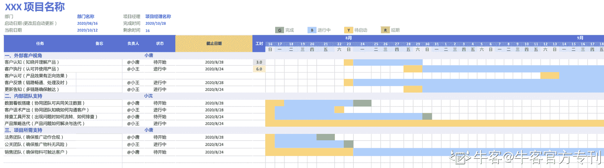

# 第三章 第 3 节 项目管理

> 原文：[`www.nowcoder.com/tutorial/10040/2edeb44d70aa4817b53596eff17780f9`](https://www.nowcoder.com/tutorial/10040/2edeb44d70aa4817b53596eff17780f9)

## 状态倒推：通往目标的路上，有哪些需要达成的“里程碑”？

产品运营的目标，其实和卖货有些相似：让客户认可我们的产品，并且愿意为产品买单。明确了目标，就需要对目标进行拆解，从想要达到的最终状态，反向倒推出其中有哪些关键节点，这在上文提到的两种能力中有提及。不过理想和现实总有差距，如何让预期的动作可以顺利落地，也是商业产品运营所需要的重要能力。整体需要注意的内容，可以参考下面这张甘特图。

## 客户视角：客户从知晓到使用，分别需要什么支持？

一般来说，客户从一无所知，到愿意为产品买单，一般会经历「认知、使用、认可」三个大的里程碑。在达成每个阶段目标前，客户应该从什么渠道接收到什么信息，并作出怎么样的反应，都需要我们提前设计规划。举个例子：

### 

*   认知：短期高强度曝光，让客户知晓对应产品

1.  XX 平台上线产品手册，并通过邮件、短信等方式，让客户知晓该产品上线
2.  通过手册中的 ShowCase（分行业/分客户层级等），让客户对产品感兴趣、并重视该产品
3.  通过统一宣讲、销售拜访等方式，重复触达客户

### 

*   执行：给出明确的使用方法论，让客户上手使用该产品

1.  通过产品手册中的介绍，让客户知晓产品的使用链路
2.  提供自查文档，让客户在遇到问题时，可以高效地自行解决
3.  梳理其他可配合的工具，让客户能够在使用时达到 1+1>2 的效果

### 

*   认可：通过有效的反馈方式，提升客户对产品的信心和黏性

1.  建立完善的问题排查机制，让客户在遇到问题时，知晓问题如何流转，以及预期的解决进度
2.  问题的迭代解决及时告知客户，让客户感受自己的反馈得到重视
3.  通过行业 ShowCase，多次触达客户，提升客户对产品的信心

## 内部视角：协作团队们需要做什么，作为运营，我能给他们什么抓手？

作为项目或产品 Owner，想要推动一款产品落地，肯定需要多个协作方支持。在项目中「明确每个协作方的职责，我们能够提供的支持，以及每个协作方明确的对接人」，是项目成功的必备条件。

*   数据看板搭建：数据应该是所有运营角色的最大公约数---每个人都需要有数据意识、能力。想要用好数据，自然也要有看数据的入口。通过搭建关键指标的数据看板，让所有团队成员都能第一时间关注到产品使用数据，分析推广效果。
*   客户话术产出：同样的产品功能，不同销售解读不同，客户感知也不同。所以作为最接近产品、研发的角色，运营需要给出明确的解读话术，用于解答客户在「认知、执行、认可」期间可能存在的疑问。一套统一的话术口径，也可以最大化避免「因为个人解读不同，导致存在法务、公关风险」的问题。
*   排查工具开发：客户使用产品时，可能会出现意想不到的 BadCase；而在客户数很大时，作为运营并不能够每个 Case 都能亲力亲为。所以如有必要，可以让产研配合开发一套半自动化的排查工具，帮助直接触达客户的一线同学，能够自行定位甚至解决产品问题。
*   产品策略迭代：无论是客户没有被满足的需求，还是业界出现新趋势，都会成为产品迭代的原动力。作为运营，需要通过定期的客户调研和市场分析，了解产品目前的问题并产出解决方案，推进产品经理和研发进行迭代，以满足客户的新需求。

## 所需支持：还有什么支持，是我所需要的，而现在还没有的？

项目启动前后，除了常规的产研运团队，还需要其他团队辅助落地。所以在启动前，想清楚需要引入的团队、需要他们配合的内容，并提前告知对方，也是项目能成功的必要因素之一。

*   法务团队：所有运营动作落地的前提，是不违规违法。所以在梳理好自己的运营动作后，需要和法务团队确认是否有合规风险；如果有，则需要修改自己的运营动作，或者是提前储备预备方案。
*   公关团队：公关负责公司整体对外口径的把控。正如我们对销售团队关于产品的解读有把控，我们对外的内容也需要由公关把控，避免和公司其他团队的口径出现冲突。
*   销售团队：销售团队就是我们触达客户的触手---庞大的客户体量，需要专门的销售团队对接配合。在执行推广前，与销售团队对齐宣推物料、对外口径、排查流程等内容，才能够让后续的触达更高效。

项目的成败，很大程度取决于过程如何。作为项目 Owner，需要将每个方面都考虑清楚：想要把一个项目成功落地，把「做什么事情」描述清楚，只能做到 70 分；明确清楚「谁来做」，只能做到 80 分；只有把「什么时候交付」和「完成的评判标准」也描述清楚，才能让项目具有达到 90 分的可能。这是运营的核心能力之一，也是让运营发挥价值，不沦为“打杂”的必备条件。
看完之后，是不是觉得这个岗位有些难以下手？没关系，后文通过校招流程的拆解，教你如何针对性准备商业产品运营的招聘。