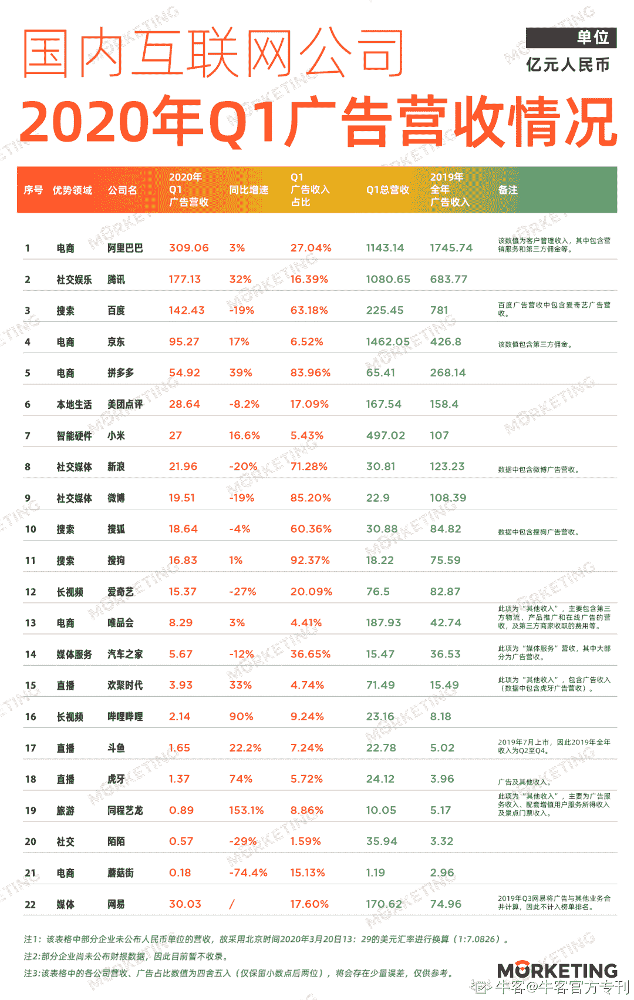

# 第四章 第 1 节 知己知彼

> 原文：[`www.nowcoder.com/tutorial/10040/029d57c837d44b369ff16863c7b474b7`](https://www.nowcoder.com/tutorial/10040/029d57c837d44b369ff16863c7b474b7)

一般来说，校招会分为「秋招」和「春招」两个大的招聘周期。前者一般开始于 8 月，结束于 11 月，9 月 10 月则是笔试面试的高峰期；后者一般开始于次年 2 月，结束于 5 月，3 月 4 月为高峰期。在每一个周期中，又一般会分为以下几个环节：

## 1、简历投递&初筛：硬性要求筛选、如学校、专业、证书、相关经验等

企业会在官网上放出本年度开放校招的岗位和对应要求，应届同学可以根据自己的规划进行投递。投递后，企业会根据每个岗位的要求，设置关键词筛选简历，如专业、学校、证书等。如果企业体量较大，或对某些学校比较重视，可能还会进行自己的网上宣讲会，或到对应大学里举办线下宣讲。**若有线下宣讲会，可能会在你投递简历的同时，进行简单的笔面试。**所以建议参加线下宣讲时，不仅要准备好简历，还要对可能的笔面试内容进行简单预演。当然，也有一些企业不会只凭简历刷人，毕竟简历并不能 100%体现一个人能力，所以还会结合笔试一起筛选。**选择公司时，建议选择「自己的专业恰好是公司主力业务」的公司来投递。**比如你是读广告的，同样有互联网广告业务的公司，百度、字节等公司的主要收入都来源于广告，而腾讯的主要收入来源于增值服务。那么，可能对于你而言，前者的公司对业务重视程度和业务本身的成熟度，会更有利于自己的成长空间。你也可以去查阅各个公司的营收情况，去思考哪些公司的广告体量更大，更有学习和成长的空间。如果是上市公司，你甚至可以去翻阅他们的财报，来获得一手信息。

## 2.线上笔试：综合能力、专业程度和性格匹配

### 

*   综合能力：考察工作基础，有规可循，勤加练习即可

不同公司考察重点不一样，但最常见的，也可能是同学们最头痛的，就是综合能力测试，也叫行测，主要考察观察、分析和逻辑能力。主要的形式是图形题、数字题、语意题、逻辑题。
**应对的方式也很粗暴：像高中题海战术那样练习。**在互联网公司的录取率已达个位数，逐步接近公务员录取率的背景下，笔试的首要目的不是考察求职者的专业能力，而是参照国家选拔人才的方式，套用一套标准简单易行的方式筛人。
**不同岗位在综合能力方面的考察大同小异，基本没有区别。**所以在综合能力的笔试准备上，根据自己涉及的专业，针对性找行业内公司的历史真题，多练习多总结规律，基本可以做到无伤通关。只要找到了做题方法，无论你面什么岗位，都可以“一招鲜，吃遍天。”像牛客网里就有很多这类真题供练习。

### 

*   专业能力：考察专业深度，对日常积累要求较高

如果说综合能力的考察有应对技巧，那专业能力的考察则毫无捷径，全看功力是否深厚。毕竟企业招聘你，就是招你干活儿的；如果你的专业能力不能够胜任企业要求，企业为什么要选择你呢？
最为典型的是技术的专业笔试。简单点的会出现基础名词、概念的解释或选择题；进阶一些的，也是最常规的，会给你描述一个技术场景，让你现场编程解决，如让你算出给定二叉树的最大深度。
在商业产品相关的岗位中，则更多的是考察思维能力。比如“小说、工具、直播、交友 4 个行业任选其一，阐述行业用户增长痛点，或用户增长方案”、“请阐述电商、新闻资讯、游戏、视频行业流量变现的方式”等主观题。如果是和技术结合得更为紧密的岗位，可能还会问一些如果没有基础知识，根本回答不了的问题，如“oCPM 和 CPM 计费方式的异同及优劣势”等。
这些问题看似人人都略懂一点，但要答出彩并不简单。能不能在有限的时间，梳理自己的思维，凝练出核心观点并清晰表达，除了临场发挥外，还要求日常中就有留心商业化、变现等问题，并有自己的思考和观点。

### 

*   性格匹配：不要撒谎或隐瞒，按真实想法回答

和公司要求“匹配”的候选人，不仅仅在能力上要匹配，还要求在性格上匹配。毕竟大学里的作业或项目还能单打独斗完成，但想负责起公司的一项业务，一定还要求团队协作。互联网公司也在近几年更为重视候选人的性格是否符合要求，比如字节跳动强调的字节范儿、阿里强调的阿里味儿。
需要强调的是，企业的性格测试题里，往往会有不少「反作弊」措施。比如设置题意相似的多道题目，通过判断你的回复是否一致，来计算你是否有撒谎的意图。
所以性格匹配类型的面试题，回答的要点只有「真实」。企业设置性格测试，也往往只是想进一步了解候选人的优势或特点，；只要不是有重大缺陷，企业都不会因为性格测试筛掉候选人。

## 3、群面：表达能力、合作能力和团队意识

群面的目的，我觉得是笔试的二次验证：通过讨论模拟业务的实际场景，验证你的能力是只停留在笔下，还是能付诸于行动——是骡子是马，牵出来溜溜就知道了。
群面又称无领导小组讨论，一般让 8 到 12 位候选人聚在一起，针对预设的问题进行讨论分析，并输出分析结果，非常接近真实工作环境。

*   表达能力：针对问题，你是否有自己的想法，并且能够清晰的表达出来？
*   合作能力：你能不能为组员提供一个讨论框架？能否在出现争执时维护讨论环境？能否在他人不同意你的观点时，理解他们想法，判断正确与否后说服对方，或不固执己见，接受对方观点？
*   团队意识：你是否能够做到始终围绕目标，在有限时间内拿出最优解？

## 4、单面：考察硬实力和软素质

单面是企业成本最高的一种筛选方式，也意味着候选人已经具备了基础的要求，需要多位面试官多轮面试，对候选人的能力进行确认。
**硬实力方面，除了上文提到的专业能力的深入以外，还会重点考察对陌生问题的应对能力。**

*   比如商业产品运营的候选人，在常见的商业变现方式、数据分析方面已经有一定基础，那可能会问一些候选人陌生的问题，如“你觉得能不能通过算法判断一个创意能不能火？”，来判断后选人面对陌生问题时的解决思路。

**软素质方面，主要考察原动力、同理心、价值观等。比如**

*   原动力：你为什么选择商业产品运营？你的职业规划是什么？
*   同理心：你在 X 项目（简历里的实习经历）和协同方遇到的最大分歧是什么？怎么解决的？
*   价值观：当你意识到负责的项目短期内不好出成果，你会怎么处理？

一轮完整的招聘流程考察点众多，让人觉得不好下手。后面将把每个环节逐个拆开，帮你抓住重点，在面对校招时有的放矢，高效准备。