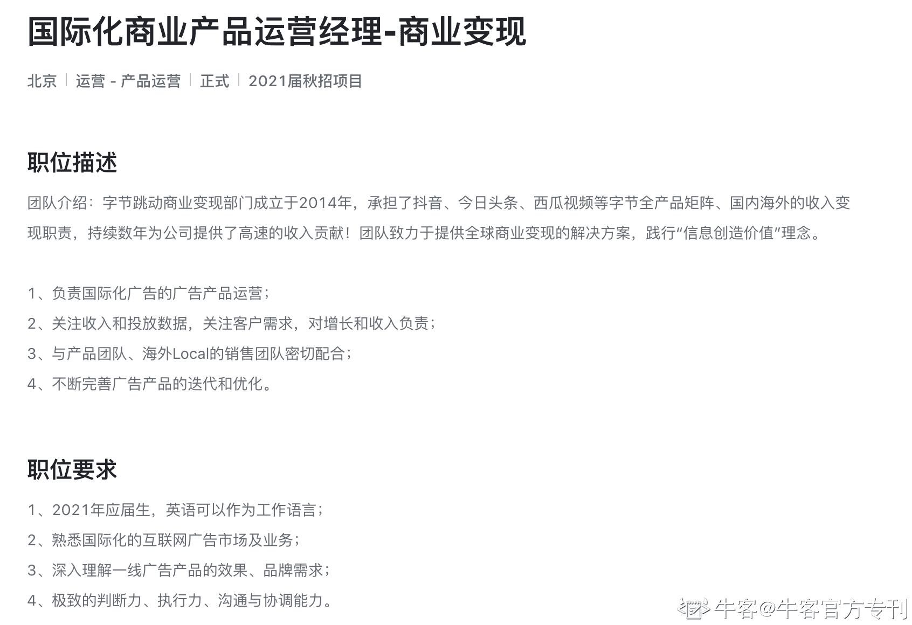

# 第四章 第 2 节 一针见血

> 原文：[`www.nowcoder.com/tutorial/10040/ce7b0c9576984e90b194725bbd474b7f`](https://www.nowcoder.com/tutorial/10040/ce7b0c9576984e90b194725bbd474b7f)

简历是每个招聘环节都要用到的“敲门砖”，重要性不言而喻：简历筛选环节会进行一轮机选，并人工二次复核；面试时也会针对简历内容进行深入挖掘。准备一份合适的简历，能够最大程度提升你通过筛选的概率，并减少你后续的面试阻力。但不要为了做简历而做简历，简历只是拿到一份好 Offer 的工具。时常见到一些经验帖，告诉你简历的样式重要性，如整体设计感、字号、段落等等，但没有强调内容的匹配性，没有突出个人的价值，导致名落孙山。这次从 HR 视角，给大家分享撰写简历的三个重点。

## 重点一：简历匹配---说明我适合这个岗位

简历的核心要点之一，就是“重点写和简历关键词相关的内容，不相关的不写或少写”。HR 相当于是一个需求执行者，承接的是用人方的人力需求。在和需要找人的业务方充分沟通了用人需求之后，再将明细的岗位描述和能力要求公布出来。如果找到一个不合适的人，用人方多半会吐槽 HR 不专业，浪费彼此时间，所以 HR 招人的第一要义就是“需求匹配”。如果简历上没有看到和岗位相关的经历、思考，那大概率简历关就被筛选掉。举个例子：字节跳动的商业产品运营，你能找到哪些关键词？

*   国际化：对外语能力有一定要求，其中英语是重点，要求能作为工作语言
*   广告产品运营：对互联网广告市场和模式有基础了解，有相关经历会更为相关
*   广告效果和品牌需求：是否有和客户沟通、挖掘需求，推进产品迭代的相关经历
*   对增长负责：是否有过产品增长相关的经历
*   与协同团队密切配合：你是否有过团队协作经历？是否能够和团队共同推进任务，拿到成绩？

多看几家大厂的商业产品岗位描述，你会发现校招时所要求的能力大同小异。硬实力主要考察三种：“常见变现模式”（如广告变现、增值服务、佣金抽成）、“产品规划能力”（需求验证、版本排期规划）和“产品设计能力”（如产品交互图的产出）。如果是国际化相关岗位，还会有语言上的考察。软实力主要考察团队协作与沟通能力。如果你有志于商业产品运营，但还没有进入校招阶段，可以自己对照着这些常见要求查漏补缺，做足准备。
拆解完明细描述后，你就能知道企业希望你的简历里有什么内容，再将自己过去的经历一一对应进行梳理，得出一份简历初稿。如果每一项要求你都有匹配的经历，恭喜你，简历关已经完成了一半。这也意味着你对这个岗位有一定了解和准备，不至于“巧妇难为无米之炊”。
如果每一项要求，你都有多项经历能够匹配，那可以按照“价值体现程度”从高到低来排序，比如“广告产品运营”的职位描述方面：

*   如果你有相关实习经历，肯定写，证明你已经有过实战，并且做过一些事情
*   如果你有其他运营经历，也可以写，证明你对运营推广、用户增长有过经验
*   如果你参加了一些校企训练营，可写可不写，主要看这个经历里有没有体现岗位要求的能力

也会有同学头疼：我没有那么多匹配的经历怎么办？别着急，在重点三里我给你说说。

## 重点二：结构化表达---我能胜任这个岗位

通过 STAR 法则，充分描述前因后果，充分说明你能胜任这个岗位。
STAR 是清晰描述一项经历的标准模板：

*   S（situation）：事情的背景是什么？遇到了什么困难？
*   T（Task）：为了解决问题，你需要做什么事情？你是如何明确自己任务的？
*   A（Action）：你实际做了什么行动？
*   R（Result）：行动的结果如何？你从结果里收获了什么？

不管是简历的文字描述，还是面试时的应答，都可以通过 STAR 法则让自己的表达更条理化。同时，更充分的前因后果，一方面能让自己的价值更多元，另一方面也能帮助面试官更充分了解你的思路，判断你的真实产出。
举个例子，“我主导了某次产品迭代，让客户留存率增加了 20%”。如果只写这个结果，内容上会有些“干燥”——为啥要迭代？迭代的功能是什么？你具体做了什么事来推进迭代？如果换成 STAR 法则，则可能是：“所负责产品对标竞品，客户留存低了 20%。通过 X 次重点用户调研，确认是某功能需要 XX。推进时，通过 X 次与用户确认过程稿，并进行 X 轮 AB 实验，确保留存有正收益，上线后留存稳定增加 20%”。
换一种表述，让你的价值可量化，并且更多元——通过竞对分析发现问题，通过多轮调研确认方案，充分验证收益后成功上线，效果依旧正向。这样一来，面试官对你的印象更丰满，翔实的细节也提升了简历的可信度；同时，自己也能充分梳理逻辑，让写在简历上的每一个字都不是废话。

## 重点三：案例包装---“变废为宝”，让案例体现你的价值

每一件事情都有不同的解读角度，找到贴合岗位的解读，为自己加分。有些同学因为大学期间没有充分准备，或者校招时打算转行，所以在简历上没有太多可以写的东西。但大学总是有自己的一些经历，变换一下解读方式，也能为简历加分不少。我从软硬实力方面分别举一个例子：

#### **软实力：通过游戏“上分”，体现自己结果导向的做事逻辑，以及较强的执行力。**

曾经为一个学弟改过简历，学弟读的是工科，希望能够转行互联网。不过大学期间在游戏上花的时间比较多，苦于自己没有相关经历，简历初稿比较空洞。但和师弟细聊之后，发现他在游戏上还是有些许成就，于是按照 STAR 法则，给他修改了简历内容，通过三个阶段目标的达成，体现目标导向和较强的执行力。

    S：玩守望先锋一直卡在中段位，上分路磕磕绊绊，希望能够达到国服 500 强的水平。

    T-1：自己主要玩辅助位，对队友的依赖程度比较高。如果排不到一个强有力的输出位队友，则经常打不赢团战，导致战斗失败。

    A-1：验证输出位是否比坦克位、辅助位更容易上分：逐个梳理国服 500 强常玩的位置和对应角色。

    R-1：输出位的数量占比确实较高。但在排名前 100 中，坦克位占比更突出，其中又以角色“查莉娅”出场率最高，可 C 可坦，兼容率很高。得出结论：坦克位的“查莉娅”角色的上分效率最高。

     T-2：确认高分段的查莉娅，分别具备什么能力，需要以什么方式练习

    A-2：通过在 B 站、游戏论坛中找高分玩家的分享，确认了两个关键点：“技能的释放时刻”以及“攻击准度与时机把握”。基于此，通过“学习”-“验证”-“总结”的方式，进行实战训练。

    R-2：充分掌握了角色要点，将段位从 3000 分提升至了 3500 分，但也逐渐遇到瓶颈。

        T-3：不拘泥于角色使用，摸查

    A-3：通过梳理对局历史，发现 3500 分段后精通坦克位的玩家数量增加，能够配合坦克的输出位供不应求。所以精通一个输出位的英雄，在缺少输出时及时补位，能有效提升团队的胜率。

    R-3：通过精通输出位中适应能力最强的“士兵 76”，在后续对局中主坦，偶尔补位输出，成功将段位提升至 3900，挤进国服排名 400+。

尽管表面上看，游戏的经历和岗位要求没太大关系，但进行拆解包装后，还是可以体现个人的“目标导向与执行力”方面的软素质。比较可惜的是这段经历没有体现太多团队合作的软素质，还需要从其他经历里进行包装补充。

#### 硬实力：快速学习和产出，提升个人硬实力。

如果有比较充足的时间，建议还是通过实习的方式，来丰富自己的简历。自己也能够在实习过程中，切身体会具体的工作内容，判断自己是否喜欢，是否合适这份工作。但如果时间不充裕，个人比较建议的方式，是通过专栏的形式，学习专业知识并有所输出。
还是同一个人，因为本专业读的是工科，打算转专业时已经是大三下学期了，没有足够的时间进行实习。在这个基础上，我建议他开通自己的学习专栏，用于记录自己的学习内容，并对运用在时事热点中进行分析输出。如果有些反馈不错的输出，还可以专门在简历中高亮，证明自己对岗位的热情和诚意，也侧面体现自己的硬实力。
后来学弟开通了牛客、知乎、简书等网站专栏，前后陆续产出了二十多篇笔记和文章。尽管没有拿到心仪大厂的 Offer，但也终归是入了行，进入了一家还不错的初创企业。