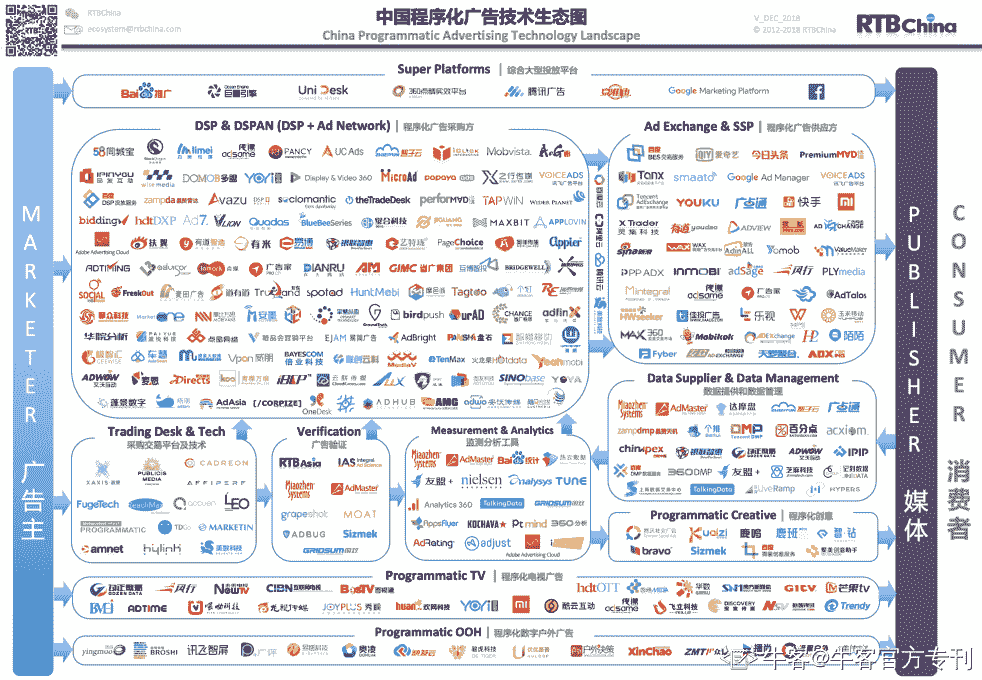

# 第五章 第 1 节 运营：非强技能要求的岗位

> 原文：[`www.nowcoder.com/tutorial/10040/e41c9c30eca34c409b133c965f97753f`](https://www.nowcoder.com/tutorial/10040/e41c9c30eca34c409b133c965f97753f)

可能看完了岗位要求的能力和准备招聘的要点之后，你会略微感觉有些头疼，不知道如何下手。没关系，最后一章咱来聊聊“怎么循序渐进地入门商业产品运营”，和你分享我循序渐进的成长之路。还在大学阶段的同学，可能对于「技能」比较执着——“我想胜任这个岗位，需要什么技能吗？”、“大学期间我学的都是理论，没什么一技之长，面对招聘我没什么东西可以拿出手，应该怎么办？”……
类似的问题，也曾困扰过我。我在本科期间读的专业是“广告学”，课表上都是“传播学理论”、“整合营销”之类的偏理论的课程。不能说这些课没用，但总觉得这些课程并不能让我拥有一个“人无我有的技能”，不能直接在应聘环节上直截了当地体现自己的能力。所以大学期间，我还围绕自己的专业，拓展了很多技能，比如“绘画能力”“摄影能力”“数据分析能力”等等；也都准备了对应的作品集，一方面让自己有东西“拿得出手”，另一方面也缓解一下自己的焦虑。
但运营并不是一个强技能要求的岗位。通过上文内容，我想你应该感受到商业产品运营岗位，并没有明显的技能要求：不像研发或设计岗位，要求熟练 XX 语言、熟练掌握 XX 设计规范等等。所以实际上，我在应聘运营岗时，准备的作品集并没有派上用场，最终让我拿到 Offer 的也不是这些体现「技能」的作品集。工作一段时间后再回头看，才逐渐意识到运营真正考察的是「能力」，而非「技能」（个人认为，产品岗也是如此）
技能只是能力的一个子集。并不是有意制造焦虑，但不是强技能要求的岗位，往往意味着难度更大：你需要摸索，并掌握一些看似有些虚无缥缈的能力，同时还要在面试中、工作中体现出来。后文我将和你一一分享我在准备秋春招前，做过些什么准备。

## 用系统思维，武装自己的头脑

### 什么是系统思维？为什么要具备系统思维？

先说一个真实的事儿。我刚入职的第二天，收到了领导给我布置的一个任务：公司新出了一个产品，交由我进行宣推文案的撰写。
我的第一反应，是“找几个产品卖点，按照公司以往文案风格的模板，快速产出了一套内容，内容大意是：我们产品有 XX 优点，最近新上市还有优惠，双十一还能有 XX 折扣，快来买！”写完之后，这任务就算完事儿了，可以领下一份任务了。
但这个方案不经想。哪怕不从业务角度出发，如果只是那么简单的工作，为什么需要费尽周折招一个校招生，再让这个校招生负责呢？肯定会有更优解。于是我带着疑惑，和我的导师重新捋了捋我应该怎么做，最终得出了下面的结论：

*   从公司视角来看，这是一个非常创新的产品，可能会引领全行业。但是对于普通用户，可能在实物到手前没有明显感知。所以可以通过众测的方式，定向邀请部分忠实用户进行测试，同时辅以折扣以提升吸引力，但要求在购物分享使用体验，先打造一波产品口碑。
*   在第一波宣推完成后，重点监控“全网产品用户声量”，同时邀请其中有负反馈的用户，以小组访谈的方式了解产品问题，以此判断后续是继续迭代产品、还是可以开始高强度进行推广动作。
*   竞品媒体方面，最近似乎也发布了类似的产品。可以通过市面信息或个人关系，了解一下他们的产品状态和运营动作，看看有没有值得借鉴的地方

可以看出，两份方案的差距非常大：前者只是被动执行，没有自己的思考；后者则是设计了整个产品的营销策略，再从策略出发，推导包括宣推文案在内的运营动作。尽管这里面存在“职场老油条”和“职场新人”在职场经验、职场信息上的区别，但也能明显看出，**两者的核心差别在于“单点思维”和“系统思维”。****在单点思维中，事情是孤立的：**为了达到目的，我只需要做事情 A。但实际上，**任何一件事情都不是独立的**：想要达到目的 B，一定还会有信息 BCD 需要搜集，配合事情 EFG 一起执行。这也是系统思维的核心要义：世界是由无数的系统组成的，并且大系统里还嵌套着小系统，比如公司的广告业务是系统 A，系统 A 下还有各种行业细分（即各个小系统），各自有自己的业务运转逻辑；而我负责某个行业里某个产品，这个产品是一个子系统，包含宣推、调研等等更下级的系统。
这和上文提到的拆解也有异曲同工之处：“营业额”这个指标实际上关联了“选址”“品牌”“定价”“销售”等等策略，这些策略各为系统。想要达到销售额的目标，就需要拆解每个系统的元素，有的放矢地执行运营动作。

**如果要说，运营最需要具备的能力是什么，我会毫不犹豫地投系统思维一票。**短期收益上，在秋春招这类场合里，如果在分析问题时拥有系统思维，对其他候选人会有“降维打击”的能力：类似于别人还在思考怎么让马跑得更快，而你已经发明了汽车；长期收益上，想要把任务完成得漂亮，拿到想要的成果，系统思维也必不可少。

### 如何训练自己的系统思维？

在提到训练前，还需要和你分享一下系统必不可少的四个属性，这些属性也会成为你后面进行思维训练的核心切入点：

*   特定的功能和目标
*   实现该目标特定的结构
*   影响系统运转的核心因素
*   约束系统运转的限制规则

举个我个人的例子，我从事的是“互联网广告”这一行业，这个行业可以看做是一个独立的系统；系统所连接的两方，分别是“广告主”和“媒体”。系统的概要结构长这样：

不从事这个领域的同学，可以不用过于关注图中的细节。我从系统的四个核心属性，给大家拆解一下这个系统：

*   **系统功能和目标：**让合适的广告，在合适的时间和场景，触达合适的消费者，让广告变成有用的信息。

*   **实现该目标特定的结构（抛去图中复杂的结构，核心要素就三个）**

1.  媒体方（提供供给）：为广告主提供媒体资源，即广告展示的地方和对象
2.  广告方（搜集需求）：整合广告主投放需求，同时整合媒体资源进行整体广告投放
3.  服务方（提供服务）：为广告方提供广告投放服务，按百分比收取服务费

*   **影响系统运转的核心因素：（依附于系统，为系统的关键角色服务）**

1.  监督方（数据反作弊）：帮助广告主监控媒体是否真正完成投放，保证投放效果
2.  数据方（数据服务）：通过自己的数据库，帮助广告主找到适合 ta 投放的人群
3.  创意方（创意服务）：通过自己的创意团队，帮广告主制作用于投放的广告素材（图片、视频）

*   **约束系统运转的限制规则：**这部分内容范围很大。小至市场竞争规律（如整个行业的市值体量），大至国家法律，如广告法、数据安全等内容，都是这个系统运转的核心限制。

这样拆解完以后，你对系统和自己也就有了全局的认识。一方面，你不仅知道你在其中参与的角色是什么，在系统中扮演什么角色，还能知道系统的价值，可能的发展方向等等，这能够帮助你在面试中体现自己的系统思考能力，也加深你对行业的理解。另一方面，也能帮助你了解自己处在什么样的赛道上，后续应该往什么方向发力。
回到正题上，所以应该怎么样练习系统思维呢？
实际上，答案已经讲完了：在还没有工作经验的情况下，**可以找一个你希望从事的领域（比如商业产品中的增值服务），按照上面的思维维度进行拆解思考**。每一次练习，都用一份专门的文档记录自己的内容。如果要是能有清晰的，可以作为面试作品的产出，自然是最好；但重点还是让自己养成系统思考的习惯，在面试时能够灵活运用到和面试官的问答中。
**如果缺乏训练的题目，你也可以将近期的行业动态作为分析素材，自问自答。**短期热点比如为什么微信最近会上线“拍一拍”功能，长期热点比如为什么微信需要投入大量资源开发并推广小程序……这类问题没有标准答案，在自己拆解思考完以后，可以在牛客或其他平台上，找一找大家的讨论思路是怎么样的，来扩充自己的想法。当然你也可以更直接一些，牛客网上有大量真实面经，可以从中寻找到高质量的内容，对自己进行训练。
抛砖引玉，我给一些我自己想过的问题，以及对应的简要思路；不一定按照上面的结构严格细拆，但总体逻辑不会有太大差别。

#### 1、互联网广告行业存在的意义是什么？可预期的未来里会不会消失？

互联网行业本身不创造价值，互联网广告也是。它所连接的两方，是商品与货币，它最大的价值是“提升商品到货币的转化效率”。
广告作为一种商业行为，通过匹配商品与用户的特征，做到了“千人前面”，极大提升了触达的效率，进而降低了商家将商品转化为货币的转化成本；这种成本的下降，让生产者和消费者都受益。
除非出现效率更高效率的渠道，否则我认为广告不会被取代。又或者是说，始终存在介于“商品”和“货币”之间的介质，只不过现在这种介质的形式是广告。

#### 2、为什么各互联网广告巨头都开始重视电商业务？

首先可以明确的是，这项业务对企业来说一定有利可图，因为企业不做亏本买卖；其次对用户也有价值，因为企业稳定的收入，本质是对受众稳定贡献了价值，否则业务不稳定。
电商业务有三个相关方：卖方、撮合方、买方。互联网广告本质是在“撮合方”这个介质角色，而进军电商，则意味着企业的触角从撮合方进一步延伸到了卖方。所以我觉得需要重点分析的，是「企业作为卖方」对企业和用户意味着什么？
从企业角度来说，是可以减少这一环节的经济成本。将进货权囊括在自己手中，在价格（如折扣）、信息（更早知道生产方做了什么商品）和话语权（我认为消费趋势是什么）都会有更大的优势。通过这三方面的优势，可以把控商品价格，甚至可以影响商品内容。这些优势和广告分发综合起来，可以进一步减少商品从诞生到售卖的成本，并从中获得利润。
从用户角度来说，可以增加自己的选择权。卖方之间有竞争，会让市场变成买方市场，在价格上获得收益；卖方之间的竞争，也有利于卖方提升自己的竞争力，来赢得更多的用户，避免垄断现象的产生。
为什么选择这个时间点切入电商？可能是因为互联网人口红利逐步减少，总用户时长的增长停滞，导致广告库存见顶，广告业务难以发掘新的机会点。同时，国际政治环境趋于紧张，国家经济政策倾向于“以拉动内需为核心的内循环”。这看似是个危机，但危机“有危也有机”，或许企业也从中发现了新的机会，于是以广告为核心变现的互联网公司，希望以电商作为新的增长点。
当然，除了自营电商，也还有“电商广告”等其他业务分支：根据电商客户的独特需求，定制对应的产品方案，让自己在电商行业的链条里，更坚实地坐稳“撮合方”的角色。

#### 3、为什么微信会上线拍一拍功能？

首先可以明确的是，对于亿级体量的国民级社交产品，这一定不是拍脑袋就做的想法。
微信作为一款轻量社交软件，已有的功能都已经较为齐全，更重的功能并不一定是普通用户的强需求，腾讯也可以放在企业微信上实现。所以“拍一拍”从功能齐全的角度上，并不会是“雪中送炭”的角色。
微信已经成为部分“打工人”的工作软件。考虑到近期越来越火的话题“微信社交压力”，“拍一拍”这种轻互动形式，可以起到社交减负的功能。比如工作场景下，这个轻量的交互也有不少的使用场景，比如某人答应你要今天交付的事儿延误了，直接文字催似乎过于生硬，发表情包过于随意，这时拍一拍就是个较为均衡的交互方式，充当一个弱提醒的功能。
在生活场景下，拍一拍会是一个更有互动性的交互形式。想象一下，如果想要和新认识的人拉进关系，聊天中夹杂着拍一拍，更有线下见面的感觉；和朋友亲人拍一拍，能够有更强的互动感&亲近感，进一步提升微信在这一场景的使用体验。
每个功能的上线，肯定多少有些促活拉新的因素在里头。不过考虑到微信已经是国民级的软件，且已经通过支付、生活服务等功能，在中国区里有了极强的用户粘性。和上述上线的收益相比，我认为这部分权重很低。
**训练系统思维的过程，有点像是爬一座很高的山：有技巧，但是没有捷径**。不仅商业产品运营的岗位，个人认为所有岗位对这一能力都有要求，而且只有通过反复的练习和“自我修炼”，才能在这一能力上获得长足提升，并自然地运用到各个场景中，毫无捷径。
以我自己为例，在秋春招之前，不依赖上文提到的生态图的情况下，自己“手撕”了自己对“互联网广告”这个行业的理解；这让我在面试中被问到相关问题时，能直接手画出简单的框架，配合着口头讲解，和面试官阐述自己的思路。
后面，我也会以一个例子，和大家分享一下，我对于校招的简要理解。