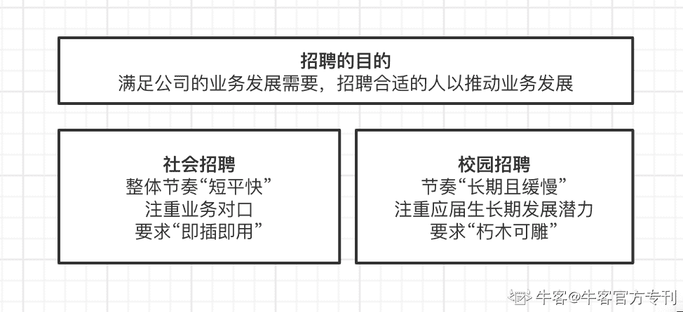
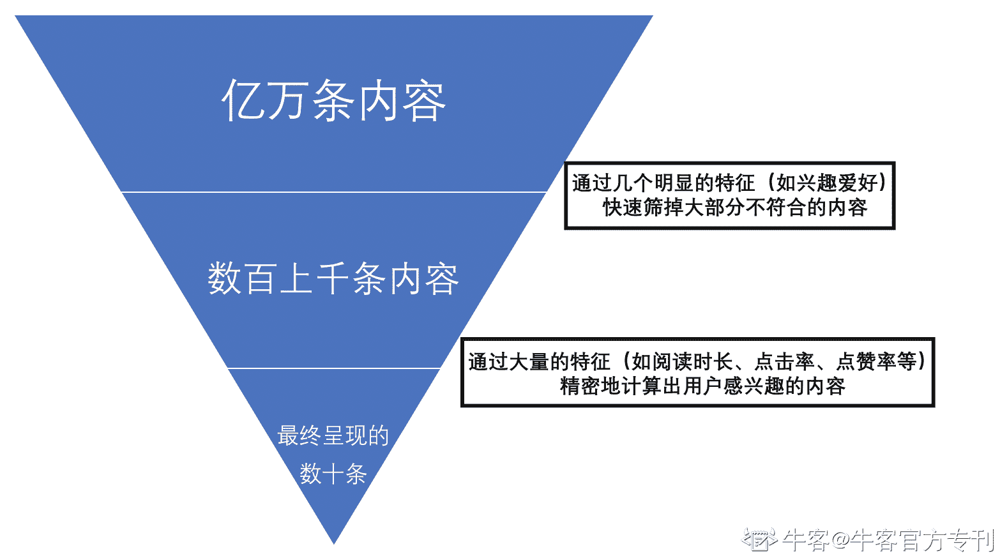

# 第五章 第 2 节 从商业视角，看待校招

> 原文：[`www.nowcoder.com/tutorial/10040/db91e417cc1e4c84bdda19a934bf5db7`](https://www.nowcoder.com/tutorial/10040/db91e417cc1e4c84bdda19a934bf5db7)

不知道你是否有思考过这些问题——“企业为什么要区分校招和社招？”、“为什么企业会考虑没有工作经验的校招生”……在网上搜索校招，大部分内容是准备校招的技巧、校招的流程等内容；这些内容很好用，能够快速地帮助应届生了解校招信息，找到拿 offer 的技巧，解决了应届生“What”和“How”的问题，但没有解决我关于“Why”的疑问。可能会有同学对这部分内容嗤之以鼻。确实，关于“Why”的解答也并不实用，但在我个人经历中，**正是关于“Why”的思考，让我找到了属于自己的校招解法**，并靠着这份特有的理解，在多次屡战屡胜后无往不利，成为同学眼中的“Offer 收割机”。所以也借这个机会，和你分享我的看法，一起来拆解一下校招这个“系统”。

## 校招系统的功能和目标

校招是什么？校招是属于“企业”这个系统下“人力”这一子系统；而在人力方面，又可以进一步拆分为“薪酬福利管理”“劳动关系管理”“内部培训”等等更次级的系统，也当然包括了“人才招聘”这个系统。从“人才招聘”出发，还能进一步拆分为“社会招聘”和“校园招聘”。这里引出第一个问题：为什么还要专门区分出“校园招聘”呢？招聘的目的，是快速满足业务发展的需要，“召之即来，来则能战”。尽管社招可能在薪酬支出上会更高一些，但毕竟工作经历匹配，“即插即用”，更快的适应能力确保了更快能够有明显产出，为什么还要花那么多人力物力，来进行校招呢？我能想到的主要是这三点：

*   企业宣传：可能实际上并不那么需要校招生，但通过大规模的校招宣推，能够打响企业名气
*   节约成本：核心岗位不缺人，只是需要找些校招生来“打杂”，能干活，人力成本也低
*   人才储备：花更多的资源寻找和培养优秀人才，以较低成本培养候选人对企业的感情，同时也能为关键业务储备人才

对于互联网大厂来说，“企业宣传”和“节约成本”都不会是校招的充分理由：企业名气不缺，也不差招人的资金实力，所以“人才储备”是大厂校招最核心的原因。而且考虑到互联网企业“轻资产”的属性，人才才是企业最重要的资产。到这里，企业对校招生的要求也就比较清晰了：

*   目前的能力和专业对口并不是最重要的（如果企业对这方面要求高，社招才是最好的选择）
*   更为看重的，是校招生的培养潜力（体现在软素质、学习能力、个人职业规划方面）

明确了这些内容后，招聘系统的第一个属性“功能和目标”就已经比较清晰了：

## 校招的运转结构

校招目的已经很明确了，那系统是如何运转，能够同时保证“效率”与“精准”？毕竟大企业的岗位，每年收到的简历数都是六位数起，但最终招的人只有四位数。回顾校招“简历-笔试-群面-单面”的“系统运行结构”，我的第一反应是“这不就是推荐系统的设计原则吗？”
**推荐系统的核心逻辑，是“低成本排除大多数内容，再高成本精准筛选”，兼顾效率与精准。****** 在推荐系统里，用户的每次内容请求，系统都需要从上亿的内容中快速找到十余条符合用户感兴趣的内容；而推荐系统的做法，是通过明显的特征（如兴趣爱好为“数码”），快速圈出几千上万条内容；再通过其他大量的特征（内容阅读时长、点赞率、留言率等），对每一条内容预计算用户的感兴趣程度（比如预估点击率），最终筛选出可以呈现的内容，并按照一定规则排序。
再回过头来，校招也是如此。
**“简历+笔试+群面”就是推荐系统中“快速圈定”的环节。**通过显著的特征（简历关键词、笔试分数、群面的表现）来快速筛掉一大批人。尽管可能筛掉了合适的候选人，但没关系，进入下一环节的候选人中也大概率能找到足够数量的潜力同学；尽管进入后续环节的同学里也可能有不合适的，但没关系，后面还有多轮单面，对每个人进行精准筛选。
**“单面”就是推荐系统中“精准筛选”的环节。**通过多轮、多职级和多角色同事的交叉面试，综合评估一个候选人是否符合要求，最大概率降低“选错人”的可能性。
**剩下的部分则是比较常规的内容，个人并没有从中挖掘可破局的点，知晓即可。**
如“核心元素”主要是 HR 和面试官。前者主要在校招开启前与业务方明确用人需求，借助自动化系统完成简历筛选，面试中考察候选人就职稳定性；后者在校招前与 HR 确认今年的业务目标和对应的 HC，在面试中考察候选人的软硬实力，并与 HR 共同确认最终候选人。
在“约束规则”上，较小但也是最切身相关的方面，就是业务增量和对应的薪资包、岗位数量；较大的方面，就是秋春招不成文的时间限定、亦或是劳动法上的约束。

## 我的校招破局思路

校招“系统”的运行方式，实际上不太能匹配其目标。试想一下，如果你完整地读完了本科，那从小学开始，你已经接受了 16 年的学校教育；你的能力、思维方式，真的能够在不长的校招流程中被全面考察，并得到准确的结论吗？我觉得很难。
**作为佐证，曾经在腾讯的校招介绍推文里，一位面试官提到“有 50%的被招进来的人，都不太符合面试时的预期”。**再换个角度，从面试官的视角看看校招：面试官自己都有自己的本职工作，但在校招期间需要承担大量的面试任务；且考察的候选人岗位基本不会变，也就意味着面试的问题不会有太大变化。连续多日每天面试，如果没有候选人能够在应答中给出亮眼的回复，那面试官也就难以有深刻的印象，更不用提给到较好的评价。
到这里，我的校招的破局思路也就相对清晰了：校招面试其实并不会太严谨，除了像答题那样准备应对内容，**还需要像把它看作是一次秀那样，准备自己的“记忆点”**。在常规的准备内容中，额外增加一份描述。内容可以是你很亮眼的一项经历、可以是你相比其他候选人更具优势的能力……只要你足够自信让面试官留下印象的内容，你都可以准备，并反复练习讲述的方式。这份内容不仅在面试中可以用上，也能够在简历上着重体现。（当然，内容一定要真实）
于我而言，最亮眼的莫过于我的职业规划了。在校招前期的准备中，每当面试官问我“为什么你要选择这个行业/岗位”，我都是从个人的能力和与岗位的匹配度来回复；不会错，但也不亮眼。但回顾我的大学经历，我从选专业时，就已经非常明确我的职业方向，并且有非常强劲的原动力。

> 我在高考时物理满分，得到了保送某 985/211 高校电气自动化这一王牌专业的机会，却毅然决然选择了某双非大学的广告专业，放弃了这个父母眼中非常安全的选择。具体的原因，只不过是看到那些历史上的伟大创意，我会觉得非常激动，并希望参与其中；相比之下，电气自动化我自信能胜任，也很“安全”，但我没有找到这方面的激情。
> 
> 大学在读两年之后，我却对广告行业略感失望。当时学习的内容非常着重于创意，讲究如何刷屏，基本不提对广告效果的量化。但我认为广告首先是一种商业行为，其次才是一种艺术行为。一次刷屏的创意，如果没有带来实实在在的可量化的效果，那无异于自嗨。
> 
> 于是在大二了解到“效果广告”这一区别于传统广告的广告形式后，我放弃所有业余时间，从大三开始双修软件工程专业，希望能够从技术角度，重新理解广告行业。学习过程中，我了解到效果广告已经是互联网公司变现的成熟方式，也实打实地能够量化创意效果，同时也与我所学习的内容相匹配。
> 
> 所以我更有动力从事这个方向的工作，也能够胜任岗位要求。可能在刚毕业的这个阶段，我在能力上和其他人相比并没有突出的优势，但在个人规划和工作原动力上，我非常自信我强于其他候选人。这就是我选择该行业的原因。

可惜的是，在校招前期的准备中，我一直没有完整地梳理出来这段心路历程，让这个校招中的“宝藏”一直被埋在心里。梳理后，每当面试官问到这方面的问题，我都能清晰详尽地表述出来：基本每一次面试，都能找到机会向面试官阐述；基本每一次我讲了这部分内容后，都能让面试官感受到我这方面的激情与动力，给面试官留下深刻印象，从而在这轮面试中“终结”相关问题。
入职一年之际，我约直属领导（也是我当时校招面试官之一）聊个人年度总结时，对方也提到了这件事。他说当时通过所有面试流程的，只有我一个本科生，其他的都是研究生，但他和 HR 沟通之后，还是选择了我。原因也很简单：能够进入到这个环节，大家的能力都不差，但我在职业规划上更清晰，源动力方面也更强烈；我也确实在过去的一年中证明了自己。
**要说明的是，“闪光点”是相对其他候选人而言的。**可能有些同学苦于自己没有什么能够拿得出手的经历，但就像上文「合理包装」的思路，并不是某个超越了所有人的能力或经历，才值得好好梳理。就像一句比喻说的那样：想要不被淘汰，你并不需要跑在最前面，你只需要比最后一个人更快一些。拆掉这堵思维的墙，能够被你想起来的能够成为你闪光点的内容，能够多很多。
**以上，希望大家在校招中都能拿到理想的成绩，感谢阅读。**