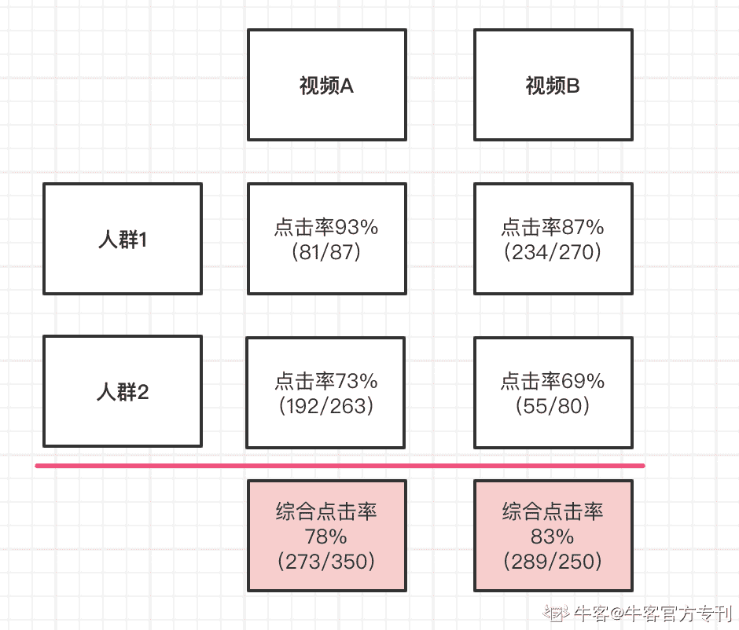

# 第六章 第 1 节 面试高频考点题

> 原文：[`www.nowcoder.com/tutorial/10040/b915baee461c4922ad196c5d1e712cd4`](https://www.nowcoder.com/tutorial/10040/b915baee461c4922ad196c5d1e712cd4)

## 1、一定要准备的面试问题：统计谬误

不同的商业产品业务，在单面的业务问题千奇百怪，难以给大家分门别类地穷举；如果有兴趣，可以在牛客里搜索“商业产品+面经”的关键字，根据面经里的内容针对性思考练习。但无论什么业务，都会对数据分析方面的能力有要求，所以如果你对面试的准备没什么思路，不妨先从数据分析入手。
**数据分析是运营必备的能力，而往往分析的思路比技能更重要。**所以在面试中，一些常见的误区会是面试官高频考察的点。我以最经典的“辛普森悖论”来举例：
“视频的点击率，可以衡量一个视频对用户的吸引力。假设视频 A 的在人群 1 的点击率有 93%，人群 2 的点击率 73%；视频 B 在人群 1 的点击率 87%，在人群 2 中的点击率 69%。这些数据是否可以说明视频 A 比视频 B 有更高的吸引力？”
别着急往下看，看看你的第一反应是什么？再花几分钟时间想想你的第一反应对不对？

答案揭晓：不一定，通过下面的图可以一目了然的发现问题：

尽管从视频 A 在人群 1、2 的点击率都明显高于视频 B，但最终的结果还会受到两个人群的基数影响：视频原本在不同人群中表现的规律可能就会消失，甚至可能会出现完全相反的规律。**所以当我们需要整体看一个视频的表现时，需要从整体的视角来判断，避免陷入误区。**

#### 再举一个在新产品测试中经常会遇到的统计偏差。

“假设有 1 万个客户使用了一款新产品 A，经过一段时间的测试，我们发现 A 产品的加权转化率比旧产品 B 高 10%。这个数据能否让我们得出‘A 产品比 B 产品更好’的结论？”
答案是不能。因为参与测试的客户在测试期内只用了 A 产品，而使用 B 产品的是另一拨客户。A 比 B 效果好，可能是因为客户之间存在差异，并不能非常坚实地证明是 A 比 B 好。
于是你改进了实验方案：让参与测试的一万名客户，在使用 A 的同时也使用 B，这样在测试周期内，新旧产品同时都会累积效果数据。测试完成后，你发现 A 的加权转化率依旧比 B 高 10%。这个时候的数据表现，能够支撑“A 比 B 效果更高”的结论吗？
答案还是不能。因为任何群体中都会存在二八原则，可能这 20%的头部客户效果特别好，但腰尾部 80%客户的测试结果，都显示 A 效果更差，但因为头部客户的体量很大，所以整体的加权转化率会显现出 A 更好。
所以想要得出置信的结论，还需要看“更优客户占比”：在 1 万名同时使用了产品 A 和 B 的客户中，有多少占比的客户表现出“产品 A 比 B 效果更好”。只有达到某个值，才能真的说明 A 比 B 效果好。
真的可以吗？其实也是不能，因为客户之间天然存在差异，如客户所处的行业，客户所卖的商品等等。所以即便我们绕开了上面提到的所有坑，我们依旧不能得出一个 100%置信的结论。我们能做的，只能是尽可能找出测试方案中的统计谬误，在更大范围得出相对置信的结论。**“100%置信的结论”不是统计中要达到的目标”，“得到某个结论的置信度，以及影响置信度的因素”才是关键。**
**已经看过那么多题目了，你也来试一道真题吧。**现在你就是正在面试的候选人，准备好一个 1 分钟的倒计时，看看你会怎么回答。**题目是“假设一组计划的点击率是 20%，另一组计划的点击率是 80%，有没有可能通过改变计划的分组，来同时提升两组计划的点击率？”**
先别往下看，1 分钟倒计时开始。
...
...
...
...

> 答案是有，我分享一下我当时的回答：“我觉得有可能。两组计划的点击率都上升，且原分组中组 1 比组 2 的点击率低，那么可能的一种情况是‘组 2 中某个计划的点击率低于组 2 的均值 80%，但高于组 1 的均值’。”“我尝试举一个简单的例子。我先假设点击率的计算逻辑=组内各计划点击率加和/计划数。在这个基础上，假设组 1 有两个计划，点击率分别是 10%和 30%；组 2 有三个计划，点击率分别是 70%、80%和 90%。到目前为止，组 1 和组 2 的点击率分别为 20%和 80%，和原题相同。”“在组 2 中，有一个 70%点击率的计划，低于组 2 均值，但高于组 1 均值。把它移到组 1 中，组 1 的点击率为 36.6%；组 2 的点击率则变成 85%，两组点击率同时上升。”“发散思考一下。既然点击率是求平均得出，所以只要不是‘一个计划组里只有一个计划’，或‘计划组中所有计划都是相同的点击率’，那么组 2 就一定存在比均值低的计划。只要这条计划的均值高于组 1 均值，那么这种情况必然发生。”

**答案看似完美，但当时我的回答并没有如此顺畅。**说实话，面试官当时并没有说给我思考时间，我听到问题后停顿了几秒，一下没想出合适的思路，于是请求了 1 分钟的思考时间，开始用纸笔设想例子，并做推演。
在寻找到了可能性之后，我随即和面试官讲解了我的思路；并且在讲解过程中，我似乎也摸出了这种情况成立的边界值，于是有了最后一段的发散思考。虽然我并没有严谨验证这个发散是否准确，但我还是打算先行抛出，一方面我还是有比较大的把握认为是正确的；另一方面也表示我愿意思考和总结规律，而不是回答了就完事儿了。
如果说还有什么地方可以做得更好，我觉得是思考业务场景。每种统计谬误，或多或少在工作中都会遇到，如果我能够思考出工作场景中，什么情况下容易出现这种谬误，那么肯定能进一步加分。如果机会合适，也可以在面试官反问“你有什么想问的”的时候，抛出这个疑问。
类似的统计误区还有很多，比如「基本比率谬误」、「威尔罗杰斯谬误」等等。互联网上已经有不少统计误区的总结，无论是出于应对面试，还是希望在工作生活中更准确地做出判断，这些总结都能够助你一臂之力。