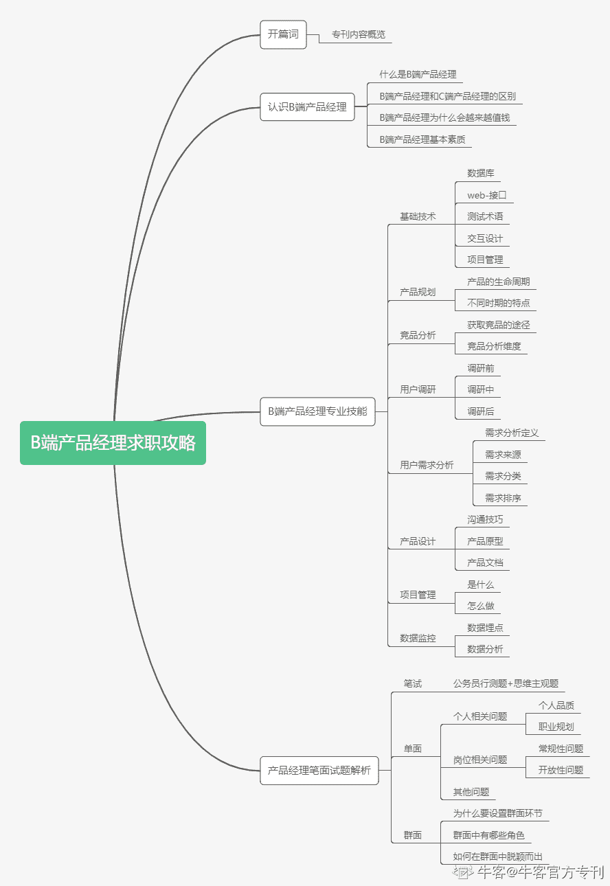

# 第一章 第 2 节 开篇词

> 原文：[`www.nowcoder.com/tutorial/10037/33bf6c3ea1fd40028e9b5260784787a3`](https://www.nowcoder.com/tutorial/10037/33bf6c3ea1fd40028e9b5260784787a3)

##  【创刊初衷】

对于【产品经理】一词，大家早已经不再陌生。随着互联网热潮的涌起，产品经理一岗已经是如雨后春笋般，几乎每个互联网公司都有这样的一个角色。而随着这一角色越来越被人熟知，它的职责也被分成过多的方向。一开始只是 C 端面向用户的一个职位，到现在出现了 to B 的业务，随之衍生了【B 端产品经理】一职。

它具备**4**大区别点：

1）产品形态上；

2）盈利方式上；

3）用户类型与数量上；

4）用户角色划分上。

因此，B 端产品经理在整个校招求职过程中的权重也逐年上升。越来越多的学生转岗产品。然而，之前市面上关于产品经理的面经大多是考生凭着记忆提供的零散信息，不准确、不完整、不系统。

本专刊系统整合了 B 端产品经理的求职攻略，帮助应届生学习求职，在校招路上拿到令人满意的 offer。

## 【适合人群】

想要求职 B 端产品经理，但无法自成体系学习的应届毕业生和职场新人。

## 【你的收获】

1、 比其他人提前知道需要准备什么以及怎么准备；

2、 比其他人提前知道 B 端产品经理的专业技能；

3、 比其他人提前学会 B 端产品经理笔面试中的技巧和题型。

简而言之，当别人还是“小白”的时候，你早已是“老司机”。

## 【专刊大纲】

第一部分，走进 B 端产品经理。我会告诉你什么是 B 端产品经理，和 C 端有什么区别；

第二部分，为什么 B 端如此火爆。我将从 3 个角度剖析 B 端产品经理岗位值钱的原因；

第三部分，B 端产品经理的基本素质。我会细讲作为一个 B 端产品经理，应该具有哪些基本素质，如何培养自己的这些素质；

第四部分，B 端产品经理的专业技能。我将从 8 个维度告诉你 B 端产品经理究竟要掌握哪些技能以及如何掌握；

第五部分，产品经理笔面试攻略。我将告知你在求职过程如何通过笔面试，成功拿到心仪的高薪 offer。

