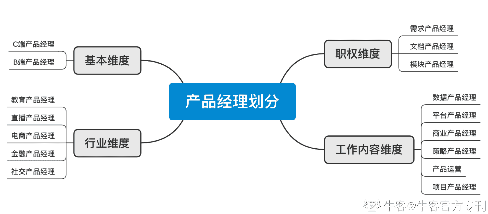
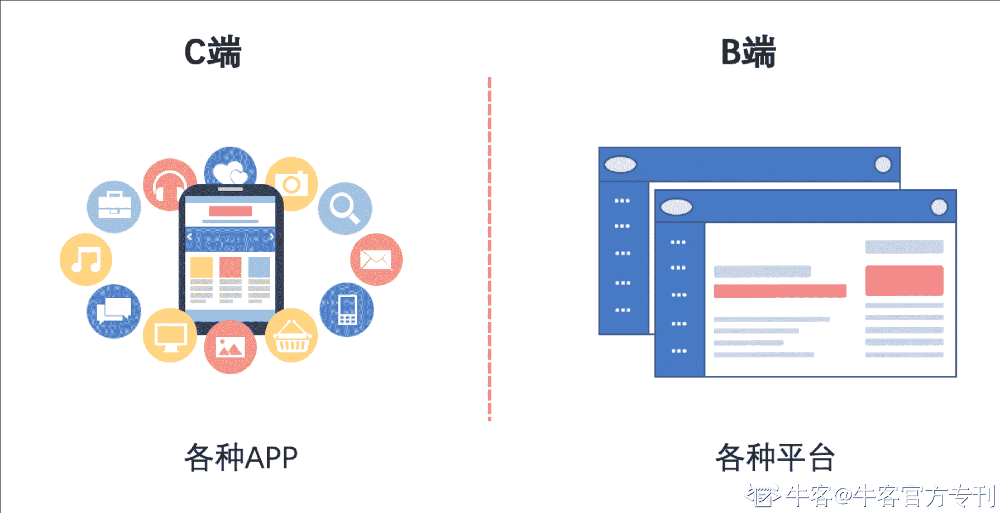
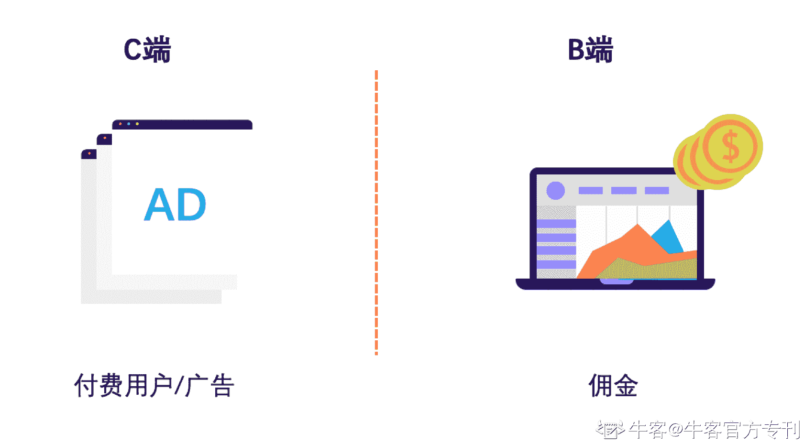
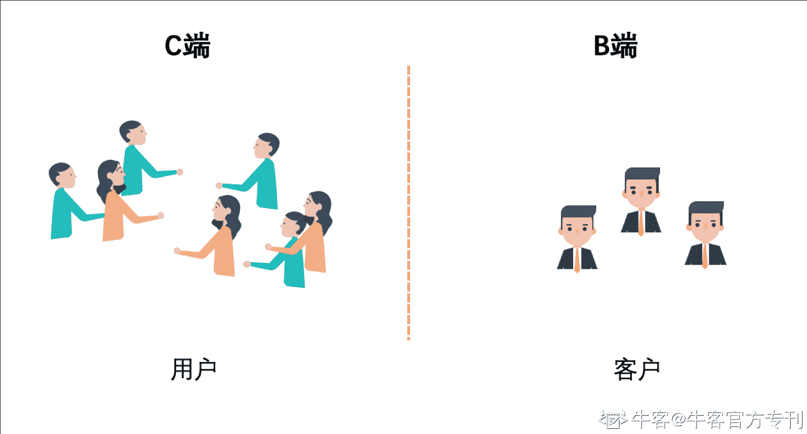
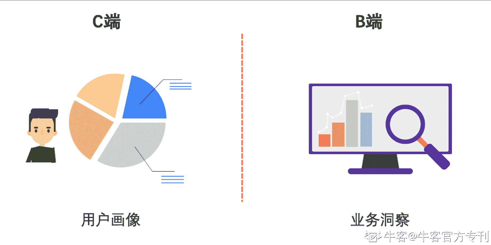

# 第二章 第 1 节 初识

> 原文：[`www.nowcoder.com/tutorial/10037/adb19e5a6d4d4171a4f596656b9a6a42`](https://www.nowcoder.com/tutorial/10037/adb19e5a6d4d4171a4f596656b9a6a42)

# 一、什么是 B 端产品经理？

## 【产品经理都有哪些类型？】

对于「产品经理」这个词，大家早已不再陌生。这个职位从刚刚出现时的定义模糊众说纷纭，再到“人人都是产品经理”时期的热火朝天，发展到今天，随着互联网业务模式的逐渐成型，产品经理成为每一个从事互联网相关业务的企业都离不开的重要角色。而这个岗位也根据不同的领域和业务更高的要求，已经演变划分出许许多多纵深的方向，从原来的“什么都做”，到现在的“专业方向”，定义趋于清晰。

#### **产品经理都有哪些类型？**

这个问题真的很有意思，产品经理职位细化至今天，在不同维度的粒度上对于产品经理的划分是不同的。简要来说，按照产品受众对象划分为 C 端产品经理与 B 端产品经理。而在其他维度，产品经理也有相应不同的划分，如行业维度、职权维度、工作内容维度等。

### **什么是 B 端产品经理？我们先来了解一下 C 端与 B 端的定义。**

## 【C 端与 B 端的定义】

C 端：Consumer（或 Customer），多指代用户，面向个人用户在终端使用的客户端类型的产品，你、我等大部分人平时接触到最多的是 C 端的产品，如：微信、淘宝、抖音等。**更多涵盖生活使用场景。**
B 端：Business，多指代企业或商户，面向企业级客户，基于企业业务问题，提供平台级的解决方案，服务企业完成业务运转。如：ERP 平台、CRM 平台、管理云平台等。**更多涵盖企业业务使用场景。**

**【B 端产品经理】**

C 端业务需要 C 端的产品经理来构建产品的功能，而 B 端的业务也同样需要 B 端产品经理。随着 B 端市场大门的开启，各大互联网巨头们纷纷加入到 B 端的赛道中去，B 端产品经理也逐渐浮出水面，让进入互联网大门的人们，尤其是产品经理们，开始逐步接触与转型。
**不过需要注意的是**，B 端产品经理，不是商业产品经理。很多同学容易将“B”理解为“商业化”，将这两个概念混淆，这是不对的。前面我也说过了，这两种产品经理是不同维度的划分，不能在同一个视角中进行直接对比，且商业产品经理也大多数为 C 端场景，对其概念说明就不再这里过多描述了。
那么，C 端我们总能接触，也或多或少的了解 C 端产品经理是做什么的，与 C 端产品经理相比，B 端产品经理又有什么不同之处呢？

# 二、B 端产品和 C 端产品的区别

通过对比 C 端与 B 端产品的不同，就可以看到对于产品经理而言，C 端与 B 端的要求也是很不一样的。

### 1.产品形态上：

C 端产品多以移动端手机上 APP 为主。而 B 端则多以 PC 端、SaaS 平台为主。所以，对于 B 端产品经理而言，产品多以导航+内容的形态为主，相比 C 端产品的变幻多端，B 端更加关注的是业务和效率本身，更加关注的是平台背后映射的业务逻辑设计，这就要求产品经理更多的去拥抱和打磨后台逻辑。

### 2.盈利方式上：

C 端多数是***，追求的是流量，是使用用户的消费，漏斗的模式来逐渐将大量的用户筛选成一定数量的付费用户以及少量的高级付费用户，广告收入等获得收入。
B 端采用的是企业按需订购的模式，简要来说就是佣金，企业依赖平台的服务来实现业务，平台根据为企业提供的服务进行收费以获得盈利。平台根据企业的业务范围等，有些是按照服务数来收费的，有些是按照服务时长来收费的，有些是按照服务资源大小来收费的……

所以 C 端产品经理需要运营的投入以及商业化的方案来助力产品获取利润；而 B 端产品经理则需要通过对业务的打磨，让平台匹配更多的企业，保持业务竞争力，以获取更多的企业订单。

### 3.用户的类型与数量上：

C 端用户数量十分广大，对于产品经理而言，关注更多的是对于用户的留存，并高度注重用户体验。B 端产品追求的不是用户数量，而是客户数量，其背后往往对应某一行业的企业，对于产品经理而言，关注的则是如何能将平台通用化，符合该领域的更多的企业。

 ### 4.用户角色划分上：

C 端产品多以某个领域的问题，面对拥有同一个需求的广大用户。产品经理可能不会过于关注用户的层级划分，而更多的是关注将用户抽象出不同群体，形成用户画像，针对性的进行营销，提升用户体验以及平台收益。B 端产品虽然不会拥有大量的用户量，但是对于用户角色层级的划分，根据公司业务以及对应权限的设定是非常严格的，对于角色分配以及权限的管理，将不同用户分布在不同业务之中，对于产品经理的洞察逻辑要求很高。

总体而言，C 端产品注重体验交互，注重用户留存，注重运营和用户增长；B 端产品注重效率，注重业务逻辑，注重行业解决方案能力。这就要求 B 端产品经理要有更加纵深的业务能力，同时要有良好的逻辑方式，拥有将复杂业务抽象成产品诉求的能力。**而这，与 C 端产品经理是截然不同的。**