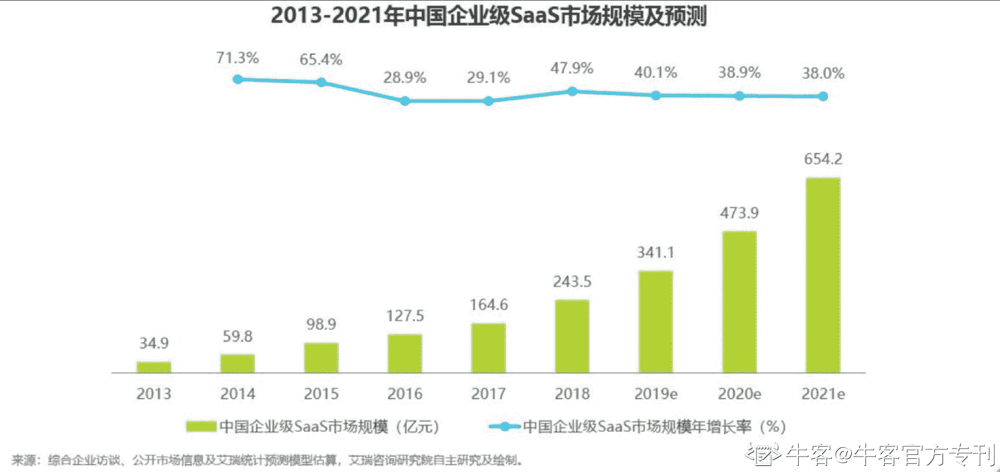
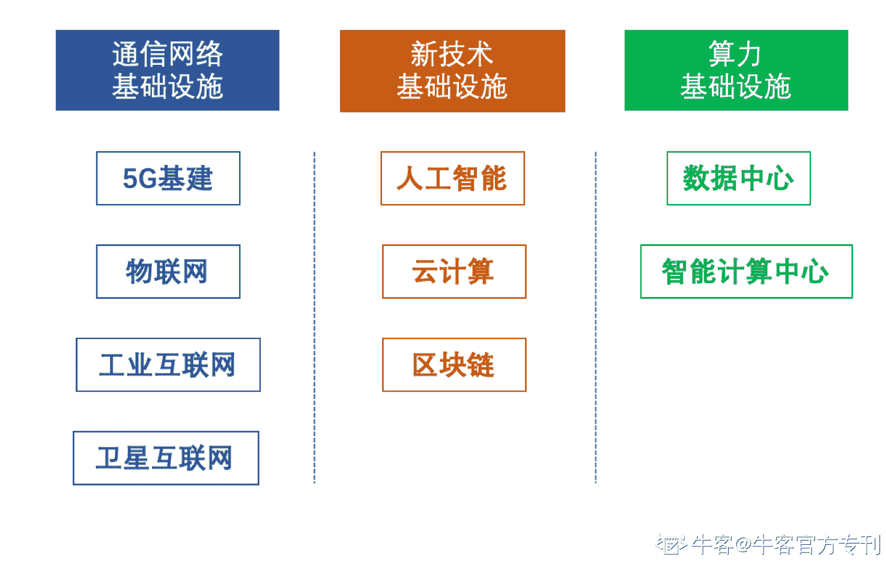
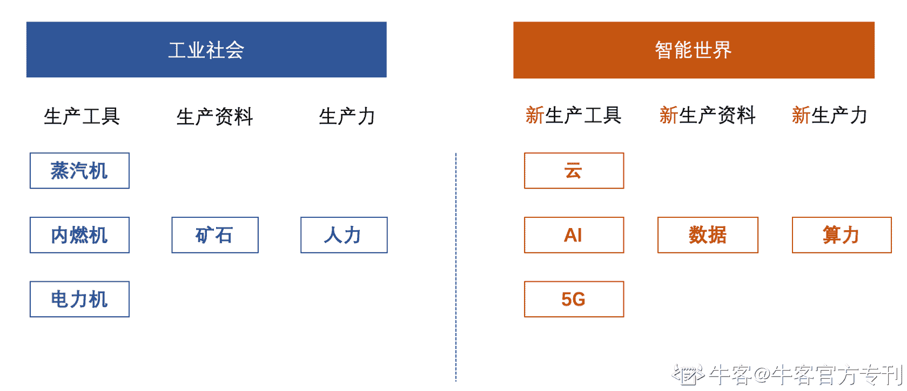
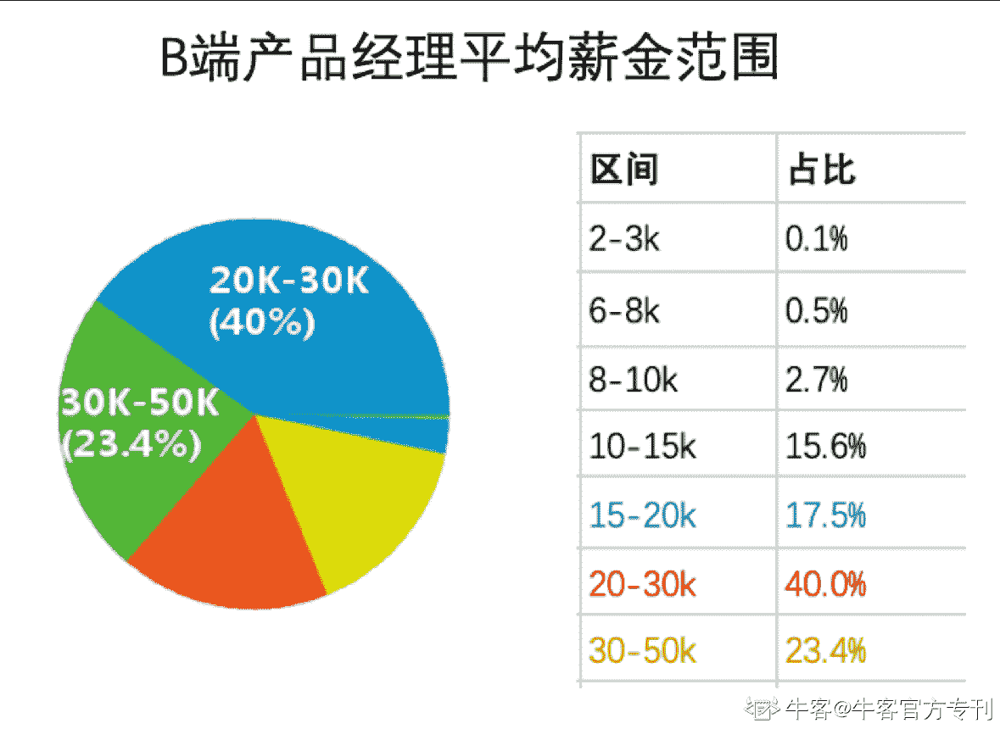
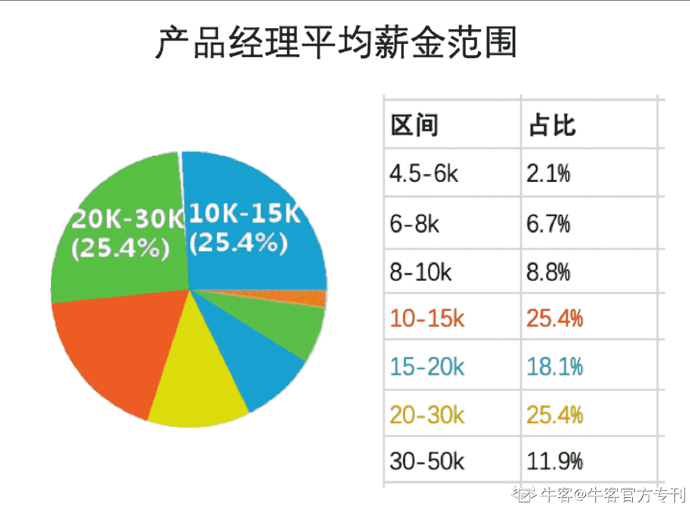

# 第二章 第 2 节 为什么 B 端产品经理会越来越值钱

> 原文：[`www.nowcoder.com/tutorial/10037/04840d0bc87445e0a2194ff19ec9b42d`](https://www.nowcoder.com/tutorial/10037/04840d0bc87445e0a2194ff19ec9b42d)

# B 端产品经理，为什么会越来越值钱

## 1.从行业趋势来看

#### **【C 端流量风口红利逐步消失】**

先来几个灵魂发问，带你亲身体验一下近几年的 C 端互联网行业趋势：
1.这三年以来，你是不是很少下载新的 APP 了？
2.有没有发现，自己每天就在几个 APP 上来回切换，且浏览停留的时间越来越长了？
3.是不是几乎生活中的每个领域已经有固定的几个可以叫出名字的头号 APP，你很少也不愿意再去尝试其他新出的 APP？
通过回答上面的问题，再结合近两年各互联网厂商不断的在宣扬“互联网的寒冬已经到来”的说法，对于这个趋势，你感受到了吗？
根据数据研究显示，截止至 2020 年 3 月，中国移动互联网的月活用户规模已经达到了 11.56 亿，但从 2018 年以来，月活用户的增速在逐年持续下跌，2019 年 10 月起同比增速甚至跌破了 1%，11 月达到了可怜的 0.7%。尽管 2020 年初因为疫情因素，月活用户规模有小幅度的提升，但并不能影响增幅加速下滑的整体趋势。从另一个角度来看，自 2018 年以来，全网月人均打开 app 个数的增幅也在逐年减少，而人均单日使用时长有了大幅度的提升，换算一下，均分到每个 APP 上的时长在持续增加。这就表明，对于整体的 C 端市场而言，新增的能普遍被用户接受 APP 数量在减少，而巨头们纷纷将流量汇聚在自家打造的顶级 APP 上，尽可能多的留住用户并延长其在自己 APP 上的使用时长。C 端市场的流量高速增长期已经过去，流量红利也在逐渐的见底。各大领域格局已定，头部座椅已经占据着不可动摇的地位，新玩家很难入场，那个雨后春笋遍地花开的 C 端市场风口也已不复存在了。
C 端市场的饱和也促使各大厂商开辟另外一条赛道，**那就是 B 端市场**，以 BAT、字节美团等为首的互联网大厂们也纷纷进行调整，开始吹响 B 端攻城略地的号角。

#### **【B 端市场群雄纷争，B 端产品经理需求增大】**

经过近几年移动互联网时代的飞速发展，而移动互联网 C 端用户的行为习惯的改变也逐步作用于企业的商业模式。依托于云平台、大数据、云计算等技术，结合 SaaS 模式，B 端云平台有如下优点：
**1.更优的移动办公体验：**随时随地办公的 B 端云平台能提供更优秀的移动办公体验；
**2.更低的成本：**大量存在信息化建设需求的中小企业难以负担传统软件的高昂费用，B 端平台的 SaaS 订阅模式可有效降低成本；
**3.更高的效率：**激烈市场竞争促使粗放式增长转向精细化管理，B 端平台通过简化复杂流程可以助力企业提高效率。
这些优点也被企业所接受，并成为企业提升竞争力的一个有效武器。基于此，国内 B 端市场规模逐年提升，预计到 2021 年将达到 654.2 亿元。
图表来源：艾瑞咨询网
面对如此大的市场，各大 2C 互联网巨头们也纷纷通过调整组织架构等动作，将产业互联网战略地位持续升级，搭建自身的企业服务生态。-2018 年初，阿里将“新制造”作为下一个阶段性目标，致力于建设 B 端服务，同时，截止至年末，旗下 ToB 业务的主要产品“钉钉”的企业组织用户突破 700 万。
-2018 年 9 月末，腾讯宣布调整组织架构，成立全新的云与智慧产业事业群（CSIG），标志着正式加入 ToB 业务战场。
-2018 年末，百度宣布组织架构调整，将原智能云事业部升级为智能云事业群组（ACG），将 AI to B 作为宗旨，加入到 to B 市场赛道中。
不仅行业巨头们对 B 端市场这块大蛋糕垂涎三尺，各企业也纷纷落地业务垂直型或行业垂直型 B 端市场，一时间市场呈现群雄纷争之势。在这种环境之下，行业业务+产品能力兼具的 B 端产品经理就成为抢手的岗位了，而且随着各 B 端领域的行业竞争加剧，B 端产品经理的岗位需求将会越来越大，而品质优异的 B 端产品经理也将越来越值钱。

## 2.从政策导向来看

国家促进经济发展，发布大量的政策导向发展企业信息化，而这对于 B 端产品经理而言是一个空前绝后的利好时代。
2017 年，国家根据云计算产业规模的稳定增长情况，工信部大力推动“企业上云”政策。
2018 年末，国家提出“新基建”，主要以 3 大主要方向为建设：通信网络基础设施、新技术基础设施以及能力基础设施建设。

在新基建的扶持之下，背靠着 5G、AI、大数据、云计算、物联网等最前沿的技术，与传统基础设施融合创新，从而将工业社会与智能世界有效结合，以 B 端平台作为中间媒介，促使各行各业都能大力发展。

2019 年成为中国 5G 元年，网络已经逐步成为水电煤之后居民生活生产重要的基本要素。国家吹响 5G 元年的号角，以“新基建”为主导，致力于建设信息领域的超高速“公路”。随着 5G 网络覆盖，国内移动上传和***指标逐步达到世界领先的水平，移动互联网的作用也将由消费端（C 端）向企业端（B 端）倾斜。企业平台的市场规模达到 341 亿，不容小觑。有了政策作为支撑，互联网、人工智能等为基建，为企业上云提供了环境的保障，大量的企业将拥有 B 端平台的需求，同时细分市场领域范围十分广阔，基于此，对于能将业务与能力相结合的平台设计者——B 端产品经理，将在这种广阔的市场前景中大展身手，市场将会如同海绵吸水一样拥有大量的 B 端产品经理的需求，有着行业经验的产品经理也将成为香饽饽，备受市场的欢迎。

## 3.从岗位需求来看

#### **【岗位需求量逐年增加】**

从全国的招聘职位数来看，2019 年 B 端产品经理的招聘职位数达到了 550 个，相比 2018 年的 414 个涨幅达到了 33%，短短一年，职位数量增长了三分之一，可得知 B 端产品经理的岗位需求量、种类数要求以及竞争力都是逐年增强的。

####  **【工资水平较高】**

B 端产品经理岗位在市场中有着很高的议价能力，从全国岗位需求历年平均工资变化情况来看，2019 年平均工资 19k/月，2020 年 26K/月，可以看出 b 端产品经理岗位的平均工资涨幅可观，同时也意味着，市场稀缺度比较***位拥有较强的竞争水准。
 
而从全国对于 B 端产品经理工资分布来看，分布最广的平均薪金范围在 20-30k 之间，达到总数的 40%，次之在 30-50K 之间，达到总数的 23.4%。整体而言，工资水平在一个较高的水平内。相比产品经理岗位的平均薪金范围广泛分布于 10-15K 区间以及 20-30k 区间（各占比 25.4%），B 端产品的平均薪金要高于产品经理。
综上，从岗位的需求以及市场情况来看，在产品经理岗位中，B 端产品经理的岗位认可度***位竞争力大，薪金水平较高且岗位需求和种类多样性在上升阶段。

# 总结

这一节我们认识了 B 端产品经理，从岗位发展到薪资水平以及目前的岗位需求，相信大家对 B 端产品岗位有空一个大致的认识，下一节我们将从产品经理的基本素质来让大家更加清晰的认识 B 端产品经理。