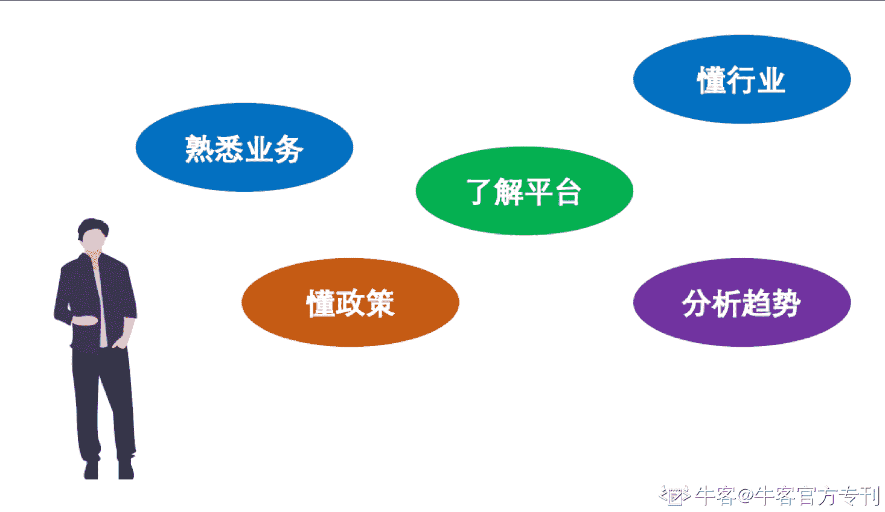
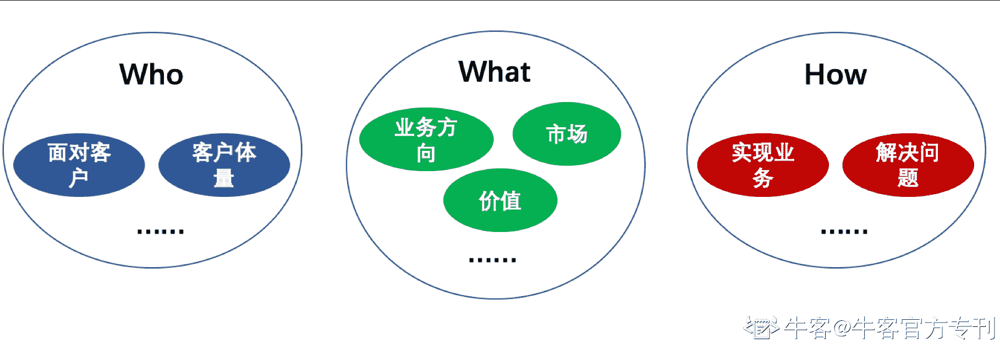
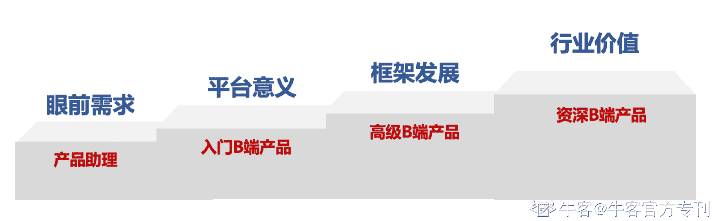
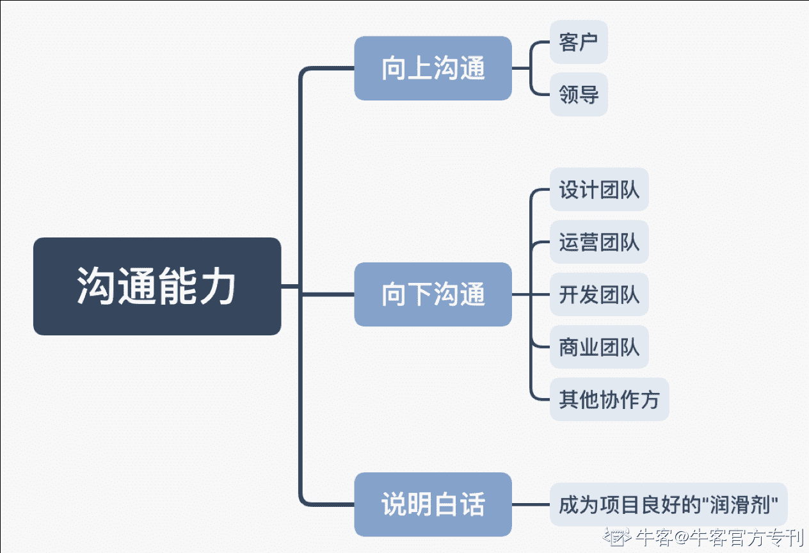

# 第三章 第 1 节 B 端产品经理的基本素质

> 原文：[`www.nowcoder.com/tutorial/10037/3def81ca5dcc4cfca9b7f5e6a2bed9c2`](https://www.nowcoder.com/tutorial/10037/3def81ca5dcc4cfca9b7f5e6a2bed9c2)

B 端产品经理，首先是作为产品经理，产品经理的基本素质大家或多或少有所掌握，就不再这里过多说明了，我们直接来了解作为 B 端产品经理，需具备的基本素质。

## 1.学习能力

学习的重要性这个大家都懂，而对于 B 端产品经理而言，拥有快速学习的能力，保持持续学习的习惯，是最重要的，所以如果写一本书叫做《B 端产品经理的基本素养》的话，第一章节一定是学习能力。B 端产品因为是在某个领域或行业进行深耕，行业业务在发展，产品经理需要快速的熟识这个领域，并需要领略到当前业务在领域中的地位和目标，这个行业发展趋势是什么。而且，由于在做产品的途中，总会出现新的技术新的流程，故需要产品经理能够快速掌握这些知识，将知识化为武器，才能将平台搭建完善。说白了，其实要是可以做到：懂业务的人没有你懂产品，懂产品的人没有你懂业务。那你就能成为这个领域中不可多得的人才。
本人之前接手的项目是物联网连接领域的 B 端 SaaS 平台，平台为物联网卡厂商与设备厂商提供对接与连接服务。刚刚接手项目的时候，由于需求较紧急，且需快速占领市场，我只有短短一周的时间来熟悉物联网这个领域的各种概念和市场，一周之后就需要跟客户见面核对需求。
不仅要对从客户口中说出来的各种名词需要了如指掌，还需要有自己的分析判断与见解，要对整个市场环境等有自己认知，为客户分析出最优解。与客户核对后，项目启动早期，市场依旧在不断的变化，政策等因素也在与时俱进，总会出现新的词汇需要快速消化吸收。每次工作时的侃侃而谈的背后都是在家里在业余时间不断的查阅资料，不断做足功课而产生的结果。努力也是有成果的，我们的 SaaS 平台迅速攻下几家大客户，并通过业务沉淀，为许许多多个小企业提供标准化的行业服务。
以下是根据多年的 B 端产品经理工作经验，总结出来 B 端产品经理保持良好学习能力，需要养成的习惯：
**1.学会自驱动学习：**自我驱动着去学习，而不是仅仅因为工作需要而去被动学习。
**2.学会挖掘根本：**产品经理，尤其是 B 端的产品经理，在看到一些数据或者结论的时候，多去思考是什么导致出现这样的结果，探究其影响结果的根本原因，并主动去深深挖掘，在挖掘的过程中，也会不断丰富自己的知识树。
**3.保持好奇心：**这个跟自驱动类似，但是不一样的点就是，在生活中也会多问为什么。尤其是遇到可能与自己业务相关的情景的时候，就会好奇，这个是否能跟我们有关，我们能否提供类似的解决方案。比如，本人在物联网连接平台项目的时候，日常打车，与司机交谈的过程中，就发现，车内的导航以及车载 Wi-Fi 似乎可以用到物联网连接，然后在手机记录下来，回去探究一下车载领域物联网发展的可能性，并在下次平台战略讨论会的时候提出自己的想法，助力平台开启新的领域。所以，时刻保持一颗好奇心，也是 B 端产品经理需要养成的习惯。

## 2.行业分析能力

B 端产品经理多面对整体行业需求，加入到某个行业中去，往往需要系统化的进行行业分析。漫无边际的分析只会徒劳的消耗时间。可以使用 WWH 的方法，即 who、what、how。
Who 即是需要分析平台面对的是哪些客户，客户的体量有多大，有多少同类型需求的客户，这样的分析可以判断所做的平台是否能被认可并提供价值。
What 即是需要分析平台要做什么业务。即使是一个比较垂直比较窄的行业领域，一个 B 端平台也不可能涵盖全部的业务。需要进行判断所做的业务对于领域内的客户是否能提供价值，有多少竞争力，有多大的市场。
How 即是需要分析如何实现平台业务，如何为客户提供服务。根据公司自身情况以及对业务的解决情况，来评估平台在行业中的竞争力。

B 端产品经理因为常见的是从行业某一业务立足，而对于业务向上升级，就需要对整个行业有一个全景的视角，因为整个行业的发展潜力往往就映射着 B 端平台的发展潜力，以及会面对多少潜在客户。举个例子，早在 09 年的时候，云市场还是一个人人看好但是没人敢做的领域，对于云各大厂商众说纷纭，多数持驻场观望的态度。在这个时候，基于对于互联网行业对于本地化搭建服务的高成本等等困扰，以及对于远程资源计费方式的追寻，立足于行业分析，阿里开始立足云市场，发展阿里云业务，成功占据了国内的云市场，并吹响了云的行业百家争鸣的号角。
具备行业分析能力，对于 B 端产品经理而言，是可长期发展的一个保障，既是对于产品业务而言，又是对于个人长足发展而言。

## 3.框架观

产品框架构建能力，是判断产品经理，尤其是 B 端产品经理级别高低的重要依据。对于 B 端产品经理而言，虽然基础要求对于框架架构能力并没有那么高，但是 to B 领域是严格需要能够站在高于眼前项目的视角来分析功能需求的能力的，所以，能够具备一个高于眼前需求的眼光，拥有一定的框架逻辑层面的视角，能从平台角度来认知需求，是 B 端产品经理的基本素质之一，我们且称其为“框架观”。
有一个寓言，讲的是一个记者在工地上，问了三个工人“你们在干什么？”，第一个回答说：“我在砌墙”，第二个回答说：“我在建一个大楼”，而第三个回答说“我在建设美丽城市”。对应 B 端产品经理而言，只知道“砌墙”的，即仅关注客户、上级提来的眼前的需求的人，是一个入门级别的产品经理，远远达不到 B 端产品经理的基本素质要求；而开始关注“建大楼”的，已经符合了 B 端产品经理的基本素养，可以做到从当前平台的视角来俯视需求，开始了解自己当前的需求于全平台而言的意义和地位，并大致能推出平台的逻辑走向，这个是 B 端产品经理的一个基本素质，即「框架观」。而最后能站在行业的角度来分析平台大局走势，合理提出平台功能框架的，放眼于“建设美好城市”的，则是高级别的 B 端产品经理核心竞争要素。
面对行业领域，平台启动初期面对的企业不多，存在很多定制化的个性需求，平台面对的是少数几个，甚至是单个企业的需求进行设计的。这种情况下，很容易就形成，客户提需求，平台按图索骥的情况。而随着平台的客户越来越多，接触到的行业企业数量不断增加，个性需求如何向共性需求靠拢，如何做出行业标准化可通配化的流程，平台功能框架是否能兼容标准化流程以及支持拓展特殊企业（如重要客户或者大企业等）的定制化需求，这就是体现 B 端产品经理框架构建能力了。

B 端产品经理做平台的时候，形成「框架观」可遵循以下：

**1.****小微企业需求标准化：**小微企业数量众多，且需求多有共性，产品经理需要将其归总汇聚为平台标准，对于小微企业提供服务，多多让其适配平台标准，而不是平台去为其适配。

**2.****中型企业需求行业化：**对于中型企业客户，数量相对较多，且合作周期较长，可将平台功能抽象成行业水平，介于高度定制化和高度标准化之间，可以允许一定量的个性化需求，但是大部分还是以行业为粒度框架为主。

**3.大型企业需求定制化：**对于大型企业客户，数量虽然较少，但是大型企业拥有成熟的业务标准，且难以动摇，B 端产品经理面对这类型的客户是，多思考将可标准化的需求为辅，而平台为其提供定制化的功能为主。这也要求平台产品的框架搭建时期需要对标准业务以外的定制化进行思考和准备。

## 4.沟通能力

嘴，是普通人吃饭的东西，更是产品经理用来“吃饭”的东西。一个公司的管理者，至少 70%的时间是用于沟通的，而一个优秀的 B 端产品经理，90%以上的时间都将用来进行沟通。玩过“传声筒”游戏的人一定知道，随着传话的人数增多，信息失真率也大大的提高，第一个人传递的信息到最后一个人的时候，大多数情况已经变成另外一个内容了。传话如此，需求沟通传递更是如此，B 端需求如果没有产品经理良好的沟通技巧，很容易成为“千人千面”的状态；客户理解的样子，产品经理理解的样子，领导理解的样子以及研发理解的样子大相径庭。**沟通能力十分重要，一个项目的失败往往是因为沟通出现问题所导致的。**

### 1.向上沟通：

这里的“上”指代领导和客户。面对领导，产品经理沟通往往会犯下一个大忌，就是总是向领导描述这个平台如何去实现，并希望能够提供建设性的意见。将军命令去攻城，一定不希望下属问他如何使用枪械。同样的道理，领导面对产品经理业务的平台，往往关心的是如何解决行业问题，行业市场情况，以及能够带来多少收益。而客户也是同样如此，业务流程可能只是沟通的一个主线，但是客户更关心的是平台能为其解决什么问题，同样，也是能为企业带来哪些收益。
所以，B 端产品经理在向上沟通的时候，就需要很多沟通技巧，首先，以业务作为一个主线去连接沟通领导与客户，但是一定要从他们的角度出发，去谈论他们关心的要点，如有需要，可从领导那边获得资源倾斜去助力自己的项目，从客户那里获得更多的需求，来明晰平台构建的方向。

### 2.向下沟通

这里的“下”不是指代自己的下级，而且，位于产品生命周期的下游，比如设计团队、运营团队以及开发团队。对于向下沟通，面对的则是提供产品和业务的细节，可能业务流程不是他们完全关心的点，而团队更关心如何去实现需求，就需要产品经理梳理出明晰的需求，针对不同职责的团队，输出根据相应职责匹配的需求描述，做到大家理解平台而又能各司其职，产品在运营、开发、设计等方面分别定下产品目标，可以理解为将产品目标拆分到不同团队的目标当中，这样才会让各个不同的团队协作起来，完成最终的产品目标。

### 3.将话说明白

沟通从最粗浅的意义而言，就是会说话，表达能力十分重要，知道如何将自己的思路用最简洁最易懂最明晰的方式说出来，并且能够给沟通对象表达明白，这是作为 B 端产品经理的一个基本素质。这个既需要本身性格善于言谈，同时也需要时间去打磨。保持信心，不畏惧沟通，产品经理才能成为项目流转良好的“润滑剂”。

## 5.判断能力

B 端产品经理通常面临很多抉择，往往通过与客户的交流，业务的变更，以及在平台搭建的过程中，从内部外部产生大量的需求。作为 B 端产品经理，很容易就成为“需求接收机”，这个时候，判断能力就显得尤为重要。
1.公司团队人力资源有限，在有限的时间和有限的人力资源里面，如何充分利用有限的资源去做价值最大的事，能够带来更大的收益，这个十分需要 B 端产品经理的判断能力。
2.对于面对因业务冲突、市场调整或者大客户的定制急需需求，面对新需求与当前正在做的有冲突的情况，需要 B 端产品经理进行取舍，决断的同时也需要充分的分析，因为优先级往往会影响整个项目的前行方向。
3.在与业务方进行对接的时候，临场的判断能力也是助力 B 端产品可以做好的一大因素，对于对接过程中出现的问题，当机立断的判定并给出相应决策往往是能够促进业务合作顺利进展的一大因素。这种判定既能给团队省下很多处理问题的时间，又能带给合作方一个良好的印象，并能助力打造出自己的产品经理口碑。

## 6.数据分析/洞察能力

数据分析能力是一个产品经理必不可少的能力，通过数据来分析当前产品的表现，市场情况，以及洞察出产品的方向。C 端产品经理的分析数据大多面对运营与商业化方面的分析，而相比 C 端产品更多从数据关注用户行为来看，B 端产品更多关注的是平台与行业领域的数据。
低级的 B 端产品经理仅仅能根据数据中体现出来的波动点来分析原因，换句话说，仅仅能说出，数据有波动有异常，是因为什么。而高级的 B 端产品经理，首先能够明晰，为什么数据是这样的，并可以根据数据来分析出数字以外的信息，比如整体趋势是什么，造成这样的趋势原因是什么，并能根据眼前的数据分析出未来的产品业务走势，洞察出当前 B 端产品需要更新哪些业务功能，哪些需要改进，确定出下一个阶段产品的目标。

## 7.复盘能力

战场千千万，经验靠磨砺。复盘是一项十分重要的环节，因为对于 B 端产品经理而言，不再同一个地方摔倒两次，是基本原则。前面的项目无论成功还是失败，定期进行复盘，并能总结出经验教训（项目管理学中管这个叫“组织过程资产”），运用到之后的产品项目中去，就会提升效率。
复盘，顾名思义，就是将之前发生的事情重新轮转一遍。当然，这里的复盘不仅仅指代产品的复盘，同时也有业务的复盘、行业大事件的复盘。正所谓以史为鉴，可以知兴替。定期复盘，并能从复盘中找到问题所在，总结出良好的经验，是 B 端产品经理的一个必要技能。

# 最后

B 端产品经理，是当下互联网最火的职位之一，各大巨头也纷纷对 B 端业务趋之若鹜，所以就给了 B 端产品经理巨大的机会，但是机会的背后也面临诸多挑战。只有不断的提升自我，提升基本能力，让自己保持竞争力，才是不会被时代所淘汰的一个必然条件。愿你可以顺利走上 B 端产品的道路，并能够直至事业的高峰。