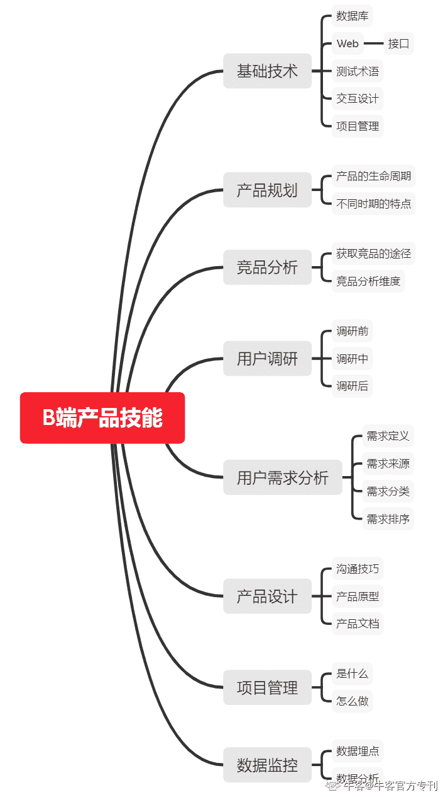
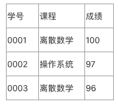
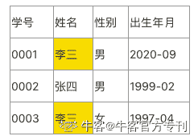
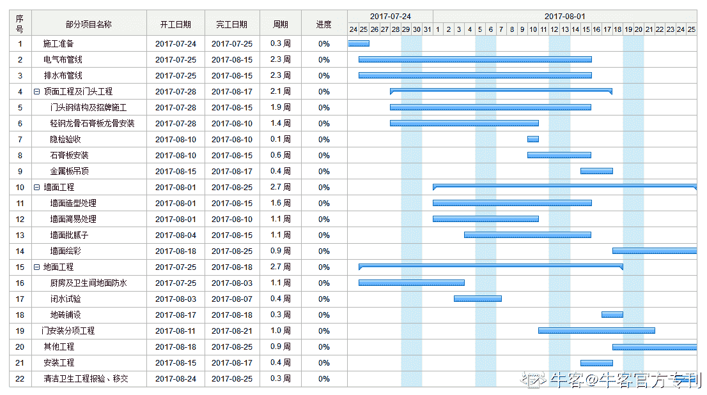

# 第四章 第 1 节 专业技能（上）

> 原文：[`www.nowcoder.com/tutorial/10037/5dc4e51e16324887ae43c0a8e95b94cd`](https://www.nowcoder.com/tutorial/10037/5dc4e51e16324887ae43c0a8e95b94cd)

## ToB 的产品和 ToC 的产品有很多差异。做 B 端产品究竟需要具备哪些专业技能呢？

先来看看本文的脑图就能够有个大致的了解。

# 一、基础技术知识理解

遍寻各公司产品经理的 JD，基本都写着计算机相关专业优先，这无疑是对产品经理的技术知识考核。**产品经理到底需不需要懂技术？**这一直都是个经典问题。我们知道产品经理的重心在于策划产品，而对技术有一定的了解，确实能够帮助你更好地策划产品，尤其是 B 端产品，因为 B 端产品是面向行业、面向公司的，往往会自带一定的专业性，不像 C 端产品一样主要针对大众群体而不能具备太多专业性。产品经理的基础工作包括与前端、后端、测试等研发同事的沟通，也包括与设计师、项目经理的合作，那么以下基础的技术知识一定是你必备的。

## 数据库相关：

*   **数据库（Database）：**顾名思义，就是存储和管理数据的仓库（简称 DB），是长期储存在计算机内部的，有组织可共享的数据集合。数据库就是文件的集合，按照特定的格式将数据分类存储，为多用户所共享，并且用户可以对数据进行增删改查等基本操作。类比下我们电脑上的文件夹，我们可以将一或多个文件存放在一个文件夹中，那这个文件夹即为一个数据库，是文件的集合。

在 B 端产品经理的日常工作中，一般是跟后台同学交流数据库，当然我们不会去讨论技术的实现，而更多地是讨论“字段”的有无。何为字段？比如一张成绩单中，学号、课程、成绩都是字段，再比如学生信息表中，学号、姓名、性别、出生年月也都是字段，相信大家都领悟到了，字段表示的就是某一个方面的信息。假如我们今天要给过生日的用户发放奖励，那么我们肯定需要拿到所有学生的出生年月，也就是拿到数据库（学生信息表）中的出生年月这个字段的信息，我们才能进行下一步操作，所以可以把数据库看作 B 端产品的基石。数据库可以分为关系型数据库、非关系型数据库。

*   **关系型数据库：**数据存放在不同的表里，各个表之间通过主键互相关联，关系型数据库由二维表格和表格与表格之间的关系组成。常用的关系型数据库有 MySQL、SQL Server、Oracle 等。

产品经理通常只需要使用简单的 SQL 语句进行查询，逻辑很简单：从哪里找出什么，并且要满足什么条件。比如从高三学生中找出所有的数学成绩，那就是 SELECT 数学成绩 FROM 高三学生，即从高三学生的数据库里把数学成绩这一字段信息拿出来；如果再加上一些判定条件，比如从高三学生中找出所有高于 130 分的数学成绩，那就是 SELECT 数学成绩 FROM 高三学生 WHERE 分数>130，以上就是最基本的 SQL 语句使用介绍。
表 1  成绩单表 2  学生信息
例如上图，两个表格及表格之间的关系即为数据库，该数据库存着若干学生的信息和课程信息，学生的姓名可能重复，而学号不可能重复，所以两个表之间通过唯一标识的“学号”关联起来，这就是关系型数据库，每个表之间通过唯一标识的“主键”关联，如图学号即为主键。

*   **非关系型数据库：**一般指 NoSQL，“Not Only SQL”，泛指非关系型的数据库，数据之间无关系，扩展性强。常用的非关系型数据库有 Redis、MongoDB 等。

## Web 相关：

*   **C/S 结构：**Client/Server 结构，需要下载客户端软件，如有道云笔记客户端、微博客户端等
*   **B/S 结构：**即为 Browser/Server 结构，只需要有浏览器，输入网址即可使用，无需下载安装客户端软件，如网页版的有道云笔记、网页版的微博等。
*   **IP 地址：**由数字组成，用于唯一标识计算机在互联网上的逻辑地址，每台计算机可以通过 IP 地址来区别和联系。例如 12.11.142.12。
*   **域名：**由于 IP 地址由数字组成太难记，于是在这基础上发展出来通过符号来表示 IP 地址，不过一个域名可以对应多个 IP 地址，一般为 www.[xxx].[xxx]，例如[www.nowcoder.com](http://www.nowcoder.com)。
*   **DNS：**即为将域名解析为 IP 地址的服务器。
*   **URL：**即 Uniform Resouce Locator，统一资源定位符，用来唯一标识某一处资源的地址。一般为"[协议]://[域名]或[ip]:port/[具体地址]“结构，也称为网址。例如 [`www.nowcoder.com/test/17305471/summary`](https://www.nowcoder.com/test/17305471/summary)。
*   **接口：**开发人员已经封装好的代码，传入相应参数，调用这个接口就能获取相应数据，可以理解为数据传输通道。
*   **部署：**一般在开发过程中，所有代码都是在开发人员本地电脑上调试，提测前需要将代码部署到服务器上。

讲了这么多，其实上述的这些 Web 概念，工作中涉及最多的是接口，出问题最多的也是接口。因为像 IP 地址、域名这些都是已知或者固定好的，且通常只有一个，而接口则有很多个，不同的接口实现不同的功能。举个形象的例子，打仗过程中，前线士兵通过电话与基地联系，每次联系的内容肯定不一样，有时是要食物补给，有时是要弹药补给，有时是要人员补给，有时是要请求撤退，因为涉及的需求不一样，所以处理这些需求的基地部门也不一样，食物补给由后勤部门解决，弹药补给由弹药仓库解决，人员补给由调派部门解决，请求撤退由司令部解决，这样就相当于基地提供了 4 个接口，来接收前线士兵的请求，并予以回应。那么它为什么出问题最多呢？因为它频繁往返于接收方和请求方之间，特别容易导致甩锅现象发生。前线士兵说我明明打了电话，你却不给我送食物；后勤部门说我昨天值班一天一夜，都没有收到你的电话，最终到底是哪一方没做到位，需要技术的排查，所以接口的对接工作在开发中往往占了很大一部分。

## 测试相关：

测试按策略和类型会分为很多种，但 B 端产品并不是所有测试环节都会进行，以下介绍测试工程师工作经常涉及的环节和关键术语。

*   **功能测试：**顾名思义，就是单纯测试系统功能是否正常。

           a.界面测试：针对产品经理和 UED 给出的设计稿和交互稿，进行界面测试，含文案和交互测试，属于功能测试的一种，一般会通过手动点击操作界面，查看是否有乱换行或文案不对的情况。
           b.回归测试：一般在产品多次迭代后，在下一次产品迭代过程中，在进行新功能的功能测试后，对之前版本的功能进行测试，确保新功能不会对旧功能产生影响，即回归测试，也是功能测试的一种。

*   **性能测试：**在代码趋于稳定时，开展性能测试，对产品性能进行验证。即测试同学经常挂在嘴边的“压测”，因为只有在对产品施压的情况下才能测出性能问题，比如让产品风吹雨淋连续工作一个月。

           a.并发测试：测试多个用户同时访问产品的同一个模块，系统是否存在异常。
           b.容量测试：测试系统最多能同时在线多少用户。

*   **安全测试：**在产品基本完成，产品发布之前将针对产品的安全性进行验证，确认该产品符合安全设计标准，一般企业都有自己的安全审核部门，在产品发布完成前必须走这一环节。
*   **验收测试：**根据产品制定的验收标准，测试模拟实际用户操作场景进行的测试，是产品发布前的最后一个环节，一般在测试工程师做完验收后，产品经理或交付经理会再进行一轮或两轮验收，以确保实现和需求完全或基本一致，达到产品要求。
*   **测试用例：**在测试之前，测试工程师根据产品经理输出的 PRD 或需求清单撰写的验证文档。
*   **测试报告：**在完成所有测试后，测试工程师会输出一份完整的测试报告，含功能测试和性能测试的结果，遗留 bug 清单和测试用例的测试情况。

## 设计相关：

*   **UI：**User interface，用户界面，一般指 UI 设计师。
*   **UED：**User Experience Design，用户体验设计。
*   **IxD：**Interaction Design，交互设计，指界面与界面的交互流程设计。

在产品经理完成低保真或高保真原型后，由 UI 设计师输出 UI 稿，由交互设计师设计交互流程。说白了，设计师分两种：一种是设计流程的，绞尽脑汁思考怎么让你体验舒服，相比于产品经理画的原型图，交互流程会涉及更多细节，比如什么时候会触发极限回弹、用户连续点击 5 次还是 6 次会触发隐藏功能等；另一种是出图的，图从哪里来？就是根据交互流程来的，交互流程上重点讲解的是用户操作的流程，至于某个图标应该是什么颜色的、画的是孙悟空还是猪八戒，这些都由出图的设计师来搞定。整个过程都要有产品经理参与其中，并完成验收。

## 项目管理相关：

*   **WBS：**Work Breakdown Structure，工作分解结构，以可交付成果为导向将项目工作阶段分解为若干个较小的可管理的组成成分。简而言之，就是将整个产品迭代过程，划分为一些关键节点，不同的节点需要输出一些关键产物，这期间会设置一些关键里程碑。例如 2021/02/13 完成需求全员讲解；2021/03/20 完成开发，正式提测；2021/04/02 完成性能测试；2021/04/30 完成产品内部发布。这几个时间点都是一个关键里程碑，将产品整个研发过程划分为多个阶段。
*   **甘特图：**由项目经理根据开发、测试排期计划，整理出一份项目进度表，甘特图就是一种项目进度表，如下图所示。

