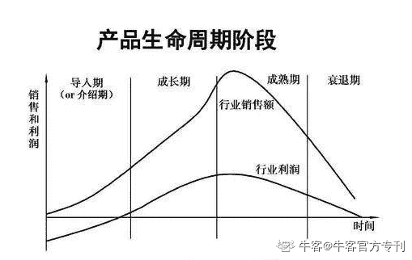

# 第四章 第 2 节 专业技能（中）

> 原文：[`www.nowcoder.com/tutorial/10037/0315956de47b40828801b95a0fe4c462`](https://www.nowcoder.com/tutorial/10037/0315956de47b40828801b95a0fe4c462)

# 二、产品规划

## 产品的生命周期及相应特点

产品的生命周期是从产品开始到产品运营到终止（退出市场）的全过程。这里补充说明下项目生命周期。项目生命周期是 PMP（项目管理知识体系）的一个术语，项目的生命周期是指项目从开始到结束所经历的一系列技术工作阶段。项目生命周期只是产品生命周期的一个产品阶段，产品的一次迭代可以视为一个项目。产品生命周期包括导入（引入）阶段、成长阶段、成熟阶段、衰退阶段。

*   **导入期：**产品刚刚成型，尚不具备市场知名度，无法与竞争对手进行正面抗衡，在此阶段，产品最重要的任务就是存活。一般新产品刚刚发布，势必不会有大量的商机导入，此时，一方面要走向市场获取收入，向领导证明产品的价值；另一方面需要逐步明确产品定位，在导入期内快速找准定位，为后续快速成长期蓄力。

通常在导入期内，产品线按照项目交付的节奏获取收入，即在标准产品的基础上为客户项目定制功能，可以在确保收入的同时便于深挖产品后续的发展方向。值得一提的是，这时候确定的产品定位通常是聚焦的，集中解决用户的一个或多个痛点，在后续可能会逐步扩展新的需求和功能，所以产品经理在各个生命周期阶段，其实也需要去思考各阶段产品的迭代和发展，当然这些迭代和发展不能太脱离于最初的定位。

*   **成长期：**产品定位逐步获取市场认可，开始有大量商机导入，具备行业快速复制的属性，收入开始大幅增加，在这个阶段，产品的质量将对产品口碑、交付和售后等有重要影响，产品内部管理显得至关重要。在成长期前期，产品线需要快速迭代，紧跟市场的步伐，并且开始与成熟的竞争对手有正面交锋的机会，此时更需要积蓄产品的差异化能力。如产品质量、差异化都在成长期无法交差，如果再加上没有强悍的销售团队，就很容易从市场掉队。

*   **成熟期：**产品逐步扩展，以延长产品成熟期，产品将达到收入高峰，产品迭代速度放缓，此时必须考虑产品的转型，开始细化垂直行业，或寻求其他领域的机会。

*   **衰退期：**产品当前的受众群体基本饱和，收入不增反降，此时在开展产品转型、重新规划用户群体的同时，也需要做好老产品的售后维护工作，减少客户流失。

举个简单的例子：**导入期：**小明说服父母给予自己支持进购笔记本，某天进购了 10 个笔记本，父母要求小明必须在半个月内全部卖完，否则不再支持，小明摆摊两周，费尽口舌把 10 个笔记本全部卖完，得到父母的第二次资助。**成长期：**小明在上次的基础上摸索出来一些方式，通过与小伙伴一起售卖、去学校附近售卖等方式，只花了 7 天就将这次进货的 10 个笔记本售尽，小明的父母也看到小明的努力，给予更多的支持，第三次卖完 20 个笔记本花了 8 天，第四次卖完 50 个笔记本.....**成熟期：**小明通过之前的方式卖掉了大量的笔记本，收入越来越多，一个月后，附近的小区、学校、商场都很少有人买小明的笔记本，小明开始反思，接下来该怎么办，小明的父母开始介入......**衰退期：**附近的顾客都不再买小明的笔记本，小明开始进货泡泡机，面向附近商场的顾客，第 7 天售卖 X 个泡泡机......在这个过程中，小明就是产品经理，笔记本和泡泡机是小明负责的产品，小明的父母就是领导，成长期小明需要作出成绩证明售卖笔记本有利可图，成长期小明总结经验快速获取大量收入，成熟期收入递增，但达到峰值后，收入开始越来越少，衰退期小明的笔记本基本不再有人光顾，小明开始售卖泡泡机。

# 三、竞品分析

B 端和 C 端产品在竞品分析上有很大的不同，大家在各大网站见到的基本都是 C 端产品的竞品分析报告，而 B 端的竞品分析少之又少。这是因为 B 端产品很多都是私有化交付，或是需要付费开通权限，或仅部分功能会提供试用时长，导致无法完整体验竞品功能，这给 B 端竞品分析带来了很大挑战。

## 获取竞品的途径：

*   **购买友商产品：**最直接的方式就是在资金范围内购买一些成熟竞品，自己注册账号、自己登录系统，在使用过程中摸索竞品面向的客户群体和需求。
*   **公司售前、商务沟通：**大部分客户都是由售前和商务沟通导入到产品线，售前和商务是最接近客户也最接近竞品的人。在与客户沟通过程中就可了解到友商产品的情况，可以收获一些 PPT、产品文档等资料，当然也要日常经受售前和商务的吐槽，“这个功能友商早就有了，我们为什么不能做，现在客户要求有这个功能，而且已经在接触友商的产品，眼看着到手的单就要没了！”。
*   **互联网搜索：**可以在网上检索含相关关键字的产品，和存在竞争关系的友商官网信息，从而检索竞品信息。
*   **阅览垂直行业媒体的文章和报告：**垂直行业的媒体（公众号、新闻号）和机构会联合几个头部公司的产品，宣传产品，输出调查分析报告等。例如：晚点 LatePost 公众号，艾瑞咨询（iresearch.com.cn）、App Annie 网站等。
*   **其他方式**

### 竞品分析维度：

竞品分析常用的方式包括 SWOT 分析、4P 分析和 4C 分析等。

*   SWOT 中 SWOT 各代表 Strenths 优势、weaknesses 弱势、Opportunities 机会、threats 威胁；
*   4P 指 Product 产品、Price 价格、Place 渠道、Promotion 宣传；
*   4C 是指 Customer 顾客、Cost 成本、Convenience 便利、Communication 沟通。

结合分析方式：**产品定位：**产品定位于解决什么场景的什么问题，核心用户人群是哪些，产品的核心价值是什么。如果你能一句话准确描述出你的产品是做什么的，那你基本就对产品有了定位。**产品功能范畴：**产品功能范畴是重要的关注点之一，在客户购买产品前进行 POC 测试（就是指用户在真实场景下的试用）时，也会重点对比几款产品的功能范畴，功能肯定是买多不买少，哪怕是用户暂时没有这个方面的需求，也会想着兴许以后能用上。**产品用户体验：**产品的交互、视觉效果、用户体验在进行竞品分析过程中可以借鉴，取其精华，去其糟粕，进行产品体验提升。顺带提一下，和 C 端产品不用的是，其实 B 端产品在视觉体验上的需求不是很强烈，因为 B 端用户想要重点解决的是企业的效率问题，所以更注重的是整体方案能否满足企业一直以来的痛点，而不会特别纠结某个按钮到底应该是红色好看还是橙色好看。**商业模式：**B 端产品一般会以标准产品、行业产品（定制产品）、解决方案三种方式进行交付。标准产品，顾名思义就是通用的产品，比如手机、电脑、冰箱，这些产品卖给小明的是这个样子，卖给小亮的也还是这个样子，不会随着用户的不同而改变形态。行业产品（定制产品）则是在标准产品的基础上针对各行业需求的定制开发，值得一提的是，定制版的开发费时费力，且后期不便维护，因此要是没有明确的大的商务订单，我们一般是不愿意干的，当一个产品被经常要求定制时，我们应该反思标准产品是否没有解决用户的通用需求。解决方案，则是指在多个产品的基础上，通过串联客户场景打包成一套解决方案，一起售卖的方式，除了卖这个解决方案里的设备可以赚钱，解决方案本身有时也会收费。**销售策略：**可以分为产品策略、价格策略、渠道策略、促销策略。产品策略则是指产品的形式，目前包括软件、硬件、软硬一体机、API、SDK 等。一般 B 端产品在售卖时，价格会按照商务职位、客户项目的大小，采取阶梯定价模式（说白了就是什么时候当男神、什么时候当舔狗，要根据对面的女生级别来判断）。渠道策略主要指采用分级代理商模式，分总代和二代，甚至三代四代等，比如华为售卖商品多用渠道商，你买的华为手机，并不是华为公司直接卖给你的，而是华为公司的中国代理下的 XX 省代理下的 XX 市代理下的 XX 县代理卖给你的，这些代理商也不是傻子，他们帮华为卖东西当然都要收费的，这些费用最终由消费者承担，就好比批发价和零售价的区别。促销策略即为打折促销，在量大的项目上进行打折，遇到特殊时期（比如产品更新换代前的清理库存）也进行降价促销方式。

# 四、用户调研与分析

在进行用户调研前，**首先**需选择调研的用户。B 端进行用户调研，基本都由销售或售前同事出面邀约意向客户，产品经理与销售或售前同往拜访客户，在客户选择上，需要结合产品规划和客户前期沟通匹配度来看，在有商机导入到产品线时，结合该商机涉及的客户需求和当前产品的用户需求匹配度去现场与客户沟通，面对面了解客户需求，如果当前产品需求未明确，可能会考虑直接将商机中客户需求转换为产品需求，并增加考虑其他使用场景的产品需求。具体调研的问题结合产品本身而定。客户现场调研与内部员工讨论不同，一般都直面主题，深度沟通场景和需求，当然，对于那些对行业界限和产品不太清楚的客户一般会提出一些当前没法达到的需求，此时也要及时引导，对于客户提出的建议，找到他们的初衷和立意点。调研结束后，需要及时进行数据整理和分析，包括调研参与人员、时间、过程和结论等，并邮件发出调研报告，参与调研的个人还可对调研过程中回答或提问的方式等细节进行总结。用户调研中有个陷阱一定要注意，就是对用户所讲的需求，**一定要有自己的甄别和判断**，这也是产品经理的基本能力之一。

#### 举几个经典的例子：

用户说想要一匹更快的马，他真的是要马吗？不，他其实更喜欢一辆轿车。用户说想要造桥，他真的是要造桥吗？不，他只是为了过河，你给他一辆水上摩托艇他可能觉得更开心。所以在实际调研中，一定要搞清楚用户为什么提这个需求，是不是可以有更好、更高效、更省成本的方式来满足，毕竟 B 端用户非常看重成本，如果你的方案成本过高，企业老板或许会觉得他其实可以通过购买廉价劳动力来解决。