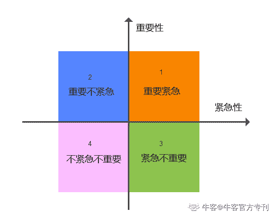
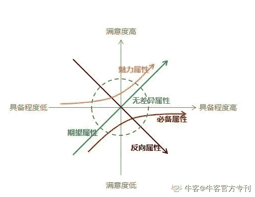
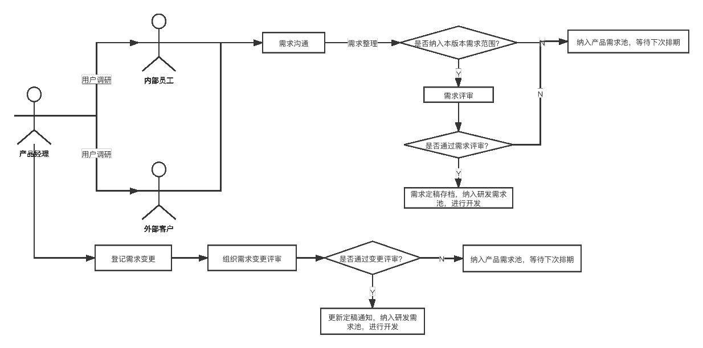
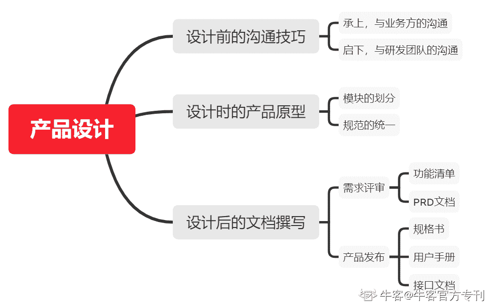

# 第四章 第 3 节 专业技能（下）

> 原文：[`www.nowcoder.com/tutorial/10037/0f4fa9b9e3fd45aa88fa74c94bcc9571`](https://www.nowcoder.com/tutorial/10037/0f4fa9b9e3fd45aa88fa74c94bcc9571)

# 五、用户需求分析

## 需求定义

**在某个角度而言，需求就是欲望。**
用户需要某物，一句话就构成了一个用户需求。
而产品需求从用户需求而来，在收集产品需求的同时，必须了解用户在提出自己的用户需求时，是基于什么样的背景和前提。例如，乌鸦说瓶子里的水够不着，那结合瓶口太小等原因分析，转化为产品需求就是，换一个广瓶口的瓶子。如果不了解用户需求的背景，那么可能选择将往瓶子里扔石头，给乌鸦一根吸管之类的。

## 需求来源

产品需求来源于用户需求、数据分析和竞品分析，用户可按照使用者身份划分为内部员工和外部客户。内部员工按职位分为领导、产品经理、产品运营、售前、商务、研发、测试、交付；外部客户则分为买方和使用方。
B 端产品购买者一般并不是产品的实际使用方，领导购买产品为了实现工作效率的提升，所以产品既要满足领导的要求，又要让实际使用方足够方便好用，一般用户需求通过客户沟通获取。这里要强调一个概念，叫做**“核心用户群”**，这个群体里聚集着你的产品的核心用户，比如小米手机的核心用户群就是那些混迹论坛的发烧友，腾讯动漫的核心用户群就是那些热爱动漫的早期 APP 启动阶段的种子用户，而在 B 端，核心用户就是你的甲方“爸爸”们，那些出钱多、订单量大的大客户，这些客户的需求是要被优先满足的，因为他们除了本身具有大订单外，还往往能带动周边区域的销售。对于这些大客户，可以专门维护几个反馈群进行售后支持和建议收集，同时建立一个产品需求池来记录需求，后续根据需求筛选和项目具体情况，甄别出真需求后规划进版本特性。
内部员工也是一款产品的相关联系人，产品经理、研发、测试对产品的建议，领导基于对市场把握提出的建议，产品运营、售前、商务和交付在交付和推广过程中提出的建议。
数据分析得来的需求往往是来源于市场变化，通过大数据分析客户关注点变化情况确定市场方向。而竞品分析得到的需求一般是无法复用的。to B 也就是 to Business，产品面向企业用户，不同企业用户需求都不一样，侧重点不同，产品复用程度低，所以竞品分析得到的用户需求往往要结合使用场景筛选。
**需求往往是源源不断的，当挖掘不到需求，那产品将很难存活。**

## 需求分类

如上所述，需求来源众多，那么在有限的产品迭代周期内，如何进行需求筛选。
并非所有的用户需求都是真需求，很多需求是伪需求，那些伪需求纯属个人建议但无法给实际用户带来收益的。
我们按照需求的紧急程度和重要程度会分为四类：

*   **重要且紧急**
*   **重要不紧急**
*   **不重要但紧急**
*   **不重要也不紧急**

重要且紧急的需求也就是我们俗称的强需求或刚需，而不重要也不紧急的需求则称为弱需求。也可以按照使用次数分为**高频需求和低频需求。**按照 KANO 模型将需求分为五种：

*   **兴奋型需求**（用户意想不到的需求，不提供用户满意度不会下降，但提供客用户满意度会大幅提升）
*   **期望型需求**（不提供该需求，用户满意度会下降，有则会提升）
*   **基本型需求**（必备，不提供该需求，用户满意度大幅降低）
*   **无差异型需求**（提不提供该需求，没有差异）
*   **反向需求**（提供了该类需求，用户满意度反降不升）

## 需求排序

强需求肯定要优于弱需求，高频需求优于低频需求，而按照重要程度和紧急程度而言，**重要且紧急>重要不紧急>紧急但不重要>不紧急也不重要**。而 KANO 模型的五种需求中，基本型需求必须满足，期望型需求其次，再是兴奋型需求，无差异和反向需求一般不在需求范围中。
在完成需求排序后，产品经理将本次迭代的需求整理成需求清单，并进行优先级排序，组织评审小组进行内部评审，评审通过的需求将进行开发，而评审未通过的需求一般进入产品需求池，等待下次版本迭代。内部评审一般会分为好几轮，如果在评审过程中一个需求点耗费过多时间，请注意立刻终止该需求讲解，待下轮评审继续商讨解决方案，注意评审进度不要浪费时间。内部需求评审完成后，产品经理将组织参与迭代的所有研发、测试、项目经理等人员进行全员需求讲解，如一次全员讲解完成后，部分内容待线下确认，则确认后需连同全员需求评审的所有内容进行邮件通知，全员需求讲解完成后需要发邮件进行定稿通知，研发和测试人员以定稿邮件内的需求清单为准进行需求开发和测试，如在开发和测试过程中有需求变更，则产品经理需要按流程发起需求变更，登记需求变更单，由项目经理组织相关人员对该需求进行分类和评审，评审通过的需求加入研发需求池，新增的需求也需要发邮件通知全员。最后是需求验收，在需求完成开发和测试后，产品经理在发布前需要进行需求验收，这个需求不单包括功能验收，还会有性能、UI、交互等。

# 六、产品设计与文档撰写

## 沟通技巧

为什么要在产品设计章节里讲沟通技巧？这就是 B 端产品区别于 C 端产品的一个显著特征，**承上启下**。所谓的承上，是指在产品设计前期，会涉及多次与业务方的沟通，常常会用开会的方式进行。与这些业务方沟通时务必要知己知彼，才能更好地了解需求和设计产品。**有以下几点经验供参考：**

1.  业务方的需求一定要追根溯源，很多时候他们更喜欢提解决方案，但在彼此冷静后询问业务方的痛点，你会发现其实可以有更好的解决办法；
2.  业务方很关心成本，哪怕你的方案做的天衣无缝，企业也不可能把家底全都砸进去，不然他们本身业务靠什么存活，所以可以了解业务方目前已有的解决方案或者尝试过的几种方案，以及他们对成本的心理预期，才能够设计出 B 端用户满意的产品；
3.  可以看看业务方接触过哪些友商，后来又为什么弃用了，尝试去解决友商不能解决的问题，这是拿下客户的关键。

所谓的启下，是指在产品设计前期，向下与研发团队进行沟通，这样做的目的有两个：一个是评估产品方案的可行性，通常由技术组长进行评估，尤其是在满足业务方需求的产品方案与已有的产品方案技术架构差异过大，或因双方技术语言不同而可能影响产品性能时，可行性的评估变得尤为重要；另一个是给出方案开发完成的排期，并同步告知销售和业务方，让大家都有一个心理预期，便于后续项目的开展。在与研发团队沟通时，他们更关心的是新功能、新特性是否与当前技术架构冲突，是否违背了技术层面的统一和可扩展性，所以在设计 B 端产品时应优先考虑继承，而不是全新的创造。

## 产品原型

产品原型是最能展现产品框架和功能的一种方式。与 C 端一样，B 端产品设计的工具也就是 Axure、Adobe XD、墨刀、Sketch 等。
B 端产品一般业务逻辑很复杂，通常会有两个及以上的产品经理，在多个产品经理联合进行产品设计时，一套统一的产品设计规范是必须的，例如表单样式、导航栏样式、按钮样式、示例图片等，毕竟设计的是同一个系统，总不能每个人一套 style，最后变成一个大杂烩。根据产品框架和需求清单，每个人逐步分模块进行产品设计，最后整理到一起。

## 产品文档

产品从需求整理到最终发布，期间产品经理需要撰写很多文档，当然，企业要求和产品形态各有不同，文档的框架、模版都不同。
在需求评审前，产品经理需要准备好产品功能需求清单、非功能需求清单、各种内容规范和 PRD 文档，在产品发布前需要准备产品对外文档，包括产品介绍、操作指南（用户手册）、常见问题（FAQ）、产品规格书、产品版本说明等，也可以适当根据产品不同新增一些文档，研发人员需要在发布前输出 API 文档。
功能需求清单内容一般包括：**版本号、业务需求、一级模块、二级功能、三级功能和备注**，如果使用 confluence 等工具进行项目管理，需求定稿后还将补充各个功能对应的需求单链接。
非功能需求清单内容则需要说明每个性能的指标项，例如系统同时在线用户数 1000 人。也可包括企业安全标准，例如登陆账号密码要求必须包含三种或四种字符。
其他文档这里就不做过多赘述了，仁者见仁，智者见智。

# 七、项目管理

## 1.什么是项目管理

项目管理是指对单个项目的管理，在符合项目范围、进度、成本、质量要求的基础上正确地完成单个项目。
一般来说，产品经理和项目经理的工作有交叉也有分岔。在用户调研、需求分析、产品设计这些前置阶段，项目经理并不参与，等到产品需求确定，开始进行需求评审时，此时项目经理和研发一起介入，在确认研发范围后，项目经理根据研发和测试预估的 pipeline 进行 WBS（工作分解结构）的梳理，随后的研发、测试管理原则上是项目经理管理，产品经理做整体把控。

## 2.产品经理在日常工作中如何做好项目管理

一般互联网企业中，产品经理和项目经理是两个岗位，其实不会出现一个产品经理同时去管资源、进度等。项目经理的主要工作与项目管理的十大知识领域息息相关，这包括范围管理、进度管理、成本管理、质量管理、资源管理、风险管理、采购管理、沟通管理、相关方管理和整合管理。
产品经理在日常工作中，重点注意的是产品需求范围、进度管控和产品发布后遗留问题的总结和移交。
产品研发之前，产品经理需要针对市场和相关方分析，与客户确认产品交付时间，根据交付时间给出本次版本迭代的一个时间点，梳理完需求后，进行需求评审，一般会经过多轮内部需求评审，最终敲定需求和技术可行性后进行全员需求评审，产品经理确认需求范围后发送定稿邮件，由项目经理组织前端、后端、测试进行需求排期，整理出 WBS，如果中途出现需求变更，需要由产品经理发起需求变更，由 SE 小组进行评审，如通过则加入需求范围中，如严重影响产品发布时间，则考虑不予通过或变更产品发布时间基线。
如上所述，研发过程中出现的需求变更等问题，可能导致产品研发进度的变化，故产品经理也需要时刻关注研发进度，必须守住的基线是必须完成的，如果发现无法达到，则又涉及到资源和成本管控，可以考虑通过加人来确保产品进度。有些产品线会采购外包人员做项目，加人一般加外包人员，此时也涉及采购。
在产品发布后，肯定会存在一些本次迭代未完成或需要持续优化的项，在产品线内部发布时需要将这些遗留 bug 清单、后续优化需求一并整理移交给下个版本迭代的产品经理。而一个大版本迭代完成后，一般会组织一次内部总结会议，通过收集各方同事的意见和建议，在下个版本开始前对收集的意见进行论述和商讨，确认下版本需要优化的工作流程和方向。
对项目管理有兴趣的同学也可以考虑报考项目管理对应的 PMP 证书。

# 八、数据监控

## 数据埋点

**数据埋点，**是指数据产品经理或数据分析工程师等角色，在关键页面或组件插入相关代码，通过工具得到这些页面或组件操作的统计数据，从而分析用户行为，并对产品进行优化的一项工作。为了全方位对产品进行追踪，我们通过数据埋点得到的统计结果指导产品优化和运营。

## 数据分析

埋点主要分为点击事件和浏览事件，例如设置一个按钮的埋点，统计该按钮被点击的次数，而设置一个关键页面的埋点，通过分析该页面浏览次数分析该页面功能的使用频次，多个事件组合分析可以得到更丰富的指标。数据埋点一般不是所有小功能小细节都要进行，而是需要选择重要功能和新增功能，以及一些不确定效果的模块。
对于 B 端产品，通过数据埋点，可以有效改善产品的组织结构，提升重点功能的使用效率，同时也能起到校验新增功能的正确性。例如将某模块放在显眼处能让用户以最快方式进行操作，加快用户操作速率；在新增功能的组件或页面上增加埋点，分析新增功能的使用人次。还可通过分析多个界面的埋点数据，优化操作步骤的顺序，分析操作路径是否对转化率有影响。
如果公司有数据团队，则可以向数据团队提出数据埋点的需求，由他们来实现。一般没有数据分析团队的公司会通过外包这部分工作给到专业的第三方，例如神策分析、友盟、百度移动统计等，有半自动化埋点方式也有全自动埋点，B 端产品一般采用半自动化埋点或者手动埋点的方式。
不过说实话，B 端产品的埋点重要性，远远不如 C 端产品，在一些消费者导向的公司，C 端产品的每次迭代方向都要基于当前的用户操作埋点以及访谈结果来确定，而 B 端产品的埋点更多的是优化使用体验，起不到决定性的作用，真正起决定作用的是你的方案本身能否满足 B 端用户的痛点。

# 最后，我们用一句话做个总结：

### 做 B 端产品，核心关注点在于客户市场和解决方案，而用户体验只是其次。