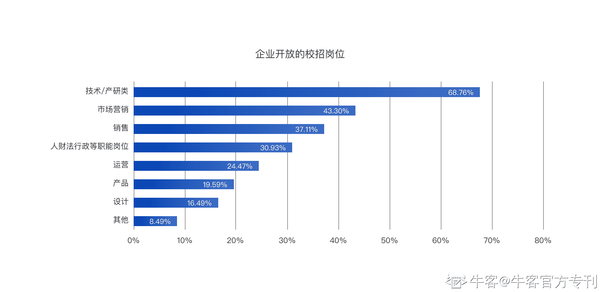

# 第五章 第 1 节 如何通关笔试？

> 原文：[`www.nowcoder.com/tutorial/10037/c7300dad09354abc85dc20dc7c48abfb`](https://www.nowcoder.com/tutorial/10037/c7300dad09354abc85dc20dc7c48abfb)

# 1\. 前言

我们从小到大经历了无数次的千军万马走独木桥的竞争：小升初考试、中考、高考以至于研究生考试等，而历经无数次竞争之后，同年毕业的大家再次面临着又一次挑战——校招，欲求获得职场生涯入门的入场券。2020 年，高校毕业生达到了 874 万人，同比增加 40 万人，毕业生人数再创历史新高。而作为 2020 年毕业生，春招赶上新冠疫情，秋招赶上互联网裁员大萧条，也让应届生找工作竞争激烈程度达到了历史之巅。据统计，今年各互联网企业开放的校招岗位，产品占总数的 19.59%，排倒数第三，产品经理岗位已然出现僧多肉少的局面。

面对逐年愈发激烈的竞争，作为走向社会并开启职业生涯的第一个门槛，面试笔试的成败直接决定着自己能否赢得 offer，并顺利开启职业生涯的第一道大门。相比研发岗位的考核偏向技术性，方向十分明确，产品岗位的考核范围十分宽泛，面试与笔试的考核方向让人抓不住头绪，让很多欲成为未来产品经理的同学们不知如何准备，从何下手。

不用担心，本章就来为你揭开产品经理面试与笔试的神秘面纱，带你了解面试与笔试的流程和会考核到的要点，让你找到准备的方向，助力你拿到心仪的 offer，迎接职业生涯的第一站点。

# 2\. 笔试篇

对于校招应聘产品经理这个岗位，面试部分已经占据了最大的比重，笔试往往占据很小的一部分比重，甚至，很多企业都没有笔试这一部分。不过也有很多同学哭诉，自己面试经验一大堆，最后却万万没有想到，笔试部分直接挂掉了，就这样与心仪的企业和岗位失之交臂，十足可惜。也就是说，笔试虽小，但是也弥足珍重，还是需要进行了解，以防止让笔试成为千里之堤溃掉的那个蚁穴。

## **1.** **行测题**

不同于研发或者测试等技术类的岗位，产品经理这类业务类的岗位没有一个统一的标准，像是编程能力等来判断个人技术。产品经理更多的是需要考察智力、综合分析能力、逻辑思考能力、记忆能力、表达能力等。而恰巧，行测题正式考察这种能力的一个良好方式。

### **行测的概念**

什么是行测？行测是指行政职业能力测试，这个实时公务员考试中最重要的一科。当然，企业招聘的时候，对于行测的要求断然不会像考公的要求那么高。行测主要考察逻辑思维能力，与反应能力。

### **行测题的形式**

很多互联网企业的行测题考试都是在线上进行回答的，也有线下考试的形式。不过不管是线上还是线下，都是在有限的时间，时间十分紧张，没有太多的空余可以留给你为这一道题做思考。行测题题型包括图形题、数量关系题、资料分析题、言语理解题、常识题等。

### **行测题的破解方式**

因为行测题往往会给很短的时间来做，题量也不会太大，所以，可以通过准备面试前进行刷题的方式来准备一下，主要是了解一下行测题的形式，在网上论坛等可以刷一刷题库。这部分其实主要还是靠练习和记忆，同学们可以关注一些专业公考教育机构准备的行测资料，他们会详细介绍行测各部分应该如何作答、十分详细。关于外企的笔试，网上也可以找到很多资料，牛客网上也有大量题目可供练习，正式笔试之前多练练找到规律，一般都没什么问题的！

## **2.** **性格测试题**

性格测试题也往往是笔试常见题型，往往通过答题结果能够给你的性格做出一个良好的判断。一般都是诸如这种类型的题：我喜欢按照计划形式，选项分为五种：A 非常准确，B 一般准确，C 中性，D 不准确，E 非常不准确。

这种类型的题不需要进行包装，也不要说谎，按照自己最直接最真实的答案去回答就行。因为这种题往往很多，而前后会有重复的题，如果出现同样的题矛盾的答案，就会被认为是不够坦诚。这种题难度不大，唯一要求是要诚信。

## **3.** **产品专业题**

在所有笔试当中，产品专业的题型是最难回答的也是最考验产品技能的。考试题目与面试中的产品岗位相关问题类似，让你去分析某款 app 的功能，或者根据场景去设计某款 app。

> **举个例子：为百度地图****app****新设计一个功能，并分析如何推广这项功能。**

首先你要知道，产品专业题，考察的是你在产品相关行业的基本知识是否扎实，对于常见的 app 是否有自己独到的理解。平时多积累是一个必要的过程，可以通过关注互联网类的媒体，诸如 36 氪、虎嗅、钛媒体等，或者通过产品经理的论坛，如 pmcafe、人人都是产品经理社区、知乎等掌握一下互联网的动态。

其次考察的是你作为产品经理，产品设计的基本功，懂得产品设计的要义，目标明确，懂得数据分析与数据论证，回答问题要有一定的框架。

最后要有良好的逻辑描述能力，答案思路清晰，条理分明。

对于刚刚讲述的例题，可以从用户痛点与自己思考的创新结合。授人以鱼不如授人以渔，这里教授一下答题的思路，希望也能够让你清晰的知道这类题如何去思考。

> 1.  首先，百度地图 app 往往是解决人们的出行找路问题，而在大城市或者旅游场景，用户很多是为了找一个地方进行引路导航时采用地图这个 app。而面对路上短途出行推荐方案，经常会出现步行距离过长，而打车或者公交又太短的情况，这种时候，最好的方式是采用共享单车的方式解决路途。而看好导航后，采用共享单车需要重新去下载 app 或者切换到其他 app 中，十分便捷，如果能将这样的用户流量保持在地图 app 中，就能带来更多的用户时长，同时也能将共享单车的收入拉入到地图 app 中。基于此痛点，可以为地图 app 增加一个一件扫单车的功能。
> 2.  明确好目标：目标用户就是解决此类出行的用户（如果能有数据说明就尽量用数据说明）。设计方案：可采用本地化增加单车入口，或者可以调起共享单车小程序的方式增加此功能。建立一个产品架构，同时分析，目标用户的数量，能够带来的收益，亮点等。绘制出一个使用流程图、简单的交互图。最后写出产品的推广实施方案，如：与单车 app 公司进行合作，推出出行优惠券或红包等。

产品的基本功需要自己平日的积累，而产品思维也是一步一步锻炼出来的。运用好自己的知识，调整好自己文案的输出，面对产品专业题型，就会交出一个良好的答卷，同时此思路也会运用到往后的工作中去，获益匪浅。

## **4.** **小结**

笔试题主要是行测、性格测试以及产品专业题三种大类型，对于行测，面试前简单刷一刷题库，了解了解题目，花少量的时间来换取最大的预习效率即可。对于性格测试，注意要如实填写。而对于产品专业题，这个是短时间内难以提升的，需要平日的积累。既然你对产品经理这个岗位十分着迷，并想要成就一番事业，提前的准备、日常关注相关知识，能力的日积月累是必不可少的。