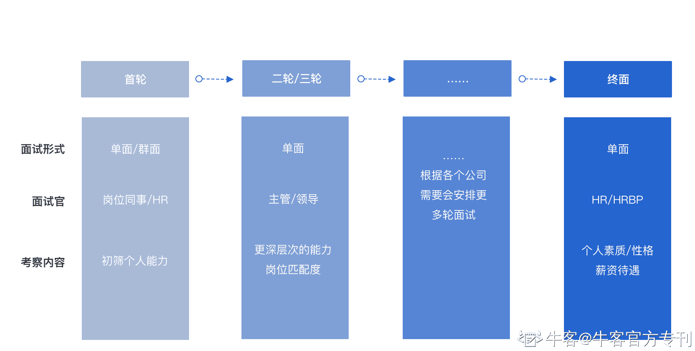
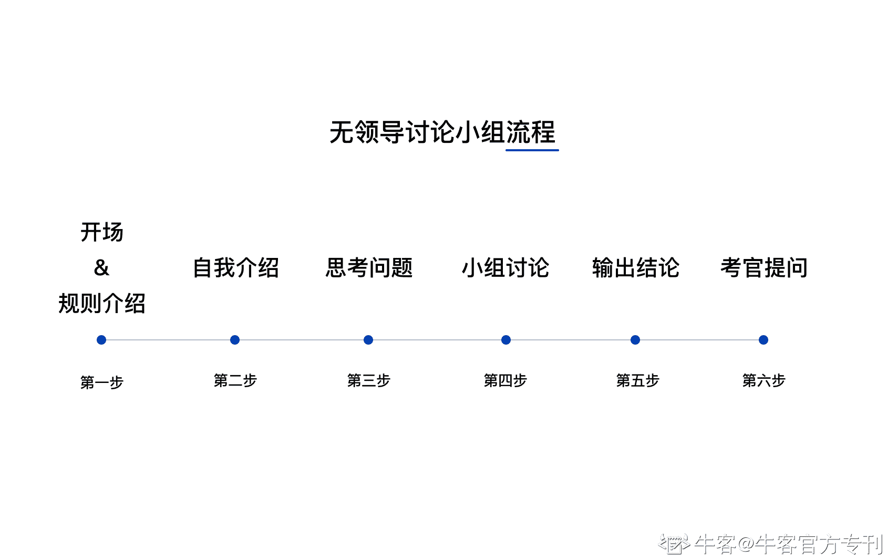
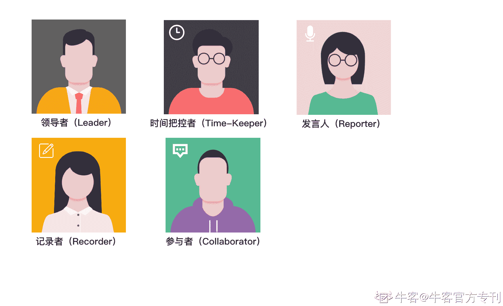
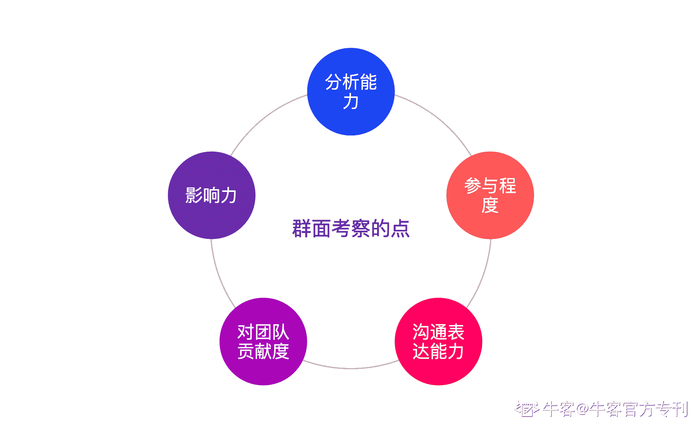

# 第五章 第 2 节 千军过独木—群面通关指南

> 原文：[`www.nowcoder.com/tutorial/10037/d94e2a604ee74ce996f0d3b1057dc532`](https://www.nowcoder.com/tutorial/10037/d94e2a604ee74ce996f0d3b1057dc532)

# 1.前言

从小到大，我们经历了无数次的笔试考试，对笔试方法已经熟练于心，而当我们开始离开校园，开始跨入社会的门槛时，却采用了面试这种我们不熟悉的方式。不要紧，在这里会会一一揭秘面试的奥秘，帮你在面试之前，了解到面试的流程与方法，提前做好准备，以大大提升自己面试的成功概率，最终拥抱心仪的 offer。

面试从数量来说，从简历通过到最终 offer 发放，一般要经历 2-3 轮面试，有些大厂还会根据需要安排更轮次的面试。往往一面是安排群面或者简单的能力面试，面试官多为所招部门的同事，简单考核个人整体素质、思维等。而下一轮面试往往是自己的直属上司，或者是更加资深的人，对个人能力与所招岗位部门进行更加匹配的考核，往往根据需要会经历 1-2 轮面试，有时根据不同公司的要求或者因为竞争对手的原因，还会安排更多轮次的面试。而往往最后会安排 HR 面试，HR 会从个人性格、品质、成长空间等等专业以外的角度来进行考核，当然，有时候 HR 面试的时候也会涉及到对薪金待遇等的谈论。

从形式的角度来说，面试分为群面与单面，同样也是不同公司根据实际需要进行的安排，有些公司会安排群面，有些则不会安排。无论单面还是群面，都不足可畏，只要了解了形式，做好充足的准备，相信你一定能披荆斩棘，最终完美走过面试，斩获自己心仪的 offer。

# 2.群面

群面，顾名思义，就是一群人的面试，不是一对一的面试。其形式有多个面试官面试一个面试者，一个面试官面试多个面试者，以及无领导小组讨论等。

多面试官面试一个面试者：这种形式的面试，国企居多，一般对于公司而言是为了缩短面试的环节数故采用该形式面试。对于面试者而言压力较大，多个面试官不同角度的发问，有些类似于论文答辩，不用担忧过多，保持良好心态即可。其提问的问题类型，考核方向与单面基本相同，可参考后文单面部分内容进行了解与准备。

一个面试官面试多面试者：这种形式的面试较为少见，其多个面试者同时面试，即在回答问题的同时，也会有几个面试者之间进行横向对比。在回答好个人部分的问题的同时，需兼具技巧，多吸引面试官对自己发问，并在回答中以多个角度来展现自己的优点，争取到更多通过面试的几率。

无领导小组讨论：这是群面最为常见又最为重要的一种形式，也是接下来讲解的重点。尤其是对于产品经理这种业务类岗位，以个人整体素质综合考核为目的，开展此类型群面。在面试之前将所有面试者分成一个一个小组，按照组别进行面试。一般一组人数在 7-8 个左右，当然也有 10 多个人数的情况。一组人通过在设定好的具体情景中，针对特定的题材进行定时讨论，最后产出结果。如果一个公司会设置无领导小组讨论的环节，那么往往会放在首轮面试中。

## **一、** **无领导小组讨论的意义**

### 为什么要设置这个环节？

**1.****提升面试效率，节省成本**

从公司的角度而言，群面首先能够提升面试的效率，大程度的节省面试所消耗的时间和人力成本。因为对于公司尤其是大厂，校招期间投递同一个岗位的人数十分多，在短暂的几日就需要完成阶段面试，如果全部采用单面的形式的话，将会消耗很高的时间与人力成本。而对于人而言，在群面中体现出来的特质与分析问题的能力，是与单面不尽相同的，而群面一场，就能够快速的批量横向对比一组一组人的表现，能够用最少的流程最快的找出优秀的人。

**2.****模拟出实际工作场景，难以伪装**

实践是检验真理的唯一标准，单面的时候，面试官很难对于面试者所描述自己的工作状态以及实力进行有效验证，而群面的无领导小组会议形式相当于在模拟公司日常召开的一次次会议，在这里的表现直接展示出各个面试者真正的工作状态，反映出其在短时间内针对某个问题的思考，同时也能体验出其沟通能力，应变能力，协调能力等，还能观察出一个人在团队中的表现，这些，是单面所不具备的。另外在一场群面之中，面试者想要从头到尾都保持自己塑造出来的伪装形象是十分困难的，可以认为，在群面中表现出来的特质，就是一个人的真实特质。

基于上述两方面原因，了解到群面的意义之后，相信你一定也想进一步探究一下群面的兵法了是不是？好，接下来就会带你进一步揭开群面的面纱。

## **二、 ****无领导小组讨论的流程**

因为设置无领导小组讨论流程的公司，往往都会将其作为首轮面试，所以对于你而言，往往准备了一大堆单面的技巧，却告知要群面，对于无领导小组讨论流程毫无概念的你，一边面试一边熟悉流程这样是肯定会消耗很多多余的经历的，所以了解一下整体流程，就十分必要。想想高考之前，还做过很多次模拟考试，考题如何且不说，但是，每一个进入考场的考生至少对于考试的整个流程都烂熟于心了，就可以更加专注于考题本身，交出自己满意的答卷。

无领导小组讨论的一般流程如下：

### **1.  ****开场与介绍规则**

一般一小组面试者入座之后，会给各位介绍此次讨论的规则，不同的公司会有不同的规则，一般会在规则内给出本次群面的流程，各个环节的准备以及进行的时间限制，以及本次无领导小组讨论的题目。此时需要对大体流程有一个简要的框架，然后心中构思一下自己需要成为哪个角色。遇到没有听懂的地方，举手进行提问是必要的。

### **2.  ****简要自我介绍**

介绍完规则后，一般接下来给大家每人 1-2 分钟的时间来轮流自我介绍。需要注意的是，群面的自我介绍并不是单面的自我介绍，需要做到短小而精悍，用最少的词汇说出自己的特点和优势，或者想办法在名字或者特点方面做做文章，加深大家的第一印象，其目的是方便小组其他人以及面试官能够记住自己，也为后续讨论环节为自己安排什么角色做好铺垫。

### **3.  ****思考问题**

一般会给短短几分钟的时间用做给各自思考问题的时间，在这段时间内，你需要充分的阅读理解好考题，并快速理清自己的观点，准备尽可能多的阐述观点的论据。

### **4.  ****小组讨论**

讨论环节开始后，小组各个成员就展开正式的对于问题的讨论了。一般会在讨论的末尾推选出一个人来整理结论，并在讨论环节结束后进行结论的输出。

### **5.  ****输出结论**

将考题的讨论后的结论进行总结输出，一般也是会有时间限制的，所以结论要精简且突出重点，观点分明。

### **6.  ****考官提问**

考官的提问环节，会点名抽查各个面试者，问道的问题不仅仅是对考题于结论本身，也会问道诸如，觉得某某人表现如何，觉得本次环节谁是表现最好/差的问题等等。在这种时候，一定不要慌张，同时也不要碍于人情面子等迟疑不决不敢下结论。这样就会带给考官自己观点不明优柔寡断的印象。**三、无领导小组讨论的角***>**

无领导小组讨论过程中，每个人会自然而然的划分成不同的角色。角色并不是主考官等进行分配的，是在讨论过程中自己去争取的，或者是在讨论过程中自然而然形成的。可能你或多或少的听说过，比如做 leader 好呀，比如做 time-keeper 好呀云云，其实，角色只是在一个无领导小组讨论过程中必要的一个部分，但是孰好孰坏，这个需要辩证的去看待，还是需要结合自身的真实性格和能力来确认自己适合什么角色，然后尽可能的去争取自己最适合的角色，而不是说，为了能收获通过面试而让自己去“出演“某个角色，因为角色没有做好该干的事情，反而会有反效果。

无领导小组讨论基本会分成以下角色：

### **1.  ****领导者（Leader）**

每一个“无领导“小组面试，总是会自然而然的出现“领导“，而这种领导往往会让其他人变得非常的”团结“。作为领导者，需要把控整个讨论的节奏，主导讨论的内容与过程。这就要求领导者要有比较强的气场，有足够的控场能力，能够让大家讨论集中在需要解决的核心问题上，主导大家的讨论方向，防止讨论偏离核心，且将时间浪费在非主体的细枝末节上。在必要的时候，针对不同意见，领导者需要有良好的判断并能够引领大家意见统一。

成为领导者，需要你有领导经验，且具备让他人信服的能力。且需要对面试的考题足够熟悉。如果你不具备上述条件，不建议硬抢领导者的位置，因为可能会无人信服，甚至带领整个小组全军覆没。

领导者角色是所有角色中，风险最高，但是带来的收益也是最高的，好的领导者角色往往能加深面试官的印象，晋级效果事半功倍。

### **2.  ****时间把控者（Time-Keeper）**

时间把控者可以说是大家最喜欢做，且争夺人数最多的角色了。因为这个角色对于整个讨论而言十分重要，但是相对而言难度较低。其主要职责是，控制整个讨论的时间进程，制定好合理的讨论各个问题的时间，做好计时工作，并在快到时间的时候适时提醒大家，防止超时，把控好讨论整体时间节奏。

成为时间把控者，需要有良好的时间观念，并具备一定的沟通能力，懂得给各个流程制定合理的时间以及预留合理的缓冲时间。但是，不能仅仅单纯做一个时间计时员，需要懂得在重要时间节点做出必要的关键结论输出和总结。

时间把控者相对容易一些，风险较低，出错率较低，而收益也较高，能够影响全局且斩获面试官与各个面试者的深刻印象。所以如果你符合上面说的特性的话，不妨争一争这个角色。

### **3.  ****记录者（Recorder）**

因为讨论过程会很长，每一个阶段都会有关键的结论进行产出，所以记录者这个角色就十分重要。作为记录者，不仅仅会记笔记就够了，还需要有高度总结和概括的能力，并能够短时间内根据不同的观点进行良好的分类。可以说，记录者不能只做一言不发的写手，而需要每个阶段记录结论并跟大家进行确认。在小组里承担很重要的角色，最后的结论发言也是依赖于记录者的结论记录的。

记录者既要记录每个人观点与结论，也要充当梳理逻辑的角色，同时，最后可以争取做结论的发言人。总体而言，记录者的风险较高，并且对最后小组输出起到关键作用，但是收益较高，整个过程高度参与，做好的话会获得面试官与面试者的良好印象。

### **4.  ****发言人（Reporter）**

无领导小组讨论结束之后，需要发言人这个角色进行陈述结论，将讨论成果进行输出。这就需要发言人这个角色拥有良好的总结归纳能力，且具备良好的演讲能力，能够做到思路清晰的表达小组结论，而不至于将整个讨论成果因结论输出的失败而功亏一篑。

发言人一般会被领导者或者记录者进行承担，当然，如果你觉得自己副歌上述特质，可以争取这个角色。发言人风险较高，承担着对整个小组结论输出的重要角色，但是如果表现较好，能够将整组表现提高一个层级，故收益较高。但发言人也会在陈述结论的时候被面试官发问，需要有良好的对全局的理解能力以及临场发挥能力。且需要尽量保证自己发言是高度总结了大家认可的观点，而不是自己的想法。

### **5.  ****参与者（Collaborator）**

在场的每一个人都是参与者，如果没有成为上面的四个角色，那么，成为一个良好的参与者也是不错的。作为参与者，时刻保持参与度也是非常重要的，要对于考题充分理解并提供自己的意见与想法，做一些必要的创新。同时积极参与整个过程，在每个环境做出自己的积极贡献。

需要注意的是，参与者并不是完全不能做上面四个角色做的事情，在最需要的时候主动去承担必要的工作，也是为自己加分的良好品质。

相对上面的 4 类角色，参与者风险最低，出错率最小，但是也需要做出良好的表现，否则跟随大流，无任何突出的话，就会自然的被淘汰了。

### **角色小结：**

首先，不一定每一场无领导小组讨论都会将上面的角色出现完全，也会有角色重叠的情况。另外就是，你需要根据自己的能力与性格来选择充当什么角色，必要的话争取一下，但是切记盲目的争夺，陷入了角色争夺的误区，因为在群面无领导小组讨论中，团队目标是高于个人的，过于强调个人表现而最终团队结论低于面试官预期，也会整体被淘汰的。另外，切记不要认为角色是固化的，就必须“各司其职“，作为一个整体团队，如果必要缺失了某个环节工作，每个人都可以站起来承担工作的，而不是等待其他角色去做。

另外，作为未来的产品经理，平时需要锻炼自己的领导力、时间观念、总结能力等，也就是说，未来想要做一名合格的产品经理，上面的 5 类角色都需要良好的承担的，平时也需要多做相关经验的积累，能力的提升。这样不仅仅是为了在群面中脱颖而出，更是为了自己未来能够良好的胜任本职工作做铺垫。

# **四、 ****无领导小组讨论的秘诀**

### **1.** **面试官主要考察的点**

要知道，你在团队如火如荼的讨论沟通的时候，面试官也并不是坐山观虎斗的状态，而是时刻的观察着各个面试者的表现，主要观察以下几点：

**1****）分析能力：**各个面试者对于考题的分析能力，整体方向是否正确，观点是否创新且合理，是否足够有效。

**2****）参与程度：**仅仅分析考题正确是不够的，需要在整个会议环节能够表达出自己的观点，并且能够通过自己的努力获得更多人的同意，整体讨论过程中贡献自己的力量，而不是在一直划水。

**3****）沟通表达能力：**作为一名产品经理，只有良好的思路和想法是不够的，而能够将自己的想法表达出来，并且沟通给大家让大家一起协作起来，这才是一个非常重要的能力。

**4****）对团队的贡献度：**不论自己充当什么角色，能够将自己角色发光放热，并为团队提供出自己的贡献，这才是面试官最希望看到的。

**5****）影响力：**是否具备良好的组织协调能力，拥有良好的大局观，能够带动周围的人投入到工作中去，适当的展现出良好的影响力能够加深面试官对自己的良好的整体印象。

### **2.  ****小技巧**

群面因为是以小组为单位进行面试，所以，在短时间能够吸引面试官的注意，且展现出自己的能力，是最重要的。可以通过以下几个小技巧来为自己的表现加分：

1） 自我介绍时候，增加些特色好记的方式，同时表达出自己的强项，加深印象：比如自我介绍的时候，给自己增加一个标签，自己当过学生会某某部长，因为时间观念好，大家都送我外号“钟点工“……这类的自我介绍，既能活跃气氛，又能充分展示出自己的优点。

2） 先发制人，优先发言：快速的理解题目，在讨论的过程中先行提出整体的讨论思维框架，奠定整个讨论的基调。

3） 有明确的方向嗅觉，能够在产生分歧时候，或者大家在细枝末节展开讨论时，适时将大家拉回正轨。

4） 节奏把控，掌控大家的节奏，把控时间，看到会超时的时候适当提醒大家。

5） 角色并不重要，如果自己十分适合在此次讨论中充当某个角色，那可以进行争取，否则反而会有反向作用。

6） 珍惜每次发言的机会，每一次发言都要做到有理有据，观点能够一针见血，能够带动团队的节奏。这样在面试官这里是个重头加分项。

7） 如果群面提供了草稿纸，在纸上做的笔记和思考过程要结构分明且字迹要清晰，字写得好、逻辑和版式十分清晰，也是一个隐藏的加分项。

良好的展示自我，是能够在群面过程中脱颖而出的必要特质。

### **3.  ****常见题型**

无领导小组讨论会出现以下的常见题型，当然，不同的企业会有其他类型的考题，以下仅为参考，用来培养一下自己面对无领导小组面试的思维。

#### 1） 开放性问题

如：对于某地图产品，有什么功能可以改进？如何对某新产品进行市场推广？等等。

开放性问题一般是对一个开放性的问题进行观点发表，没有标准答案，没有选择与判断。更像是一个脑暴，但是，这就对面试者们要求就很高了，需要具备宽广的思维，清晰的思路，同时要有新颖的观点和见解，平时知识的积累与运用能力。

面对这类的题型，你需要审题良好，看好题目中的场景限定，并从多角度发散思维提出创新的观点，对方案条理分明，并能够说服其他人方案更具备合理性与落地性。

#### 2） 比较问题

如：美团和青桔单车哪个更受用户欢迎？ 赚钱和梦想，哪个更重要？等等。

比较问题，往往需要二选一或者多选一，在讨论过程中，小组很容易分成正反两方进行辩论，需要你分析好问题双方的共性与区别，充分的梳理逻辑来支撑自己得到的结论，如果可以，梳理出其他的解决方案。千万别用“我觉得“、”我认为“来说话。

#### 3） 多选问题

如：去往荒岛，只能带 3 个人，从医生、教授、科学家、工程师、猎人等不同人中选择。

这类问题，需要明确核心价值点，比如荒岛，针对大家对于荒岛的理解和生存必备进行意见统一，对价值进行排序，最后得到取舍结论。这里考察的是大家的逻辑分析能力以及沟通能力，对于大家的意见统一的过程是此类题目的难点。

#### 4） 资源分配问题

如：给出一个项目，给你 500 万预算完成，如何安排各个环节的预算分配？

此类问题需要你分析出项目的明确目标是什么，有限的资源是什么，为了完成目标，如何能够良好的分配资源达到最合理组合。需要你能够透过现象看到本质，知道为了达成的是目标，而不是把预算花完。良好的梳理项目目标是一个必要技巧。

# **五、****小结**

群面并不可怕，作为未来的产品经理，每一天的工作可能都会是群面的过程重演。平时多锻炼自己的沟通能力、团队协作能力，在学校期间，团队活动中多多充当管理者的角色，锻炼自己沟通技巧。另外，培养自己的逻辑能力，思考问题的时候多从根本做思考，多写一写分析问题的报告，多观察。在参加群面之前，多在牛客网的面经汇总区看一看相关的面经，了解一下当下群面的题型，如果看完本章仍然对群面没有把握，还可订阅牛客网[《群面钻石通关攻略》](https://www.nowcoder.com/tutorial/10030/index)，此刊从各种角度分析了群面中的套路和题型，手把手带你打怪通关！此外最重要的是，保持自信，相信自己一定能在群面里面脱颖而出的！