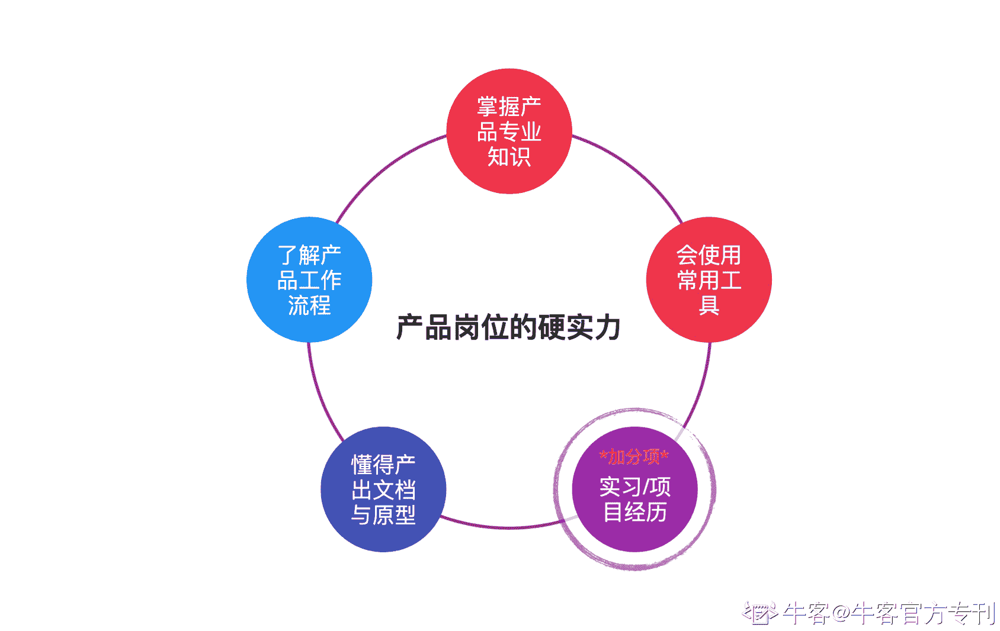
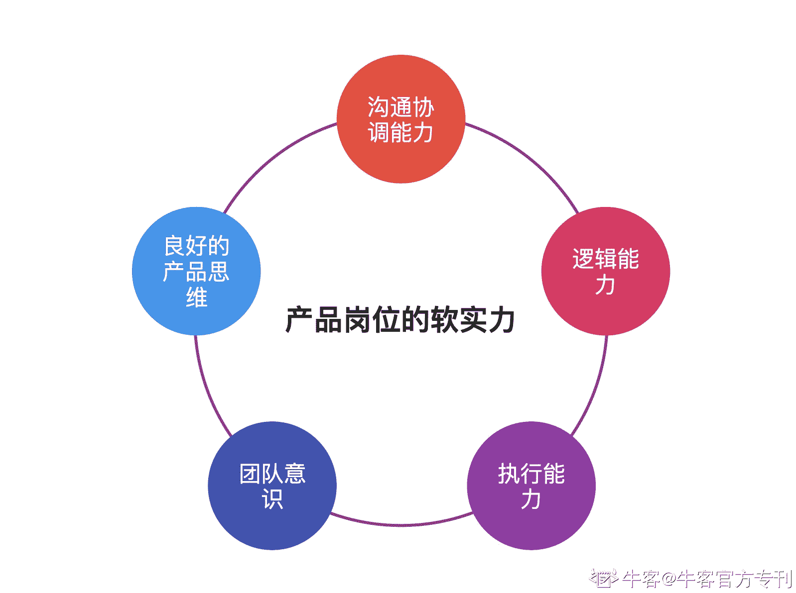

# 第五章 第 3 节 如何通过面试

> 原文：[`www.nowcoder.com/tutorial/10037/e88f93a1f22a421c8c7497c30b66a4ad`](https://www.nowcoder.com/tutorial/10037/e88f93a1f22a421c8c7497c30b66a4ad)

# 1.前言

其实，要是没有与“群面“的对比，就不会专门有”单面“一说。单面就是最常见，最普遍的面试考察方式了。

在面试之前，你需要了解一下，作为一个未来的产品经理，各个公司对于产品经理所具备的特质。

先说硬实力要求：综合观测了各个厂的产品经理岗位的要求，可以总结出来的一个整体硬实力要求有如下：

1.  需要了解产品经理完整的工作流程。作为未来的产品经理，要熟悉围绕产品生命周期全部过程的需求跟踪流程，至少知道，什么时候要做什么事情，比如：需求采集、需求调研、分析需求、提出需求、跟进需求、需求发布、需求上线最后验收、收益回顾等等，工作流程你需要在面试之前做好功课，阅读相关书籍或者论坛的帖子，掌握一下产品经理的基本工作流程。

2.  需要掌握产品常用的专业知识。这里的知识既要有产品经理的通用知识，比如常用的词汇，比如什么是 DAU，什么是 Feed 等，又要有该岗位产品经理的特有知识，比如增长产品经理需要懂用户增长的概念知识、增长黑客等，B 端产品经理需要懂垂类行业的相关知识等。

3.  需要会使用常用的工具。Office 软件需要懂得满足日常工作使用的功能，axure/sketch/磨刀等原型工具至少需要掌握一项，思维脑图用的 xmind 或 mind manager 等，这些都是看家的本领，如果你暂时还未掌握的话，可以去学一学。

4.  懂得如何产出产品文档和原型。文档与原型是产品输出给其他业务部门重要的产物，需要你了解如何去写 PRD（产品文档），懂得描述产品的基本逻辑，如何绘制原型。

5.  实习经历、项目经历是加分项。

除了上述的硬实力以外，软实力也是公司着重看的特质：

1.  要有良好的产品思维。产品思维是一个非常抽象的东西，可以理解为对于一个潜在的需求，能否挖掘出共性问题，并分析出问题所在，如何能通用化的解决问题，并能创造正向的价值。举个例子，福特能看到对于实用廉价汽车的需求故设计出便宜且实用的汽车，而不是提供用户更快的马。这就是产品思维。

2.  良好的沟通协调能力。产品经理日常的工作接近 90%的时间都是在与各方进行沟通，且跟进需求的时候，面对资源的短缺需要进行良好的协调。所以，良好的沟通能力可以说是产品经理的入场券。如果连话都无法表达明确，那还是不要考虑做产品经理了。

3.  逻辑能力强。产品经理需要有良好的逻辑能力，逻辑是指运用自己的知识，通过概念、判断、推理等方式，从某种现象抽象为事物本质的一种能力，在工作中，产品经理需要从客户的简单诉求以及痛点问题，梳理为行业通用的业务逻辑，并能产品化的有效解决一类问题。如果你能够少说“我觉得”，多通过案例、数据等分析来得出结论，那你的逻辑能力才是符合产品经理的基本特性的。

4.  团队意识好。对于一个产品而言，产品经理上至整条产品线的生命周期，下至某个功能的完整迭代，都是起到穿针引线作用的。所以，一个产品的走向，绝对不能是产品经理的一言堂，产品经理需要召集整个相关人员，促使项目良好进行。需要你具备组织能力、沟通能力，并且不独裁，能够统一各方意见，保障团队的相信力和目标一致性。

5.  具备良好的执行力。能够发现问题和提出问题，具有良好的想法，这只是产品经历职责的一部分，另外的一部分是执行，能够将产品真正的落地实现的能力。所以在描述自己项目、实习或者校园工作的经历时，着重描述自己如何去处理问题，如何将项目的目标实现的，这是面试官考核产品经理的一个重点。

# 2.面试的环节

校招面试一般是 2-3 轮，根据不同公司的安排可能还会有更多的轮次。一般有群面的会将群面安排至首轮。轮次越高的面试，就越会接近你未来的直接领导。而末轮面试往往是 HR 面。第一次单面，你面对的是部门同事或者同职级的同事，大多考察的是你的项目过往、基本功等，后续的面试将会加深对你能力角度的考核，面试官的职级也会越高，可以这么说，越到后面，就越是你未来部门的直接领导。所以，越到后面的面试，就越要有充足的准备，当然，也离胜利越近。往往面试的末轮是 HR 面，会更多的考察你的个人品质类问题，如实回答，不要添加过多的包装，针对不同轮次，做好不同的准备。这里有个小技巧，你可以在每一轮的面试末尾，面试官问道你说“你有什么问题想要问我吗”的时候，问一下自己还会面对几轮面试，确定一下自己当前的面试轮次的重要性以及推知自己下一轮面试会面对的会是什么级别的面试。

## **2.1 自我介绍**

几乎 99%以上的面试，面试官的第一个问题都是让你进行自我介绍。虽然明知道这个是必考题，但是，你是否能良好的回答出来呢？是不是大多数情况下，自我介绍就是将简历上的内容背诵一遍呢？

好的开始等于成功的一半，自我介绍往往是每一次面试的最重要的部分，而面试官之后对你进行展开发问也多半是根据你的自我介绍内容中他们感兴趣的地方发起的。

### **不要只是复述简历：**

要知道，面试官在面试你之前，是对你的简历内容有过了解的，所以他们并不希望从你的自我介绍当中仅仅听到简历内容的复述。而更多的是期望听到简历上没有明确的，需要细致描述总结的部分。

### **深挖 JD，表明匹配度与优势：**

需要在面试前做好功课，挖掘一下职位 JD（职位描述）中对于岗位的要求，自我介绍根据 JD 要求重点凸显岗位匹配度以及对于该岗位的优势所在。

### **提前准备好，但不要死记硬背**

死记硬背的一个坏处就是，万一忘记了，就会加大自己的紧张程度，让自己面试一开始就陷入精神困境之中。提前做好准备，多多在线下进行演练，才不至于出现各种漏洞。

### **一张一弛，突出要点**

凡事必有一个度，既然是自我介绍，一般都要求精简，也就是说，你肯定不能像是介绍生平传记的方式来诉说自己的一切。既然时间有限，就要做到要点分明，有一个良好的框架和明确的思路。

在了解了公司招产品所需的基本特质之后，你需要在自我介绍环节，多用实例的方式证明自己符合哪些基本特质：比如，在校期间，以 xx 项目参加了国家级的创业大赛（说明了 xx 项目的地位），并取得 xx 成绩（说明成果是成功的，最好有数据佐证），我在该项目中承担 xx 部分的 xx 工作，我通过运用 xx 方法，将 xx 问题解决，最终促进 xx（说明自己的价值与思考的过程），我通过此，xx 能力得以提升（提升的能力一定要尽可能的与所面试岗位招聘特质所匹配）。

当然，不要过于生搬硬套，要知道，你的目的是在短短几句话中展现出你对于这个岗位的匹配度以及相应的优势，所描述的话一定要精炼，条理清晰，层次分明。

好的开始等于成功的一半，对于自我介绍这一道面试必考题，如果你成功的突出了自我亮点，就会为后续的面试过程启动良好的开头。

## **2.2 简历上的答疑**

面试官会基于你的自我介绍，以及对于简历上的内容进行展开发问。这个过程有点儿像是论文答辩一样，首先你需要确保简历上的项目实习等经历的真实性，诚信是面试的基础，千万不要抱有侥幸心理进行伪造，因为伪造出来的项目/实习等经历经不起面试官的发问与推敲，对于经验丰富的面试官而言，很轻易就会发现你的伪造行为。不但会让自己下不来台，更严重的，会被质疑个人诚信品质问题而直接被拉黑。

一般面试官会基于以下几个重要问题进行提问：

### **项目/实习经历：**

面试官最感兴趣，也最能考察你实力的，就是通过项目/实习经历。而你，也要从以下方式进行回答：首先要简述一下项目/实习的内容，对于项目，面试官多半不会很了解，所以需要简要表明这个项目的地位，比如是某某国家级的项目，或者某某地方合作项目等，如果是实习，则说明实习内容以及意义，要是不是那种耳熟能详的实习公司，则需要简要介绍一下公司，在什么行业处于什么水平。让考官大体上有一个认知，了解你的项目/实习经历，你做了什么，取得了什么样的成效。

最好根据自己在项目中的亮点来表明自己的突出特性，比如，描述一下在项目工作中遇到了哪个困难，自己如何解决困难并助力项目取得什么样的成果。如果可以，尽量先用数据进行量化成果，再进行定性表明成果。在整个过程中锻炼了自己什么能力，还有 review 一下自己的不足，需要进行何种改进。深刻体现一下自己能力与思考的深度和广度。

### **在校经历**

如果你有各种在校头衔，比如班长、社长、学生会经历，或者在校获得奖学金、参与比赛获得奖项，面试官也会进行提问。

你需要知道的是，面试官提问一个是为了检验经历真实性，另外也是在复核你的个人品质，所以，要好好描述好自己的相关经历，最好要以事例佐证，同样，能定量尽量定量，能定性尽量定性。

### **兴趣爱好**

面试的时候，如果简历上你写了兴趣爱好，面试官会进行一个简要发问。当然有时候你没有写兴趣爱好，也会被问道这样的问题。你需要清楚的是，面试官绝对不是想“交个朋友”或者真的要跟你一起玩。

而你所说的兴趣爱好也最好别是诸如玩游戏、逛街等这类过于“真实”的爱好。

兴趣爱好所需要表达的是，背后的特质与岗位之间有什么联系，对于兴趣爱好，能体现出自己对于爱好的思考与研究的能力，并能做到主动自驱进行成长；同时体现出自己良好的性格。这个才是兴趣爱好类的面试所需要表达的核心。

## **2.3 STAR****法则回答问题**

思想的清晰往往更加依托于表达的清晰，而面试的时候，学会用一个良好的回答结构，往往能事半功倍。STAR 法则就是一个非常值得借鉴的结构模型：

STAR-即情景（Situation）、任务（Task）、行动（Action）以及结果（Result）的合称。

情景（Situation）：就是背景，你想要说明自己的一段实习工作或者项目之前，需要描述好这个项目工作的背景，让听者对于你所描述的内容有一个概念及大致了解。

任务（Task）：就是你对于描述经历中自己承担了什么角色，承担了什么职责，要达到什么样的目标。

行动（Action）：你为所描述的项目或工作所作了什么工作，而且重点是自己做的工作是什么，而不是团队或者同事等共同的工作是什么。

结果（Result）：讲述自己的项目、工作最后达成了什么样的成果，价值如何，自己学到了什么等。

举个简单的例子，比如，在面试中，考官看到你简历上写着在校期间参与 xx 校园二手交易平台项目，让你具体说一下这段经历，你就可以采用这种方式进行描述：当时基于校园二手交易诉求强烈，每年毕业季会有多少学长学姐（最好数据佐证）会将自己闲置的东西进行售卖，而线下交易效率低下，故与几个同学进行立项，决定要做这个平台（描述好了情景）。自己在这个平台中承担平台产品设计的职责，搭建平台产品框架以及各个模块的设计（描述好了任务）。自己通过线下多次考察，梳理出校园二手交易的通用流程，为平台设计出信息发布模块、交易模块等，并设计好原型图，交付给团队进行开发（描述好行动）。最后经过了 x 次迭代，平台良好上线，有 xx 日交易量，项目获得了学校 xx 组织的重视，并参加了国家级创业比赛获得了 xx 奖项，自己累积了产品经验等（描述好结果）。

STAR 法则，能够让你用最清晰的结构，最省时的方式让听者最快最全方面的了解到你描述的内容，掌握这种结构模型，运用到面试回答问题当中，能够大大提升沟通效率。