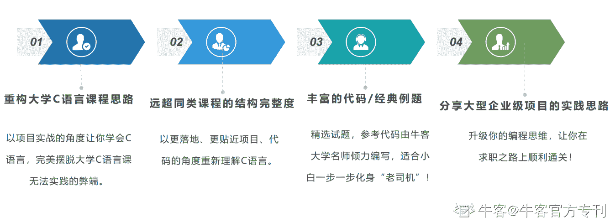
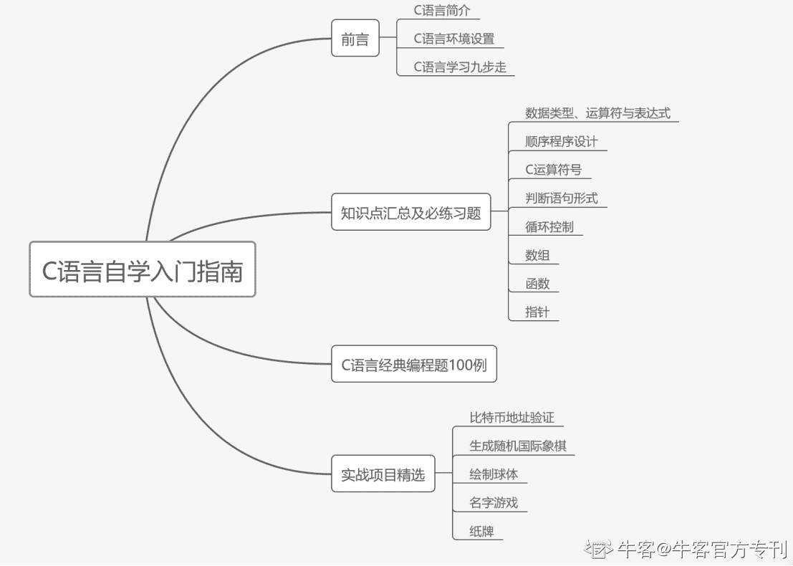

# 第一章 第 2 节 开篇词

> 原文：[`www.nowcoder.com/tutorial/10031/3456dc982c234a6ab14832f15e964aa6`](https://www.nowcoder.com/tutorial/10031/3456dc982c234a6ab14832f15e964aa6)

### 一、**专刊适合怎样的你**

1. 刚踏入计算机专业，想要提前学习 C 语言

2. C 语言小白，想要有一技之长却苦于无法入门

3. 学过一些编程相关课程，苦于无法实践

4. 热爱计算机行业，想要从事相关行业的工作

只要对计算机充满热情的你，都可以学习本刊。

### 二、你的收获

### 三、专刊主要内容

本专刊主要分四章，让你从 0 到 1 学会 C 语言。

#### （1）专刊第一章：前言

这部分是对 C 语言的一个详细介绍，以及在不同系统中的如何安装，学习 C 语言的极大重要步骤等。对 C 语言了解为 0 的同学只有学好了这一章才能进行下一步的学习。

#### （2）专刊第二章：知识点汇总及必练习题

这一章将 C 语言中的重要知识点提炼出来，并且在每一个知识点下都留有相应习题，让你从理论到实践，融会贯通。

#### （3）专刊第三章：C 语言经典编程题 100 例

“纸上来的终觉浅，绝知此事要躬行。”学习完前两章的知识点，这一章就是同学们大展身手的时刻了。本章收录了 100 道经典习题，让你全方位练习，并最终举一反三。

#### （4）专刊第四章：实战项目精选

这是本专刊的最后一章，本章精选了五个项目实战，在同学们学习完前三章之后，相信同学们都有能力参与到实战项目中，揭开 C 语言的神秘面纱，让 C 语言不再是困扰你的拦路虎！

最后，本专刊从一个入门者的角度写下这篇 C 语言自学指南，内容丰富详实，每一道例题也都是精挑细选，不管是 C 语言小白抑或是“老司机”，都能在本刊中有所收获。

### 真诚希望同学们食用愉快！