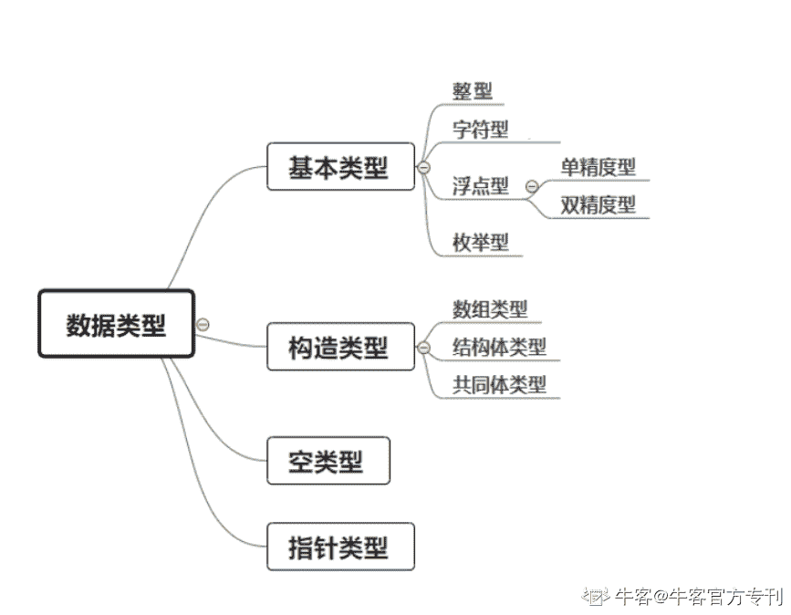

# 第三章 第 1 节 数据类型、运算符与表达式

> 原文：[`www.nowcoder.com/tutorial/10031/c2d1b85398c9492cb975a4cdf27b6418`](https://www.nowcoder.com/tutorial/10031/c2d1b85398c9492cb975a4cdf27b6418)

## **二、****知识点汇总**

### 2.1 数据类型、运算符与表达式

#### **2****.1****.1**** 数据类型**



#### **2.****1.2 基本类型的分类及特点**

*   **整数类型**

| **类型** | **存储大小** | **值范围** |
| **char** | 1 字节 | -128 到 127 或 0 到 255 |
| **unsigned char** | 1 字节 | 0 到 255 |
| **signed char** | 1 字节 | -128 到 127 |
| **int** | 2 或 4 字节 | -32,768 到 32,767 或 -2,147,483,648 到 2,147,483,647 |
| **unsigned int** | 2 或 4 字节 | 0 到 65,535 或 0 到 4,294,967,295 |
| **short** | 2 字节 | -32,768 到 32,767 |
| **unsigned short** | 2 字节 | 0 到 65,535 |
| **long** | 4 字节 | -2,147,483,648 到 2,147,483,647 |
| **unsigned long** | 4 字节 | 0 到 4,294,967,295 |

*   **浮点类型**

| **类型** | **存储大小** | **值范围** | **精度** |
| **float** | 4 字节 | 1.2E-38 到 3.4E+38 | 6 位小数 |
| **double** | 8 字节 | 2.3E-308 到 1.7E+308 | 15 位小数 |
| **long double** | 16 字节 | 3.4E-4932 到 1.1E+4932 | 19 位小数 |

*   **void 类型**

| **序号** | **类型与描述** |
| **1** | **函数返回为空**C 中有各种函数都不返回值，或者您可以说它们返回空。不返回值的函数的返回类型为空。例如 void exit (int status); |
| **2** | **函数参数为空**C 中有各种函数不接受任何参数。不带参数的函数可以接受一个 void。例如 int rand(void); |
| **3** | **指针指向 void**类型为 void * 的指针代表对象的地址，而不是类型。例如，内存分配函数 void *malloc( size_t size );返回指向 void 的指针，可以转换为任何数据类型。 |

**查看本章****全部内容：**[`www.nowcoder.com/tutorial/10002/d847acacee2f4437bd94b668bf685c85?from=Ccz`](https://www.nowcoder.com/tutorial/10002/d847acacee2f4437bd94b668bf685c85?from=Ccz)

#### **2.****1****.****3****习题库**

**【习题 1】有容乃大**

**题目描述**

确定不同整型数据类型在内存中占多大（字节），输出不同整型数据类型在内存中占多大（字节）。

**输入描述**

无

**输出描述**

不同整型数据类型在内存中占多大（字节），具体格式详见输出样例，输出样例中的?为不同整型数据类型在内存中占的字节数。输出样例如下：

The size of short is ? bytes.

The size of int is ? bytes.

The size of long is ? bytes.

The size of long long is ? bytes.

**题目解析**

在线代计算机中,C 语言 short 占 2 字节，int 占 4 字节，long 占 4 字节，long long 占 8 字节，在对应系统环境中可以用 sizeof 来获取。

**参考代码**

```cpp
#include <stdio.h>
#include <stdlib.h>
int main( )
{
    printf("The size of short is %d bytes.\n",sizeof(short));
    printf("The size of int is %d bytes.\n",sizeof(int));
    printf("The size of long is %d bytes.\n",sizeof(long));
    printf("The size of long long is %d bytes.\n",sizeof(long long));
    return 0;
}
```

**【习题 2】计算表达式的值**

**题目描述**

请计算表达式“(-8+22)×a-10+c÷2”，其中，a = 40，c = 212。

**输入描述**

无

**输出描述**

(-8+22)×a-10+c÷2 计算之后的结果，为一个整数。

**题目解析**

把数学表达式转为代码中的数学表达式计算即可。

**参考代码**

```cpp
#include <stdio.h>
int main( ){
    int a,b,c;
    a=40,c=212;
    b=(-8+22)*a-10+c/2;
    printf("%d",b);
    return 0;
}
```

**【习题 3】反向输出一个四位数**

**题目描述**

将一个四位数，反向输出。

**输入描述**

一行，输入一个整数 n（1000 <= n <= 9999）。

**输出描述**

针对每组输入，反向输出对应四位数。

**示例 1**

输入

1 2 3 4

输出

4 3 2 1

**题目解析**

可以用%xd 来控制读入 x 位数字，然后对应反向输出即可。

**参考代码**

```cpp
# include<stdio.h>
int main( )
{
    int a;
    scanf("%d",&a);
    printf("%d%d%d%d",a%10,a/10%10,a/100%10,a/1000%10);
    return 0;
}
```

**【习题 4】浮点数的个位数字**

**题目描述**

给定一个浮点数，要求得到该浮点数的个位数。  

**输入描述**

一行，包括一个浮点数。

**输出描述**

一行，包含一个整数，为输入浮点数对应的个位数。

**示例 1**

输入

13.141

输出

3

**题目解析**

先使用 int 强转为整数，然后对 10 求余数即可。

**参考代码**

```cpp
#include <stdio.h>
int main( )
{
    float a;
    int n;
    scanf("%f",&a);
    n=((int)a)%10;
    printf("%d",n);
    return 0;
}
```

**【习题 5】大小写转换**

**题目描述**

实现字母的大小写转换。多组输入输出。 

**输入描述**

多组输入，每一行输入大写字母。

**输出描述**

针对每组输入输出对应的小写字母。

**示例 1**

输入

A

B

输出

a

b

**题目解析**

大写字母到小写字母的转换为 ASCLL 码+32。

**参考代码**

```cpp
#include <stdio.h>
int main( )
{
    char ch;
    while (~scanf("%c", &ch) && getchar())
    {
        if (ch >= 'A' && ch <= 'Z')
            printf("%c\n", ch + 32);
        if (ch >= 'a' && ch <= 'z')
            printf("%c\n", ch - 32);
    }
    return 0;
}
```

**查看更多相关习题，进行线上编程训练：**

`ac.nowcoder.com/acm/contest/311#question?from=Ccz`