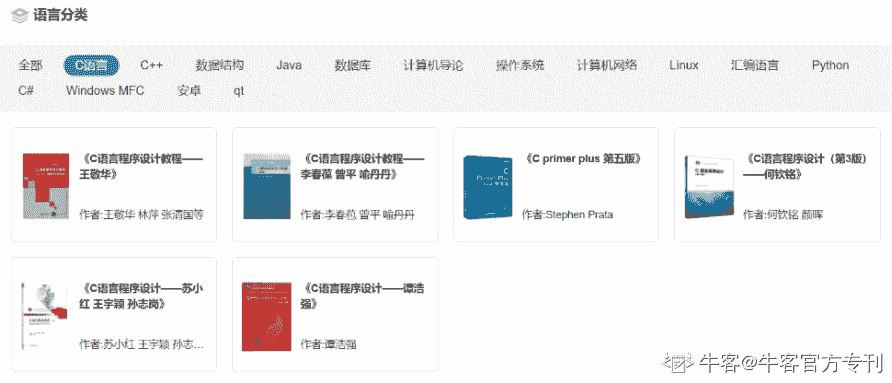
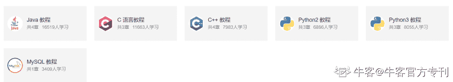
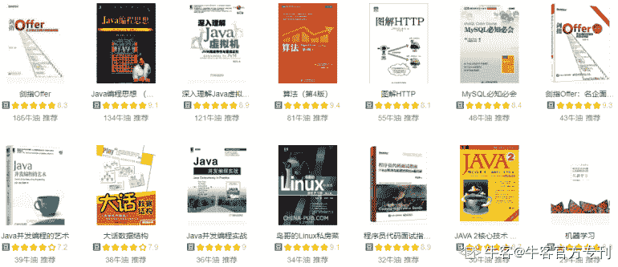
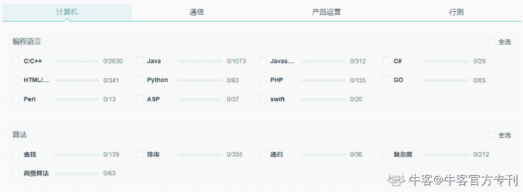
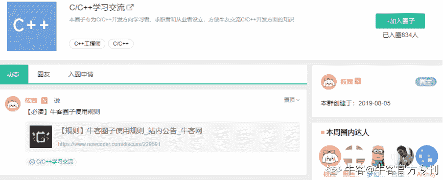
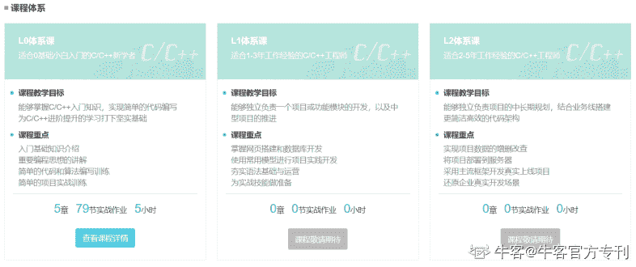
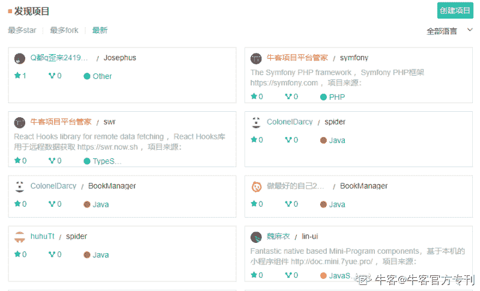
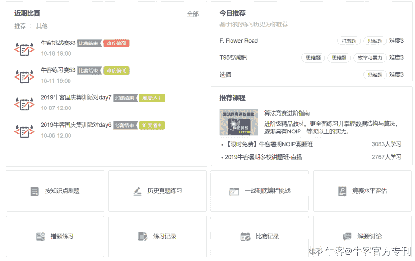
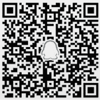

# 第二章 第 2 节 C 语言学习九步走

> 原文：[`www.nowcoder.com/tutorial/10031/3dc0475dcf414dddb1669c8dd342d435`](https://www.nowcoder.com/tutorial/10031/3dc0475dcf414dddb1669c8dd342d435)

## **1.3 C 语言学习九步走**

### **第一步：****大学教材要学透，课后习题要重视**

学习语言的第一步，就是理解透教材。

除了掌握好每个知识点，打牢基础之外，**完成****课后****练习题****也是非常重要的，实践出真知。**

但是在我们独立完成课后习题的过程中就会遇到各种问题。对此，大家可以到**牛客网-题库-教材全解****，**找到相应的教材题库。

（网址[www.nowcoder.com/schoolbooks](http://www.nowcoder.com/schoolbooks)[?from=Ccz](https://www.nowcoder.com/intelligentTest?from=Ccz)）

牛客教材全解，是集合了大学必学的编程语言教材，实现课后习题在线测评功能的题库，帮助大家更好的实战练习。

每道题都配有**标准答案****+****题目解析**，所以完全不用担心难题不会做而打消了学习积极性这种问题。 
再结合牛客特制编程入门文字教程，反复练习，提取重点，高效快速掌握一门语言的基础。位置：**牛客-****学习-图书馆****-编程入门教程-c 语言教程**（网址：[ ](http://www.nowcoder.com/library?from=Ccz)[`www.nowcoder.com/library?from=Ccz`](https://www.nowcoder.com/library?from=Ccz)）

其中 C 语言教程涵盖 C 语言基础语法详细讲解+标准库用法提炼+100 道经典习题解析。

### **第****二****步：****找到一本好书，扩展知识体系**

在掌握教材的基础上，可以开始读一些优秀的 C 语言书籍。通过阅读，学习到更多编程技巧，完善自己的知识体系。

推荐书籍：

基础篇：《C 语言程序设计：现代方法》 作者：K.N.King

进阶篇：《C 和指针》作者：克里

《C Primer Plus（第 6 版）中文版 》 作者：普拉达

不知道应该看什么书的同学，可以到**牛客-****学习****-图书馆**

（网址：[`www.nowcoder.com/library`](https://www.nowcoder.com/library)[?from=Ccz](https://www.nowcoder.com/intelligentTest?from=Ccz)）

图书馆里面有前辈的推荐书单，一一为您列举值得一看的书籍。另外，馆内还有大量的优质读书笔记，供大家进行读后交流。

### **第****三****步：****每周固定一套题，查漏补缺提高快**

在看书的过程中，必须配合做题，因为实践才能出真知。

牛客专项题库覆盖计算机所需全部知识点，帮助大家更全面且专一的提高每个短板。地址：**牛客网-题库-知识点专项练习-计算机**

（网址：[www.nowcoder.com/intelligentTest?from=Ccz](http://www.nowcoder.com/intelligentTest?from=Ccz)）

### **第****四****步：****加入一个技术圈子，多与同行交流**

技术的学习，除了勤学苦练，还要跟上时代的更新迭代。多与同行的学长学姐交流，丰富自己视野和思维。

加入 C/C++交流圈地址：**牛客****网****-首页-推荐圈子-C 语言****圈子**

（网址：[`www.nowcoder.com/circle/7a5ff7da/feed?from=Ccz`](https://www.nowcoder.com/circle/7a5ff7da/feed?from=Ccz)）

与志同道合的朋友们一起探讨 C 语言的学习方法，多交流才能更快地进步。

### **第****五****步：系统知识网络梳理，难点逐个攻破**

通过前面的学习，基本上对 C 语言有一定的理解，但知识网络还是相对混乱的，需要进行系统的梳理。在梳理的过程中逐个攻破知识难点。大家可以到**牛客-****学习-课程****-****学院****-C/C++方向**

网址：（[`www.nowcoder.com/courses/institute/detail/cpp?from=Ccz`](https://www.nowcoder.com/courses/institute/detail/cpp?from=Ccz)）加入体系课程，正确理解编程思想，尝试简单的实战训练。

### **第****六****步：****完成第一个项目，从量变到质变**

每个程序员初学者都期待自己独立完成的项目，但第一个项目往往是踩坑预警。为了能让大家能够既可以完成项目又避免踩坑，牛客特制“项目平台”，技术大佬手把手演示讲解。

项目实战地址：**牛客-****学习****-项目实战**

（网址：[www.nowcoder.com/project/recommend](http://www.nowcoder.com/project/recommend)[?from=Ccz](https://www.nowcoder.com/intelligentTest?from=Ccz)）

这里涵盖初级到高级，不同难度的项目案例。每一个项目从配置环境到运行实现，一步步详细讲解，帮助大家更快地掌握项目技能。

并且，如果你想把自己的项目存放起来，或者与他人分享交流，可到**牛客-****学习****-项目实战-发现更多项目**。

在这里你可以上传自己的项目，也可以接触更多优质的项目资源。

### **第****七****步：****如果对算法感兴趣，可以参加 A****CM**

有算法基础的同学，可以在大学期间参加 ACM 算法竞赛，这类竞赛含金量高，对自己技术的提升、申请奖学金、求职都是一大助力。

对于 ACM 的练习，可加入学校 ACM 队，在牛客竞赛平台进行专业的刷题训练。

牛客竞赛地址：**牛客-发现-竞赛**

（网址：[`ac.nowcoder.com/acm/home?from=Ccz`](https://ac.nowcoder.com/acm/home?from=Ccz)）

欢迎扫码加入**编程入门学习交流群**（QQ 群号：727937511）及时获得更多比赛信息、编程资源、新生福利等干货资讯。和更多志同道合的小伙伴一起交流成长，成为牛人！（扫码加群）                                               