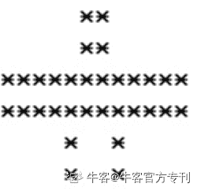

# 第三章 第 2 节 顺序程序设计

> 原文：[`www.nowcoder.com/tutorial/10031/14bdcf80271e485ab68fabf5a80bedc6`](https://www.nowcoder.com/tutorial/10031/14bdcf80271e485ab68fabf5a80bedc6)

## 2.2 顺序程序设计

### 2.2.1 字符数据的输入输出

*   **putchar 函数**

**int putchar(int c)**函数把字符输出到屏幕上，并返回相同的字符。这个函数在同一个时间内只会输出一个单一的字符。您可以在循环内使用这个方法，以便在屏幕上输出多个字符。

**例子：**

```cpp
#include <stdio.h>

int main ()
{
char n;

for(n = 'A' ; n <= 'D' ; n++) {
putchar(n);
}
return(0);
}
```

**结果：**

ABCD

*   **getchar 函数**

**int getchar(void)**函数从屏幕读取下一个可用的字符，并把它返回为一个整数。这个函数在同一个时间内只会读取一个单一的字符。您可以在循环内使用这个方法，以便从屏幕上读取多个字符。

**例子：**

```cpp
#include <stdio.h>

int main ()
{
char a;
printf("请输入字符：");
a = getchar();

printf("输入的字符：");
putchar(a)

return(0);
}
```

**结果：**

请输入字符：nowcoder

输入的字符：nowcoder

*   **printf 函数**

**printf 函数（****“****格式控制字符串****”****，输出表列）** 输出指定的数据

格式控制字符串用于指定输出格式，以%开头，在%后面跟有各种格式字符，以说明输出数据的类型、形式、长度、小数位数等。输出表列的数量和类型要求与格式字符串一一对应。

| **%格式字符** | **描述** | **对应数据类型** |
| **%d** | 十进制有符号整数 | int |
| **%u** | 十进制无符号整数 | unsigned int |
| **%f** | 浮点数 | float(double) |
| **%s** | 字符串 | char* |
| **%c** | 单个字符 | char |
| **%p** | 指针的值 | void* |
| **%e** | 指数形式的浮点数 | float(double) |
| **%x** | 无符号以十六进制表示的整数 | unsigned int |
| **%o** | 无符号以八进制表示的整数 | unsigned int |
| **%g** | 把输出的值按照 %e 或者 %f 类型中输出长度较小的方式输出 | float(double) |
| **%p** | 输出地址符 | void* |
| **%lu** | 32 位无符号整数 | long unsigned int |
| **%llu** | 64 位无符号整数 | long long unsigned int |
| **%%** | 显示百分号本身 | - |

*   **scanf 函数**

**scanf（****“****格式控制字符串****”****，地址表列）**把数据输入到指定的变量中

**例子：**

```cpp
# include <stdio.h>

int main(void)
{
int i;

scanf("%d", &i); 
printf("i = %d\n", i);

return 0;
}
```

**结果：**

输入：123

i=123

**查看本章更多知识点**

[`www.nowcoder.com/tutorial/10002/d847acacee2f4437bd94b668bf685c85?from=Ccz`](https://www.nowcoder.com/tutorial/10002/d847acacee2f4437bd94b668bf685c85?from=Ccz)

### 2.2.2 习题库

**【习题 1】****小飞机**

**题目描述**

KiKi 学会了 printf 在屏幕输出信息，他想输出一架小飞机。请帮他编写程序输出这架小飞机。

**输入描述**

无

**输出描述**



**题目解析**

输出语句需要单行输出，所以需要把图形拆解为几个单行，分别进行输出即可。

**参考代码**

```cpp
#include<stdio.h>

int main( )
{
    printf("     **\n     **\n************\n************\n    *  *\n    *  *\n");
    return 0;
}
```

**【习题 2】缩短二进制**

**题目描述**

我们处理的整数通常用十进制表示，在计算机内存中是以二进制补码形式存储，但通常二进制表示的整数比较长，为了便于在程序设计过程中理解和处理数据，通常采用八进制和十六[进制](https://www.baidu.com/s?wd=16%E8%BF%9B%E5%88%B6&tn=SE_PcZhidaonwhc_ngpagmjz&rsv_dl=gh_pc_zhidao)，缩短了[二进制补码表示的整数](https://www.baidu.com/s?wd=%E4%BA%8C%E8%BF%9B%E5%88%B6%E6%95%B0&tn=SE_PcZhidaonwhc_ngpagmjz&rsv_dl=gh_pc_zhidao)，但保持了[二进制数](https://www.baidu.com/s?wd=%E4%BA%8C%E8%BF%9B%E5%88%B6%E6%95%B0&tn=SE_PcZhidaonwhc_ngpagmjz&rsv_dl=gh_pc_zhidao)的表达特点。请输出十进制整数 1234 对应的八进制和十六进制。

**输入描述**

无

**输出描述**

十进制整数 1234 对应的八进制和十六进制（字母大写），用空格分开，并且要求，在八进制前显示前导 0，在十六进制数前显示前导 0X。

**备注**

printf 可以使用使用格式控制串“%o”、“%X”分别输出八进制整数和十六进制整数，并使用修饰符“#”控制前导显示

**题目解析**

printf 可以使用格式控制串“%o”、“%X”分别输出八进制整数和十六进制整数。

**参考代码**

```cpp
#include <stdio.h>
int main( )
{
    int num = 1234;
    printf("%#o %#X",num,num);
    return 0;
}
```

**【习题 3】十六进制转十进制**

**题目描述**

BoBo 写了一个十六进制整数 ABCDEF，他问 KiKi 对应的十进制整数是多少。

**输入描述**

无

**输出描述**

十六进制整数 ABCDEF 对应的十进制整数，所占域宽为 15。

**备注**

printf 可以使用格式控制串“%md”输出域宽为 m 的十进制整数。

**题目解析**

printf 可以使用格式控制串“%md”输出域宽为 m 的十进制整数，这里的十六进制可以强转为十进制输出。

**参考代码**

```cpp
#include <stdio.h>
int main( )
{
    int num = 0XABCDEF;
    printf("%15d",num);
    return 0;
}
```

**【习题 4】字符转 A****SCLL****码**

**题目描述**

BoBo 教 KiKi 字符常量或字符变量表示的字符在内存中以 ASCII 码形式存储。BoBo 出了一个问题给 KiKi，输入一个字符，输出该字符相应的 ASCII 码。

**输入描述**

一行，一个字符。

**输出描述**

一行，输出输入字符对应的 ASCII 码。

**示例 1**

输入

C

输出

99

**题目解析**

可用%d 强制输出对应的 ASCLL 码

**参考代码**

```cpp
#include<stdio.h>
int main( )
{
    char a;
    scanf("%c",&a);
    printf("%d",a);
    return 0;
}
```

**【习题 5】A****SCLL****码**

**题目描述**

BoBo 教 KiKi 字符常量或字符变量表示的字符在内存中以 ASCII 码形式存储。BoBo 出了一个问题给 KiKi，转换以下 ASCII 码为对应字符并输出他们。

73, 32, 99, 97, 110, 32, 100, 111, 32, 105, 116 , 33

**输入描述**

无

**输出描述**

转换输出题目中给出地所有 ASCII 到对应的字符

**题目解析**

对于 char 范围内的数字用%c 可控制其转化为对应的字符。

**参考代码**

```cpp
#include<stdio.h>

int main( )
{
    printf("%c%c%c%c%c%c%c%c%c%c%c%c",73, 32, 99, 97, 110, 32, 100, 111, 32, 105, 116 , 33);
    return 0;
}
```

**【习题 6】出生日期输入输出**

**题目描述**

输入一个人的出生日期（包括年月日），将该生日中的年、月、日分别输出。

**输入描述**

输入只有一行，出生日期，包括年月日，年月日之间的数字没有分隔符。

**输出描述**

三行，第一行为出生年份，第二行为出生月份，第三行为出生日期。输出时如果月份或天数为 1 位数，需要在 1 位数前面补 0。

**示例 1**

输入 20130225  

输出 year=2013month=02date=25

**题目解析**

通过 scanf 函数的%m 格式控制可以指定输入域宽，输入数据域宽（列数），按此宽度截取所需数据；通过 printf 函数的%0 格式控制符，输出数值时指定左面不使用的空位置自动填 0。

**参考代码**

```cpp
#include<stdio.h>
int main( )
{
    int a,b,c,d;
    scanf("%d",&a);
    b=a/10000;
    c=a%10000/100;
    d=a%100;
    printf("year=%d\nmonth=%02d\ndate=%02d",b,c,d);
}
```

**【习题****7****】进制 A****+B**

**题目描述**

输入一个十六进制数 a，和一个八进制数 b，输出 a+b 的十进制结果（范围-2³¹~2³¹-1）。

**输入描述**

一行，一个十六进制数 a，和一个八进制数 b，中间间隔一个空格。

**输出描述**

一行，a+b 的十进制结果。

**示例 1**

输入 0x12 05 

 输出 23

**备注**

十六进制 Hexadecimal 一般以 0x 开头，例如 0xFF。八进制 Octal，一般以 0 开头，例如 07。

**题目解析**

%x 表示十六进制，%o 表示八进制，%d 表示十进制，scanf 也可使用。

**参考代码**

```cpp
#include<stdio.h>
int main( )
{   
int a,b;
    scanf("%x %o",&a,&b);
    printf("%d",a+b);
}
```

**查看更多相关习题，进行线上编程训练：**

`ac.nowcoder.com/acm/contest/310#question?from=Ccz`