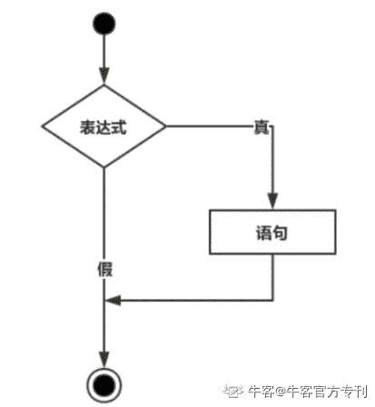
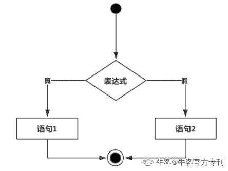

# 第三章 第 4 节 判断语句形式

> 原文：[`www.nowcoder.com/tutorial/10031/ac0bcb56b9724bcdb459b464b53a86aa`](https://www.nowcoder.com/tutorial/10031/ac0bcb56b9724bcdb459b464b53a86aa)

## 2.4 判断语句形式

### **2.****4.1 if 语句**

C 语言中**if 语句**的语法：

```cpp
if(boolean_expression)
{
   /* 如果布尔表达式为真将执行的语句 */
}
```

如果布尔表达式为 true，则 if 语句内的代码块将被执行。如果布尔表达式为 false，则 if 语句结束后的第一组代码（闭括号后）将被执行。



**例子：**

```cpp
#include <stdio.h>

int main ( )
{
   /* 局部变量定义 */
   int a = 10;

   /* 使用 if 语句检查布尔条件 */
   if( a < 20 )
   {
       /* 如果条件为真，则输出下面的语句 */
       printf("a 小于 20\n" );
   }
   printf("a 的值是 %d\n", a);

   return 0;
} 
```

**结果**

a 小于 20

a 的值是 10 

### **2.****4.2 if-else 语句**

C 语言中**if...else 语句**的语法：

```cpp
if(boolean_expression)
{
   /* 如果布尔表达式为真将执行的语句 */
}
else
{
   /* 如果布尔表达式为假将执行的语句 */
}
```

如果布尔表达式为 true，则执行 if 块内的代码。如果布尔表达式为 false，则执行 else 块内的代码。



**例子：**

```cpp
#include <stdio.h>

int main ( )
{
   /* 局部变量定义 */
   int a = 100;

   /* 检查布尔条件 */
   if( a < 20 )
   {
       /* 如果条件为真，则输出下面的语句 */
       printf("a 小于 20\n" );
   }
   else
   {
       /* 如果条件为假，则输出下面的语句 */
       printf("a 大于 20\n" );
   }
   printf("a 的值是 %d\n", a);

   return 0;
}
```

**结果**

a 小于 20

a 的值是 10 

### **2.****4.3 嵌套 if 语句**

在 C 语言中，嵌套 if-else 语句是合法的，这意味着您可以在一个 if 或 else if 语句内使用另一个 if 或 else if 语句。

C 语言中嵌套 **if 语句**的语法：

```cpp
if( boolean_expression 1)
{
   /* 当布尔表达式 1 为真时执行 */
   if(boolean_expression 2)
   {
      /* 当布尔表达式 2 为真时执行 */
   }
}
```

可以嵌套**else if...else**，方式与嵌套 if 语句相似。

**例子：**

```cpp
#include <stdio.h>

int main ()
{
   /* 局部变量定义 */
   int a = 100;
   int b = 200;

   /* 检查布尔条件 */
   if( a == 100 )
   {
       /* 如果条件为真，则检查下面的条件 */
       if( b == 200 )
       {
          /* 如果条件为真，则输出下面的语句 */
          printf("a 的值是 100，且 b 的值是 200\n" );
       }
   }
   printf("a 的准确值是 %d\n", a );
   printf("b 的准确值是 %d\n", b );

   return 0;
}
```

**结果**

a 的值是 100，且 b 的值是 200

a 的准确值是 100

b 的准确值是 200

### **2.****4.4 switch 语句**

C 语言中**switch 语句**的语法：

```cpp
switch(expression){
    case constant-expression  :
       statement(s);
       break; /* 可选的 */
    case constant-expression  :
       statement(s);
       break; /* 可选的 */

    /* 您可以有任意数量的 case 语句 */
    default : /* 可选的 */
       statement(s);
}
```

switch 语句必须遵循下面的规则：

1、switch 语句中的 expression 是一个常量表达式，必须是一个整型或枚举类型。

2、在一个 switch 中可以有任意数量的 case 语句。每个 case 后跟一个要比较的值和一个冒号。

3、case 的 constant-expression 必须与 switch 中的变量具有相同的数据类型，且必须是一个常量或字面量。

4、当被测试的变量等于 case 中的常量时，case 后跟的语句将被执行，直到遇到 break 语句为止。

5、当遇到 break 语句时，switch 终止，控制流将跳转到 switch 语句后的下一行。

6、不是每一个 case 都需要包含 break。如果 case 语句不包含 break，控制流将会继续后续的 case，直到遇到 break 为止。

7、一个 switch 语句可以有一个可选的 default case，出现在 switch 的结尾。default case 可用于在上面所有 case 都不为真时执行一个任务。default case 中的 break 语句不是必需的。

**例子：**

```cpp
#include <stdio.h>

int main ()
{
   /* 局部变量定义 */
   char grade = 'B';

   switch(grade)
   {
   case 'A' :
      printf("很棒！\n" );
      break;
   case 'B' :
   case 'C' :
      printf("做得好\n" );
      break;
   case 'D' :
      printf("您通过了\n" );
      break;
   case 'F' :
      printf("最好再试一下\n" );
      break;
   default :
      printf("无效的成绩\n" );
   }
   printf("您的成绩是 %c\n", grade );

   return 0;
} 
```

**结果**

做得好

您得成绩是 B

**查看本章更多知识点**

[`www.nowcoder.com/tutorial/10002/cd0d7b6b2a044a568834af2bca1dcb92?from=Ccz`](https://www.nowcoder.com/tutorial/10002/cd0d7b6b2a044a568834af2bca1dcb92?from=Ccz)