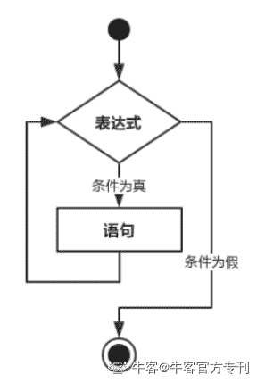
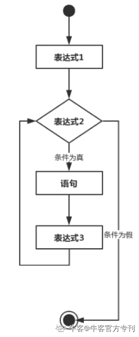
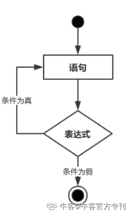
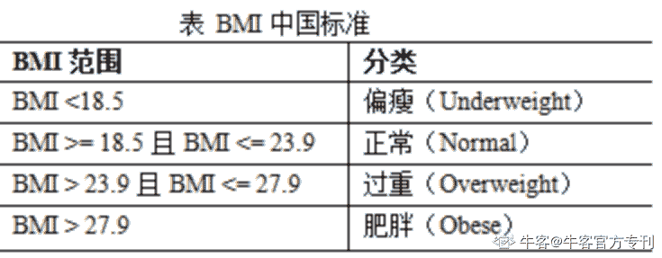
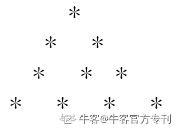
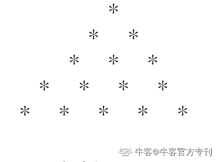
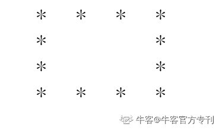
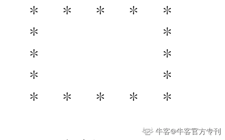

# 第三章 第 5 节 循环控制

> 原文：[`www.nowcoder.com/tutorial/10031/de968ca3f2434ac7bb6e721b295ba946`](https://www.nowcoder.com/tutorial/10031/de968ca3f2434ac7bb6e721b295ba946)

## 2.5、循环控制

### **2.****5.1 while 语句**

C 语言中**while 循环**的语法：

```cpp
while(condition)
{
   statement(s);
}
```

表达式为循环条件，语句为循环体，当条件为 true 时执行循环。 当条件为 false 时，退出循环。



**例子：**

```cpp
#include <stdio.h>

int main ( )
{
   /* 局部变量定义 */
   int a = 10;

   /* while 循环执行 */
   while( a < 20 )
   {
      printf("a 的值： %d\n", a);
      a++;
   }

   return 0;
}
```

**结果**

a 的值： 10

a 的值： 11

a 的值： 12

a 的值： 13

a 的值： 14

a 的值： 16

a 的值： 17

a 的值： 18

a 的值： 19

### **2.****5.2 for 语句**

C 语言中**for 循环**的语法：

```cpp
for ( init; condition; increment )
{
   statement(s);
}
```

下面是 for 循环的控制流：

1、init 会首先被执行，且只会执行一次。这一步允许您声明并初始化任何循环控制变量。您也可以不在这里写任何语句，只要有一个分号出现即可。

2、接下来，会判断 condition。如果为真，则执行循环主体。如果为假，则不执行循环主体，且控制流会跳转到紧接着 for 循环的下一条语句。

3、在执行完 for 循环主体后，控制流会跳回上面的 increment 语句。该语句允许您更新循环控制变量。该语句可以留空，只要在条件后有一个分号出现即可。

4、条件再次被判断。如果为真，则执行循环，这个过程会不断重复（循环主体，然后增加步值，再然后重新判断条件）。在条件变为假时，for 循环终止。



**例子：**

```cpp
#include <stdio.h>

int main ( )
{
   /* for 循环执行 */
   for( int a = 10; a < 20; a = a + 1 )
   {
      printf("a 的值： %d\n", a);
   }

   return 0;
} 
```

**结果**

a 的值： 10

a 的值： 11

a 的值： 12

a 的值： 13

a 的值： 14

a 的值： 16

a 的值： 17

a 的值： 18

a 的值： 19

### **2.****5.****3**** do-while 语句**

C 语言中**do...while**循环的语法：

```cpp
do
{
   statement(s);

} while( condition );
```

首先执行循环语句，然后再进行表达式判断，若为真则继续执行循环，若为假，则跳出循环。

条件表达式出现在循环的尾部，所以循环至少会被执行一次。



**例子：**

```cpp
#include <stdio.h>

int main ( )
{
   /* 局部变量定义 */
   int a = 10;

   /* do 循环执行 */
   do
   {
       printf("a 的值： %d\n", a);
       a = a + 1;
   }while( a < 20 );

   return 0;
} 
```

**结果**

a 的值： 10

a 的值： 11

a 的值： 12

a 的值： 13

a 的值： 14

a 的值： 16

a 的值： 17

a 的值： 18

a 的值： 19

### **2.****5.****4**** goto 语句**

C 语言中的 goto 语句允许把控制无条件转移到同一函数内的被标记的语句。

注意：在任何编程语言中，都不建议使用 goto 语句。因为它使得程序的控制流难以跟踪，使程序难以理解和难以修改。任何使用 goto 语句的程序可以改写成不需要使用 goto 语句的写法。

C 语言中**goto 语句**的语法：

```cpp
goto label;
..
.
label: statement; 
```

**例子：**

```cpp
#include <stdio.h>

int main ( )
{
   /* 局部变量定义 */
   int a = 10;

   /* do 循环执行 */
   LOOP:do
   {
      if( a == 15)
      {
         /* 跳过迭代 */
         a = a + 1;
         goto LOOP;
      }
      printf("a 的值： %d\n", a);
      a++;

   }while( a < 20 );

   return 0;
}
```

**结果**

a 的值： 10

a 的值： 11

a 的值： 12

a 的值： 13

a 的值： 14

a 的值： 16

a 的值： 17

a 的值： 18

a 的值： 19

**查看本章更多知识点**

[`www.nowcoder.com/tutorial/10002/7ea7c59926404492b8726dd7bc8beb2c?from=Ccz`](https://www.nowcoder.com/tutorial/10002/7ea7c59926404492b8726dd7bc8beb2c?from=Ccz)

### **2****.****5****.****5****习题库**

**【习题 1】及格分数**

**题目描述**

KiKi 想知道他的考试分数是否通过，请帮他判断。从键盘任意输入一个整数表示的分数，编程判断该分数是否在及格范围内，如果及格，即：分数大于等于 60 分，是输出“Pass”，否则，输“Fail”。

**输入描述**

多组输入，每行输入包括一个整数表示的分数（0~100）。

**输出描述**

针对每行输入，输出“Pass”或“Fail”。

**示例****1**输入 94 

输出
Pass 

**示例 2**输入 44 

输出
Fail

**题目解析**

对于有多个条件的判断，我们可以用逻辑运算连接，本题使用逻辑与，并且使用 if…else…语法判断了问题的正反面。

**参考代码**

```cpp
#include<stdio.h>
int main( )
{
    int a;
    while(~scanf("%d",&a))
        if(a>=60&&a<=100)
            printf("Pass\n");
    else if(a>=0)
        printf("Fail\n");
}
```

**【习题 2】判断整数的奇偶性**

**题目描述**

KiKi 想知道一个整数的奇偶性，请帮他判断。从键盘任意输入一个整数（范围-2³¹~2³¹-1），编程判断它的奇偶性。

**输入描述**

多组输入，每行输入包括一个整数。

**输出描述**

针对每行输入，输出该数是奇数（Odd）还是偶数（Even）。

**示例 1**

输入 47 输出 EvenOdd

**题目解析**

判断一个整数的奇偶性可以对 2 求余来区分。

**参考代码**

```cpp
#include<stdio.h>
int main( ){
    int x;
    while(~scanf("%d",&x))
    {
        if(x%2==0)
            printf("Even\n");
        else
            printf("Odd\n");
    }
    return 0;
}
```

**【习题 3】衡量人体胖瘦程度**

**题目描述**

在计算 BMI（BodyMassIndex，身体质量指数）的案例基础上，判断人体胖瘦程度。BMI 中国标准如下表所示。 



**输入描述**

多组输入，每一行包括两个整数，用空格隔开，分别为体重（公斤）和身高（厘米）。

**输出描述**

针对每行输入，输出为一行，人体胖瘦程度，即分类。

**示例 1**

输入 80 17060 17090 16050 185 

输出
Overweight
Normal
Obese
Underweight

**题目解析**

对于不同的条件进行逻辑表述之后，使用 if…else if 语句表达所有的条件逻辑。

**参考代码**

```cpp
#include<stdio.h>
int main( )
{
    int a,b;
    while(scanf("%d%d",&a, &b)!=EOF)
    if(a/((b/100.0)*(b/100.0))<18.5)
        printf("Underweight\n");
    else if(a/((b/100.0)*(b/100.0))>=18.5&&a/((b/100.0)*(b/100.0))<=23.9)
        printf("Normal\n");
    else if(a/((b/100.0)*(b/100.0))>23.9&&a/((b/100.0)*(b/100.0))<=27.9)
        printf("Overweight\n");
    else if(a/((b/100.0)*(b/100.0))>27.9)
        printf("Obese\n");
}
```

#### **【习题 4】简单计算器**

**题目描述**

KiKi 实现一个简单计算器，实现两个数的“加减乘除”运算，用户从键盘输入算式“操作数 1 运算符操作数 2”，计算并输出表达式的值，如果输入的运算符号不包括在（+、-、*、/）范围内，输出“Invalid operation!”。当运算符为除法运算，即“/”时。如果操作数 2 等于 0.0，则输出“Wrong!Division by zero!”

**输入描述**

多组输入，一行，操作数 1 运算符操作数 2（其中运算符号包括四种：+、-、*、/）。

**输出描述**

1、针对每组输入，输出为一行。

2、如果操作数和运算符号均合法，则输出一个表达式，操作数 1 运算符操作数 2=运算结果，各数小数点后均保留 4 位，数和符号之间没有空格。

3、如果输入的运算符号不包括在（+、-、*、/）范围内，输出“Invalid operation!”。当运算符为除法运算，即“/”时。  

4、如果操作数 2 等于 0.0，则输出“Wrong!Division by zero!”。

**示例 1**

输入
1.0+3.0 
1.0;4.0
44.0/0.0 

输出
1.0000+3.0000=4.0000
Invalid operation!
Wrong!Division by zero!

 **题目解析**

根据计算器中不同的运算符对应处理对应的运算，对于除法的情况单独进行处理。

**参考代码**

```cpp
#include<stdio.h>
int main( )
{
    double a,c;
    char b;
    while(~scanf("%lf %c %lf",&a,&b,&c))
    {
        if(b=='+')
        printf("%.4lf+%.4lf=%.4lf\n",a,c,a+c);
        else if(b=='-')
        printf("%.4lf-%.4lf=%.4lf\n",a,c,a-c);
        else if(b=='*')
        printf("%.4lf*%.4lf=%.4lf\n",a,c,a*c);
        else if(b=='/')
        {
            if(c==0.0)
        printf("Wrong!Division by zero!\n");
            if(c!=0)
        printf("%.4lf/%.4lf=%.4lf\n",a,c,a/c);
        }
        else
            printf("Invalid operation!\n");
    }
    return 0;
}
```

#### **【习题 5】竞选社长**

**题目描述**

假设你们社团要竞选社长，有两名候选人分别是 A 和 B，社团每名同学必须并且只能投一票，最终得票多的人为社长.

**输入描述**

一行，字符序列，包含 A 或 B，输入以字符 0 结束。

**输出描述**

一行，一个字符，A 或 B 或 E，输出 A 表示 A 得票数多，输出 B 表示 B 得票数多，输出 E 表示二人得票数相等。

**示例 1**

输入 ABBABBAAB0 

输出
B

**题目解析**

定义两个计数变量，分别记录 A 和 B 获取的票数，最终对比票数结果。

**参考代码**

```cpp
#include <stdio.h>
int main( )
{
    int a=0,b=0;
    char c[200];
    for(int i=0;i<10;i++)
        scanf("%c",&c[i]);
    for(int i=0;i<10;i++)
    {
        if(c[i]=='A') a++;
        if(c[i]=='B') b++;
    }
    if(a>b) printf("A");
    else if(a==b)
        printf("E");
    else printf("B");
    return 0;
}
```

**【习题 6】金字塔图案**

**题目描述**

KiKi 学习了循环，BoBo 老师给他出了一系列打印图案的练习，该任务是打印用“*”组成的金字塔图案。

**输入描述**

多组输入，一个整数（2-20），表示金字塔边的长度，即“*”的数量，也表示输出行数。

**输出描述**

针对每行输入，输出用“*”组成的金字塔，每个“*”后面有一个空格。

**示例 1**

输入 4 输出   ** **

**示例 2**

输入 5 输出    

**题目解析**

观察清楚空格和*跟循环的行列变量的关系。

**参考代码**

```cpp
#include<stdio.h>
int main( )
{
    int i,j,k;
    while(scanf("%d",&i)!=EOF)
    {
        for(j=0;j<i;j++)
        {
            for(k=0;k<i-j-1;k++)
                printf(" ");
            for(k=0;k<=j;k++)
                printf("* ");
            printf("\n");
        }
    }
}
```

**【习题 7】空心正方形**

**题目描述**

KiKi 学习了循环，BoBo 老师给他出了一系列打印图案的练习，该任务是打印用“*”组成的“空心”正方形图案。

**输入描述**

多组输入，一个整数（3-20），表示输出的行数，也表示组成正方形边的“*”的数量。

**输出描述**

针对每行输入，输出用“*”组成的“空心”正方形，每个“*”后面有一个空格。

**示例 1**

输入 4 输出

**示例 2**

输入 5 输出

**题目解析**

观察清楚空格和*跟循环的行列变量的关系。

**参考代码**

```cpp
#include<stdio.h>
int main( )
{
    int i,j,k,a;
    while(scanf("%d",&a)!=EOF)
    {
        for(i=0;i<a;i++)
        {
            if(i==0||i==a-1)
            {
                for(j=0;j<a;j++)
                {
                    printf("* ");
                }
            }
            else
            {
                printf("* ");
                for(k=a-2;k>0;k--)
                {
                    printf("  ");
                }
                printf("* ");
            }
            printf("\n");
        }
}
return 0;
}
```

**【习题 8】****HTTP****状态码**

**题目描述**

KiKi 访问网站，得到 HTTP 状态码，但他不知道什么含义，BoBo 老师告诉他常见 HTTP 状态码：200（OK，请求已成功），202（Accepted，服务器已接受请求，但尚未处理。）400（Bad Request，请求参数有误），403（Forbidden，被禁止），404（Not Found，请求失败），500（Internal Server Error，服务器内部错误），502（Bad Gateway，错误网关）。

**输入描述**

多组输入，一行，一个整数（100~600），表示 HTTP 状态码。

**输出描述**

针对每组输入的 HTTP 状态，输出该状态码对应的含义，具体对应如下：
200-OK
202-Accepted
400-Bad Request
403-Forbidden
404-Not Found
500-Internal Server Error
502-Bad Gateway

**示例 1**

输入 200 输出 OK

**题目解析**

对于每个不同的状态码对应输出对应的结果即可，使用条件判断语句完成。

**参考代码**

```cpp
#include<stdio.h>

int main( )
{
    int i;
    while(~scanf("%d",&i))
    {
        if(i==200)
            printf("OK\n");
        else if(i==202)
            printf("Accepted\n");
        else if(i==400)
            printf("Bad Request\n");
        else if(i==403)
            printf("Forbidden\n");
        else if(i==404)
            printf("Not Found\n");
        else if(i==500)
            printf("Internal Server Error\n");
        else if(i==502)
            printf("Bad Gateway\n");
    }
    return 0;
}
```

**【习题 9】数字三角形**

**题目描述**

KiKi 学习了循环，BoBo 老师给他出了一系列打印图案的练习，该任务是打印用数字组成的数字三角形图案。

**输入描述**

多组输入，一个整数（3~20），表示数字三角形边的长度，即数字的数量，也表示输出行数。

**输出描述**

针对每行输入，输出用数字组成的对应长度的数字三角形，每个数字后面有一个空格。

**示例 1**

输入 4 输出 11 21 2 31 2 3 4

**示例****2**

输入 5 输出 11 21 2 31 2 3 41 2 3 4 5

**题目解析**

观察数字变化规律以及每行数字个数的规律输出即可。

**参考代码**

```cpp
#include <stdio.h>
int main ( ) {
    int i,j,n;
    while (scanf("%d",&n)!=EOF) {
        for (i=1;i<=n;i++) {
            for (j=1;j<=n;j++) {
                if (j<=i)
                printf("%d ",j);
            }
            printf("\n");
        }
    }
    return 0;
}
```

**【习题 10】筛选法求素数**

**题目描述**

用筛选法求 n 以内的素数。筛选法求解过程为：将 2~n 之间的正整数放在数组内存储，将数组中 2 之后的所有能被 2 整除的数清 0，再将 3 之后的所有能被 3 整除的数清 0 ，以此类推，直到 n 为止。数组中不为 0 的数即为素数。

**输入描述**

多组输入，每行输入一个正整数（不大于 100）。

**输出描述**

针对每行输入的整数 n，输出两行，第一行，输出 n 之内（包括 n）的素数，用空格分隔，
    第二行，输出数组中 2 之后 0 的个数。每行输出后换行。

**示例 1**

输入 20 输出 2  3  5  7  11  13  17  1911

**题目解析**

按照题意从小到大枚举素数，然后每个素数其的倍数都不是素数了。

**参考代码**

```cpp
#include<stdio.h>

int main( )
{
    int n,i,j,sum=0;
    scanf("%d",&n);
    int a[n+1];
    for(i=2;i<=n;i++)
    {
        a[i]=i;
        for(j=2;j<i;j++)
        {
            if(i%j==0)
                a[i]=0;
        }
        if(a[i]!=0)
            printf("%d ",a[i]);
        if(a[i]==0)
            sum++;
    }
    printf("\n%d",sum);
    return 0;
}
```

**【习题 11】变种水仙花**

**题目描述**

变种水仙花数-Lily Number：把任意的数字，从中间拆分成两个数字，比如 1461 可以拆分成（1 和 461）,（14 和 61）,（146 和 1),如果所有拆分后的乘积之和等于自身，则是一个 Lily Number。

例如：

655 = 6 * 55 + 65 * 5

1461 = 1 * 461 + 14 * 61 + 146 * 1

求出 5 位数中的所有 Lily Number。

**输入描述**

无

**输出描述**

一行，5 位数中的所有 Lily Number，每两个数之间间隔一个空格。

**题目解析**

枚举 10000~99999 范围内的所有五位数，然后对应进行拆分相乘求和，然后判断是否等于本身即可。

**参考代码**

```cpp
#include<stdio.h>
int main( )
{
    int a,b,c,d,e;
    for(a=10000;a<100000;a++)
    {
if(a==(a/10000)*(a%10000)+a/1000*(a%1000)+a/100*(a%100)+a/10*(a%10))
            printf("%d ",a);
    }
}
```

**【习题 12】争夺前五名**

**题目描述**

期中考试开始了，大家都想取得好成绩，争夺前五名。从键盘输入 n 个学生成绩（不超过 40 个），输出每组排在前五高的成绩。

**输入描述**

两行，第一行输入一个整数，表示 n 个学生（>=5），第二行输入 n 个学生成绩（整数表示，范围 0~100），用空格分隔。

**输出描述**

一行，输出成绩最高的前五个，用空格分隔。

**示例 1**

输入 699  45  78  67  72  88 输出 99  88  78  72  67

**题目解析**

对输入的数据，使用任意一种排序算法，然后输出前五大的即可。

**参考代码**

```cpp
#include<stdio.h>
int main ( )
{
    int i=0,n,j=0,k=0;
    scanf("%d",&n);
    int a[n];
    for(i=0;i<n;i++)
        scanf("%d",&a[i]);
    for(j=0;j<n;j++)
        for(i=0;i<n-j-1;i++)
        if(a[i]<a[i+1])
           {k=a[i];a[i]=a[i+1];a[i+1]=k;}
        for(i=0;i<5;i++)
            printf("%d ",a[i]);
    return 0;
}
```

**【习题 13】有序序列插入一个数**

**题目描述**

有一个有序数字序列，从小到大排序，将一个新输入的数插入到序列中，保证插入新数后，序列仍然是升序。

**输入描述**

第一行输入一个整数(0≤N≤50)。

第二行输入 N 个升序排列的整数，输入用空格分隔的 N 个整数。

第三行输入想要进行插入的一个整数。

**输出描述**

输出为一行，N+1 个有序排列的整数。

**示例 1**

输入 51  6  9  22  308 输出 1  6  8  9  22  30

**题目解析**

找到待插入的位置，然后把后面的元素都往后移一个位置，最终插入这个数。

**参考代码**

```cpp
#include <stdio.h>
int main( )
{
    int n,i,j,x,a[11];
    scanf("%d",&n);
    for(i=0;i<n;i++)
    scanf("%d",&a[i]);
    scanf("%d",&x);
    i=0;
    while(a[i]<x&&i<n)
         i++;
    for (j=n-1;j>=i;j--)
    {
        a[j+1]=a[j];
    }
    a[i]=x;
    for(i=0;i<n+1;i++)
       printf("%d ",a[i]);
    return 0;
}
```

**【习题 1****4****】图像相似度**

**题目描述**

给出两幅相同大小的黑白图像（用 0-1 矩阵）表示，求它们的相似度。若两幅图像在相同位置上的像素点颜色相同，则称它们在该位置具有相同的像素点。两幅图像的相似度定义为相同像素点数占总像素点数的百分比。

**输入描述**

第一行包含两个整数 m 和 n，表示图像的行数和列数，用单个空格隔开。1≤m≤100, 1≤n≤100。之后 m 行，每行 n 个整数 0 或 1，表示第一幅黑白图像上各像素点的颜色，相邻两个数用单个空格隔开。之后 m 行，每行 n 个整数 0 或 1，表示第二幅黑白图像上各像素点的颜色，相邻两个数用单个空格隔开。

**输出描述**

一个实数，表示相似度(以百分比的形式给出)，精确到小数点后两位。

**示例 1**

输入 3  31  0  10  0  11  1  01  1  00  0  10  0  1

输出
44.44

**题目解析**

循环枚举统计图像相同的像素个数，然后除以图像大小得到相似度。

**参考代码**

```cpp
#include <stdio.h>
int main( ){
    int m,n;
    int a[105][105];
    int b[105][105];
    double sum=0;
    int d;
    scanf("%d %d",&m,&n);
    for(int i=0;i<m;i++){
        for(int j=0;j<n;j++){
            scanf("%d",&a[i][j]);
        }
    }
    for(int i=0;i<m;i++){
        for(int j=0;j<n;j++){
            scanf("%d",&b[i][j]);
        }
    }
    for(int i=0;i<m;i++){
        for(int j=0;j<n;j++){
        if(a[i][j]==b[i][j]){
            sum++;
        }
        }
    }
    d=m*n;
    printf("%.2f",(sum/d)*100);
    return 0;
}
```

**查看更多相关习题，进行线上编程训练：**

`ac.nowcoder.com/acm/contest/312#question?from=Ccz`