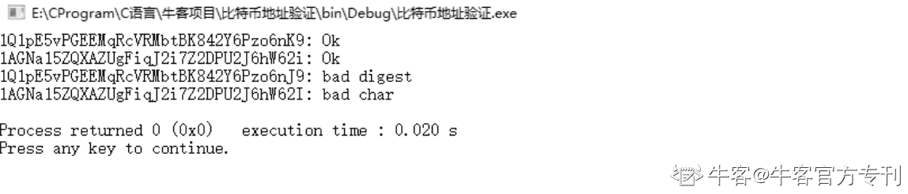
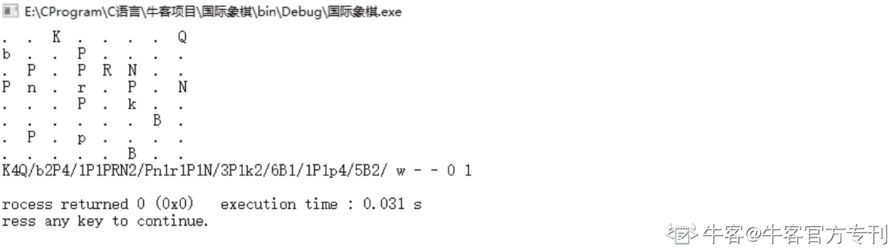
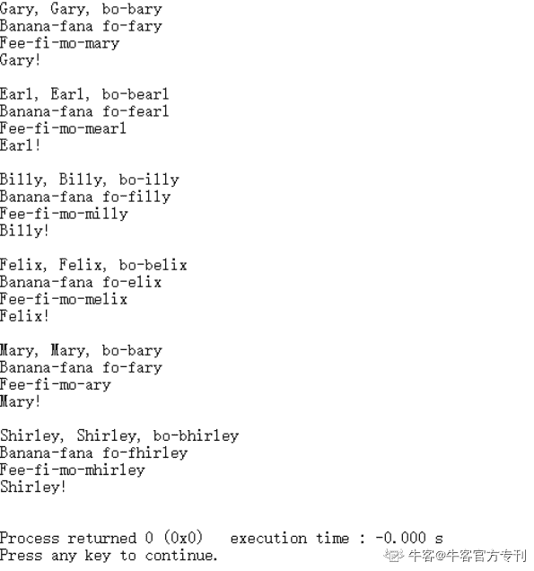
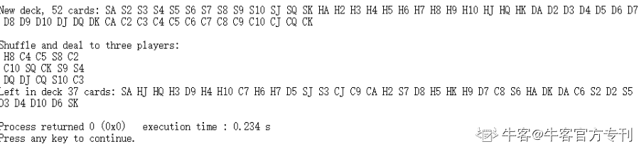

# 第五章 第 1 节 C 语言项目实战

> 原文：[`www.nowcoder.com/tutorial/10031/a849b52e986f4995bdea3d6ac941f05a`](https://www.nowcoder.com/tutorial/10031/a849b52e986f4995bdea3d6ac941f05a)

## **一、比特币地址验证 **

**项目概况**

编写一个以比特币地址为参数的程序，并检查该地址是否有效。比特币地址使用 base58 编码，该 Base58 是用于比特币中使用的一种独特的编码方式，主要用于产生比特币的钱包地址。相比 Base64，Base58 不使用数字"0"，字母大写"O"，字母大写"I"，和字母小写"l"，以及"+"和"/"符号。

通过这种编码，比特币地址可编码 25 个字节：

1、第一个字节是版本号，此任务的版本号为零；

2、接下来的 20 个字节是一个 ripemd-160 摘要，但是对于这个任务，您不必知道：您可以将它们视为纯粹的任意数据；

3、最后四个字节是校验和检查。它们是前 21 个字节的双 sha-256 摘要的前四个字节。

要检查比特币地址，必须读取前 21 个字节，计算校验和，并检查它是否与最后 4 个字节对应。

程序可以返回布尔值，也可以在无效时引发异常。 

**项目源码**

```cpp
#include <stdio.h>
#include <string.h>
//用来加密的头文件
#include <openssl/sha.h>

//coin_err 表示最终结果
const char *coin_err;
//对 coin_err 进行赋值的函数
#define bail(s) { coin_err = s; return 0; }
//对字符串 base58 编码
int unbase58(const char *s, unsigned char *out){
//定义一个常量字符串，包含所有的合法字符	
static const char *tmpl = "123456789"		"ABCDEFGHJKLMNPQRSTUVWXYZ"	
"abcdefghijkmnopqrstuvwxyz";
//定义循环变量	
int i,j, c;	
//用来记录匹配字符串的地址	
const char *p;	
//对输出字符串 out 进行初始化	
memset(out, 0, 25);	
//对原始字符串进行遍历	
for (i = 0; s[i]; i++) {
//查找给定字符的第一次匹配的地方		
if (!(p = strchr(tmpl, s[i]))) 
//如果没有合法字符，代表是一个 bad 地址			
bail("bad char"); 
//c 表示在进制转换时的进位		
c = p - tmpl;		
//用来处理表示 58 进制结果的 out 字符串，编码 25 个字节		
for (j = 25; j--; )  
//采用 58 进制			
c += 58 * out[j];			
//256 进制的计算过程			
out[j] = c % 256;			
c /= 256;		
} 
//地址太长，所以编码失败，返回 0		
if (c) bail("address too long");	
}	

return 1;
}
//判断是否为 58 进制编码
int valid(const char *s) {    
//dec 表示经过 58 进制编码后的字符串	
unsigned char dec[32], d1[SHA256_DIGEST_LENGTH], d2[SHA256_DIGEST_LENGTH];   
//表示的状态：是否为有效地址	
coin_err = "";	
//如果不符合 58 进制，直接返回 0	
if (!unbase58(s, dec)) return 0;	
//双哈希，采用两次
SHA256 加密哈希算法	SHA256(SHA256(dec, 21, d1), SHA256_DIGEST_LENGTH, d2);	
//比较 dec 从第 21 个字符开始后的与 d2 的前四个字符
if (memcmp(dec + 21, d2, 4)) 
//如果不相等就是属于不合法的		
bail("bad digest");    
//正常返回，即是该地址有效	
return 1;
}
int main (void) { 
//给定需要判断的字符串地址	
const char *s[] = {		
"1Q1pE5vPGEEMqRcVRMbtBK842Y6Pzo6nK9",
"1AGNa15ZQXAZUgFiqJ2i7Z2DPU2J6hW62i",
"1Q1pE5vPGEEMqRcVRMbtBK842Y6Pzo6nJ9",		                   	   
"1AGNa15ZQXAZUgFiqJ2i7Z2DPU2J6hW62I",		
0 };
//循环变量	
int i;	
//对每个字符串进行判断	
for (i = 0; s[i]; i++) { 
//计算该地址是否有效		
int status = valid(s[i]); 
//输出结果		
printf("%s: %s\n", s[i], status ? "Ok" : coin_err);	
}	

return 0;
}
```

**运行结果**


****查看完整项目****[`git.nowcoder.com/999991353/Bitcoin_address_validation?from=Ccz`](https://git.nowcoder.com/999991353/Bitcoin_address_validation?from=Ccz)

## 二、生成随机国际象棋

**项目概况**

这项任务的目的是以 FEN 格式生成一个随机的棋盘。位置不一定要符合现实情况，甚至不一定符合平衡性，但必须遵守以下规则：

1、每种颜色只有一个国王（一个黑国王和一个白国王）；

2、两个国王不能被安排在相邻的格子上；

3、升变方格上不能有兵（第八条横线上没有白色兵，第一条横线上没有黑色兵）；

4、包括国王在内，每种颜色最多可放置 32 个。双方之间没有数量平衡的要求；挑选棋子不必遵守常规的国际象棋规则：可以有五个马，二十个车……只要总个数不超过三十二。

5、现在轮到白色棋子的回合，假定双方都失去了易位，不能使用吃过路兵（En passant）的移动方式（因此，FEN 应以 w--01 结束）

最终显示如下所示：

（注：由于是随机值，所以每次运行结果可能不一样）

**项目源码**

```cpp
#include <stdio.h>
#include <math.h>
#include <string.h>
#include <stdlib.h>
#include <time.h>
//进行宏定义，即 TRUE 表示 1
#define TRUE 1
#define FALSE 0
//类型装换由于 C 语言中没有 bool 类型，所以用 int 代替
typedef int bool;
//生成的棋盘格子
char grid[8][8];

//生成 King 的坐标
void placeKings() {
int r1, r2, c1, c2;
//死循环的
for (;;) {
//随机生成两个坐标，因为是 8*8 的方格所以横纵坐标都对 8 取模
//第一个 king 的坐标
r1 = rand() % 8;
c1 = rand() % 8;
//第二个 king 的坐标
r2 = rand() % 8;
c2 = rand() % 8;
if (r1 != r2 && abs(r1 - r2) > 1 && abs(c1 - c2) > 1) {
//如果符合条件那么赋予两个 King，为了区分开，一个大写 K，一个小写 k
grid[r1][c1] = 'K'; 
grid[r2][c2] = 'k';
//直接 return，函数结束
return;
}
}
}

//随机生成位置棋子
void placePieces(const char *pieces, bool isPawn) {
int n, r, c;
int numToPlace = rand() % strlen(pieces);
//循环刚才取得的随机数次
for (n = 0; n < numToPlace; ++n) {
//随机生成一个坐标，对 8 取模
do {
r = rand() % 8;
c = rand() % 8;
}
//如果当前位置上没有棋子为空且升变方格上不能是兵
while (grid[r][c] != 0 || (isPawn && (r == 7 || r == 0)));
//做给定(r,c)坐标位置上的棋子
grid[r][c] = pieces[n];
}
}
//转化为 FEN 格式
void toFen() {
char fen[80], ch;
/**
(r,c)表示棋盘坐标
countEmpty：空格子的个数
index：fen 格式串的下标索引
**/
int r, c, countEmpty = 0, index = 0;
//8*8 的棋盘
for (r = 0; r < 8; ++r) {
for (c = 0; c < 8; ++c) {
//取得当前坐标的棋子
ch = grid[r][c];
//如果 ch 是 0 的话，说明是空格子，打印.
printf("%2c ", ch == 0 ? '.' : ch);
//如果 ch 是空格子，那么 countEmpty 计数+1
if (ch == 0) {
countEmpty++; 
}
else {
if (countEmpty > 0) {
//fen 字符串的当前位置 置为 0，因为 0 的 ascii 码是 48
fen[index++] = countEmpty + 48;
//然后重新将 countEmpty 置为 0
countEmpty = 0;
}
//将 ch 赋值为 fen 的当前字符
fen[index++] = ch;
}
}
//在每一行结束在处理一遍，跟上面代码相同
if (countEmpty > 0) {
fen[index++] = countEmpty + 48;
countEmpty = 0;
}
//fen 字符串设置为"/"进行分隔
fen[index++]= '/';
//输出换行
printf("\n");
}
//要求最后以 w - - 0 1 结尾，所以直接进行赋值
strcpy(fen + index, " w - - 0 1");
//打印 fen 格式串
printf("%s\n", fen);
}
//FEN 格式
char *createFen() {
placeKings();
//给定几个随机的串
placePieces("PPPPPPPP", TRUE);
placePieces("pppppppp", TRUE);
placePieces("RNBQBNR", FALSE);
placePieces("rnbqbnr", FALSE);
//转化为 FEN 格式串
toFen();
}

int main( ) {
//初始化随机种子
rand(time(NULL));
//创建 FEN 格式的国旗象棋
createFen();
return 0;
}
```

**运行结果**



**查看完整项目**

[`git.nowcoder.com/999991353/Generate_random_chess_position?from=Ccz`](https://git.nowcoder.com/999991353/Generate_random_chess_position?from=Ccz)

## **三、绘制球体**

**项目概况**

根据 ASCII 字符画出一个球体

如下图所示：


**项目源码**

 ```cpp
#include <stdio.h>
#include <stdlib.h>
#include <string.h>
#include <ctype.h>
#include <math.h>

//用来表示输出球体的字符串
const char *shades = ".:!*oe&#%@";

double light[3] = { 30, 30, -50 };
//3 维向量标准化
void normalize(double * v)
{
//获取 3 维向量长度
double len = sqrt(v[0]*v[0] + v[1]*v[1] + v[2]*v[2]);
//标准化
v[0] /= len; v[1] /= len; v[2] /= len;
}

//计算点积
double dot(double *x, double *y)
{
//获取当前向量的模长
double d = x[0]*y[0] + x[1]*y[1] + x[2]*y[2];
//如果点积是负的，转化为正数
return d < 0 ? -d : 0;
}

//绘制球面
void draw_sphere(double R, double k, double ambient)
{
//两个循环变量 i, j 和一个球体表面强度
int i, j, intensity;
double b;
//定义一个三维变量 vec 和 横纵坐标
double vec[3], x, y;
//以 i 为横坐标，进行循环
for (i = floor(-R); i <= ceil(R); i++) {
//x 坐标的表示
x = i + .5;
//以 j 为纵坐标，进行循环，
for (j = floor(-2 * R); j <= ceil(2 * R); j++) {
//y 的坐标表示，因为是以(-2R,2R)区间，所以要除以 2
y = j / 2. + .5;
//如果在满足下列条件，就给 vec 向量赋值
if (x * x + y * y <= R * R) {
//vec 向量横纵坐标为(x,y)
vec[0] = x;
vec[1] = y;
//保证 z 坐标在球上
vec[2] = sqrt(R * R - x * x - y * y);
//对 vec 向量进行初始化
normalize(vec);
//计算点积的 k 次方
b = pow(dot(light, vec), k) + ambient;
//计算球体表面强度
intensity = (1 - b) * (sizeof(shades) - 1);
//如果 intensity<0，将其赋为 0
if (intensity < 0) intensity = 0;
//如果 intensity 超过长度-1 的时候，将其赋值为倒数第二个字符
if (intensity >= sizeof(shades) - 1)
intensity = sizeof(shades) - 2;
//打印输出的单字符
putchar(shades[intensity]);
} else
putchar(' ');
}
//换行
putchar('\n');
}
}

int main( )
{
//正则化 light 向量
normalize(light);
//分别以不同的 半径和 k，画一个球
draw_sphere(20, 4, .1);
draw_sphere(10, 2, .4);
return 0;
}
```

**查看完整项目**

[`git.nowcoder.com/999991353/Draw_a_sphere?from=Ccz`](https://git.nowcoder.com/999991353/Draw_a_sphere?from=Ccz)

## **四、名字游戏**

**项目概况**

编写一个程序，输入一个名字，并输出像 Shirley Ellis 歌曲“The Name Game”这样的歌词。

如果名字中的首字母，不是元音字母(A, E, I, O, U), 'B', 'F' 或者 'M'，可以不需要注意特殊规则，要以下面这样的格式输出：

(X), (X), bo-b(Y)

Banana-fana fo-f(Y)

Fee-fi-mo-m(Y)

(X)!

其中 X 表示的是输入的名字，Y 表示名字去掉第一个首字母之后的字符串。

如果首字母是除了上面所列的特殊字符之外的，那么就是下面这样的歌词：

Gary, Gary, bo-bary

Banana-fana fo-fary

Fee-fi-mo-mary

Gary!

如果首字母是元音字母的话，就不会截断这个名字，像下面这样：

Earl, Earl, bo-bearl

Banana-fana fo-fearl

Fee-fi-mo-mearl

Earl!如果是'B', 'F' 或者'M'作为首字母的话，将会截断对应以相应字母作为首字母名字，例如：

Billy, Billy, bo-illy

Banana-fana fo-filly

Fee-fi-mo-milly

Billy!

如下图所示：



**项目源码**

```cpp
#include <stdio.h>
#include <string.h>

//输出对应名字之后的歌词
void print_verse(const char *name) {
//定义两个字符串 x,y 用来保存 name 的
char *x, *y;
//b,f,m 判断是否为特殊字符 i 用来作为循环的变量
int b = 1, f = 1, m = 1, i = 1;
//将 name 字符串拷贝到 x,类似赋值
x = strdup(name);
//将首字母变为大写字母
x[0] = toupper(x[0]);
//除首字母之后剩余的字符串全部变为小写字母
for (; x[i]; ++i) x[i] = tolower(x[i]);
//判断首字母是否为元音字母
if (strchr("AEIOU", x[0])) {
//将 y 赋值为 x
y = strdup(x);
//将首字母变为小写字母
y[0] = tolower(y[0]);
}
//如果首字母不是元音字母,y 表示从 1 之后的字符串,方便输出
else {
y = x + 1;
}
//判断首字母是否为 b,f,m 的特殊字符
switch(x[0]) {
case 'B': b = 0; break;
case 'F': f = 0; break;
case 'M': m = 0; break;
default : break;
}
//按照给定的格式进行输出
//判断是否为特殊字符
printf("%s, %s, bo-%s%s\n", x, x, (b) ? "b" : "", y);
printf("Banana-fana fo-%s%s\n", (f) ? "f" : "", y);
printf("Fee-fi-mo-%s%s\n", (m) ? "m" : "", y);
//最后一行
printf("%s!\n\n", x);
}

int main( ) {
//循环变量
int i;
//输入的名字
const char *names[6] = {"gARY", "Earl", "Billy", "Felix", "Mary", "sHIRley"};
//将每个名字得到的歌词进行输出
for (i = 0; i < 6; ++i) print_verse(names[i]);
return 0;
}
```

**查看完整项目**

[`git.nowcoder.com/999991353/The_Name_Game?from=Ccz`](https://git.nowcoder.com/999991353/The_Name_Game?from=Ccz) 

## **五、纸牌**

**项目概况**

创建一个数据结构和相关的函数来定义和操作一组扑克牌，这副牌应该有 52 张独特的牌。

这些函数包括以下几种：

1、创建一副新的扑克牌

2、随机洗牌

3、从一副扑克牌中发牌

4、输出当前这幅扑克牌的内容

如下图所示：



**项目源码**

```cpp
#include <stdio.h>
#include <stdlib.h>

//表示扑克牌四种花色，黑桃(Spade)、红桃(Heart)、方块(Diamond)、梅花(Club)
const char *s_suits_ascii[] = { "S", "H", "D", "C" };
/**
扑克牌中的数字
WHAT 表示数字为 0 时,如果大于>13 的话,表示溢出(overflow)
**/
const char *s_nums[] = { "WHAT",
"A", "2", "3", "4", "5", "6", "7", "8", "9", "10", "J", "Q", "K",
"OVERFLOW"
};
/**
定义一个扑克牌结构体
suit：花色
number:扑克牌的数字
_s:随机值
**/
typedef struct { int suit, number, _s; } card_t, *card;
/**
定义一副扑克牌的结构体
n:表示一副扑克牌的数量
cards:上面的定义的每张扑克牌的结构体类型
**/
typedef struct { int n; card_t cards[52]; } deck_t, *deck;
//显示扑克牌的花色和数字
void show_card(card c)
{
//直接打印即可
printf(" %s%s", s_suits_ascii[c->suit], s_nums[c->number]);
}
//创建一副扑克牌实例
deck new_deck()
{
//定义三个循环变量
int i, j, k;
//创建一个 deck 的实例对象指针，并申请空间
deck d = malloc(sizeof(deck_t));
//给成员变量赋值,一副牌有 52 张(不包括大小王)
d->n = 52;
//i:花色 j:数字 k:扑克牌的数量
for (i = k = 0; i < 4; i++)
for (j = 1; j <= 13; j++, k++) {
//分别给扑克牌的花色和数字进行赋值
d->cards[k].suit = i;
d->cards[k].number = j;
}
//返回一个 deck 结构体指针
return d;
}
//显示一副扑克牌(包括花色和数字)
void show_deck(deck d)
{
//定义循环变量 i
int i;
//打印 d 这幅扑克牌的数量
printf("%d cards:", d->n);
//循环 52 次
for (i = 0; i < d->n; i++)
//对于每张扑克牌,打印其花色和数字
show_card(d->cards + i);
//输出换行
printf("\n");
}
//对纸牌进行排序,给定一个排序的规则
int cmp_card(const void *a, const void *b)
{
//x,y 取得卡片 a 和 b 的随机值
int x = ((card)a)->_s, y = ((card)b)->_s;
//对随机值进行排序
return x < y ? -1 : x > y;
}
//从 d 这幅扑克牌中发牌
card deal_card(deck d)
{
//如果没有牌了,直接返回 0
if (!d->n) return 0;
//否则返回当前的 cards,并且 d 这副牌中数量减 1
return d->cards + --d->n;
}
//对 d 这幅扑克牌进行随机洗牌
void shuffle_deck(deck d)
{
int i;
//对于 d 这副牌中的每个卡片,给其成员变量 _s 赋一个随机值
for (i = 0; i < d->n; i++)
d->cards[i]._s = rand();
//对 d 进行排序
qsort(d->cards, d->n, sizeof(card_t), cmp_card);
}

int main( )
{
//循环变量 i,j 
int i, j;
//创建一副扑克牌实例
deck d = new_deck();
printf("New deck, ");
//打印当前的扑克牌
show_deck(d);
printf("\nShuffle and deal to three players:\n");
//进行随机洗牌
shuffle_deck(d);
//三个玩家,每个玩家发 5 张牌
for (i = 0; i < 3; i++) {
for (j = 0; j < 5; j++)
//输出发到玩家手中的牌
show_card(deal_card(d));
//输出换行
printf("\n");
}
//输出剩余的牌
printf("Left in deck "); show_deck(d);
return 0;
}
```

**查看完整项目**

[`git.nowcoder.com/999991353/Playing_cards?from=Ccz`](https://git.nowcoder.com/999991353/Playing_cards?from=Ccz)

**查看更多精选项目：**

**（路径：牛客主页-资源导航-项目）**

[`www.nowcoder.com/project/recommend?from=Ccz`](https://www.nowcoder.com/project/recommend?from=Ccz)

