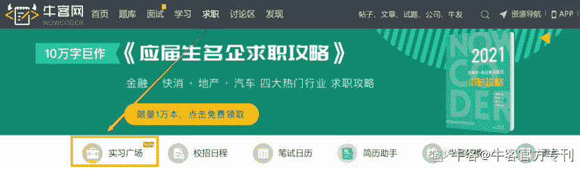
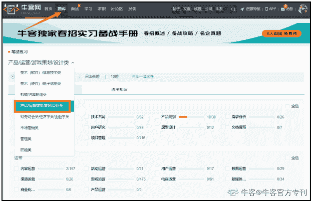
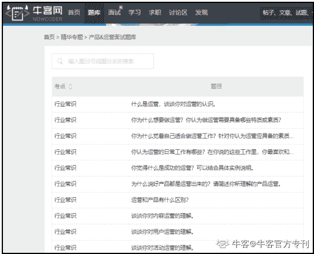
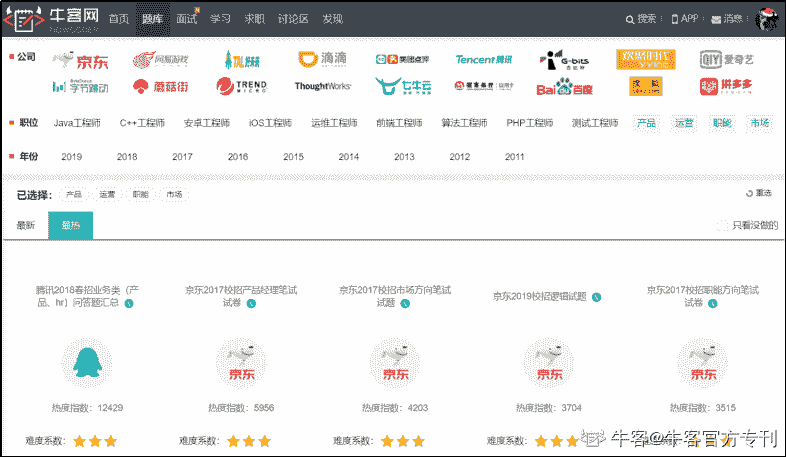
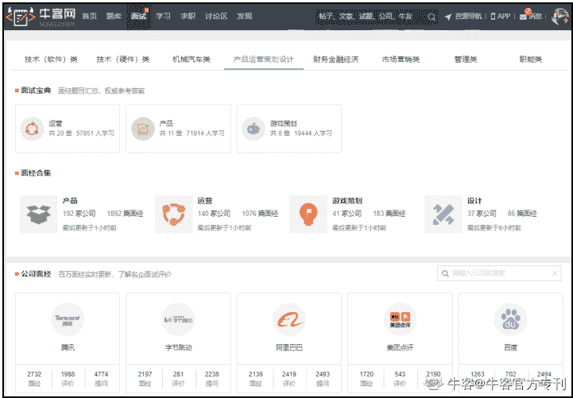
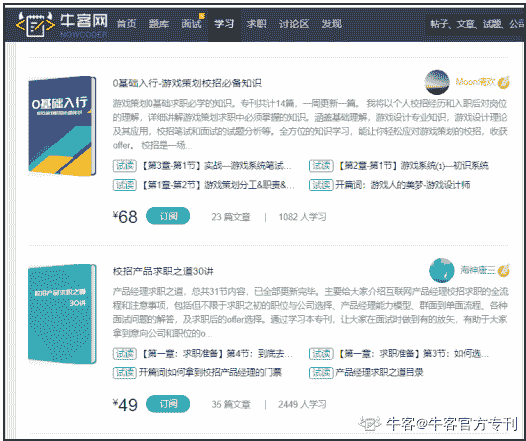
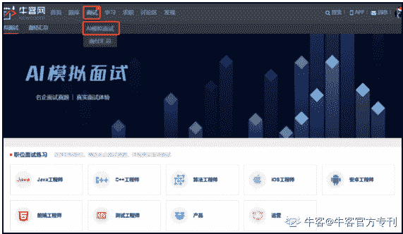
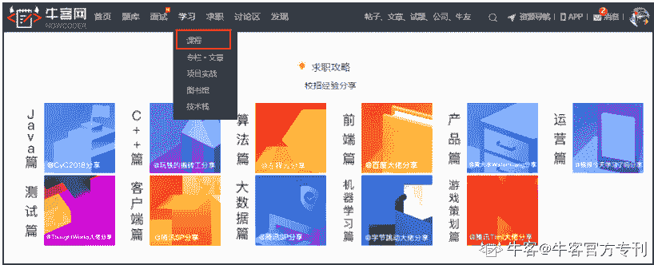

# 第二章 第 1 节 校招介绍

> 原文：[`www.nowcoder.com/tutorial/10027/cc9cdd0873e54096a3cf8ed8a977217d`](https://www.nowcoder.com/tutorial/10027/cc9cdd0873e54096a3cf8ed8a977217d)

#  校招介绍

**校招**，即**校园招聘**，是企业面向应届生专门举办的招聘，一年举办两次，即秋招和春招。秋招，秋季校园招聘，是**面向应届生的最大****规模****的校园招聘**，一般在每年的秋季举办（8 月-10 月），但近年来，秋招开始的时间越来越早，最早 6 月末 7 月初就有公司开始招聘了；春招，即春季校园招聘，时间一般在每年的春节之后（3 月-5 月），春招是秋招的补充，规模相较于秋招会小很多，而且招聘节奏快，招满就会关闭通道。

有些同学的观念是：找工作是毕业前的事情，大四下学期才开始找。结果导致春招的时候才行动。这个想法是错误的，秋招是最大规模的校园招聘，机会和选择都更多，到了春招，招聘岗位会变少，每个岗位的招聘人数也会很有限，甚至有的公司并没有春招。因此，请大四的同学们一定要抓住秋招机会。

今年因为疫情原因，大部分企业会选择将整个流程转到线上，像往年的线下招聘渠道，例如校园宣讲会，线下双选会都会改为线上进行，招聘节奏会变快，整个招聘流程时间会缩短，所以 21 届毕业生从 7 月初就要开始密切关注线上的招聘信息，进行网申或者内推，千万不要想着等企业到学校进行宣讲，才开始投递简历。

## 秋招时间

7 月-8 月：内推&校招提前批

9 月：正式校招

##  秋招面向对象

秋招是面向应届生的招聘，今年的秋招是面向 2021 届毕业生的。

如果是留学生，由于国外的毕业时间跟国内存在差异，一般企业也允许 20 年毕业的留学生参与 21 届的校招的。

具体流程：**应聘>****>****公司****发正式 offer****>****>****学生****接 offer>>****签订实习合同，到公司实习（有的公司不需要）****>>****毕业领毕业证>****>****正式入职、签订劳动合同**。

## 秋招信息渠道

*   **公司官网+官方招聘公众号**

正常的校园招聘信息获取途径最快捷最准确的是公司官网或官微，但是是招聘的公司这么多，一个个翻找会浪费很多时间和精力，而且还容易遗漏或者错过简历投递时间。**这时候，认准牛客网就可以了**。可通过牛客校招指南，一键直达各个公司官网：牛客网>求职>校招日程汇总（地址： [`www.nowcoder.com/school/schedule?from=CZ2021`](https://www.nowcoder.com/school/schedule?from=CZ2021)）

*   **牛客网**

**实习广场**：企业最新招聘信息，由用人部门/企业 HR 直接发布，信息真实可靠，简历处理效率快，岗位齐全，随时可以找到职位发布者直接联系。  

**网站地址****:****牛客网>求职>实习广场****：**

[`www.nowcoder.com/job/center?from=CZ2021`](https://www.nowcoder.com/job/center?from=CZ2021)

**移动端地址****:****牛客 APP>求职 **

**企业校招日程汇总**: 一站获得所有公司最近招聘动态，不再遗漏任何一家心仪公司的简历投递时间。 

**网站地址：牛客网>求职>校招日程**

[`www.nowcoder.com/school/schedule?from=CZ2021`](https://www.nowcoder.com/school/schedule?from=CZ2021)

**移动端地址：牛客 APP>求职>****求职工具>校招日程** 

小程序地址：扫描上方二维码即可观看，小程序订阅企业校招进度，第一时间获取最新校招信息。

**讨论区：**数百万已拿到 offer 的老牛友以及 HR 发布各企业各岗位地内推消息，消息来源真实可靠，助力大家快人一步拿到 offer。

**网站地址：牛客网>讨论区>招聘信息**

[ https://www.nowcoder.com/discuss/referral/index?from=CZ2021](https://www.nowcoder.com/discuss/referral/index?from=CZ2021)

小程序地址：扫描下方二维码即可观看

**公众号**：

牛客网：牛客网公众号新增岗位订阅功能，关注“牛客网”公众号 - 点击菜单“资源汇总”-“实习职位订阅” 就能每天收到新职位的推送啦。

招聘日程汇总：每日推送校招/内推资讯以及面经干货。

牛客招聘助手：绑定手机号，可及时查询自己的笔试面试进度和信息。

牛客求职：每天推送互联网/金融/房地产/快消/机械 5 大行业校招实习信息。

                        牛客网                          招聘日程汇总                   牛客招聘助手                       牛客求职

**求职内推群**：为了帮助正在进行春招的同学牛客网建立了校招资源群。

群资源如下：

*   海量春招、实习内推资源
*   企业历年招聘真题汇总
*   精选笔经面经
*   专业导师在线指导        

                             

**牛客资料大全**：互联网求职简历制作、优质面经、名企校招笔试、面试真题等资料大汇总。

小程序地址：扫描下方二维码即可领取

**O****ffer 神器**：基于牛客网真实 Offer 大数据的预测神器。根据求职意向，帮大家发现未来可能拿到的 Offer，分析手头 Offer 的竞争力，了解校招薪资情况，为大家地 Offer 选择提供参考。

网站地址：牛客网>发现>offer 神器

[`www.nowcoder.com/show-offer/index?from=CZ2021`](https://www.nowcoder.com/show-offer/index?from=CZ2021)

移动端地址：牛客 APP>求职>求职工具>offer 神器

 通过以上方式，大家能更快获取招聘信息，避免浪费大量时间在查找信息上。事半功倍，将时间运用到更重要的事情——准备秋招。

# 非技术岗考前须知 

现在，越来越多的互联网公司的非技术岗位笔试也开始在牛客网进行，如产品、运营、市场、游戏策划、设计等岗位。对于非技术岗位的同学，很多都没有使用线上笔试系统答题的经验，很容易因为操作不熟练影响答题。不过不用担心，现在牛妹就帮你普及一些使用技巧。

下面详细讲述在线笔试的**完整流程以及注意事项****。**

##  在线考试系统使用说明

下面详细讲述在线笔试的**完整流程以及注意事项**

**第一步****：投递简历**

注意：邮箱和手机号等信息一定检查仔细，因为后续通知全是通过邮件和短信提醒。

**第二步****：笔试通知邮件和短信**

注意：如果收到短信没有收到邮件，可能是你邮箱填错或者邮箱设置了拒收等原因，可以通过关注公众号：**牛客招聘助手> 绑定收到短信的手机号 > 查询我的笔试。**

**第三步****：****检查考试设备**

1、请使用**谷歌 Chrome、火狐浏览器**访问笔试网址。

如遇到页面加载不出来、摄像头不好使等情况，**优先采取措施：换另一个浏览器试一下。**

**浏览器下载地址：**[`www.nowcoder.com/discuss/3793?from=CZ2021`](https://www.nowcoder.com/discuss/3793?from=CZ2021)

2、确保电脑带有摄像头，并确保摄像头能够正常使用。

摄像头检测：[`www.nowcoder.com/cts/3942933/summary#0?from=CZ2021`](https://blog.nowcoder.net/detail/277bcf8462d44c328deb33c37d902517#0?from=CZ2021)

（1）**摄像头黑屏、无法拍照等情况：**优先采取措施：换另一个浏览器。其次检查浏览器有没有 adblock adguard 等这种广告屏蔽插件，关闭后重试

（2）**更换为前置摄像头：**请点击地址栏右侧的设置>高级>隐私设置和安全性>内容设置>摄像头，进行调试即可

3、考试前**请关闭其他浏览器窗口，关闭 QQ、微信、Skype 等即时通信软件，关闭屏保，关闭 Outlook 等有弹窗提示消息的软件，**否则会被记录离开网页。

4、确保网络连接畅通，网速应在 100KB/S 以上，**建议使用手机 4G 热点连接网络。**

5、考试时允许使用草稿纸，请**提前准备纸笔**。考试过程中允许上厕所等短暂离开，但请控制离开时间。

**第四步****：****笔试做题流程**

1、试卷中会有一种以上个题型，进入考试后**请仔细查看共有几个题型。**

2、可选择任意题型进入做题，**所有题型一旦提交后将无法返回修改。**

3、**可通过试卷页面底部答案卡进行同一题型试题切换**，但一旦进入某一类题型，提交后方可进入下一题型。

4、如**遇突发情况**，如断网、电脑死机、断电等，请直接刷新页面，或**关闭浏览器后重新通过考试地址进入**。题目会自动保存，所以不用担心。

5、考试环境体验：[`www.nowcoder.com/cts/3942933/summary#?from=CZ2021`](https://blog.nowcoder.net/detail/277bcf8462d44c328deb33c37d902517#?from=CZ2021)

##  考前复习资源总结

### 1、简历攻略

相信大家对简历准备都有一些困惑，不知道该写什么不该写什么，怎么写才能更受企业青睐，下面帮大家来总结一下。

完整的简历需包括：**基本信息****+实习经历+项目经历+校园****（社团）****经历+掌握技能**。

*   **基本信息**

**个人信息：姓名+手机号+邮箱地址** 

该部分需在简历中显著的标识出来，HR 每天要看很多很多简历，需要一眼可以看见你的联系方式。关于简历照片，建议大家放一张干净大方精神的证件照片，不要随便放一张自己的生活照或者过分美颜的照片，正式大方的照片可以增 HR 对你简历的印象。

**学校学历：你的毕业院校****+你的学历**

如果是本科生，写本科院校，如果是研究生，需写上你的本科毕业院校+研究生毕业院校。这部分很重要，有些公司部分岗位会对学校学历有额外要求。

相信这时候一部分同学会说：“我的毕业院校不够好，怎么办？”说实话，学校对找工作肯定有着或多或少的影响。但这也并不是能对你一锤定音的指标，在毕业院校不是特别好的情况下，请一定在简历上充分表现你的实习经历+项目经历！这一点在接下来介绍实习经历&项目经历的时候，会再给大家详细介绍！ 

*   **实习经历**

实习经历是简历中的重中之重！如果你有大厂实习经历，绝对是校招时扣响名企大门的一块最有力的敲门砖。

因为大厂的实习经历代表着你曾被大厂认可过，且具有相应的技能和一定的工作经验，用人单位会很欢迎这样的学生！有实习经历后，要怎么通过简历表现出来也是一门学问，以下有几点大家需要注意：

**（1）实习经历不是写得越多越好**

把与你要应聘的职位匹配度高且含金量高的实习经历写上去即可，避免堆积简历，例如在奶茶店打过暑期工的这些经历不需要往上写；又例如你要应聘的是产品经理，但实习经历写的是某公司销售，这样非但没有展现出你的优势，还会让面试官更加慎重地考虑你是否适合产品经理这个岗位。

**（2）无需交代细枝末节的工作任务**

之所以实习经历重要，是因为面试官希望通过实习经历，了解你的专业能力、工作能力，以便他们更好地评估你是否适合他们公司。因此在描述实习经时，只需要把你主要负责的、能够体现你专业能力的工作清晰地描述出来即可，表达逻辑可以遵循“依据重点概括+STAR 法则”。 

**（3）分点描述工作内容，切勿流水账**

有的同学在写简历的时候，会有一个毛病，就是容易写成流水账，长篇大论，字数非常多，且不会分段。试想一下，如果你是面试官，看到简历上密密麻麻的字，找不到重点，你还会有心情认真去看这份简历吗？所以，建议大家养成分点描述的好习惯，将自己要表达的内容好好梳理，分 1、2、3 点进行简单明了的描述，提高简历的可读性。

*   **项目（****校园****）****经历**

对于产品或运营等非技术岗的同学来说，有过实习的同学请把你的实习经历仔细梳理，展现在简历中。

如果没有实习经历，请好好包装一下自己的校园经历，比如自己曾在社团/学生会做过一些什么活动，自己担任什么角色、负责什么内容等等，尽量写与应聘行业、岗位相关的一些校园经历，主要是体现一下自己的学习能力和合作/组织能力等；同样地，描述过程尽量做到数据化、专业化及流程化。最后，在这一部分可以列举一些你获得的奖学金。

**加分项：比赛获奖经历。**

如果你曾经参加过**大创（大学生创业竞赛）**或者**其他一些比赛**，有过一些项目经验（例如和同学合作过 app，即使只是雏形），请好好包装这些项目，并梳理其中的关键步骤等，这将是你在面试中能够与面试官好好探讨的重要内容！又或者自身有写过竞品分析报告、用户体验报告之类的作品，也可以通过附件的形式上传到公司的简历投递官网，优秀的作品可以为你的简历增色。

*   **掌握技能**

应聘哪个岗位，一定要具备其相关技能。你可以通过简历告诉面试官你都掌握了哪些相关的技术。注意“了解”、“基本掌握”、“熟练掌握”和“精通”的区别，注意词汇上的应用。防止过于夸大而适得其反，毕竟面试的时候，面试官跟你交流的谈资就是你的简历，简历上写的所有内容，都有可能会被问到。 

*   **其他注意事项**

#### （1）简历排版整齐有序、主次突出（该加粗的字体加粗），没有过多细节问题

· 英文部分注意大小写，比如 O2O 而非 020 

· 中文始终保持一种字体，英文始终保持一种字体

·简历模板简单不花哨，慎用图标、进度条等附加元素

· 简历字体不要使用过多的颜色，1-3 种即可

· 简历内容安排合理，描述调理清晰，分点论述，标点符号使用正确

· 谨慎使用了解、熟悉、精通等词汇

#### (2)去除和目标职位无效的内容

比如个人兴趣爱好、自我评价、年龄、生日、住址等这些无关的信息

#### (3)尽量压缩简历到一页

如果超过一页，可以根据各个模块的重要性优先级进行删减，各模块重要性优先级如下：实习经历>完整项目经历>比赛获奖>学校内获奖>社团工作>班长支书>自我评价>兴趣爱好。

#### (4)不断通过修改简历去匹配不同企业的不同岗位

简历的制作过程并不是一蹴而就的，因为每个公司、每个职位的招聘要求都有所不同，每次投递简历前，都要通过修改简历去更好地匹配不同企业的不同职位，这样才能增大简历通过的概率。面试后也要针对简历不足的地方进行修改。

#### (5)不要造假

简历制作切记：可以美化，但是不可以撒谎！有些同学实习周期 1 个月，洋洋洒洒写了一大段产品功能，让人觉得根本不是你做的项目。

#### (6)使用 PDF 投递简历，不要使用 word

避免出现 word 文档打开乱码，或者格式错乱的情况，绝大部分公司秋招只允许投递一次，机会珍贵。不要因为自己的一时大意或者偷懒，错失了机会。

### 2、笔试备考

每个公司的笔试都是不同的，大部分会根据公司实际业务设计考题，一般试卷组合形式：**客观题+主观题**。客观题有的全部是行测，有的部分行测+部分岗位相关知识，有的全部是岗位相关知识。主观题是重点，下面部分会详细说明。

**①客观题备战**

互联网非技术岗的客观题一般有以下题型：行测、行业资讯、岗位知识。对于这类型的题目，备战的方法就是**刷题**。

牛客网有专门针对客观题的**产品运营题库、游戏策划题库**和**行测题库**，大家可以好好地刷一下题库里的题目。

**位置：牛客网>题库>专项练习产品/运营/游戏策划/设计类**

**地址：**[`www.nowcoder.com/intelligentTest?from=CZ2021`](https://www.nowcoder.com/intelligentTest?from=CZ2021)

**移动端位置：牛客 app>求职题库>专项练习**

②主观题备战

本备战攻略将在下文详细剖析各大主观题题型，选择了最为经典的题目做案例。大家在看完所有题型解析后，就要开始实战刷题练习，才能真正检验是否掌握。

**题库位置：题库>****精选专题>****产品&运营面试题库**

**地址：**[`www.nowcoder.com/ta/review-product?from=CZ2021`](https://www.nowcoder.com/ta/review-product?from=CZ2021)

**移动端位置：****牛客 app****>****学习****>求职题库>查看全部>****产品&运营面试题库**

**③****真题模拟练习**

备战笔试，大家千万别忘了刷真题。通过刷真题，不但可以让自己提前模拟笔试，还可以从真题中了解到各个企业的考察重点，然后有针对性地查漏补缺。

牛客网上有大量的企业真题供大家练习！

**真题位置：****题库****>****公司真题>****选择公司、****职业方向**

**地址：**[`www.nowcoder.com/contestRoom?from=CZ2021`](https://www.nowcoder.com/contestRoom?from=CZ2021)

**移动端位置：牛客 app****>学习>公司真题**

### 3、面试备考

面试环节**一般采用形式：群面+单面**

*   **群面**

又称“无领导小组讨论”，是指 n 个面试官对 n 个学生，针对一个主题进行一个无领导小组讨论，考察大家在团队合作中能够担任什么样的角色，是否有团队合作能力等。

群面中体现出的角色：领导者（leader）、协调者、时间控制者、观点者、破冰者（第一个发言的人，可能会成为 leader）、总结者（一般会是 leader）。

考察：沟通能力，领导能力，组织能力，抗压能力等。

面试建议： 

（1）提前认识队员；这一点是在有条件的基础上，比如正好去面试的你们都认识，那么你们可以提前分工，而且认识的人往往心态上比较放松，而且也会敢于去表达自己的观点。

（2）不害怕，不打压；有的同学可能说我根本都不认识谁，也没有办法组队，而且那也是一种非常理想的状态，那么我们在讨论的时候就正常发表自己的观点就好，不要因为某个人比较强势就不敢否定或者因为某个人比较弱势就去压制，正常发言即可。

（3）认清自己的优势和弱势；找准自己的优势和弱势，在交流中发挥出自己的优势，比如自己适合领导组织，那么就申请当领导，但是很多同学会觉得当领导就比较容易通过，但是如果你没有组织好，有时候往往会起反作用，所以认清自己很关键。

 对于**群面谨记**：不要不说话，不要多说话，说该说的话，说话有亮点。

*   **单面**

单面是指学生通过去公司现场、临时办公点（如酒店、学校教室）或者通过线上面试的模式对学生进行面对面的面试考察，非技术单面普遍流程是：**leader 面—总监面—H****R****面**。考察：**专业能力，沟通能力，亲和度（性格分析等），综合能力**。

 面试建议： 

（1）准备好简历；现场面试往往不可控，有的公司可能会提前为你准备好你的简历，有的公司可能不会为你准备。当然，也可能出现为你准备了简历但是现场找不到的情况，所以，准备好自己的纸质版简历，比较稳妥的方式是准备两份到三份简历。

（2）准时到达；面试邀请往往会提前发到你的邮箱，手机或者电话通知等等，那么往往就要你提前估算好时间，提前十分钟或者二十分钟到指定地址，以备有特殊临时情况能够及时处理。

（3）保持一个良好的心态和礼仪；面试有可能当面出结果，也可能之后等结果。如果当场被拒，也要保持一个良好的心态和礼仪，比如进了一个房间，要先敲门，不卑不亢的进行面试。不卑不亢很关键，我们要做到礼仪相待，但是也没有必要过于谦卑，因为学生和面试官是同等的，面试就是一个互相选择的过程。

（4）面试是最能表现自己的环节，所以不要什么都不准备空着手去，要**准备一个作品**，最好和你要面试的公司有相关性。比如该公司某产品的竞品分析报告、某活动的总结报告分析等等。为你的面试大大地增加成功率，在面试者中脱颖而出。

 面试环节是所有招聘环节中至关重要的一项，考察也会更全面、更严格。而提高自己面试应对能力的方法就是：**看面经**。面经是学长学姐的亲身经历和总结，参考价值无需多说。

 为了帮助产品方向校招求职者更好地应对校招面试，牛客特别调研了近 5 年各大厂产品经理校招面试题目并提炼出**十大经典必考问题**，制成本篇**《牛客产品十问｜产品经理校招面试必备经典题》**希望能够为正在校招路上的你指点迷津。

（网址：[`www.nowcoder.com/discuss/377990?from=CZ2021`](https://www.nowcoder.com/discuss/377990?from=CZ2021)）

##### 

*   **面试法宝****1：****看面经**

牛客网上有非常多各行业、各岗位的面经，这些面经都是往届师兄师姐求职后的经验汇总，涵盖了很多实用性的干货，对准备校招的同学非常有帮助。我们强烈建议大家多研读面经。

**面经位置：面试>面经汇总****>****选择公司、****职业方向**

**地址：**[ https://www.nowcoder.com/interview/center?from=CZ2021](https://www.nowcoder.com/interview/center?from=CZ2021)

**移动端位置：牛客 app****>社区>讨论区>笔经面经**

**大家也可以关注“**面经大全**”和“**牛客论坛**”小程序，这里面有**上千篇高品质面经汇总**以及众多行内人士信息分享，助你了解心仪公司/岗位的面试真题，面试官套路各个击破。**

 **           

扫一扫，面经装进口袋             看一看，关注行内新态** 

*   **面试法宝 2****：看专栏**

为了让同学们能更系统地备战秋招，牛客邀请了各领域大佬分享求职攻略，帮助大家利用碎片化的时间系统化地进行复习，提高复习效率。

**专栏位置：学习>专栏·文章****>****专栏推荐**

**地址：**[`www.nowcoder.com/blog/blogCenter?from=CZ2021`](https://www.nowcoder.com/blog/blogCenter?from=CZ2021)

**移动端位置：牛客 app****>学习>牛客专刊**

**·****面试法宝 3****：** **模拟面试**

目前，越来越多的企业为了提高招聘效率，都会采用线上面试的模式，加上今年的特殊情况，绝大部分的公司都会选择将面试改为线上。

但很多同学**因为缺少面试经验**，在面试中表现得很紧张、胆怯，导致自身实力无从发挥，面试失败。因此建议大家在正式面试前进行模拟面试练习。

推荐大家通过牛客网的**AI 模拟面试系统**进行模拟面试练习**，**该系统利用名企面试真题进行全真模拟面试，可以帮助大家提前熟悉真实面试流程，**全面提升面试能力！**

**A****I****模拟面试位置：牛客网****>** **面试****> AI****模拟面试**

**链接**：[`www.nowcoder.com/interview/ai/index?from=CZ2021`](https://www.nowcoder.com/interview/ai/index?from=CZ2021)

如果看了上文的攻略还是对秋招没什么头绪的话也别慌，牛客网为大家准备了**产品/运营/游戏策划岗位的求职攻略**，从简历到笔试面试，层层细讲。

**求职攻略位置：牛客****网****>****学习****>****课程****>****求职攻略**

链接：[`www.nowcoder.com/courses?from=CZ2021`](https://www.nowcoder.com/courses?from=CZ2021)

**移动端位置：牛客 app****>学习>求职攻略**

感谢腾讯、京东、字节跳动、爱奇艺、网易互娱、哔哩哔哩、西山居、搜狐畅游、盛趣游戏、欢聚集团、BIGO、Shopee 等各大企业对于本次《2021 名企校招笔试真题精选》活动的大力支持。

感谢来自各大互联网名企的学长学姐提供的题目解析经验和求职备考经验。

下面将按不同岗位不同题型为大家一一举例讲解。