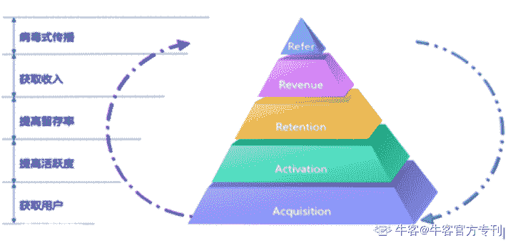

# 第四章 第 1 节 笔试简介与题型解析

> 原文：[`www.nowcoder.com/tutorial/10027/38be83a1aba8455e991eb817305db9f8`](https://www.nowcoder.com/tutorial/10027/38be83a1aba8455e991eb817305db9f8)

# 笔试简介与题型解析

运营岗位笔试题题型分为客观题和主观题，根据近几年的企业笔试真题，运营岗客观题和主观题题目类型大概有如下几类：

##  笔试介绍

### 1、客观题

数理逻辑：逻辑推理题，考察考生逻辑思维能力，主要来自于行测题。

行业资讯：互联网行业、产品运营相关讯息，考察考生是否关注行业热点。

岗位知识：考察对运营岗位工作内容和能力框架的了解程度，以及部分专业知识。

### 2、主观题

行业分析                岗位认知                名词解释

用户画像                竞品分析                运营策略

运营方案               产品冷启动              新媒体运营

用户运营                内容策划                文案撰写

营销推广                活动策划                线下活动

数据分析

 **而****不同****公司的产品岗所考的试卷题型组合也是不一样****。以往年的试卷为例（每年不固定，仅供参考）：**

·腾讯：行测题+运营策略+产品冷启动

·爱奇艺：行测题+岗位认知+营销推广+新媒体运营+运营方案

·网易互娱（数据方向）：数据分析

·京东：行测题+岗位认知+行业资讯+运营策略

·欢聚集团：营销推广+竞品分析

·BIGO：用户运营+竞品分析+活动策划

·百度：需求分析&用户调研+新媒体运营+内容策划

·搜狐-内容方向：文案撰写+竞品分析+营销推广+岗位认知

·搜狐-媒体方向：岗位认知+新闻资讯+文案撰写+内容策划

 **以及像游戏类公司，所考试的内容基本都是游戏方面的，例如：**

·搜狐畅游：游戏基础+岗位认知+数据分析+竞品分析

·哔哩哔哩：数据分析+行测+行业分析+竞品分析

·吉比特：用户运营+行业分析+竞品分析+用户画像+新媒体运营

以上题型中，行业分析，岗位认知，名词解释更多的来自于平时的知识积累，近几年的出现频率相对较少，在此不多赘述，考生可直接去牛客网>公司真题>职业方向：产品运营市场，进行原题练习。

下面，重点讲解后面几类题型。

 **备注：以下题型解析由来自各大互联网名企的学长学姐提供，仅供参考。**

## 题型解析

### 1、用户画像

#### ①题型介绍

用户画像，又称为人物角色（persona），是根据用户社会属性、生活习惯、消费行为等信息抽象而成的一个标签化的用户模型。用户画像分析作为运营人员的一项基本技能，经常在考试中出现。该题型不一定会以单独题目的形式出现，但经常会融入到其他题型中去。

#### ②解题思路

用户画像确定的一般步骤如下：

第一步，理解用户。合理有效的用户画像是建立在对目标用户充分理解基础之上的，一般建立用户画像之前需要先收集相关数据。

第二步，寻找关键变量。所谓关键变量是指导致目标用户对产品/服务的相关行为产生差异的核心因素。

第三步，聚类。关键变量是帮助用户聚类的核心维度，有了关键变量后则可以通过将每个维度上的“信息值”串联，得到用户画像的核心特征。

第四步，丰富人物形象。将聚类后的典型用户类型进行精细刻画，添加一些细节描述，让用户画像更有画面感。

 **考试中如果没有相关数据支持，只能靠考生个人的理解和推测了。**

#### ③案例分析

【案例】“索尼游戏机占领不了中国人的客厅”“电视慢慢式微”，客厅作为家里最复合的一个功能区域，分化出了不同的使用场景。无论是旧房改造、新屋装修还是未来客厅，请你假想一个或多个服务对象，设计一个或多个客厅方案。（欢聚集团校招运营真题）

【评分标准】

本题主要考察能否合理地界定用户群体（+5 分）

分析对应的需求及消费场景（+10 分）

围绕需求进行合理的产品设计且逻辑足够完善自洽（+15 分）

同时考察创造力（+5 分）和对科技前沿知识（+5 分）的了解

其他言之有理酌情给分。

###  2、竞品分析

#### ①题型介绍

竞品分析在运营工作中经常遇到，一般是对竞品在关键维度上进行横向比较，说明理由或者优缺点。在考试中，经常需要考生根据题目要求自行划分对比维度。

#### ②解题思路

产品中的竞品分析以横向比较产品功能为主。

运营中的竞品分析则不同，可以根据“AARRR 模型”来对竞品进行对比分析。具体需要根据题目要求，选择关键对比维度展开。

#### ③案例分析

**【案例】**请找出互联网两个同类产品，并分析他们各自的优势与劣势。

**【参考答案】**

拼多多：

优势：下沉市场用户基数可观

    主流用户群体的特征，与微信娱乐流量的契合

    以分享砍价、拼团等社交化电商玩法，充分利用了用户的碎片化时间

劣势：商家管理：包括商品管控、提供的服务等暂不完善

   客单价较低：主流用户群体特征，导致客单价较低

   入住品牌广度、深度不足，品类覆盖度不足

京东：

优势：京东自营，品质保障

    京东自营物流的速度，给予用户很高的用户体验

劣势：用户群体多以男性为主，用户增长天花板受限

    产品基因以及用户产品形象，影响其在社交化电商、内容电商上的发展速度

###  3、 运营策略

#### ①题型介绍

运营策略可大可小，既可以是面向整个产品生命周期的策略，也可以是阶段性的或者某个小项目的运营策略。不管面向的问题大小，该题型只要保证思路清晰，有理有据，切实提出一些有效或者有亮点的解决方案即可。

#### ②解题思路

运营策略题型可以参考如下思路解答：明确目标——分析问题——解决问题，提出解决方案。此外，还可以借助一些工具或者理论框架协助分析问题，例如 SWOT 分析、定位理论、波特五力模型、基本竞争战略理论等等。

#### ③案例分析

**【案例】**如果让你策划设计一个影片评论功能的运营策略，你会如何进行竞品分析呢？

**【参考答案】**

一、选定 3 个与本产品同类的其他产品为竞品进行分析；

二、先整体从战略层、范围层、结构层、框架层和表现层进行分析；

三、重点分析其他产品的影片评论功能；

四、接着分析评论功能的运营策略，并根据自身产品的属性，结合竞品优势进行本产品的运营策略的制定；

五、得出结论。

**具体运营策略如下：**

一般的评论模块，用户可点赞、回复、收藏、分享等，促进用户参与互动社交，用户可以写长评；有些评论模块，用户只有点赞、反对两类选项，用户无法写长评，有此需求的用户只能使用该 APP。导致两者不同的原因在于一个针对购票用户，一个针对电影爱好者，即目标用户群不同。这是由两者的产品定位及优势决定的，一个是电影类的 O2O 平台，一个是电影多年来积累的口碑及优质内容的沉淀，是电影爱好者选择它的关键因素。

 所以，最终的策略需要根据 APP 实际定位和目标用户群来设计。

###  4、 运营方案

#### ①题型介绍

运营方案题型一般会给定具体的活动或者项目，要求考生按照题目要求给出相应的运营方案，可能包括活动运营、产品推广、内容运营、用户运营等等。

#### ②解题思路

如果题目没有特别说明，运营方案可以参考“5W1H”来给出，即原因（何因 Why）、对象（何事 What）、地点（何地 Where）、时间（何时 When）、人员（何人 Who）、方法（何法 How）。

如果题目特别说明了方案涉及的方面，运营方案按照题目要求给出即可。

需要特别注意，运营方案一定要结合产品和用户特性。

####  ③案例分析

**【案例】**李佳琦被称为口红一哥，他通过直播和短视频带火的商品销售量不俗。

请从内容模式，商务合作，店铺运营，自媒体内容矩阵等方面描述，直播电商红人的运作模式。（欢聚集团校招运营真题）

**【评分标准】**

主要考查考生对热点内容的熟悉程度以及分析总结能力

内容模式：能提到商品描述，商品分析，价值分析，记忆点词汇，个人特色，趣味性，可看性等 3 点以上内容描述特色均可得分，考察答题者对内容的分析（5）

商务合作：可从自营品牌或外部品牌合作两方面作答（5）

店铺运营：可从自营品牌或外部品牌合作两方面作答（5）

内容矩阵：直播，短视频，微博，公众号等平台，分析 2 个以上不同平台内容特点即可得分（5）

###  5、产品冷启动

#### ①题型介绍

产品冷启动是指在产品诞生初期、用户资源缺少、渠道较窄的情况如何获取第一批用户。冷启动的考法一般是从零开始运营一个公众号/微博/知乎/APP，第一批种子用户如何获取。

需要注意的是，种子用户不仅是指第一批用户，它更强调“质”，种子用户要符合产品的定位，并且尽可能具有一定的影响力，即具有 KOL 属性。

#### ②解题思路

第一步：根据产品定位，确定目标种子用户画像。

第二步：根据种子用户画像，选择获取渠道和方式。

第三步：目标拆解，根据选择的渠道和方式，形成运营方案。

加分项：一些有亮点、有创意的种子用户获取方式或策略。

#### ③案例分析

**【案例】**有一个新的用户原创内容网站，假设你是运营，如何去获取前 1000 名用户？

**【参考答案】**

最有效果的话就是找 kol，通过 kol 去传播

当然，传播需要一个介质和一个内容，既然是用户原创内容网站，可以先邀请 kol 来写相关的内容。

 **具体方案思路如下：**

1、计算成本

2、根据成本去计算对应的 kol 数量和扩充的内容种类，做出相应规划

3、策划拉新活动，结合网站类型，给出相关的福利，比如是旅行网站，可以给出 xxx 双人游，分享出去让多少人点击或助力即可解锁 xxx 福利

###  6、 新媒体运营

#### ①题型介绍

新媒体运营在此特指新媒体账号的运营，包括了整体策略方案，用户增长（涨粉），内容运营，用户运营，活动运营等等。

考生在解答该类题型时需要对于具体新媒体平台的特性有所了解，值得关注的新媒体平台有微信公众平台、微博、知乎、抖音。

####  ②解题思路

新媒体运营可谓“麻雀虽小，五脏俱全”，关于运营的方方面面都可能出现在新媒体运营题型中。在解答该题型时需要根据题目要求具体分析，下面的解题思路可作为参考：

第一步：确定新媒体账号定位，并描述目标用户画像。

第二步：结合新媒体平台特性，根据题目要求，制定相应的运营方案。

第三步：设定新媒体运营目标，效果评估的标准和方法等。

####  ③案例分析

**【案例】**从你关注的微博和微信账号中，请你列举出 3 个认为运营得比较好的账号，你觉得他好在哪里呢？

**【参考答案】**

我认为运营的比较好的微信公众号有“你好竹子”“招财大牛猫”，微博账号是“深夜徐老师”，这几个本身也是我比较喜欢看的几个账号。

 **先简单介绍下这几个号是做什么的：**

1.“你好竹子”是一个 VLOG 号，博主竹子会经常更新自己的 VLOG，有时也会发一发带货文。

2.“招财大牛猫”主要讲些股市、投资相关的事情，基本每天更新，文笔比较有趣。

3.“深夜徐老师”是一个时尚博主，主要发些穿搭和时尚活动相关的，风格比较有趣。

 **我之所以认为这几个账号运营得比较好，主要有以下几个点：**

1.他们都非常“人格化”。这一点很重要虽然说现在的自媒体大号基本上不可能真的只有一个人在运营，但是他们的号在发东西的时候都有非常明显的个人烙印，会让你非常亲切地觉得是这个博主本人在和我对话，营造出了非常亲切而真诚的氛围。

2.主攻的点找的很准，绝不顾左右而言他。自媒体想要吸引住人群，千万不能想着我什么都做，变成一个万能号，这是不现实的，而这几个号分别找到了自己的目标人群，不相关的不发不接。

3.很看重和读者的互动。互动这个事情虽说是自媒体必备，但是很容易变成纯生意套路。但是这几个号在和读者互动的时候，尺度感拿捏得很好——我是对我的读者好，所以想要给他们一些福利或是想要真诚地推荐一些什么东西。

4.最重要的一点，有内容有真材实料啊！这个是最难得也是最影响真正的留存率的。

###  7、 用户运营

#### ①题型介绍

用户运营题型主要涉及用户留存、用户活跃、用户召回、用户成长体系等知识点。其中用户留存和用户活跃是最经常考的点。

该题型可以理解为产品功能设计，也可以理解为用户运营。鉴于是运营岗笔试题，可侧重于运营方面。该题主要考察了产品设计、用户运营等。

用户运营是通过运营的手段提升用户数量、活跃度和忠诚度。主要在三个维度进行用户运营一个是获取新用户，第二个留存旧用户，第三个是刺激不活跃用户，第四个是变现，基本考察的是前三种。主要考法有如何通过活动来获取新用户，如何分层次的运营激励用户，数据分析分析用户下降的原因，用户不活跃的原因，如何提高用户活跃度这几个方面。

####  ②解题思路

用户运营题型要针对题目的具体要求展开，考生在答题时要注意紧密联系产品特点，以及用户需求。以“用户活跃”为例给出参考解题思路如下：

第一步：分析数据，找出原因，是哪部分用户因为什么而不活跃。

第二步：针对发现的问题，给出相应的解决方案，提升用户活跃。

第三步：设定合理的效果评估标准和数据指标，并对效果进行评估。

####  ③案例分析

**【案例】**在懂你英语 30 天的社群中，现在需要通过用户运营和社群运营实现用户续费，请说一下你的具体执行方案。

**【参考答案】**

用户运营：

1.定期针对性地对用户进行消息推送

2.营造人格化、人性化的学习氛围，给用户学习时的关怀

3.和用户进行学习上的互动

4.设立阶梯式的学习路径，鼓励用户在完成前一步骤后进入下一个步骤

 社群运营：

1.在社群内营造相互鼓励、友好的学习氛围，让学习社群变得像一个大家庭

2.在社群内举办各种学习相关的活动

3.营造社群内的成长体系，给以比外部更低的续费折扣

###  8、 内容策划

#### ①题型介绍

内容策划题型主要考察考生对于热点事件的敏感度，选题策划能力。同时，也要求考生对产品定位、产品功能、内容调性等有一定的了解和认识。

#### ②解题思路

内容策划题型可以参考如下解题思路：

第一步：梳理近期热点事件，结合产品调性、用户人群，选择最合适的热点。

第二步：根据题目要求，结合热点事件，呈现内容策划方案。

PS.热点事件的选择要注意事件的覆盖范围，产品的目标受众对于事件的熟悉程度，以及事件与受众之间的关联紧密度。

#### ③案例分析

**【案例】**请结合日常对视频网站的关注和观察，尝试阐释如何优化一档在视频网站上推广的内容策划。

**【答案解析】**

优化：通过数据指标层面对内容策划进行优化。

数据指标：点击率、转化率、跳出率等。通过对内容文案的优化，观察各指标的变化趋势，动态调控。

其次可以通过问卷调查，用户访谈（焦点小组）等方式，了解用户对于内容文案的喜好建议。

再者，可以借鉴 AB Test 的思想，同时曝光几个风格、不同样式的内容策划方案，观察各个内容策划方案的数据指标，不断增加较优数据指标内容策划的曝光百分比。

###  9、文案撰写

#### ①题型介绍

文案能力是运营的基础能力，也是非常重要的一项技能。通过大量的刻意练习，每个人都能达到一定的文案水平。该题型除了检验考生的文字功底，考生对于产品的理解、用户的理解也非常关键。

#### ②解题思路

文案撰写题型可以参考下面的解题思路：

Step1：了解产品特性。了解文案是针对于什么产品写的，产品有哪些特色。

Step2：了解目标受众。了解文案针对的目标群体是谁，有什么需求和痛点。

Step3：提炼产品卖点。产品能够为用户带来哪些独特价值，解决什么痛点。

Step4：撰写文案。撰写文案的时候，也要考虑到文案投放的平台的调性。

#### ③案例分析

**【案例】**请围绕《乐队的夏天》和《一起乐队吧》同天播出决赛，准备一篇公号文章。（爱奇艺校招运营真题）

**【参考答案】**

**解题思路：**

1、选题

好的题目是一篇公众号的灵魂，选题至关重要，选题我们要吸引用户的好奇心，带入同理心，比如宣泄情绪，建立对比，心里暗示，寻找背书，利益引诱；

根据公众号粉丝的定位，选择粉丝喜欢的话题方向。

比如：《乐队很忙——同天决赛，你看好谁》

《一起乐队吧 PK 乐队的夏天，29 号同天决赛》

 2、内容框架

·开头——吸引用户读：乐队对夏天以乐队为主题对综艺让很多乐队走进生活中，是这个夏天难得的声音，乐队登上了综艺舞台，让观众接触到，而且个性、有实力的选手和评委，就在 X 日，要选出冠军了，扣人心弦。

·中间——读的爽：分析两个节目的背景和各自进度，客观分析

·结尾——留悬念/点睛之笔总结：实力相当，花落谁家

### 10、营销推广

#### ①题型介绍

营销推广是企业以多种手段向用户推广产品，进行宣传，让其产生购买欲望，产生购买行为的一种方式。营销推广题型往往会通过实际案例进行考核，新媒体推广是考查重点。 

#### ②解题思路

营销推广题型可以参考下面的解题思路：

第一步：研究产品和目标用户群。挖掘产品能带给目标用户群的独特价值，形成卖点。

第二步：选择营销推广平台，具体需要根据产品特点以及用户群的特点来综合选择。

第三步：形成营销推广方案，要给出一些具体的推广方式，最好能有一两个亮点。

#### ③案例分析

**【案例】**请为爱奇艺即将上线的自制综艺节目《奇葩说》第六季制定宣传推广方案，需要有完整的思路。（爱奇艺校招运营真题）

**【参考答案】**

从时间上分为：准备阶段，执行阶段（前期预热、播出期间宣传）

1.准备阶段

A 宣传物料准备

文案物料：slogan，宣传文，

平面物料：海报，长图，新媒体病毒物料，漫画，gif 表情包

视频物料：小视频，视频 CUT，H5 等

B 制定推广策略

品牌定位/粉丝营销/明星矩阵/微博平台带动全媒体平台/悬念营销/宣传理念植入内容/制造话题

2.执行阶段

·在前期的预热过程中，节目利用微博、抖音等渠道通过图文，短视频打造超级话题、知乎话题榜对前期内容回顾，本期内容侧重宣传，激发公众兴趣，引起讨论热度。

·在播出过程中选手的现场表现及排名，结合当期热点对内容进行宣传，及时总结，打造热点。

·在综艺收官之际，要加大宣传价值观，让节目留点东西在生活中，方可实现下一期计划。

·在综艺收官后，趁着热度还在，可以放出一些花絮、幕后、彩蛋，利用节目余温进一步提高节目的关注度。

### 11、活动策划

#### ①题型介绍

活动策划，顾名思义，就是以活动的形式实现某些运营目标。最常见的活动策划题型主要有两类，一类是拉新活动，一类是促活活动。

#### ②解题思路

活动策划题型可以参考下面的解题思路：

第一步：确定活动目标，是拉新，促活，还是其他。

第二步：目标用户分析，发现问题，找出活动策划的着力点。

第三步：策划活动，并给出活动思路或者活动方案。

#### ③案例分析

**【案例】**9 月份开学季即将到来，公司需要结合开学季这个热点，策划一次社群活动，来提高群内用户的学习积极性。请思考并给出你的活动方案。备注：可以任选一个学习型社群进行思考阐述。

**【参考答案】**

假设社群为英语提升群。

**具体方案：**

入群之前需要做个英语等级测试，然后根据测试等级分到不同等级英语群（高-中-低级），以得到更好的学习效果。

这里以进入某个高级英语群路径为例。

用户进入群内→参与每日七点打卡背单词（至少 50 个），9 月内打卡次数累计 10 次、20 次、30 次及以上分别获得不同等级的奖品 and 成功邀请两位好友进入群内学习可获得一次打卡积分→每天中午完成我推送的口语作业，积累到要求次数及作业质量连续保持 A-及以上可得 1V1 外教课→相互激励

### 12、 数据分析

#### ①题型介绍

数据的估算与分析是产品岗位常用的技能要求，该类问题往往是给定限定信息的有可能计算的数量的猜想的验证，可以参考费米问题（在科学研究中用来做量纲分析、估算和清晰地验证一个假设的估算问题，例如:“估算今年全国通过网络参加考研培训的人数？”）的解决，主要考察分析问题的能力、逻辑思考的能力。

#### ②解题思路

**该题型考察素质：**

逻辑分析能力（能否清晰有条理解决问题）

数据能力（对数据的敏感性，是否关注日常数据）

细节把握能力(是否注意分析细节，并结合实际情况去细化)

**该题型考察知识点：**用户画像，市场分析，数据分析

·依据生活常识，选择与题目相关的数据信息。

·通过信息筛选，选择解题路径：估算的关键因素、因素的参数、参数间逻辑。

·通过量化估计，计算整条逻辑链，完成问题的解决。

**解题要点：**

有根据有来源的数据越多，估算结果就越有说服力。可以使用漏斗模型、用户分类和画像等方法进行解题。解题的思路比最终得出结果的更为重要。该类型题目考察的重点是主要结构化思维逻辑。

#### ③案例分析

**【案例】**选择一个熟悉的社区或学校，若你作为共享单车的投放人员，应该投放多少辆单车？设计思路是什么？

**【答案****解析****】**

社区投放要考虑社区空间和社区住户年龄结构组成：

先根据社区的人口年龄结构和人数筛选出有骑行单车能力的人数（未成年儿童和老人以及残障人士排除）

确定这部分人的出行距离和出行方式（太远或者有私家车等其他出行工具的排除）

确认小区有合适的空间容纳一定数量的单车，确保不会因为停放空间造成的乱停乱放。