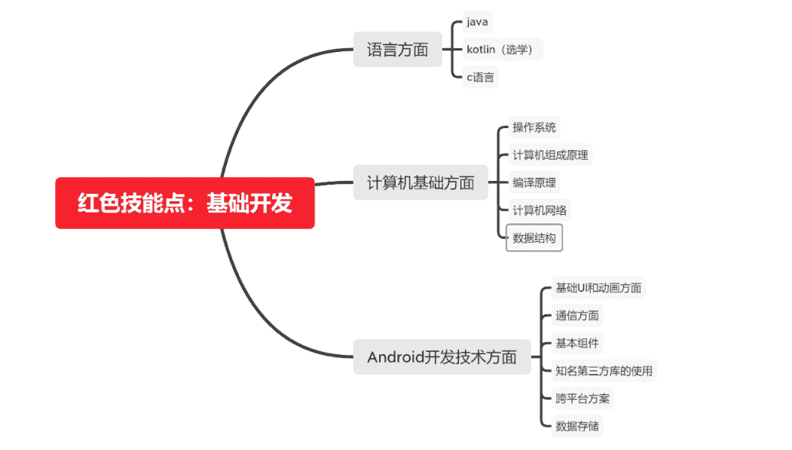
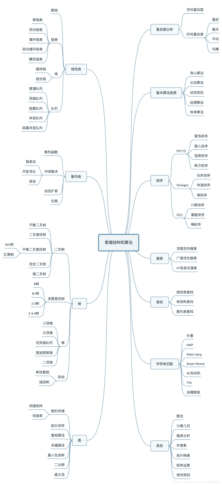
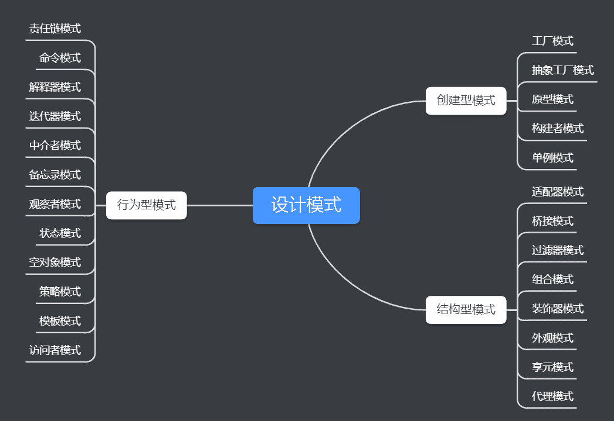

# 第三章 第 1 节 点亮技能树

> 原文：[`www.nowcoder.com/tutorial/10049/07f93128ab7c4d30b5adf592db93bfc9`](https://www.nowcoder.com/tutorial/10049/07f93128ab7c4d30b5adf592db93bfc9)

本章会详细讲解下安卓客户端开发方向我们具体需要那些专业技能，以及如何准备项目。

# 1 专业技能准备与提升

我们根据之前的技能分为：

*   **红色技能点：基础开发能力**

*   **紫色技能点：算法和编程思维 思考模式能力**

*   **绿色技能点:与人沟通交流 多人合作的软件使用能力**

## 基础开发能力

作为一个客户端开发者，我们首先要很扎实的掌握计算机基础能力，然后学习 java 语言，再学习安卓开发，如下图所示是基础开发能力整体的思维导图：

## 语言学习方面

安卓客户端开发基本上用的 java 进行开发（也可以用 kotin 语言）,计算机语言其实并不重要，每种语言的语法特性不一样，如果学完编译原理你会发现都是把高级语言转换成机器语言，但是不建议一开始就学习 java 这种面向对象的编程语言上手，个人建议先去学习下 C 语言，因为 C 语言这种面向过程的语言让新手很容易入门，也让人更好理解内存等变量这些基础。

### C 语言学习指南

| 辅导教材 | 任意一本 c 语言教材 郝斌老师的 C 语言课程视频 |
| 学习重点 | 基本变量 流程控制 数组 链表 指针 文件 |
| 学习时间 | 大一上学期建议学完 2 个月左右 |
| 学习程度 | c 语言不需要学的很深入 会简单的操作 会用指针 会手写链表后就可以了 |
| 后续学习 | 有兴趣可以买本《c primer plus》深入学习下 C 语言 |

### java 语言学习指南

有 c 语言基础，学习 java 很快的，简单过下基础变量 流程控制 ，就学习下面向对象的方面的内容

| 辅导教材 | java 学习教材 《疯狂 java 讲义》 《java 核心卷一 二》建议直接找个 java 学习视频直接上手边看边学 |
| 学习重点 | 面向对象基础 线程 集合 IO 反射 网络编程 |
| 学习时间 | 大一暑假时候抽空学下 3 个月左右 |
| 学习程度 | 对 java 的学习一定要很仔细打好基础 理解面向对象语言如何去处理事情 集合常用的一定要会 了解网络请求如何去写 |
| 后续学习 | 有兴趣可以买本《java 编程思想》深入学习下 java 语言在大三之前记得去看下 java 虚拟机相关的书籍，了解下 java 虚拟机运行原理，深入学习 java |

## 计算机基础学习

对于计算机基础方面的学习，个人建议都应该花时间去系统的学习和掌握的，不要求每门课都完全掌握，但是脑袋里面对计算机这门学科有个清晰系统的从底层到上层的理解。

个人对计算机体系的学科理解，从底层到最上层的顺序依次是：

数字电路 概率论 等基础学科---->计算机组成原理 编译原理----->操作系统 计算机网络----->数据结构 ---->上层高级语言。

如果想系统的学习计算机这门学科，建议按照上面的顺序进行学习。

|  | 教材 | 学习时间 | 重点程度 | 学习时间 |
| 操作系统 | 大学课本 b 站搜索北大陈向群老师的课程 | 大二到大三 | 高 | 6 个月 |
| 编译原理 | 大学课本 b 站搜索哈工大那个老师的课程 | 大二到大三 | 中 | 6 个月 |
| 计算机网络 | 大学课本 《图解 HTTP》等 不想看书就去 b 站找课程看 | 大二上学期 | 高 | 6 个月 |
| 计算机组成原理 | 大学课本 《计算机是如何运行的》 | 大二上学期 | 中 | 6 个月 |
| 数据结构 | 大学课本 | 大二上学期 | 极高 | 3 个月 |

## 算法和思维能力

基础的算法就好比前人总结的武林秘籍，流传至今，很多年前计算机硬件还没那么好的时候，人们只能不断打磨自己的算法，形成一些套路体系，就成为我们今天的算法。对于算法的学习要在学习完数据结构之后，掌握基本的常用的数据结构然后开始学习基本的算法，如下图左边是我们要掌握的常用数据结构，右边是我们要学习的基础算法

### 经典算法

| 辅导教材 | 《啊哈算法》《剑指 offer》 牛客网的左程云课程班（强烈推荐） |
| 学习重点 | 递归、排序、二分查找、搜索、哈希算法、贪心算法、分治算法、动态规划、字符串匹配 |
| 学习时间 | 学习数据结构后 大二大三坚持每周都学 牛客题霸 |
| 学习程度 | 对基础的算法可以手写出来 对常见算法题可以 ac |
| 后续学习 | 黑皮算法书 有兴趣可以去看下 |

### 设计模式

对于设计模式来说，更多的也是前人总结出来的经验和处理问题的套路，他们将问题分类，根据不同问题形式场景，采用对于的设计方法，这就是设计模式。

常见的设计模式有如下的 23 种，也不需要全部记住，会几种常见的设计模式就行了，剩下的了解下概念。

| 辅导教材 | 建议直接菜鸟教程那个网站上看 |
| 学习重点 | 单例 工厂 构建者 观察者等常用的设计模式 |
| 学习时间 | 大二下学期 |
| 学习程度 | 在自己项目中可以使用简单的设计模式 |
| 后续学习 | 《java 与模式 》《重构与模式 》 |

### 源码阅读的能力培养

对于程序员来说不仅要会写代码，更多的是如何快速看懂别人写的代码，这个能力需要刻意去锻炼，在公司接手写业务的时候，看别人代码也需要大量时间上手，所以我们要养成读源码的习惯。

个人建议安卓客户端开发阅读源码顺序：

**集合源码---->android 经典框架---->android 系统源码**

对于阅读源码的方法：

**1 找一些大佬的博客 整体过下思路和设计方式**

**2 自己下载源码，在本地调试下**

**3 用自己的话总结下自己对该源码的理解**

| 源码 | 重点 | 掌握程度 | 学习时间 | 学习时间 |
| 集合源码 | Arraylist hashmap linkdelist 等 | 至少会讲 | 3 个月 | 大二上学期 |
| android 经典框架 | okhttp Gilide 等 | 至少看过 | 1 个月 | 大三上学期 |
| android 系统源码 | 安卓启动流程 安卓 view 相关等 Handle | 至少了解 | 2 个月 | 大三上学期 |