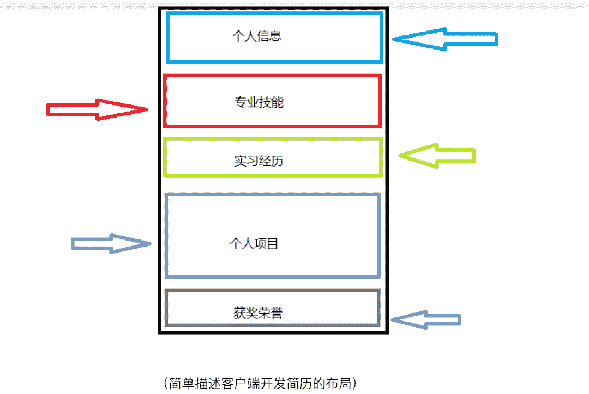
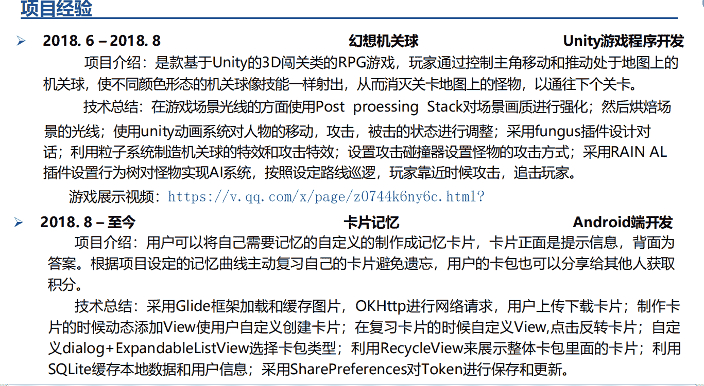
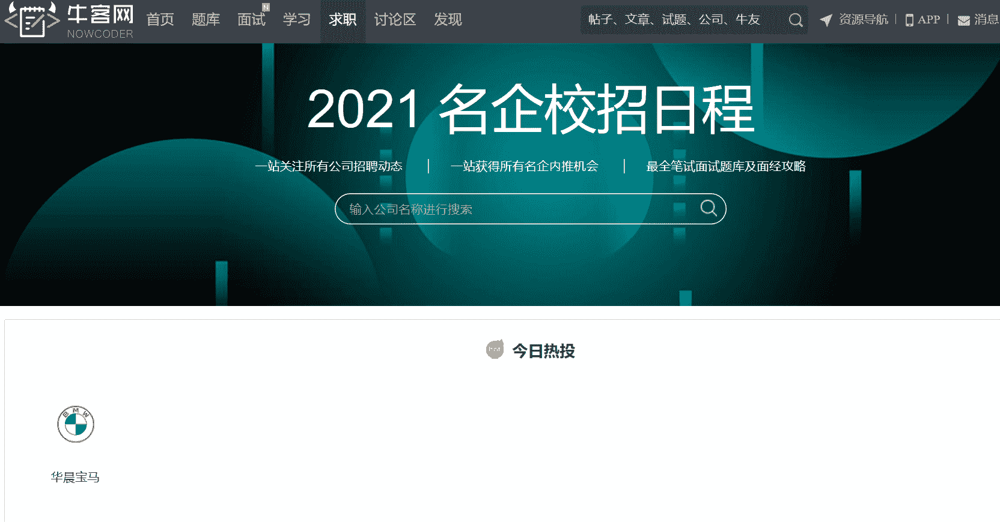

# 第四章 第 1 节 简历撰写及投递

> 原文：[`www.nowcoder.com/tutorial/10049/5d45545b03e944f69201f92c19ca17f3`](https://www.nowcoder.com/tutorial/10049/5d45545b03e944f69201f92c19ca17f3)

上一章节我们讲述了客户端方向专业技能方向有哪些和如何去规划学习，这一章主要讲解如何提升校招求职技能的。一个人光有实力是不够的，面试也是一门艺术，在校招时候，有同学可以凭借运气和面试技巧更好的展示自己，让自己有更大的竞争力。

求职技能简单来说是如何在面试过程中更好的展示自己。

| 求职技能点 | 建议准备时长 | 开始准备时间 | 重要程度 |
| 简历编写 | 1 个月 | 大二开始准备 | 极高 |
| 笔试技巧 | 2 个月 | 大三系统训练 | 高 |
| 面试技巧 | 3 个月 | 大三下学期开始 | 极高 |
| offer 选择和比较 | 无 | 拿到 offer 后 | 重要 |

## 1 如何制作简历

简历，是我们面试的时候第一个要准备的东西，必须认真且细致的去编写自己的简历。

下面详细讲解如何编写客户端开发人员的简历，如下图所示：

整体说下简历的基本要求：

*   确保个人信息正确，不存在虚假或者错别字和常识性错误

*   简历最好是 pdf 版本（切记）

*   简历最好是一页，方便别人查看

## 1.1 个人信息

下面给大家看下当时自己春招时候简历的个人信息部分：

个人信息这一部分，主要是以下几点内容：

*   个人姓名 学历 专业 xx 年毕业生 照片（最好建议正装照片）

*   电话 邮箱联系方式

*   个人博客 和 github 地址（注意弄成超链接方便面试官跳转）

*   求职意向

**个人信息绝对不要写错！！！**自己实验室同学当时因为电话号码写错了，春招都过去了都没收到面试电话邀请，错过了很多机会。

**信息不要作假！！！**不要因为个人一些原因，写虚假的毕业时间 专业 学校，这些最后被查出来会回收 offer 的。

## 1.2 专业技能

这一部分就是展示自己掌握专业能力的地方，要把自己会的技能点展示出来，让面试官一眼就能看出来你会哪些技能。下面也是自己春招时候简历个人技能方面内容：

个人技能方面，注意一下是这几点内容：

*   一定是要跟专业方向相关的技能

*   上面写的必须是自己很熟悉的，有准备的技能

*   不要写精通这类词汇，容易造成面试官误解，校招就不要写这种精通方面词汇

## 1.3 实习经历

实习经历如果有的话记得写上，如果没有这块也可以不写。可以给大家看下当时自己秋招时候的简历，百度实习是当时春招前大三上学期时候去的，腾讯实习是当时大三下学期的实习。

*   实习经历记得写实习时间，公司和部门

*   具体写实习时候做了什么，学到了什么，掌握了什么技能等等

**实习经历不要作假！！！**很多人面试时候没有实习经历，为了面试编实习经历，如果被查出来或者被问住会很尴尬的，还有对个人诚信的影响。

## 1.4 个人项目

在简历上面个人项目是最重要的部分，这一块一定是占简历比例最大的部分。这个是当时自己秋招时候简历上面的项目经验模块。

*   项目介绍就是描述项目主要是做什么的，让面试官清楚认识到这个项目是做什么的。

*   技术总结是根据自己项目中采用了什么技术，具体模块用什么框架，在关键地方用什么处理的，遇到什么问题，如何解决的。

*   项目如果有展示的地方 比如 git 地址 展示视频可以放在下面

## 1.5  个人奖项

这一模块是主要写自己在校期间拿取的奖项，计算机方向的话就写跟计算机方面相关的内容就可以了，不要写一些莫名其妙的自我总结和废话，举个反面教材，下面是一个同学的简历个人奖项模块：

个人看来如果简历最后一部分这样写完全没有什么意义，上面写的个人评价对自己找工作没有任何帮助，计算机方面最看重的是实力，又不是让你去做销售，写这种东西在上面完全是占字数，简历是来展示实力的，最后一部分记得去写自己在大学期间获得的奖项和荣誉，最好是计算机方面相关的。

如果说自己在大学期间没有参加过任何的比赛怎么写这一模块，也可以写一些校园的荣誉，举个例子，如下图所示：

如果大学任何奖项和荣誉都没有，实在没办法了，只能写个人评价了，那就别写一些废话，写一些跟计算机方向相关的特点，比如好奇心强、善于研究新技术等等。

# 2 如何投递简历

投递简历有很多渠道，简单的总结下投递简历的几种方式：

| 投递简历方式 | 方式 | 特点 | 注意点 | 靠谱程度 |
| 官网投递 | 直接公司官网投递简历 | 正规 | 注意时间和投递岗位要求 | 一般 |
| 内推码内推 | 问公司人要对应公司内推码 | 正规 | 内推码基本上人手一个 没有什么用 部分可以免笔试 | 一般 |
| 直接投递到部门 | 找人直接投递到部门中 | 快捷 准确 | 别被骗简历 | 最靠谱 |
| 其他方式投递简历 | 类似公共号这些 | 资源丰富 | 信息不对称 | 不靠谱 |

## 2.1 官网投递

在各大公司的校招官网上面，都会有日常 秋招 春招的实习投递的入口，直接进官网，按照官网要求投递简历，这种有的公司可以定向选择部门和岗位，是最正规的方式。

## 2.2 内推码内推

一般在校招季的时候，每个公司都会有对应的校招内推码，这个内推码大部分来说类似拉人头的，比如你用了这个人的内推码，你在这个公司面试的时候，内推人会看到你的面试流程到哪一步了，方便查阅流程。

内推码内推会比官网好一点，但是前提条件必须是你有内推码对应内推人的联系方式，如果你莫名其妙用一个人的内推码，但是找不到内推人根本没什么用。要保证用的内推码对应的内推人方便联系，可以帮忙时刻问进度，这一点必须切记。

建议找熟悉的人内推，比如牛客网内推广场里面大佬们 大学校友等等渠道。

## 2.3 直接投递部门

一般部门缺实习生的时候，会让部门的人推荐自己的学弟学妹来面试，这种可以直接把简历准确投递到部门的方式最有效率，一方面你知道部门是做什么的，另一方面你确定这个部门招实习生，有 hc。

这种机会比较难得，自己当时春招前百度日常实习就是自己实验室百度的学长直接把简历给部门，面试完后直接就能知道结果，比较高效。

直接投递部门的方式，机会比较少见，可以在大学里面多问下校友或者在牛客网上面看下有没有机会。但是这个也存在对应的风险。比如阿里，有些阿里部门投递面试的简历数量有指标，如果没达标的话有些部门会有惩罚，所以网上看到阿里疯狂要人简历，然后帮忙直推部门的，有可能就是为了简历数量，这种情况如果你没有准备好就不要把简历给他们，不然面试不好进入系统会有记录，影响后面春招秋招。

## 2.4 其他投递简历方式

在校招季有各种各样的投递简历的方式，五花八门，但是大部分都不靠谱，比如一些公共号推文，或者什么收费加入什么内推群，很多信息鱼龙混杂，很难筛选出来那些是靠谱的面试信息，个人不建议在那些没有保障的渠道投递简历。

个人建议牛客网上面投递简历，查询企业信息，有官方的合作信息，讨论区也有专门的大佬发帖内推。牛客网上的[求职-校招版-校招日程板块](https://www.nowcoder.com/school/schedule)，下面是校招日程的截图：

