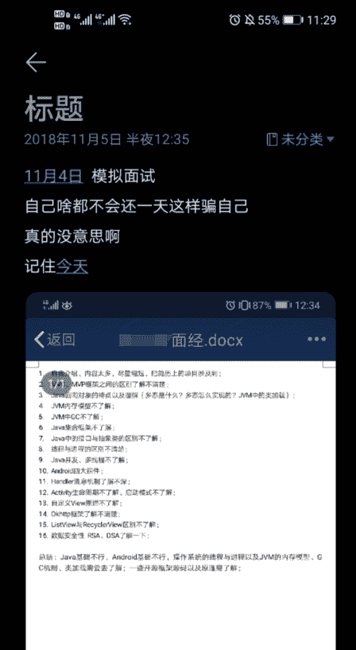

# 第四章 第 2 节 如何通过笔面试

> 原文：[`www.nowcoder.com/tutorial/10049/629d16f0e7264b129d03d9b68c36ecfe`](https://www.nowcoder.com/tutorial/10049/629d16f0e7264b129d03d9b68c36ecfe)

在校招的时候，客户端开发方向简历投递完毕第一关就是笔试

# 1 如何准备笔试

首先来看，笔试也就是互联网公司对学生的一种筛选方式，目前大部分笔试都是线上系统牛客网上面进行，注意的题型是算法题+计算机基础题（专业方向知识题 计算机网络 数据结构 操作系统等）+部分智力题 只需要根据专项进行训练就好了。

如果从一开始很早就准备笔试题，提前做好规划，笔试题还是挺容易的。

| 笔试题类型 | 建议准备时间 | 准备方式 | 参考资料方向 | 重要程度 |
| 算法题 | 大二开始系统刷算法题 | 刷题 | 牛客网 | 极高 |
| 专业知识题 | 大三时候 | 看原题 看题解 | 牛客网面经区 | 中 |
| 计算机网络 | 大二开始 | 看专业数据 看常见题目 | 大学课本 | 中 |
| 数据结构 | 大二开始 | 刷题 看题型 | 大学课本 牛客网笔试区 | 中 |
| 智力题 | 大三开始 | 直接看原题 | 牛客网笔试区 | 中 |

### 对应笔试题的准备 只有多练 多刷题 多准备 没有任何取巧的地方。

## 1.1 笔试答题技巧

做题都是有技巧的，简单来说就是如何用在最短时间拿到自己能拿的最多的分数。

*   基础题 计算机网络 数据结构题一般大多为选择题，没有把握的先放下，后面再进行处理，如果真的做不出来，就随便选个吧，毕竟算法题是大头。

*   算法题很多都是《剑指 offer》 leetcode 的原题或者变种题目，如果遇到这种刷过的题目，就一定要争取 ac 掉，也可以在牛客网有专门的算法练习平台，牛客题霸上面进行模拟练习算法题。

*   算法题一般都有一道简单的签到题，如果其他算法题都不行，也可以先把这个签到题 ac 了

笔试不要作弊！！！之前在实习时候听到一个校招生都三面了被反馈笔试作弊，直接作废然后拉入公司黑名单，很多公司笔试题成绩很多时候只是参考，并不是绝对因素。如果笔试题不行的话，可以投递提前批或者直推那种，有些是免笔试的。

# 2.  如何通过面试

## 2.1 如何准备面试

面试才是找工作时候最重要的一个环节，一般来说技术面试有三轮：

一面组员面试：基础知识+基本能力+简历是否真实

二面组长面试：项目经验+开发方面专业知识

三面总监面试：个人计算机方面规划+思考能力+智力题+发展方向的选择

基本上秋招时候面试你的人就是你以后的上级同事和导师，所以对于秋招来说，面试都是双向的，如果你面试时候很不喜欢这个组的人，也可以提前早点放弃这个组的面试，找个适合自己的公司或者部门。

对于面试的准备，不仅仅是自己实力方面的 更多是说话的技巧和面试的经验。

简单来说，一个人光有实力是不行的，你得在短短的面试几十分钟内，展示自己的能力，让对方耳目一新，对你眼前一亮，觉得你非常不错。

对于面试的准备分为以下几个方面：

*   要对自己简历非常的熟悉，倒背如流，上面写的技术点一定是自己会的，提前准备好的，有深度有广度扩展的，不能面试官问到简历上写的内容，都回答不出来。

*   找学校学长学姐帮忙模拟面试练手，然后找一些不打算去的小公司模拟面试练手，面试的多了，你就熟能生巧，对答如流了

*   每场面试完都要系统的记录下来当时面试的问题，自己有哪些没回答上来，然后针对不会的方面进行强化复习。

给大家看下当时大三上学期时候，实验室学长对我的模拟面试，然后给我反馈的截图，我至今都保留着，每次面试感觉害怕时候都会拿出来看看，自己最差情况也不过如此，然后就有勇气面对任何面试了。

面试是不断积累信心的过程，从学长学姐模拟面试----->小公司面试----------->面试

一步一步类似打怪升级，慢慢积累自信心，带着自己最好的状态去面试。

## 2.2 面试技巧

面试也存在对应的技巧的，有下面三种技巧分享给大家：

**第一种 引入入胜 先声夺人**

这个技巧面试的时候简单来说，就是自己掌控面试的主动权。从一开始的自我介绍开始，就不断的把自己经历和项目串起来讲下去，讲到关键的地方吸引面试官的好奇心，然后给他解答。

在面试时候，将面试官问的问题挖掘深度，比如面试官问你用过那些集合类，就说 Hashmap 这些，你不能简单讲过你用过 Hashmap，你还要说你看过 Hashmap 的源码，给面试官讲下 Hashmap 如何存储的等等，然后再扩展到红黑树这些内容，将你所学的东西展示出来，掌握面试的主动权。

**第二种 遇到不会 思考再问**

在面试的过程中，很大几率会问到你不会的问题 或者是你从来都没见到的题目，在这种情况下，很多人就支支吾吾说个不会，这样肯定是不行的，不论他问哪方面的问题，都要先思考下，看能跟自己所学的哪些知识相关，然后说出自己的思考给面试官。

举个例子，当时面阿里时候面试官问我浏览器 view 显示的原理，可是我是客户端从来没接触过浏览器方面知识，于是就从安卓 view 绘制开始给面试官讲，然后再扯到编译原理那块。虽然可能不是面试官想要的回答，但是至少自己思考了，而不是简单给个答案不会。

**第三种 心态平静 赞美他人**

很多人面试的时候都很紧张，仿佛自己下一秒就要上了战场一样。面试其实说白了就是人与人对专业方面的交流和沟通，没什么大不了的，反正面试官也不认识你，就算答的不好也没关系，面试官还帮你查缺补漏，高级工程师对我们能力方面的建议和推荐学习的内容都是宝贵的财富，最重要的是还都是免费的哈哈，不用花钱。这样一想，面试根本不可怕，平静的面对面试，心态放平和。很多面试最后一问都是面试官问你还有什么想问的吗，我一般都是问下组里面的业务方向，然后礼貌的感谢面试官。但是我有个实验室同学，他每次最后一问都会真诚的赞美面试官，说他觉得面试官问的问题很专业很有挑战，想必面试官组里面技术氛围都很好，他超级想去这里，觉得面试官是他遇到的最好的面试官（他对每个面试官都会这么说有点尴尬），虽然有点厚颜无耻，但是也蛮有成效的，面试官也是人，都是我们的前辈们。真诚地说一些好听的话，没有人会不喜欢的。

## 2.3 面试注意事项

*   注意时间，不要迟到和随意放弃面试，如果要放弃发邮件说明理由，面试官也都是每天抽时间进行面试的，要互相尊重。

*   语气平和，就算遇到委屈也不要随便给别人发脾气，如果面试官真的专业素质不行，可以面试结束后，到专门的公司渠道投诉，不要意气用事。

*   不要说大话和弄虚作假，对于校招来说更看重一个学生是否有潜力，是否值得培养，真诚的回答别人的问题，展示最真实的自己。