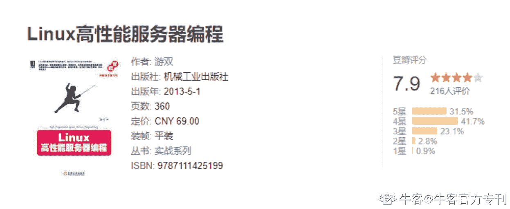
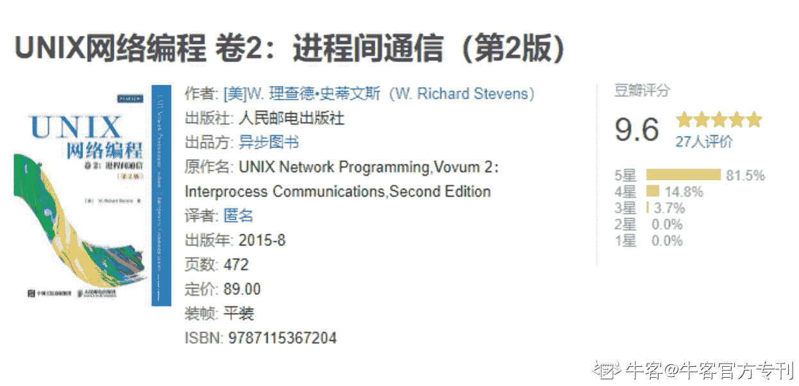
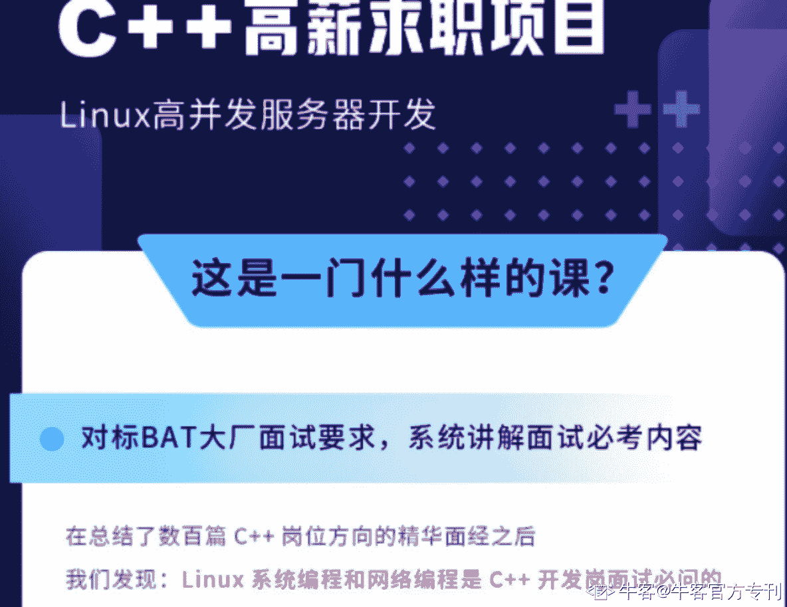

# 第二章 第 3 节 学习规划（下）

> 原文：[`www.nowcoder.com/tutorial/10043/f30c153dc49c4bea952c64b75849a743`](https://www.nowcoder.com/tutorial/10043/f30c153dc49c4bea952c64b75849a743)

# 2.2.4 计算机网络

        计算机网络是重点之一，特别是 HTTP 以及 TCP 相关知识点，面试必问，并且难度是逐年上升的。笔者请教过 18 届的师兄，他们当初考察计算机网络对于 TCP 就随便问问，就只问一些基本的三次握手四次挥手大概过程，不会过多问细节。但是现在不直接问三次握手四次挥手，反而问一些链接建立过程中的意外情况，比如 SYN 请求包丢失的话，客户端会怎么做？或者为什么要等待 2MSL 时间，为什么不等待 1MSL 或者 3MSL 呢？

        我个人学习计算机网络的路线是先看一些有意思的计网相关视频，然后从书籍入手，毕竟视频中的知识都是别人总结好又给你讲解的，自己在听的时候可能会觉得“嗯嗯，说得对，我也是在这么觉得的”，可是临到自己实际场景中遇到了就会一脸懵逼，两手无措。只有自己亲自揣摩亲自动手实践得来的知识才是自己的，毕竟“纸上得来终觉浅，绝知此事要躬行”的。

        这里以 TCP/IP 四层协议为例简单介绍一下校招过程中经常考到的协议，知识导图：

** 视频推荐：****        谢希仁老师**的计算机网络视频，谢老师讲课很有意思，整个课堂充满了欢声笑语，也可以看视频下的留言，那里都是有很多好笔记的。

        斯坦福大学的 CS144 计算机网络相关课程

**书籍推荐：**        这里从易到难逐步推荐一些比较好的计算机网络经典图书。

        推荐指数：四颗星★★★★

        书名：《图解 TCP/IP》、《图解 HTTP》

        理由：日本人写的两本科普书，很适合计算机网络入门，书很小并且书中图画很多，看着有 300 多页挺多的，其实没有多少内容的。看完这两本书对于场面的秋招面试题都能够答得上来，但对于一些细节问题还不太够比如 TCP 中的滑动窗口、拥塞避免等还是需要看别的经典书籍加以补充。

        推荐指数：五颗星★★★★★

        书名：《网络是怎样连接的》

        理由：强推！同样是日本人写的一本书，本书紧紧围绕一个问题：输入一个 URL，按下 enter 键，直到我们在网页端看到请求的内容，这中间发生了什么？这本书抽丝剥茧般将这个问题逐步细化，亲手带你自顶向下的走完整个网页访问的过程。不可多得的一本好书！强烈推荐！

        推荐指数：五颗星★★★★★

        书名：《计算机网络：自顶向下方法》

        理由：别的常见介绍计网的书籍是从底向上即物理层到应用程序介绍网络，这本书另辟蹊径，是自顶向下介绍整个网络的。这样做的好处是从我们所接触的应用层开始逐步深入，而不是从离我们最远的物理层开始。如果不是网络安全相关专业，大多数人看重点章节也就是第三章传输层那一章，重点看 TCP/UDP 的各种细节基本也够用了，剩下的可以后期再补，为自己节约时间。

        推荐指数：五颗星★★★★★

        书名：《TCP/IP 详解 卷 1：协议》

        理由：确认过眼神，是经典中的经典，没错了。不过就是，emmm 太厚了…笔者买来翻了翻 TCP/UDP 知识点就用来垫电脑了…..对于 TCP 的各种机制介绍的很细致，看了之后对于 TCP/UDP 感觉明显上升了一个台阶。如果不是信息安全、网络安全相关岗位的，可以作为一本工具书来使用的，需要用到某些知识再来补就行。

# 2.2.5 数据库

        校招过程中常问的数据库主要是关系型数据库 MySQL 以及内存型数据库 Redis，普通研发岗掌握这两个基本也够用了，数据库的知识点比较死，范围也不广。MySQL 经常问的包括数据库索引、范式、ACID 特性、常见优化策略、B+树，而对于 Redis 问的有 Redis 底层模型、五种数据结构、跳表的实现、缓存击穿、缓存穿透以及 AOF 和 RDB 等常见问题。

        有时候也会让你写一些 SQL 语句，比如给予一个工资表和工人表，查出工资排名第三的工人信息或者按照部门类别求工人平均工资。

        其实这些问题在一些面经里已经出现过很多次了，俗称“面试八股文”，有牛友说背就完事了，笔者不是很赞同。如果只是背的话，很多知识点和名词压根不明白什么意思，如果想要在 IT 行业走的更远、更稳的话，这些基础还是要打好的，只停留在书本上无异于饮鸩止渴，希望各位牛友们谨记。

        数据库常问知识导图：

        数据库是一门需要自己动手实践的学科，在学习一些 SQL 语句时，建议大家自己实操一下，建个数据库表，输入一些数据，自己动手写 SQL，牛客上也有相关的[S](https://www.nowcoder.com/ta/sql)[QL 语句练习资源](https://www.nowcoder.com/ta/sql)，建议好好利用

**书籍推荐：**

        推荐指数：五颗星★★★★★

        书名：《MySQL 必知必会》

        理由：同《图解 HTTP》一样也是袖珍型书籍的典型代表，书虽薄但是很经典，是一本很小的小册子，笔者当时不到一周就看完了，看完基本的 SQL 语句没什么问题了。需要注意的是千万要记得自己手敲一遍其中的 SQL 语句，要实操才能理解的更深。

        推荐指数：五颗星★★★★★

        书名：《Redis 设计与实现》

        理由：Redis 方面的好书，算是 Redis 入门资料吧，认真看完的话就对 Redis 的五种数据结构以及缓存等常见问题有大概了解了，包括其中的底层数据结构，其中的跳表需要特别注意，是 Redis 面试知识点常问之一。Redis 在如今的互联网中很多时候都充当缓存中间件来使用，其中有不少设计很巧妙的地方，推荐推荐！

        推荐指数：四颗星★★★★

        书名：《Redis 实战》

        理由：Redis 系列的第二本书。前一本书偏向于理论讲解，这本书偏向于实战讲解，学了不能就完事了，毕竟还是要实操的，不能只停留在理论层面上，书中除了通过一些实例讲解了 Redis 的用法，还讲述了一些 Redis 的优化方法以及扩展方法，确实不错！

        推荐指数：四颗星★★★★

        书名：《高性能 MySQL》

        理由：首先肯定这是本经久不衰的数据库方面的好书，但是，也是真的厚，垫书桌都嫌厚的那种厚度..笔者买来只看了其中的索引以及优化两章，对于常问知识点有个大概了解后就放一边了，在面试过程中够用了，其他的后面再说，哈哈。

        推荐指数：四颗星★★★★

        书名：《MySQL 技术内幕：InnoDB 存储引擎》

        理由：作为 MySQL 内置引擎的 InnoDB 能够满足绝大多数情况下常见业务的需求，本书从源码角度带我们深度解析 InnoDB 的体系结构、实现原理以及工作机制，对于更好的理解 MySQL 有很好的帮助，如果你是数据库相关从业人员，更不能错过这本书了，相信这本书能带给你很多全新的认知！

# 2.2.6 Linux

        C++跟 Linux 基本是离不开的，特别是后端方向跟网络通信关系很大。在实际工作里，很多成熟的项目都是在 Linux 上进行开发的。笔者在秋招过程中被问过很多网络通信相关的知识，比如 IO 模型、线程池、多线程、epoll 底层数据结构等等。

        说来惭愧，笔者并没有系统的学习过 Linux 相关命令，都是遇到问题了再去翻书或者面向百度学习。遇到问题了再去学其实也是很多人的真实写照，毕竟学习时间相比于浩瀚的知识海洋来说真的很有限。反而对于网络通信与 Linux 系统内核倒是系统的学过不少，这里也简单推荐一些资料。

        推荐指数：四颗星★★★★

        书名：《鸟哥的 Linux 私房菜》、《Linux 就该这么学》

        理由：这两本书都挺经典的，不过褒贬不一，笔者觉得还是不错的，算是比较好的 Linux 入门书了。如果想要系统学习 Linux 可以照着书本上的命令老老实实的敲上一遍，Linux 命令这一块基本没啥问题了，要不然就像笔者这样当个工具书，哪里不会翻哪里就是了。

        推荐指数：四颗星★★★★

        书名：《深入理解 Linux 内核》

        理由：堪称讲述 Linux 内核方面不可多得的一本好书，个人感觉比那本《Linux 内核完全注释》要好上不少，不过仁者见仁智者见智。这本书可以很好的对你在内核中使用的最重要的数据结构、算法和程序设计诀窍进行一次详细解读，也能帮助你在以后使用 Linux 时更好地进行进程调度、文件存取和内存管理。

        推荐指数：四颗星★★★★

        书名：《TCP/IP 网络编程》

        理由：如果让我推荐一本网络编程入门书籍，那我毫无疑问会推荐这本韩国人写 TCP/IP 网络编程，书中例子超级多，堪称一小节一个例子，比如很知名的简易版回声服务器、优雅断开 TCP 链接等，从客户端和服务端两个方面分别展开叙述，手把手带你初窥网络通信的点点滴滴。在看这本书的时候，注意总结笔记，因为例子太多了笔者经常出现看了后面一节就忘记前面一节的内容的情况，后来记了笔记就好多了。而且在 github 上也有很多别人做好的读书笔记，牛友们可以自行检索。在获得同样知识的前提下，当然用的时间越少越好了。

        推荐指数：五颗星★★★★

        书名：《Linux 高性能服务端编程》

        理由：游双老师的经典之作，笔者第一次看的时候，内心 os:这什么垃圾，那么多人推荐？？第二遍看的时候，不好意思，是我垃圾….

        这本书需要一定的门槛，但真的是一本很好的书，网络通信相关基本全都涉及到了，比上面那本《TCP/IP 网络编程》要详细的多。其中第 1-5 章高度涵盖了计算机网络的知识，高度概括，所以看这本书的前提就是要对计算机网络有基本了解和认识，后面的章节讲的是网络通信的前世今生，关于网络通信你知道的不知道的，这本书都告诉你了。强烈推荐！

        推荐指数：五颗星★★★★

        书名：《Linux 多线程服务端编程：使用 muduo C++网络库》

        理由：前排提醒，这本书有一定的门槛。北师大陈硕大神的经典著作，从事服务端编程方向的从业人员必看的一本书，能够从书中借鉴到很多比如关于定时器的设计。笔者也只是看了一小半，建议后期再看，需要不少基本功才能看明白。

        推荐指数：五颗星★★★★

        书名：《UNIX 网络编程 卷 1:套接字联网 API》、《UNIX 网络编程卷 2：进程间通信》

        理由：史蒂文斯大神的盖世之作。说一句“网络编程方面的圣经”不为过。对于有志进入腾讯鹅厂的小伙伴，这两本书可以说是必须要看的，可以说是网络研究和开发人员公认的权威参考书，无论网络编程的初学者还是网络专家都会大受裨益。不过因为太厚的原因，特别是《套接字联网 API》可以说是我遇到的最厚的技术书了，全部啃完需要耗不少时间，可以像笔者一样，哪里不会翻哪里。哈哈。

        笔者在牛客上闲逛的时候，也发现了一个不错的**C**++项目：[Linux 高并发服务器开发](https://www.nowcoder.com/courses/cover/live/504)。针对于 C++求职者来说，这个项目还是有一定的含金量的，感兴趣的同学们可以去看看。

# 2.2.7 其他

        还有一些经典书籍比较好，适合自己持续性充电、打基础，这里也推荐给大家。

        推荐指数：五颗星★★★★★

        书名：《数据库系统实现》

        理由：本书是斯坦福大学计算机科学专业数据库系列课程第二门课的教科书，也是国内华东师范大学数据学院指定数据库原理书籍。讲数据库的书籍有很多，这本是少有的讲的通俗易懂，不是那么深奥晦涩难懂的，对读者友好的那一类型经典书籍，笔者依然经常看。这类书是属于内功修炼的那一类书，像什么框架之类的属于外功修炼的书，外功固然重要，想要真正在 IT 行业走的远、走得稳，内功是必须要扎实的。

        推荐指数：五颗星★★★★★

        书名：《汇编语言》

        理由：宝藏书籍！！！王爽老师的这本汇编语言真的可以说一句宝藏书籍了！强推，千万不要被书名劝退。如果你是 C/C++方向开发者，这本书绝对不会让你失望！对于函数的调用过程等细节讲的十分透彻，掰碎了讲给你，一点一点的传授你知识！如果每个作者都能像王爽老师这样就好了...

        推荐指数：四颗星★★★★

        书名：《X86 汇编语言：从实模式到保护模式》

        理由：作为上一本《汇编语言》的补充，这本书以很多的代码演示了 16／32／64 位软件的开发方法，介绍了处理器的 16 位实模式和 32 位的保护模式，这本书教你如何直接控制硬件，教你如何显示字符、读取硬盘数据、控制其他硬件等。

        推荐指数：四颗星★★★★

        书名：《老码识途：从机器码到框架的系统观逆向修炼之路》

        理由：汇编与反汇编就好像如今的爬虫与反爬虫一样，这本书以逆向反汇编为线索，自底向上，从探索者的角度，原生态地刻画了对系统机制的学习，对于有志成为系统架构师的小伙伴来说不应该错过这本好书，这本书涉及反汇编、底层调试、链接、加载、钩子等在别的书中很少看到的知识等。

# 2.2.8 学习方法

        我知道有些小伙伴会被上面的书籍和资料分享吓到了，可能有些人会问，这些书你都看了吗？自己能不能看完？

        不过每个人的生长环境以及自身水平不同，适合自己的的学习方法也不尽相同。我只是和大家分享一下自己在学习上的一些小技巧或者方法，如果有可以借鉴的地方自然是好的，如果大家对自己的学习方法比较满意，认为不需要的，可以直接跳过此小节。

## 1、**看视频**

        看视频个人所花费的精力会少于读书，因为你所获取的知识都是讲课老师消化好又传授给你的，你只需要被动接受即可，一个好的老师会让你觉得他所讲的东西容易理解与和掌握。但是视频的广度和深度是不如书籍的。而且因为老师语速和自身看视频时的注意力等问题，与看书相比，看视频的效率要低得多。看视频适合于快速入门和那些自学能力不是很好的同学。

## **2、看书**

        l 建议多看纸质书，而不是 PDF 电子版，必要的投资是必要的，而且纸质书能够让人安静下来思考，也可以方便做笔记，看 PDF 电子书鼠标滑着滑着很容易就走神了，个人感觉没有纸质书效果好。

        l 学会善用目录。有时候，看过目录后就大概知道这章或者这小节讲的是什么了，建议在看一本书的时候先看一遍目录，挑选出自己不懂得或者感兴趣的章节来看，而将已看过的或者暂时不需要的放到后期再去看。

        l 学会将知识串联起来，大脑中形成自己的知识体系。经典书籍是挺多，但是其中有很多知识点是一样的，比如你详细了解计算机网络后，游双老师的那本《Linxu 高性能服务端编程》中的前四五章你大概略过即可，就不再需要细看了。知识是有相关性和相通性的，有了前面的沉淀后期自然就好很多了。

        l 学会取舍。就像前文中笔者说的那样，每个人的一天都只有 24 小时，要学会取舍，先看对自己最重要的，比如在秋招时期，那本《高性能 MySQL》那本书有七八百页，认真看完黄花菜也凉一半了，这个时候就应该先看面试过程中考察最多的索引与优化章节，而将其余章节暂时搁置一边，日后再说…

## **3**、看博客与论坛

        有很多大佬都是很乐于分享的，会将自己对于某个问题的看法发表在一些博客或者论坛上，比如牛客博客就很不错，里面有很多经过秋招洗礼后的前辈们将自己的经验总结发在牛客博客上了。博客的限制就在于一篇博客上分享的知识有限，所以这种学习方式比较适合你有了一定的基础后，再开始看别人的博客。千万不要在自己还是个小白的时候就贸贸然看别人写的博客。当我们对于一门科目或者知识有了整体认识后，剩下要做的就是查漏补缺了，对于书中不懂的细节问题进行逐个攻破，这往往需要我们自身对该问题就有一定的认识，自己手动的去提取某个问题，然后在各个博客上寻找答案。

        还有一点需要注意的就是不要偏听偏信某一个博客或者论坛，不同的人对于同一个的问题有着不同的见解和认知，毕竟一千个读者就有一千个哈姆雷特。作为求知者的我们要尽可能多看几个博客、多看几个人对于同一个问题的看法和分析，然后将这些看法和分析进行汇总整理，你可以做笔记或者像他们一样写博客，最终形成自己的认知。

## **4**、看官方文档或者源码

        这种方式适合有一定水平的牛友，比如 Java 中各种框架都是有官方文档的，对于学习能力很强的同学来说有的就是直接生撸，简单粗暴，过程很辛苦但是如果能够成功撸出来，收获会很大的。在学习一些知名项目的时候，也可以直接看人家的源码，一般来说正规一点的开源项目都是有代码注释的，不过不少都是英文注释，需要一定的英文水平才能驾驭。

        最开始你在学的时候可能会觉得很难，看书可能很慢，但是请你坚持下来，千万坚持下来，咬着牙坚持下来。过一段时间，等你有了前面的基础，后面就会感觉舒服多了，速度就会慢慢快起来了。

        慢慢学、慢慢看，慢慢的就会有收获了，千万要坚持下去鸭。