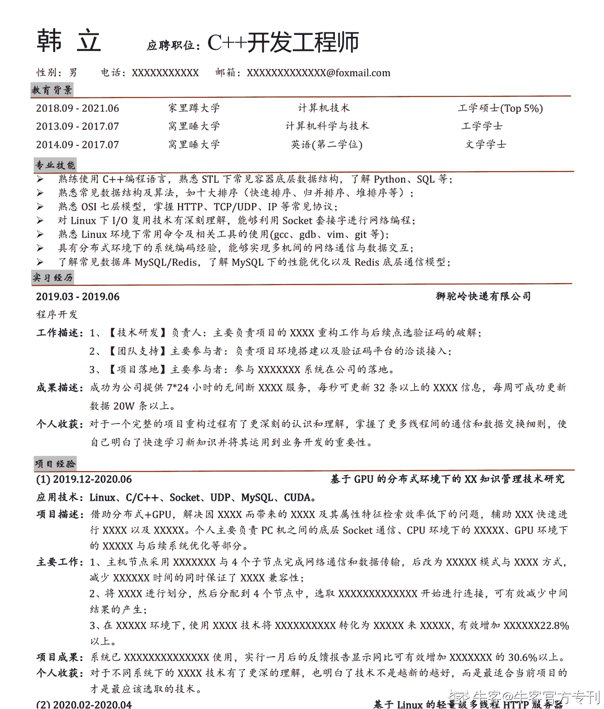
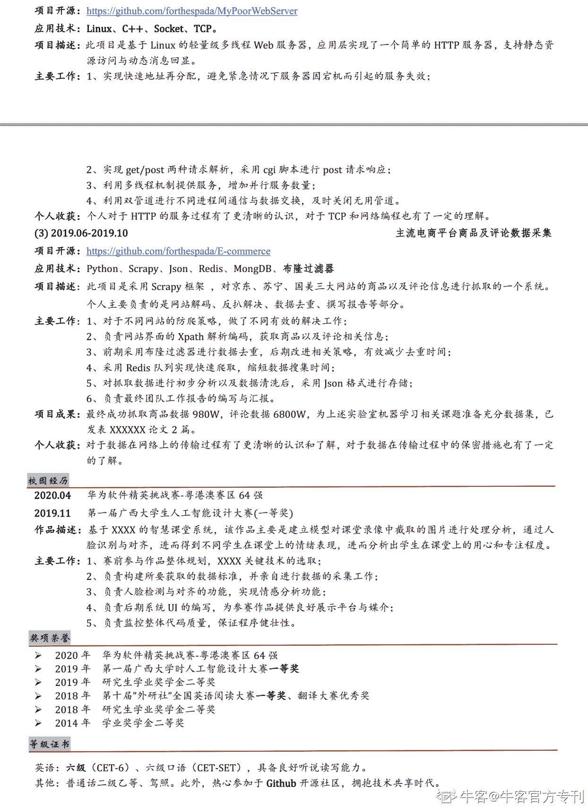

# 第四章 第 1 节 如何制作简历

> 原文：[`www.nowcoder.com/tutorial/10043/7b3fe247379247ffa12629c8d4b646b8`](https://www.nowcoder.com/tutorial/10043/7b3fe247379247ffa12629c8d4b646b8)

        对于秋招过的同学来说，不少人都看过企业的线上宣讲会直播吧。你会发现他们一般都会邀请公司的 HR 或者技术经理或者项目组主要成员来做嘉宾，其中他们都会提到一个关键点，那就是一份好的简历往往能够无形中给自己增添很多机会。 

        笔者微信好友中有一位是某旅游独角兽公司的架构负责人，他以前发过朋友圈强调了简历的重要性，说“面试的 40 个人中，90%的简历写的都是不合格的。简历是你的第一印象，如果简历都是一团糟，如何相信你的能力突出呢？”

        其实同学们也可以想想，对于我们秋招，首先第一关就是简历关，如果从你的简历中一点关键信息都提取不到或者你投的简历含金量极低，企业怎么会给你面试机会呢？当初秋招过程中，笔者身边很多同学对于简历不在意，觉得自己有技术、有本事，简历不算什么。这是大忌！再大的本事，企业看不到又能有什么用呢！所以简历真的非常重要，可惜很多人根本意识不到。

        还有一种情况就是，有些同学觉得自己明明有实力，但就是不知道该如何将自己做过的项目或者掌握的知识用比较好的语言把它叙述出来，对于这个真的很亏啊有木有。

# 4.1.1 简历内容

        一般来说公司内部都是有简历筛选系统的，你的简历会经过内部系统筛选一遍，然后是 HR 人为筛选一遍，HR 阅读一份简历的时间只有短短的十几秒甚至几秒，那么这么短的时间，HR 在看什么呢？主要针对简历中的信息作客观评估，主要包括个人信息、教育经历、实习/项目经历，这是最关键的几个点。很多企业的 HR 并不是技术出生或者并不是计算机相关专业毕业的，所以 HR 涉及技术方面的评估会很少，他们可能会依靠你简历中出现的关键字眼来进行评估。

        一份成功的简历往往具备以下几个特征：内容匹配（简历上写的 Java 技术栈去投 C++，这不没事找乐子吗）、简介明了、言简意赅、不花里胡哨、重点突出。下面根据简历的通用排版，给出笔者的一些小建议：

**1、****个人信息**

        首先个人信息要全，一般这些要放在最前面的，该有的要有，不该有的就算了，别往上面写。必写的有姓名、联系方式、邮箱、应聘岗位，其次可以选写的：年龄（出生年月）、性别。

        至于个人照片放不放上去的问题，我建议不放上去，如果你对自己的长相比较有自信，那完全可以放上去。如果你是技术岗，真的没什么必要放上去，如果你是前台、销售这些非技术岗还是可以放上去的，企业招聘不是选美。

**2、****专业技能**

        这一栏是比较重要的内容了，希望同学们好好重视这一栏，将自己所掌握的专业技能说清楚。对于描述性词语的运用要把握好，常见的有：了解、熟悉、掌握、精通，不是万分确定还是不要写精通 XXX 了，要不然可能会给自己挖坑。

        还有一点就是注意技能叙述的完善性。比如有一句话大家可能都会写：“熟悉常见数据结构与算法”，这一句话相信在很多技术岗的同学们简历上都有，我的建议是可以再清楚一些，比如“熟悉常见数据结构如栈、队列、链表、二叉树等，了解常见算法如十大排序、二分查找、双指针、单调栈等”，这样是不是会好一点呢。

        注意要对自己在简历上写的内容负责，不要把自己不明白不了解的东西写上去，如果被问到，结果你不会或者答错了，是很扣分的。

**3、****教育经历**

        首先，如果个人信息和教育经历不能符合要求，就通常不会再浏览其他内容，先排斥在外，一般大厂校招最低学历要求本科，如果是社招走内推通道可能会放宽到大专。

        还有就是同学们注意将自己的受教育经历按照受教育程度从高到低叙述，如果你是研究生，那就先写研究生学校，再写本科学校。如果你是专升本，那就先写本科学校再写专科学校，其次要备注好大学教育的起始时间和类别，比如全日制本科，如果你不写清楚会让筛选你简历的人认为你在混淆统分、成人教育或者专科本科的区别，企图蒙混过关，掩盖自己过往的教育经历。所以最好诚实得将自己的教育经历写出来，写清楚。

        同学们也要记得写上自己的相应专业，比如计算机专业/通信专业等。如果某些同学知道自己在学校/班级的排名，可以一并写上。比如 4/34，代表班级 34 人，自己排名第四名，或者 Top 10%这样的院系综合排名。

        对于一些在校生，如果实在没什么可以写的或者觉得简历篇幅过短，可以选择可以选择把一些专业课如数据结构、计算机网络、操作系统、C++/Java 程序设计的分数写上去。但如果是只考了 60 分，刚及格那种，那还是别写上去了。

**4、****实习****/项目****经历**

        如果有实习经历要记得把实习经历写上去，包括实习公司、担任的职位、起始时间，一般都会在实习经历后写上自己在实习期间的主要工作，要写清楚自己在实习期间干了什么事，采用哪些方法取得了什么样的成果。最好是书面用户 +数据支撑，这样给人的信服度也更高一些。 

        对于项目经历也是的，项目描述要清晰列出在项目中使用的技术点。还有就是如果是个人的项目，可以选择性的把相关 github 链接或者博客贴上去。项目要按照时间前后的顺序写，一般会把自己最拿手的放在项目经历的第一个。下面贴一下笔者自身的简历描述：

**工作描述：**

**1、【技术研发】负责人：主要负责项目的 X****XX****工作与后续 X****XXX****的优化；**

**2、【团队支持】主要参与者：负责项目****XXX****搭建以及 X****XXX 的****接入；**

**3、【项目落地】主要参与者：参与 X****XXXXXX****系统在公司的具体落地。**

**成果描述：成功为公司提供****XXXXX****的 X****XXXXX****服务，每秒可 X****XXX24 条****，每周 X****XXX15W 条****以上。**

        可以说自己主要负责公司当前项目中的某个子模块功能，通过与 leader 探讨以及团队内部沟通，决定采取 XX 技术/XX 框架，最终达成了什么样的效果，取得了什么样的成就，为团队带来了什么样的增益等；又比如说负责公司现有软件的重构工作，具体负责某个 XX 模块，比如登录模块，个人提倡引入验证码功能，主要原因是能够为公司有效去除僵尸用户，保留有价值用户，技术 leader 最终同意所提方案；也可以说自己负责单线程版本软件到多线程版本软件的迭代更新工作，最终成功增加软件并行化程度，为公司增加效益 10.3%增幅等等。

        可以使用一定的数字来加深实习可信度，而不要用一些修辞性的词语来修饰自己的实习，比如“大幅度增加用户数“，”给公司带来了一定的经济效益”，”成功为公司增加有效信息”等这些看着就比较虚的话语等。换句话说就是：多用名词、动词，少用形容词。

**5、****校园经历**

        校园经历如果拿得出手，比如参加 XXX 社团，参加某某比赛之类的，也建议写上去，因为作为校招生本来就没有什么可以写的东西。

        如果比赛或者社团比较有意义可以适当展开，比如获得国家级比赛/省级比赛，也可以考虑把比赛的过程叙述一下，毕竟国奖还是挺有含金量的。如果啥也没有，那就不要写了。

**6、****其余**

        在该模块中可以说一下自己的英语水平或者对自身的评价，记得要简要概括，评价需要真正思考一下，不要写那种性格开朗、积极学习之类的话，一看就很假。

        如果有实力证明那就更加好啦。有写博客的习惯就把博客贴上去，有 github 就把 github 贴上去。

        另外还有别的一些需要注意的点，想要跟同学们叮嘱一二:

1、注意精炼语句。可能你自己觉得写的内容清晰易懂，但在面试官看来可能是通篇大段的自然语言，让人头痛，注意精炼关键字，不要追求什么语法结构，就简简单单的主谓宾，然后加上适当的定状补修饰即可，力求简洁有力、落落大方。

2、不要过分张扬但也不要过于谦虚，简历的作用是真实客观的体现你这个人的基本情况，某些同学在简历上描述自己掌握某项能力一般，但是面试中发现比绝大多数面试者都要强上不少。这就是一种过分的谦虚了。

3、如果不是对自己很有自信，建议不要写上薪资要求。薪水要的太高，HR 会直接 pass 你，因为企业给不起，薪水要的比较低会让人质疑你的能力，觉得你比较菜。如果你是社招，可以大胆写上，校招不建议写上。

        这里简单贴上笔者简历，其中关键信息已脱敏，笔者简历修改迭代达 26 版之多，具体过程已发表在牛客专栏中，有需要的同学可以移步：[一份百投百中的计算机校招简历是如何迭代足足 26 版的？](https://blog.nowcoder.net/n/a94c64fe09ac43408ac3cc27519f735d)

 

# 4.1.2 简历网站

        说真的，千万不要过分相信自己的排版能力，很可能你的简历连对齐都没有对齐。建议使用一些在线的简历网站，别人把排版给你做好了，直接往里面填内容，它不香吗。完事了，自动生成简历，排版大气又能节省时间，直接导出 PDF 格式即可，不省事吗。

        这里推荐牛客的在线简历功能，只需一次填写可以直接在牛客网上投递互联网公司的岗位，还是很方便的，笔者在秋招过程中，奇安信、当当、迅雷等公司就是通过牛客网直接投递的。

        使用在线简历网站还有一个好处就是便于修改自己的简历，因为简历是需要多次打磨的，可能需要很多次的增删内容，并且网站也有简历留存功能，不会说简历丢失等情况发生。

# 4.1.3 投递简历

        对于应届生来说，投递简历的途径有很多。主要有三种，1、校园宣讲会 2、网申 3、内推。

**1、****校园宣讲会**

        校招宣讲会一般都会有一些笔试，笔试过了即可参加正式的面试，去的时候带好笔试的东西即可。

        现在也有一些线上的宣讲会，经常都是会有一些互动环节的，观众提出自己比较关心的问题，然后主持人或者嘉宾现场回答，对于那些被抽中问题的同学一般会有一些小礼品发放比如 U 盘，鼠标垫之类的，除此之外还会有一些直通面试卡的发放，也就是不需要笔试，简历筛选过关即可直接面试。

**2、网申**

        网申基本算是投递人数最多的一种方式，通过招聘网站或者官网进行信息的填写，直接投递即可。需要注意的是，不同公司用的简历系统都是独立的，所以很有可能你每投递一家公司就要填写一次，真的真的很累人滴！最开始填写的时候可能还是比较有耐心，慢慢的你就会觉得有点烦，笔者建议午饭后坐在座位上没事了就填一个，哈哈。

        还有值得推荐的就是牛客的简历助手功能，哈哈真的很好用，是以插件的形式嵌入到你的浏览器的。笔者用的是谷歌浏览器，使用了简历助手，少敲很多字，很多简历信息，助手就会直接帮你填写好，真的很方便了，一次填写，可以投递多家企业，堪称填写简历必备之神器。

        信息获取渠道在 2.3 已经有所提及，请自行翻看了解。

**3、内推**

        这也是近几年越来越流行的一种方式了，直接找意向公司内部的员工帮忙推荐即可，比如已经入职成功的学长学姐，笔者建议能找内推一定要找内推，否则简历很容易石沉大海，连求职进度都不知道。

        此外牛客网上也经常有一些人发布招聘信息，基本都会附赠内推码或者内推邮箱或者搜寻自己想要投递的岗位获取内推码，然后发邮件过去就好。还有部分公众号也是可以找到内推信息的，注意关注即可。

        内推对于内推人来说也是有好处的，基本上每个大厂内推成功都是有奖金的，他内推你，如果你能够顺利入职的话，内推员也是会拿到奖金的，内推基本是双赢的。

        虽然很多人说现在人均内推，基本没啥用，但是我还是觉得能内推就内推，人均内推+你不内推，那你不就吃亏了吗，说不定能起作用呢。

**这里有两个需要注意的点：**

1、注意及时添加内推人的联系方式比如微信 QQ 等，及时了解内推信息，很多同学随便找了一个内推码就写上去了，到最后也不知道自己的内推情况到底如何了。

2、注意发送简历的格式，最好是 PDF 的，这样简历格式才不会改变。word 在不同电脑上格式可能会有所变化，还有就是别人无法修改你的简历，内推人也能更快更方便的打开。发送给招聘邮箱的简历也要注意命名和格式：一般只发中文版本，除非你投递的岗位明确要求需要英文简历，简历命名格式为：姓名+职位，邮件标题也命名为：姓名+意向工作地+岗位，因为这样也方便别人更快地把你的简历推送到合适的岗位中去。