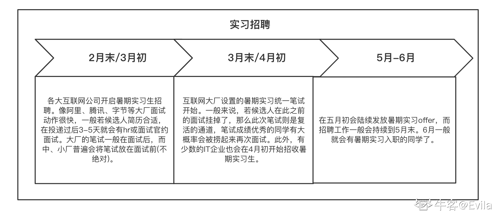
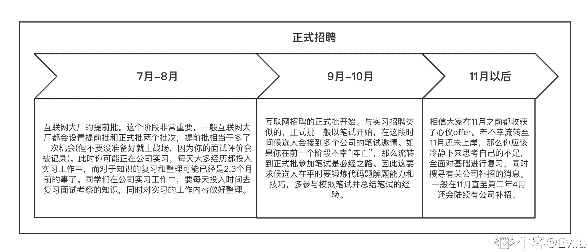

# 第二章 第 1 节 从实习到秋招的求职经历

> 原文：[`www.nowcoder.com/tutorial/10094/b9efa848389b4ad89eb97c47ca457763`](https://www.nowcoder.com/tutorial/10094/b9efa848389b4ad89eb97c47ca457763)

# 1.我的校园招聘经历

### 1.1 我的校招岗位介绍

**岗位：** 19 年暑假进入腾讯 CDG 企业发展事业群-腾讯金融科技实习，经过实习后成功留用，20 年正式入职腾讯。岗位是支付平台的“事务型开发”，支持微信支付和手 Q 钱包业务相关的客户和交易体系的业务研发，即用户相关的实名、绑卡、服务开通等业务；交易相关的社交与商业支付两个领域中的零钱支付、快捷支付、零钱通支付等业务。

**腾讯的事务型开发：** 当初面试的时候，我询问面试官：什么是事务型开发？面试官答：后台开发细分的一类，你就当作后台开发就好了。事实上事务型开发属于后台开发大类，事务型开发的职业发展也与后台开发紧密相关。由于金融业务的敏感性和特殊性，需要支付系统首要保障可用性和资金安全性，而不是像其他业务追求快速迭代和新颖的用户功能。因此，事务型开发的程序员需要更多精力投入到接口/数据安全性、业务逻辑严谨性、服务稳定性、容灾架构设计工作中。

**C++后台开发:** 后台开发在整个行业的技术族中是需求量最大的，其中大多企业是以 Java 语言的研发为主，腾讯和网易对 C++后台开发需求量较大的互联网企业。实际上，像阿里巴巴、字节跳动这样的大厂都会有一些 C++后台开发需求，只是相对 Java 后台开发来说 C++占的比例较少。事实上，程序设计语言不是后台开发的全部，语言方向不一致并不是阻碍候选人获得 offer 的必要条件，面试中更重要的是考察候选人对后台开发整个体系的基础掌握和实践理解。

## 1.2 我的实习到校招心得体会

### 1.2.1 我的校园经历

**学历：** 本科毕业于中国地质大学（武汉）空间信息与数字技术专业（偏 CS），大三获得保研资格；研究生就读于南京大学地理信息系统专业（GIS）。

**本科：** 本科所学的空间信息与数字技术专业是以计算机科学和地质科学为基础背景的交叉学科，优点是两个学科均有一定涉猎，缺点也很明显：两个学科均具有较强的倾向性，导致普适性的课程学习较弱，例如计算机网络和数据库原理这两门课在本科时只掌握了皮毛。

**硕士：** 硕士期间论文压力较大，大多时间都给导师和课题组打工了。期间学习了**python**，学了很多网络爬虫和数据分析技能。后来，由于我个人对游戏比较感兴趣，还自学了一段时间**unity**游戏开发，和几个同学一起参加过网易雷火举办的游戏研发比赛。虽然最后没进前三名，不过是一段比较有趣的经历。

### 1.2.2 实习求职经历

一切都是后知后觉，2018 年 12 月还在全心投入到游戏竞赛的研发中，到了研二下学期开始(2019 年 2 月末)，各大企业的实习生招聘开始了。尽管我知道应该早做准备，但此时的我没有打磨简历、没有复习基础、更没有优秀的实习实践经历。在 3 月初我投递了网易互娱的游戏研发这个职位，尽管我有一些游戏研发经历，但还是因为基础不扎实而被淘汰(当时甚至面试官问我堆排序，我都回答不出来)。后来又陆陆续续投的几家面试，均以失败告终。

到了 3 月下旬，我意识到依靠面试去查缺补漏是远远不够的，应该系统性的整理和回顾知识点，更关键的是不同岗位的面试官在关注候选人的实践经历的方向是不同的。比如说，游戏研发除了基础程序设计能力以外，还应有图形学、游戏引擎方向的知识储备；后台开发除了基础程序设计能力以外，还应有扎实的操作系统、网络、数据库等知识储备。如果读到这里的你还在犹豫自己是否要成为一名后台开发程序员，我建议是先思考清楚自己未来希望从事的工作方向，因为不同的岗位对候选人要求掌握的知识各不相同，候选人大多不可能做到每个方便的知识都牢牢掌握。

经历过几次失败后，我意识到了游戏研发只是我的兴趣，可是我的能力并不匹配公司的需求，于是我开始从牛客讨论区等多个渠道了解求职后台开发、客户端开发以及测试开发的核心需求点。最终，我选择求职后台开发，将主要语言定位在了 C++。在牛客讨论区中，有很多前届学长学姐留下的经验回馈贴，在总结了多方的求职建议后我开始进行后台开发方向的全面复习，包括 C++语言基础、数据结构、操作系统、计算机网络、数据库、消息中间件以及开源项目。当然，不会忘记刷算题，因为大多企业笔试题合格是进入面试的前提。

3 月-4 月进行了一个多月的基础知识梳理，并进行一个 C++网络编程项目的实践。这期间陆陆续续投递了很多简历，做了很多笔试，像阿里、腾讯、字节这些大厂都是因为基础不扎实一轮游。终于在五月初，我拿到了海康、华为、亿联几家公司的实习 offer。就当我在抉择去哪家实习的时候，由于我不经意的在腾讯的招聘系统中将游戏研发修改为了后台开发，于是我被腾讯捞了(可能是笔试得分还不错)！经历了强度较大的 3 轮技术面后，顺利拿到了腾讯的实习 offer，为我实习的求职生涯暂时画上句号。

> 这使得我坚信：**天道酬勤，只有坚持不懈的努力，才能抓住人生的机遇！**

### 1.2.3 秋招求职经历

在腾讯经历两个多月实习后顺利留用。腾讯的暑期实习留用率应该不同的 BG 差异较大，可能 PCG 和 CSIG 这两个事业群的暑期实习留用率较低，但以我的实际经历来看，CDG 的暑期实习留用成功率>70%, 各个部门的考核方法也各有差异，我们部门需要经历 PPT 答辩，但最终结果应该还是取决于直属 leader 的印象和部门的 HC 分配。实习后应学校导师的要求，返回学校继续投入科研工作。由于已经拿到了腾讯的校招 offer，因此在秋招时仅投递了杭州地区企业的简历，最终取得结果如下：

| 企业 | 成绩 | 总结 |
| :-: | :-: | :-: |
| 阿里云 | 4 面挂 | 难度偏大，1-2 面很基础，3-4 面要求候选人具备较高的项目或实践素质 |
| 字节跳动(游戏研发) | 3 面挂 | 笔试难度较大，1-2 面很基础，3 面最好有一些游戏开发相关的经历或对知名的游戏研发平台/组件有一定了解 |
| 拼多多 | sp offer | 2 面技术，每一轮都是基础 + 实践项目剖析 + 手撕代码(一般都是数据结构相关的 例如：二叉树中序遍历、堆排序等) |
| 网易互娱(服务端研发) | offer(没谈薪资就 over 了) | 笔试+2 轮技术面试，笔试难度忽高忽低，1 面很基础-要求对 C++、数据结构与常见算法一定要很熟悉，2 面针对一些场景问题现场做需求方案，建议大家准备 kTop 问题、bitmap 与步隆过滤器、map-reduce 以及常见的数据结构和算法。此外，建议大家不要投递网易互娱的服务端研发工程师这个岗位，这个岗位是面向网易做的 UU 加速器这类服务的研发人员，不是游戏研发的后台工程师，如果大家想做游戏研发的后台方向，还是要投递游戏研发工程师这个岗位。 |
| 大华/同花顺/海康 | offer | 这类企业一般都是线下举办招聘会，现场参与笔试面试，难度不大。 |

总的来说，在经过腾讯的暑期实习后，秋招过程中无论是个人心态还是与面试官聊天的过程都会相对轻松一些。关于阿里云的面试经历，前两轮面试还是以基础为主，到了 3-4 面，面试难度指数级上涨(可能就是不想要我吧)，4 面结束拖了我一个月才挂掉。关于字节的面试经历，由于个人原因只想看杭州的机会，但是字节面试的组是 base 上海的，因此在 3 面开始时向面试官表明想看杭州的机会，面试官表示很为难，但还是双方勉为其难的进行了一次面试，结果也可想而知。 T_T

### 1.2.4 春招

一般的，大厂都会有一部分 HC 在春招去补招，可能是秋招有同学拒绝 offer，也可能就是单纯的没招够。需要注意的是，春招的进行可能不像秋招一样正规，例如秋招会分为提前批等阶段，有明确的时间点和笔试等环节，春招可能一直都在默默的进行，一般在 2-4 月较为集中，不同的公司/部门可能都有不一致的安排；因此对于想参加秋招的同学，应该多关注意向公司的招聘动态，或者积极和内部人员沟通部门的招聘意向。以我的经历来说，春招进入我目前所在部门的同学也有一部分，因此如果秋招没有拿到满意 offer 的同学，一定要持续学习下去，在春招也可以逆风翻盘。

## 2.求职技巧总结

### (1)关于简历制作

关于简历的制作，我认为应该遵守以下几点：

*   简历的基本格调应该是简约的，字体排版清晰整齐、逻辑和结构清晰，并且一定是 PDF 文件，最好不要超过一页。
*   基本信息一定要完整，至少要包含姓名、性别、年龄、毕业院校、电话、邮箱、求职意向。
*   工作或项目经历：参照万能的 STAR 法则写。若有实习经历，则在工作经历中写清就职过的企业，从事的业务方向。在项目经历中，写出该项目的产生背景、你在项目中明确承担的任务、采用了什么行动方式(技术栈)、获得了什么结果以及经验。注意语言简介、逻辑清晰、负责的任务和解决的技术明确。
*   个人总结：对自己有一个全方位的一个描述总结，或者讲一下你的优点特长有哪些。
*   个人博客、出版的书籍或者活跃的社区贡献可以适当的展示出来。

### (2)关于简历投递

*   简历投递的渠道：关于投递渠道，各个公司的招聘官网一定是大家最先想到的答案。但公司的数量很多，招聘官网同样很多，所以招聘信息的汇总显得尤为重要。在[牛客网的招聘专区](https://www.nowcoder.com/recommend/campus)汇聚了很多公司的招聘信息。此外，在牛客网的[讨论区](https://www.nowcoder.com/discuss)会有很多企业认证人员发布内推讨论帖。在求职季，同学们可以经常关注这两个站点发布的相关求职信息。

*   实习招聘的时间节点简介： 

*   秋招的时间节点简介： 

### (2)关于面试

*   流程 1：技术面一般都是线上面试，一定要选取网络和环境较好的面试地点。首选准备一段自我介绍，用 100 字左右介绍你的学校经历、个人优势和求职意向。
*   流程 2：技术面一般面试官会先出 2 道左右的算法题，要求候选人现场编程作答。这一环节非常重要，候选人自身需要具备较高的程序设计素质，其次在理清题意后先整理解题思路，思路不够清晰时可以寻求面试官的提示。不要盲目编写代码，这样可能导致你和面试官都不懂你的代码思路。
*   流程 3：手撕代码后是漫长的简答题。我将简答题归纳为两类，即基础知识点相关的简答题和项目经历相关的简答题。基础知识点相关的简答题需要候选人对后台开发多涉及到的多个方面均有较好的基础和理解，回答问题前先思考问题考察的知识点原理，再分条理的阐述总结；项目经历相关的简答题忌讳废话连篇、夸夸其谈，简历上写的内容一定是自己熟悉的，而不是摘抄他人的。
*   面试过程保持自信，遇到不会的问题不要自乱阵脚，也不要直接回答不会/没了解过，应该要冷静下来思考，明确面试官提问的意图，尽力回答问题相贴切/自己熟悉的内容，再请面试官指教。不要将自己根本不熟悉的内容抛出，更不要写到简历上。

### (3) 总结复盘

*   面试结束要调整心态和复盘，及时查缺补漏。
*   养成编写技术博客的习惯，无论是学习还是面试，高效的整理和回顾知识点是最重要的。
*   刷[牛客题霸](https://www.nowcoder.com/activity/oj)，牛客上提供了剑指 offer 的算法题，这类题目的难度较低且与数据结构关联较为密切，可以用来入门；牛客题霸都是经典、实用且高频的笔试/面试题，建议前期可以按题目类型分开刷，在每类题目都有一定认知后进行随机刷。此外，也可以在牛客上练习企业的笔试真题，提前了解各企业笔试的难易程度、类型偏好，做到考试时不怯场、规划好时间、不因 IDE 工具等问题影响程序设计。
*   无论是实习还是秋招，求职无疑是身心俱疲的过程，时刻调整心态、参与线上/线下的总结交流对自身的心态、招聘信息、知识交流均具有较大的帮助(比如来牛客认识小伙伴)。

## 最后欢迎同学们进行留言和私信，所有有关专刊的内容我都会在工作之余进行回复。