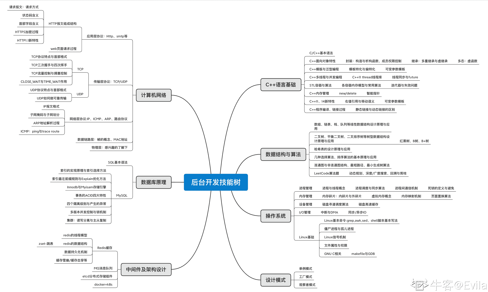

# 第二章 第 2 节 牢固基础——必要条件

> 原文：[`www.nowcoder.com/tutorial/10094/8b55861ecc424b02842e0bce1c24dfbc`](https://www.nowcoder.com/tutorial/10094/8b55861ecc424b02842e0bce1c24dfbc)

# 1\. 岗位考点技能树(C++后台开发)

专刊希望能为读到的同学提供相对较为全面的知识梳理，本节将 C++后台开发岗位的必备技能梳理成脑图，为同学们提供面试准备的全局视野和自身不足的检视。同时在下文每部分的知识点进行梳理总结。 

> 同学们可以放大网页查看上图中展示的 C++后台开发技能树，点开图片似乎并不容易放大

互联网公司对于后台开发岗位候选人的首要要求都是**基础牢固**。基础不仅仅是对程序设计语言的语法、特性以及发展动态要熟悉，而且要求对于后台开发涉及到的内容 (例如：**语言基础、数据结构、操作系统、计算机网络、数据库、设计模式、软件工程、分布式**) 均具有较为扎实的基础。互联网大厂的面试一般会进行多个轮次，如果基础不过关，根本不会有机会去展示自己所做的项目、参与的竞赛或者发表的学术成果。

> ps: 记得我第一次面试时，面试官问：请你介绍一下 TCP 的滑动窗口。我甚至回答：我对计算机网络不太熟悉。结果也就是自己熟悉的内容都没有展现的余地，就挂了。

## 2\. C++语言基础要点

### 2.1 C++基本语法与特性

*   C 语言与 C++语言的区别
*   指针与引用的特性与区别
*   野指针的概念以及如何避免
*   static、const、volatile、extern 关键字的作用
*   C++的四种类型转换：static_cast, dynamic_cast, const_cast, reinterpret_cast
*   inline 内联函数与#define 宏定义的区别
*   C++的异常处理机制
*   C++程序编译、链接机制、静态链接与动态链接库的制作方法与区别

### 2.2 C++面向对象三大特性

*   封装：构造函数/析构函数的作用、explicit 关键字、初始化列表的优点与成员变量顺序
*   继承：继承访问控制、虚继承与菱形继承
*   多态: 虚函数作用与实现机制、静态多态：函数重载与模板机制

### 2.3 C++内存管理

*   new/delete 操作符与 malloc/free 函数的关联与区别
*   野指针的概念，如何避免和检测野指针
*   进程的内存分区情况与功能
*   内存泄漏如何检测和避免
*   智能指针的设计思想、实现原理

### 2.4 C++多线程与并发编程

*   C++11 标准库提供的线程库 std::thread
*   future 异步任务与线程同步机制 std::future std::condition_variable
*   原子类型与原子操作 std::atomic
*   C++的锁机制 std::mutex

### 2.5 C++泛型编程

*   类模板与函数模板
*   模板特化、偏特化与萃取机

### 2.6 C++11 新特性

*   关键字及新语法：auto 类型推导、nullptr 关键字、for 循环新语法
*   std::chrono 时钟库、Lambda 表达式、
*   右值引用与移动语义
*   可变参数模板

### 2.7 STL 容器与算法

*   sequence-containers: vecotr、list、queue、stack
*   associative-containers: set、map、unordered_set、unordered_map
*   容器迭代器与分配器
*   常见的选择算法 find、排序算法 sort、堆算法 make_heap 等

> 同学们可以阅读专刊相对应的内容进行学习，同时这部分内容推荐阅读书籍：《C++ Primer》、《STL 源码剖析》、《Effective C++》、《深度探索 C++ 对象模型》。

## 3.数据结构与算法

### 3.1 线性数据结构

*   数组：一维数组与多维数组的基本概念和内存模型
*   链表：单链表、双向链表、循环链表的基本概念和内存模型
*   栈与队列:栈与队列的内存模型、联系与区别
*   算法：几种常见排序算法、2 分查找、链表中的快慢指针等

### 3.2 树形数据结构

*   二叉树：二叉树、完全二叉树、二叉搜索/排序树的基本概念；叶子节点与非叶子节点的计算公式；二叉树的遍历方式；
*   AVL 树、红黑树、B 树与 B+树的基本概念、联系与区别
*   算法：哈夫曼树与哈夫曼编码问题

### 3.3 图形结构

*   图、有向图、无向图的基本概念与内存模型；
*   图的深度优先遍历算法、广度优先遍历算法、最小生成树算法、最短路径算法。

### 3.4 哈希表

*   哈希表的基本概念与内存模型；散列函数概念；哈希冲突解决方法；rehash 的过程。

## 4\. 操作系统基础要点

### 4.1 进程管理

*   进程与线程的概念、区别
*   进程间/线程间通信的机制
*   进程运行状态、调度算法
*   进程间同步模型(生产者消费者模型、读者写者模型、哲学家就餐模型)
*   死锁的定义与避免算法

### 4.2 内存管理

*   内存碎片：外碎片与内碎皮的定义
*   虚拟内存的定义、设计目的、实现方式
*   页表及内存映射机制
*   页面置换算法

### 4.3 磁盘管理

*   磁盘寻道调度算法
*   磁盘高速缓存的概念

### 4.4 I/O 管理

*   中断及 DMA 的概念
*   同步、异步 I/O、I/O 复用(select、poll 和 epoll)

### 4.5 Linux 系统基础

*   linux 基本命令：文件管理相关命令(cat、find、mv、chmod、awk)、文档编辑及传输命令(grep、sed、scp)、磁盘管理及维护命令(cd、mkdir、tree)、网络监听级通讯命令(netstat、traceroute、ping、telnet)、进程及系统管理命令(ps、kill、top)
*   Shell 脚本写法
*   僵尸进程及孤儿进程
*   makefile 写法、GDB 调试

> 同学们可以阅读专刊相对应的内容进行学习，同时这部分内容推荐阅读书籍：《深入理解计算机系统》、《鸟哥的 linux 私房菜》、《Unix 环境高级编程》

## 5\. 计算机网络基础要点

### 5.1 应用层协议

*   HTTP 报文组成结构、状态码含义、请求方式
*   cookie/session 的定义与区别
*   HTTPS 的加密过程、认证与完整性保护机制
*   HTTP1.1 和 2.0 相关特性

### 5.2 传输层协议

*   TCP/UDP 协议的特点、首部组成结构、端口的定义
*   TCP 建立连接与断开连接过程、状态转换、报文分组与 MSS
*   3 次握手建立连接的意义
*   4 次挥手断开连接的意义，以及维持 CLOSE_WAIT 和 TIME_WAIT 状态的意义
*   TCP 提供可靠传输的机制：流量控制与拥塞控制
*   UDP 如何实现可靠传输

### 5.3 网络层协议

*   IP 数据报文格式、子网划分、IP 分片
*   ICMP 报文的两个应用：ping 与 trace route
*   ARP 协议的过程

### 5.4 数据链路层与物理层协议

*   帧的定义
*   MAC 地址与以太网的定义
*   交换机与路由协议

**最后，综合网络协议栈的各层协议，弄清楚：(1)网页解析 URL 过程中各层协议如何工作才使得浏览器可以得到网页内容; (2)网络泛洪攻击原理(syn_flood)及防御方法。**

> 同学们可以阅读专刊相对应的内容进行学习，同时这部分内容推荐阅读书籍：《计算机网络：自顶向下方法》、《TCP/IP 详解卷 1：协议》

## 6\. 数据库原理基础要点

### 6.1 SQL 语法

*   创建-删除-修改库表结构、增删改查记录、DISTINCT、LIMIT、排序、条件逻辑、通配符、统计计算、函数、文本截取、时间字段处理、数值函数、子查询、连接查询(内连接、外连接)、组合查询
*   SQL 的存储过程、触发器
*   关系型数据库设计范式

### 6.2 MySQL

*   MySQL 常用存储引擎：Innodb 和 Myisam 的特点与区别
*   MySQL 的索引底层存储结构、索引选择原则、Explain 计划
*   Innodb 引擎：事务的概念与 ACID 特性
*   Innodb 引擎：事务的四个隔离级别
*   Innodb 引擎：锁机制与多版本并发控制

### 6.3 MySQL 集群

*   分库分表、读写分离设计原则
*   MySQL 主从复制过程

#7 中间件与架构设计 消息中间件是后台架构设计中不可或缺的重要组件，候选人如果能够掌握 1 个或多个消息中间件，不仅能够在面试中大放异彩，而且在日后工作中也会提供很大帮助。

### 7.1 redis-数据缓存组件

*   redis 的基本用法、redis 的数据结构和内部原理
*   redis 的工作原理、数据持久化与事务机制
*   redis 的线程和进程模型，学习好性能 server 的设计架构

### 7.2 etcd-分布式一致性存储

*   etcd 的基本用法、etcd API 语法、etcd 集群的部署方式
*   etcd 的数据版本号机制、lease 机制、watch 机制
*   raft 分布式一致性协议的工作过程

此外，学习 nginx-Web 服务器和 MQ 消息队列也是不错的选择。

## 8 设计模式

### 8.1 单例模式

*   单例模式原理与作用；懒汉与饿汉模式下的线程安全问题；

### 8.2 工厂模式

*   工厂方法、简单工厂、抽象工厂的概念

### 8.3 迭代器、解释器