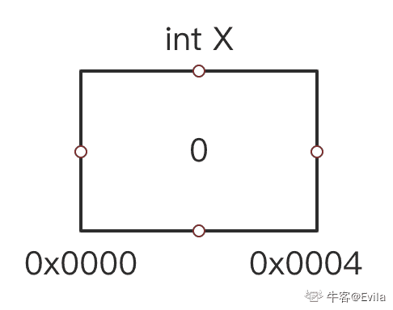
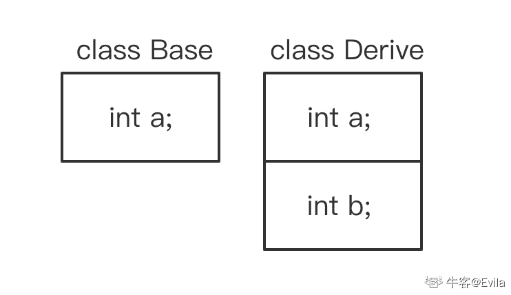
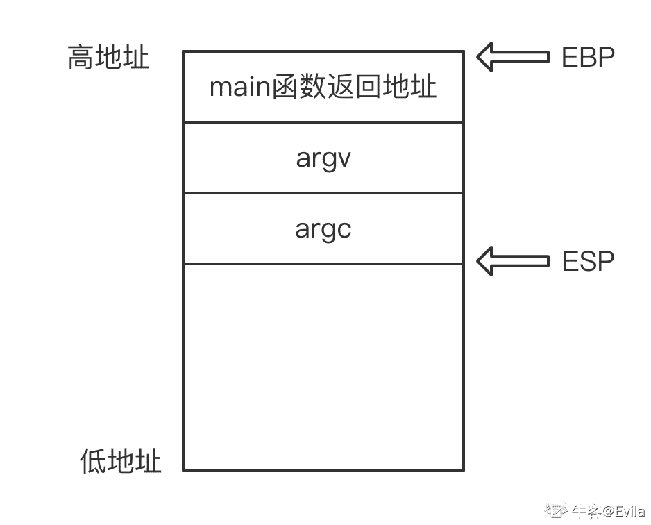
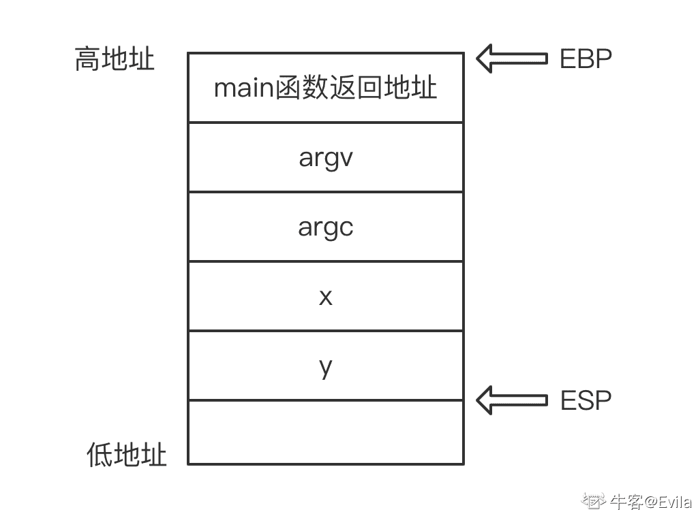
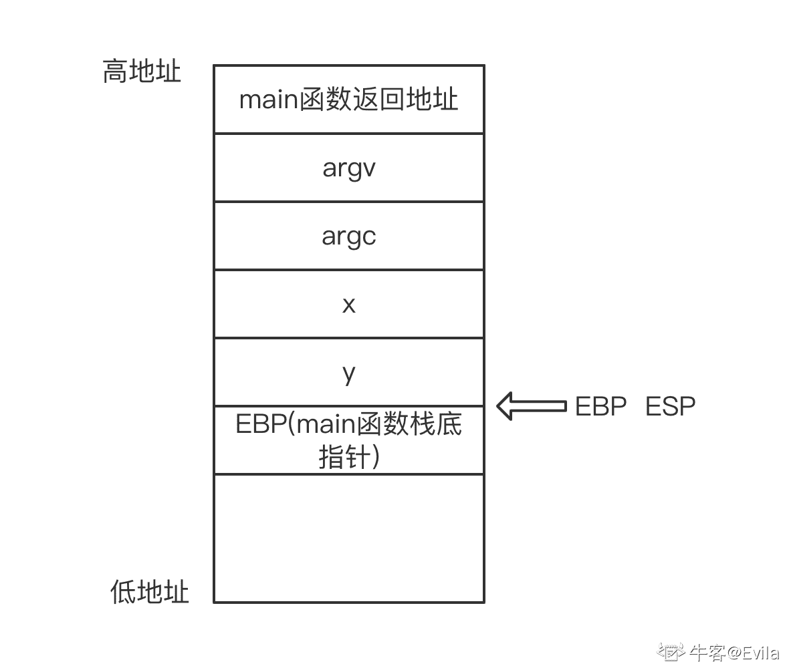
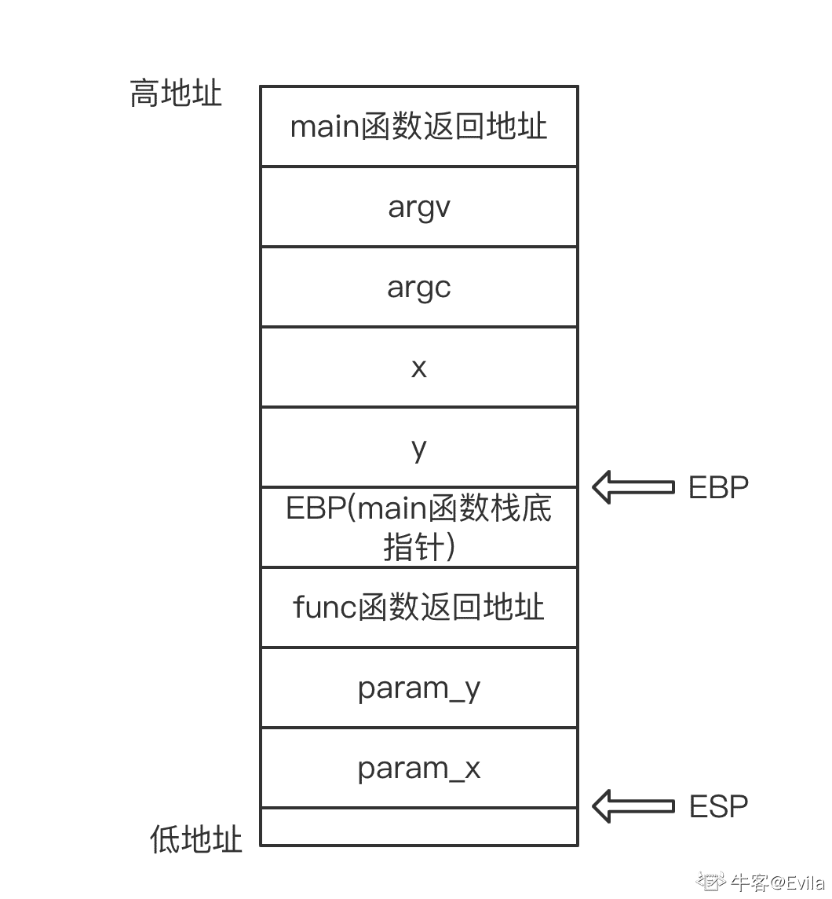
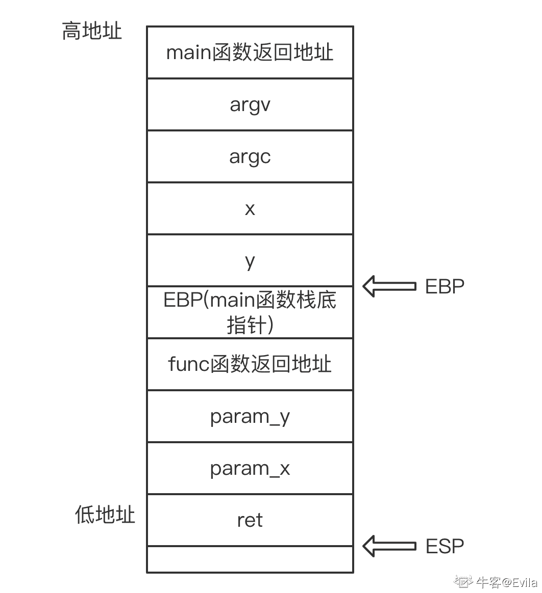

# 第三章 第 1 节 C++基本特性

> 原文：[`www.nowcoder.com/tutorial/10094/dd4414fcbcf7456db075c051981b156c`](https://www.nowcoder.com/tutorial/10094/dd4414fcbcf7456db075c051981b156c)

# 前言

本章的内容聚焦于 C++程序设计语言的基本特性，属于较为基础且常考的知识，每节针对 1-2 个基础特性进行讲解和举例，并在每节的最后将面试所涉及的考点进行总结。基础较为薄弱的同学需要全面深入理解这部分基础内容，基础较扎实的同学可以选择性的回顾。

## 1\. 指针与引用

### 1.1 变量与内存地址

变量(variable)标识一块内存区域，变量值被设置在这块内存区域中，变量拥有自己的名字，变量名用于标识变量存储的内存空间。 例如，当我们声明一个 int 型变量 x 时，x 是变量名，它的内存地址是 0x0000。在程序中使用变量 x 时经过两个步骤：(1)通过符号表找出与变量 x 相对应的内存地址。(2)根据内存地址取出该地址对应的内存值进行操作。 

### 1.2 指针

指针一般是指针变量，指针变量存储的是其指向的对象的首地址。按照指向对象的类型划分，指针可以指向变量、数组、函数等具有内存地址的实体，但不同类型的指针变量所占用的内存空间大小是相同的，在 32 位系统下为 4Byte。由于指针变量自身是变量，因此它的变量值是可以改变的，这使得指针变量可以更换指向的对象。

指针是 C/C++语言特有的内存操作机制，C/C++程序员可以使用指针对变量内存地址进行动态内存分配等灵活性操作，这也给予了 C/C++程序员极大的内存操作自由。

#### 1.2.1 变量指针

如代码所示，定义 int 型变量 x 与 int 型指针 ptr，使用连字号（&）运算符访问变量 x 的内存地址并赋值给 ptr。同理，对于结构体类型同样适用。

```cpp
int x = 0;
int *ptr = &x;  // int 类型指针 ptr 的值为变量 x 的内存地址
printf("x=%d", *ptr); // 通过使用运算符 * 来返回指针所指定地址的变量值 
```

```cpp
struct student;
student stu;
student *ptr = &stu;  // 自定义结构体类型指针 ptr 的值为变量 stu 的内存地址 
```

#### 1.2.2 数组名与指针

众所周知，C/C++语言中数组名是数组的首地址，数组名与指针概念较为相似，因此我们可以取数组名并赋值给一个指针，这样可以通过指针来访问数组成员变量。

```cpp
int array[6] = {1,2,3,4,5,6};
int *ptr = array;
printf("array[0]=%d", *ptr); // ptr 为数组的首地址，使用*操作符将返回数组的第一个元素值
// 指针支持++、--、+、-四种运算
printf("array[1]=%d", *(ptr++)); // *(ptr++)将返回数组第二个元素值，此时 ptr 也指向了数组的第二个元素地址 
```

注意：数组名与指针较为相似，但也有不同之处：

*   (1)数组名是指针常量，指针是指针变量;
*   (2)使用 sizeof 计算变量占用地址空间大小时，对数组名使用 sizeof 得到整个数组素有元素占用的字节，而对指针 sizeof 则得到指针变量占用的字节数(32 位系统下为 4 字节)。同理，使用&操作数组名和指针时意义也不同，此时数组名也代表了数组的整体，而非普通的常量指针。

#### 1.2.3 函数指针

众所周知，程序中定义的函数在编译时也会为函数分配存储空间，函数名为这段空间的首地址，因此我们可以定义一个指针来存储函数首地址，即函数指针。与变量指针定义不尽相同的是，函数指针的定义需要声明函数的返回值和参数列表：函数返回值类型 (* 指针变量名) (函数参数列表)。

```cpp
int func(int x);   // 声明一个函数
int (*ptr) (int x);  // 定义一个函数指针, 声明返回值为 int 类型，参数为 int 类型
ptr = Func;          // 将 func 函数的首地址赋给指针变量 ptr

// 调用
int x = 10;
int y = (*ptr)(x);  // 通过函数指针调用 func 函数 
```

#### 1.2.4 指针作为函数参数/返回值

众所周知，函数在调用和返回过程中存在形参到实参的拷贝和返回值拷贝，且函数在压内存栈的过程中实参和返回值会压入栈中，因此如果如果函数参数和返回值占用内存较大，会导致内存拷贝效率低并耗费大量栈内存。为了避免这一问题，C++允许将指针作为参数进行函数调用，指针变量占用内存大小是固定的,这极大的提高了函数调用的计算效率和内存消耗。

```cpp
// 使用 int 类型指针作为参数
void func(int* ptr);
struct student;
// 使用结构体指针作为参数
void func(student* ptr);
// 使用结构体指针作为参数和返回值
// struct* func(student* ptr); 
```

#### 1.2.5 指针使用的安全性

*   指针在定义时一定要初始化，可以为空指针(NULL/nullptr),若未初始化则会随机指向一块内存区域。
*   指针的操作注意变量作用域，例如在使用指针访问数组成员时，若访问越界则会产生无法预料的结果；不要在函数返回时传递栈空间的指针(函数定义的局部变量指针等)，因为函数调用结束后栈空间会被释放。(函数调用的压栈过程在 4.1 节内存管理中讲解)
*   指针指向的变量空间已失效(变量被销毁等)，那么在使用*操作符取指针指向变量值时会产生不可预料的结果。

### 1.3 引用

引用(reference)可以理解为变量的别名，实际上引用是一种常量指针，引用在被创建时初始化指向一个变量，在使用引用时自动调用*操作符取得变量值。

```cpp
int x;  // 声明 int 型变量 x
int &ref = x; // 使用&声明变量 x 的引用 ref 
```

#### 1.3.1 引用作为函数参数/返回值

与指针类似的，C++支持将引用作为函数参数和返回值调用。

```cpp
// 使用 int 类型指针作为参数
void func(int& ptr);
struct student;
// 使用结构体指针作为参数
void func(student& ptr);
// 使用结构体指针作为参数和返回值
// struct& func(student& ptr); 
```

### 1.3.2 关于函数调用中参数的值传递与地址传递

前文提到，函数在调用过程中存在形参到实参的拷贝，因此如果我们不使用指针或引用作为函数的参数，那么函数在执行过程中对实参的操作均是形参的拷贝，而形参变量并未参与函数的计算。

```cpp
// 值传递
void add(int x, int y);
// 地址传递
void add(int *x, int *y); // 指针
void add(int &x, int &y); // 引用 
```

使用指针和引用为程序减少的内存拷贝效率相信各位同学已经清楚了，在实践中使用指针时需要更多的考虑指针使用的安全性，在不涉及指针指向变量的改变时应尽量多的使用引用。

### 1.3.3 指针和引用的算数运算

指针的值是变量地址。因此，指针可以进行进行四种算术运算：++、--、+、-。并且，指针进行算数运算与指针指向变量的类型关联，若指针指向的是 int 型(4 字节)的变量，则该指针进行算数运算都会偏移 4 的倍数个字节。例如有一个指针 ptr 指向内存地址为 1000，指针为指向 int 型变量的指针，则 ptr++运算后该指针会指向 1004 的位置。

引用的算数运算即是引用对象的算数运算。

### 1.4 面试考点

#### 1.4.1 指针与引用的区别是什么？

【出现频度】★★★★★ 【难度】☆☆ 【参考答案】

*   存在形式：指针是一个变量，有自己的内存空间；而引用只是一个变量的别名。因此在使用 sizeof 获取指针和引用的内存大小时，指针的大小是 4(32bit 系统下)，而引用则返回被引用对象的内存大小。
*   初始化时：指针可以被初始化为 NULL，而引用必须被初始化关联一个已有对象。
*   初始化后：指针可以被修改指向其他变量，而引用不可以改变所引用的对象。
*   使用操作上：指针需要被解引用才可以进行变量操作，指针对于++、--、+=、-=操作符具有特殊的意义；而对引用的操作就是直接修改所引用的变量的值。
*   其他：指针可以有多级指针（**ptr），而引用不存在多级引用。

#### 1.4.2 指针操作对象的方式？指针作为函数参数时的地址传递介绍

【出现频度】★★★★★ 【难度】☆☆ 【参考答案】

*   指针通过解引用操作符*对其指向的对象进行操作
*   指针作为函数参数传递后，在函数中操作指针类型的形参进行对象的操作，也会改变实参对象；实际上，通过指针操作的是同一个对象，同一片内存空间。

#### 1.4.3 指针和引用的算数运算

【出现频度】★★★★★ 【难度】☆☆ 【参考答案】 参考 1.3.3。 本题考查的本质实际为指针自身是一个变量，它的值为它指向对象的内存空间。而引用是个别名，对引用的操作就是对原对象的操作。

## 2\. const 与 static 关键字

const 实现了常量语义，使得编译器强制对 const 修饰的变量约束不可修改。若在程序设计中某个变量的值是保持不变的，那么程序应该明确使用 const 来强制约束。

### 2.1 const 常量语义

#### 2.1.1 const 修饰普通变量

```cpp
const int x = 0; // const 修饰变量 x 为常量
x = 1; // 错误，x 不可修改
int y = x; // 正确 
```

变量 x 被 const 修饰为常量，x 的值不可以被修改，但当尝试使用指针来修改变量 x 时：

```cpp
const int x = 0; // const 修饰变量 x 为常量
int *ptr = (int*)&x;
(*ptr) = 1;
cout<<x<<endl;  // 输出 0
cout<<*ptr<<endl;  // 输出 1 
```

这段代码可以编译通过，但运行时我们会发现输出指针 ptr 指向的地址空间值是 1，但输出变量 x 的值仍是 0。这与编译器的优化有关，编译器发现定义变量 x 与输出变量 x 的代码之间没有对变量 x 进行修改，那么在输出 x 的值时候编译器会从寄存器中读取上次读变量 x 的值，而不是真正的去变量 x 所在的内存地址去取值。因此，若变量 x 被明确修饰为 const 常量时，我们不应该想方设法去修改 x 的值，这样会产生不可预料的后果。

为了避免上述问题，我们可以使用 volatile 去修饰变量 x，来告知编译器这个变量值是多变的，在取变量值时编译器会从该变量的内存地址取，从而避免由于编译器优化产生的取值错误。

```cpp
volatile const int x = 0; // const 修饰变量 x 为常量
int *ptr = (int*)&x;
(*ptr) = 1;
cout<<x<<endl;  // 输出 1 
```

#### 2.1.2 const 修饰指针

常量指针：const 修饰指针指向的内容，即指向常量的指针。指针指向的变量 x 不可通过指针 p 改变其值，简称左定值，即 const 位于*号的左边。

```cpp
int x = 0;
// 以下两种写法都是常量指针
const int *p = &x;  
int const *p = &x; 
```

指针常量：const 修饰指针，指针自身为常量，即指针指向的内存地址不可改变，但内存中存储的值可以被改变，简称右定值，即 const 位于*号的右边。

```cpp
int x = 0; 
int* const ptr = &x; 
*ptr = 1； // 正确
int y = 0;
ptr = &y; // 错误 
```

指向常量的指针常量：常量指针与指针常量的合并，使用两个 const 修饰，指针指向不可改变，指向的内容也不可以改变。

```cpp
int x = 0;
const int * const  ptr = &a; 
```

#### 2.1.3 const 修饰函数参数和返回值

*   const 修饰函数参数 如果函数参数确实是常量语义，那么应该明确使用 const 修饰函数参数中的指针和引用，可以避免函数在调用过程中产生不正确的篡改。

```cpp
struct student;
// 在函数中对 ptr 指针的修改和 stu1 变量的修改都是不允许的
void func(const student* const ptr, const student& stu1); 
```

*   const 修饰函数返回值 如果函数的返回值是指针类型，且使用 const 修饰返回指针，那么根据 const 修饰指针的位置进行常量限制，且该返回值只能赋值给同类型的指针。

```cpp
const char * getString(); // 函数声明，返回值类型是 char 类型的常量指针
char* pStr = getString(); // 错误，不能将 const char* 赋值给 char*类型变量
const char *pStr = getString(); // 正确 
```

#### 2.1.4 const 修饰类成员函数

const 修饰类成员函数作用是限制成员函数不能修改成员变量的值，但 const 不能与 static 共同修饰类的成员函数，因为 static 修饰的类成员函数在调用时不通过 this 指针不能实例化，const 成员函数必须关联到具体的实例。

```cpp
class student 
{
    public:
        student(std::string name) : m_name(name) {}
        std::string getName() const
        {
            // 在这一成员函数中不允许修改成员变量的值
            return m_name;
        }
    private:
        std::string m_name;
}; 
```

#### 2.1.5 面试考点: const 关键字的作用和意义是什么？

【出现频度】★★★★ 【难度】☆ 【参考答案】 const 关键字实现了常量语义，在程序设计中一些不会发生变化或不应被修改的变量应明确使用 const 进行常量修饰，以取得编译器的帮助。const 用来修饰普通变量为常量不被修改；const 修饰指针变量，根据 const 所在的不同位置限制指针指向的修改和指向变量被修改的能力；const 用来修饰函数参数和返回值，函数在调用过程中 const 参数不会被修改；const 修饰类的成员函数，该成员函数在调用过程中无法修改成员变量的值。

### 2.2 static 静态语义

#### 2.2.1 static 修饰局部变量

无论是内置类型还是自定义类型的局部变量和指针，函数中的局部变量和指针会在栈空间开辟内存(第四章详述 C++内存管理)，当函数调用结束时从栈中弹出。但如果我们想保存局部变量的值到后续的函数调用中，我们可能会考虑使用全局变量，但全局变量的缺点是放大了该变量的访问范围(语义上是局部变量，但却成为了全局变量，产生了不必要的风险)。

static 修饰局部变量为静态局部变量可用于解决这一问题，静态变量的内存位置则从栈区移动到了全局(静态)存储区,局部变量的生命周期得到延续(全局静态存储区在进程运行结束时自动释放)。且无论函数调用多少次，static 修饰的静态局部变量只执行初始化一次。

```cpp
#include <iostream>
using namespace std;
int func(){
    static int count = 10; // 在第一次进入这个函数的时候，static 变量 count 被初始化为 10,且只初始化一次。
    return count--;  // 每次执行 func 函数都对静态 count 变量进行--
}
int count = 1;  // 全局的 count 变量
int main()
{
     for(; count <= 10; ++count)
        cout<<count<<func()<<endl;
     return 0;
} 
```

static 修饰符的另一个作用是限制变量可见性，被 static 修饰的静态变量只能在本文件中被访问，其他文件即便使用 extern 外部声明也不可以访问该变量。这一特性可以避免在不同的文件中定义同名函数和同名变量产生的命名冲突。

static 可为程序提高效率，因为 static 修饰的变量存储在内存的全局(静态)存储区，在全局(静态)存储区所有内存字节默认值是 0x00，即变量值默认都是 0。因此，当程序在初始化一个矩阵值全为 0 时，不需要进行 2 层循环去遍历每个数组成员，只需将数据声明为 static 即可。

#### 2.2.2 static 修饰类成员

被 static 修饰的成员函数和成员变量是属于类的静态资源，类的所有实例共享，不能通过 this 指针访问静态资源。

*   static 修饰成员变量 static 修饰类的成员变量，则该成员变量是类的静态变量，进程内存空间中只有一个副本。由于静态成员变量存储在全局静态存储区，与类的对象存储区域无关，因此不能在构造类的对象时(构造函数)中初始化静态成员变量，只能在类的外部进行初始化静态资源。

```cpp
class student 
{
public:
    static std::string class_name;
};
std::string student::class_name="student"; 
```

*   static 修饰成员函数 static 修饰类的成员函数，则该成员函数被类的所有实例共享，静态成员函数调用过程没有 this 指针参与，因此静态成员函数调用具有以下的限制： (1)不能在静态成员函数中使用类的非静态成员变量 (2)不能在静态成员函数中调用非静态成员函数 (3)不能把静态成员函数声明为虚函数

```cpp
class student 
{
public:
    static void output_classname() 
    {
        cout<<class_name<<endl; // 正确
        set_age(10); // 错误,不能在静态成员函数中调用非静态成员函数
        cout<<stu_age<<endl; // 错误,不能在静态成员函数中使用类的非静态成员变量
    }
    void set_age(int age)
    {
        stu_age = age;
    }
public:
    static std::string class_name;
    int stu_age;
};
std::string student::class_name="student"; 
```

### 2.2.3 面试考点: static 关键字的作用和意义是什么？

【出现频度】★★★★ 【难度】☆ 【参考答案】 static 关键字实现了静态全局语义。

*   作用 1: static 保持变量内容持久，修饰局部变量时可以使局部变量成为静态全局变量，且局部变量的作用域不被打破。
*   作用 2: static 隐藏变量的可见性，static 修饰的变量和函数只能在本文件中使用，其他文件无法使用。
*   作用 3: static 修饰的变量默认初始化为 0。
*   作用 4: static 修饰类的成员变量和成员函数，使其为该类的所有成员共享，因此无法通过 this 指针访问类的 static 成员，static 成员函数也只能访问类的静态数据和静态成员函数。

## 3\. C++的四种类型转换

在 C 语言中，可以使用 Type b = (Type)a 的语法形式实现不同类型变量之间的类型转换；例如，将 float 浮点型转换成 int 整型：

```cpp
float a = 3.14;
int b = (int)a; 
```

C++继承了 C 风格的类型转换，但是这种类型转换没有编译时和运行时的安全性检查。因此，C++引入了四种类型转换来解决不同情况下的强制类型转换安全问题。

### 3.1 const_cast 常量类型转换

```cpp
const_cast<type> (expression); 
```

const_cast 的两个作用：

*   const_cast 用于去掉变量的 const 属性，由于 const 修饰变量为常量，且 const 变量不能直接赋值给非 const 的变量，因此代码语义需要修改 const 变量的值或想要将 const 变量的值赋值给非 const 变量时，必须使用 const_cast 去掉 const 属性。
*   const_cast 也可用于为变量加 const 属性，但使用较少，因为非 const 类型变量可直接赋值给 const 类型变量。

> 注意：const_cast 只能对指针或引用添加或移除 const

来看一个例子：

```cpp
const int x = 0;
x = 1; // 编译报错 const 变量不允许修改
int &y = const_cast<int &>(x) = 0; 
y = 1; // 使用引用去掉 const，正确 
```

> 此时，引用 y 是 const 变量 x 的别名(x 与 y 的内存相同)，但输出 x 和 y 的值时：x=0，y=1，x 依旧没变，这是因为编译器在编译时将 0 替换了变量名 x。但对于程序来说，已经达到了目的，即可以使用引用 y 来修改。

一个指针类型的例子：

```cpp
int *ptr = const_cast<int *>(&x) = 0;
*ptr = 1; // 使用指针去掉 const，正确 
```

再看一个自定义类型的例子。

```cpp
class student
{
public:
    student() {m_name = "Evila";}
    std::string m_name;
};
int main()
{
    const student s1;
    student* ptr = const_cast<student *>(&s1);
    ptr->m_name = "Nowcoder";
    cout<<s1.m_name<<endl;  // Nowcoder
    cout<<ptr->m_name<<endl; // Nowcoder
    return 0;
} 
```

### 3.2 static_cast 静态类型转换

```cpp
static_cast<type> (expression); 
```

static_cast 是类似于 C 风格的强制类型转换，常用于基本类型之间的转换，但不可用于除空指针外的指针数据强制转换。

*   基本类型之间的转换：例如 int 与 float、int 与 char、int 与 enum 等，需要程序员保证安全性。
*   空指针与其他目标类型指针之间互相转换：例如 void**与*int*。
*   基类与派生类的指针或引用之间转换(不推荐)：上行转换(派生类指针/引用转基类类型)安全、下行转换(基类指针/引用转换成派生类类型)**危险**，缺少动态类型检查。

> 为什么基类指/引用转换为派生类指针/引用是不安全的？ 如图所示：在基类中有 int 型成员 a，派生类中有 int 型成员 b 和继承自基类的成员 a。当我们定义了一个基类指针 ptr 指向派生类对象时，由于 ptr 只能解释基类的内存长度，因此当 ptr 指向基类对象时，且 ptr 被强制转换为派生类指针，使用 ptr 访问派生类自定义的成员时会发生无法预料的结果。因此，基类与派生类之间的指针和引用之间的上行转换是安全的，下行转换是非常危险的。 

### 3.3 dynamic_cast 动态类型转换

```cpp
dynamic_cast<type> (expression); 
```

如上节所述，dynamic_cast 用于基类指针/引用向派生类指针/引用进行安全的转换(安全的向下转型)；至于向上转型本身就是安全的，使用 static_cast 可提高效率。使用 dynamic_cast 进行向下转型有两种情况：

*   当基类指针指向的对象是派生类对象时，该基类指针转换为派生类指针是安全的，因为该指针指向的是派生类的对象，无论我们通过指针访问基类的成员还是派生类的成员都是安全的。dynamic_cast 转换成功时返回值是转换后的指针。
*   当基类指针指向的是基类对象时，该基类指针转换为派生类指针是危险的。dynamic_cast 转换的基类必须有[虚函数](https://blog.nowcoder.net/n/fb6cfda4c27c448c9e20ca90c46344a0)，dynamic_cast 在转换时依赖虚指针进行运行时检查，若本次下行转型的基类指针指向的对象是基类对象，则转换失败返回 NULL。
*   同样的，对于基类类型的引用在下行转型时，若该引用是派生类对象的引用转换是安全的，dynamic_cast 返回值是转换后的引用；若该引用是基类对象的引用转换是危险的，dynamic_cast 抛出 bad_cast 异常，因此程序应在转换时进行必要的异常捕获与处理。

```cpp
class person
{
public:
    std::string m_name;
public:
    virtual std::string getType() {return "person";} // 注意 基类必须声明了虚函数
};
class student : public person
{
public:
    std::string stu_id;
public:
    virtual std::string getType() {return "student";}
}
int main()
{
    // 我们定义一个基类指针，new 一个派生类对象
    person *ptr = new student();
    // 此时我们想进行下行转型，即把 ptr 指针类型从 person 类转换成 student 类
    ptr = static_cast<student *>(ptr);  // 此时不需要使用 dynamic_cast

    --------------------分割线------------------------------------------
    // 我们定义一个基类指针，new 一个基类对象
    person *ptr = new person();
    // 此时我们想进行下行转型，即把 ptr 指针类型从 person 类转换成 student 类
    ptr = dynamic_cast<student *>(ptr);  // dynamic_cast 转换失败，返回 NULL
    return 0;
} 
```

### 3.4 reinterpret_cast 重新解释转换

```cpp
reinterpret_cast<type> (expression); 
```

reinterpret_cast，顾名思义：interpret 为解释，re 为重新，reinterpret_cast 进行变量各 bit 位的二进制级重新解释，即将一个类型的变量值交给另一个类型去解释。reinterpret_cast 经常用于以下几种场景：

*   从一个类型的指针/引用转换到另一个类型的指针/引用
*   指针类型与足够大的整形之间相互转换
*   从某个函数的指针转换到另一个函数的指针
*   从一个对象的指针转换到另一个不同类型的对象指针
*   ... ... reinterpret_cast 所能够执行的类型转换十分强大，这也使得 reinterpret_cast 操作的安全性需要程序员保障。 举两个例子：

```cpp
int funcA() {return 0;}
int main()
{
    typedef void(*VoidFuncPtr)();  // 定义 VoidFuncPtr 这个类型，它是指向返回值是 void 且没有参数的函数的指针
    VoidFuncPtr ptr = &funcA; // 编译不通过，因此 funcA 的返回值是 int；
    // 但我们可以使用 reinterpret_cast 对 funcA 的值进行重新解释
    VoidFuncPtr ptr = reinterpret_cast<VoidFuncPtr>(&funcA);
    // 此时，ptr 仍然指向 funcA 函数的首地址，但是 funcA 函数的返回值被重新解释为 void
    return 0;
} 
```

```cpp
int main()
{
    typedef void(*FuncPtr)(int);  // 定义 FuncPtr 这个类型，它是指向返回值是 void 且有一个 int 参数的函数的指针
    int test_value = 0;  // 定义一个 int 变量
    FuncPtr ptr; // 定义一个变量 ptr，它是一个函数指针
    // 使用 reinterpret_cast 对 test_value 的值重新解释为返回值是 void 且有一个 int 参数的函数的指针
    ptr = reinterpret_cast<FuncPtr>(&test_value);
    ptr(test_value); // 运行错误，因为 ptr 指针指向的地址不是一个函数的入口，而是一个 int 类型变量
    return 0;
} 
```

### 3.5 面试考点：介绍下 C++的四种类型转换？

【出现频度】★★★ 【难度】☆☆☆☆ 【参考答案】 需要候选人对 C++的四种类型转换有较深的认知，有代码实践可以加深类型转换的作用和安全属性。

*   1.const_cast 经常用于去掉变量的 const 属性，也可用于为变量加 const 属性。由于 const 修饰变量为常量，且 const 变量不能直接赋值给非 const 的变量，因此代码语义需要修改 const 变量的值或想要将 const 变量的值赋值给非 const 变量时，必须使用 const_cast 去掉 const 属性。
*   2.static_cast 是类似于 C 风格的强制类型转换，常用于基本类型之间的转换，但不可用于除空指针外的指针数据强制转换。
*   3.dynamic_cast 用于基类指针/引用向派生类指针/引用进行安全的转换(安全的向下转型)；至于向上转型本身就是安全的，使用 static_cast 可提高效率。
*   4.reinterpret_cast 进行变量各 bit 位的二进制级重新解释，即将一个类型的变量值交给另一个类型去解释。 |reinterpret_cast 用于以下几种场景| |::| |从一个类型的指针/引用转换到另一个类型的指针/引用| |指针类型与足够大的整形之间相互转换| |从某个函数的指针转换到另一个函数的指针| |从一个对象的指针转换到另一个不同类型的对象指针|

## 4\. 函数调用过程与内联函数

### 4.1 函数调用过程

函数定义由 4 个元素组成，分别是函数名、形参列表、返回值类型和函数主体，C/C++程序启动时会调用 main()函数，其他函数在代码中调用函数名即时对该函数进行调用。函数的调用依靠内存中的栈空间(关于 C++内存管理可移步第四章内容)，以下面代码块中的定义的函数调用为例，逐步分析函数调用过程与内存栈空间的变化。

```cpp
int func(int param_x, int param_y)
{
    int ret = param_x + param_y;
    return ret;
}
int main(int argc, char* argv[])
{
    int x, y;
    func(x, y);  // 在 main 函数中调用 func 函数
    return 0;
} 
```

内存的栈空间是向下生长的，即从内存的高地址向低地址拓展，栈顶的地址要比栈底低。C/C++程序从 main()函数开始，main()函数调用其他子函数，子函数同样可以调用自身和其他子函数，为了实现函数调用、恢复现场和归还栈空间，每次的函数调用都有它自己独立的一个栈帧。栈帧中包含函数形参列表、函数的局部变量、函数返回地址。并使用两个指针来指向函数栈帧，EBP 指针指向函数栈帧的栈底(固定)，ESP 指向函数栈帧的栈顶(随函数运行变化)。 在本案例中，main 函数为调用方，func 函数为被调用方，程序的函数调用过程如下：

*   1.压栈：程序启动时，main 函数栈帧生成，依次将 main 函数返回地址入栈和函数参数从右至左压栈。



*   2.跳转执行：跳转到 main 函数执行，在 main 函数中定义了两个 int 变量 x 和 y，压入栈中,ESP 向下拓展。



*   3.调动子函数：main 函数中调用 func 函数，func 函数栈帧生成，main 函数的 EBP 栈底指针入栈，当前的 ESP 赋值给 EBP；



*   4.压栈：依次将 func 函数返回地址入栈和函数参数从右至左压栈,ESP 向下拓展。



*   5.跳转执行：跳转到 func 函数执行，在 func 函数中定义了一个局部变量 ret 压入栈中,ESP 向下拓展。



*   6.恢复：func 函数调用完毕，局部变量 ret、形参列表、返回地址依次出栈，ESP 随之收缩，EBP 恢复到 main 函数的栈底值。


*   7.恢复：main 函数调用完毕，局部变量、形参列表、返回值依次出栈。程序结束，图略。

### 4.2 面试考点：C++函数调用的过程？

【出现频度】★★★ 【难度】☆☆☆☆☆ 【参考答案】 关于这个问题的回答，若候选人对 C++函数调用过程的汇编、寄存器、栈内存等动作流程比较熟，则可以从较深层次进行回答。若候选人对函数调用的底层不够熟悉，则可以选择回答出函数调用的压栈过程。总的来说围绕栈内存回答函数的调用过程：

*   1.从 main 函数开始执行，编译器会将操作系统的运行状态，main 函数的返回地址、main 的形参列表、main 函数中的局部变量依次压栈。
*   2.当 main 函数开始调用其他函数时，编译器会将 main 函数的运行状态压栈，再将子函数的返回地址、子函数的形参列表、子函数定义的局部变量依次压栈。

### 4.3 内联函数

内联函数在编译时，编译器会将函数的代码副本放置在内联函数被调用处进行代码展开，对内联函数进行任何修改，需要重新编译该内联函数的所有调用处，因为编译器需要重新更换一次所有的代码，否则将会继续使用旧的函数。 定义内联函数的方式：在函数声明前加 inline 关键字

```cpp
inline int add(int x, int y); 
```

在类定义中的定义的函数(即使未使用 inline 修饰)都是内联函数，例如：

```cpp
class person
{
public:
    int add(int x, int y)    // 未使用 inline 修饰编译器也会将其视为内联函数
    {
        return x + y;
    }
} 
```

*   优点：内联函数在函数调用处进行代码展开，取消了函数的参数压栈等调用过程。当函数体比较小或函数实现机制比较简单的时候, 内联该函数可以令目标代码更加高效。
*   缺点：若内联函数函数体复杂或代码量较多，可能使目标代码量陡增，从而降低效率。因此，一般内联函数的函数体不要超过 10 行代码。此外，递归函数，或者函数中有 switch 或循环表达式时不应声明为内联函数，虚函数也不会被编译器正常内联。

### 4.4 面试考点：内联函数是什么？与宏定义有什么区别？

【出现频度】★★★★★ 【难度】☆☆ 【参考答案】

*   1.内联函数定义参考上节。
*   2.内联函数与宏定义的区别： (1)宏定义是在预处理过程中进行宏替换，内联函数是编译器控制进行代码展开。 (2)内联函数在编译器会像普通函数一样具有参数类型推导和安全检查，而宏只是宏替换。 (3)内联函数可以访问对象的私有成员函数，例如定义类的成员存取函数。