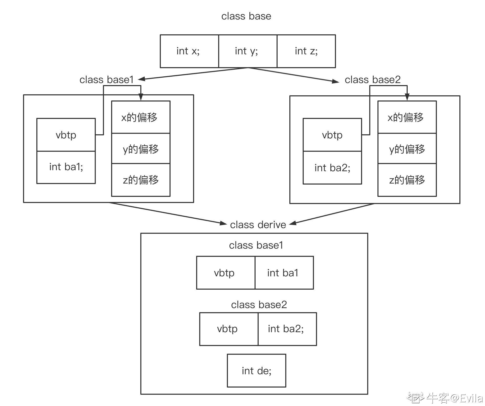

# 第三章 第 2 节 C++面向对象特性

> 原文：[`www.nowcoder.com/tutorial/10094/b06a4a10b4334cfaba2b120af50e00bd`](https://www.nowcoder.com/tutorial/10094/b06a4a10b4334cfaba2b120af50e00bd)

# 前言

本章的内容围绕 C++面向对象的三大特性：封装、继承、多态进行展开介绍，每节分别讲解面向对象特性的概念、意义、表现方式和实现原理，。

## 1\. 封装

面向对象程序设计与面向过程程序设计的不同之处在于，面向过程程序设计要分析出解决问题所需要的步骤，将涉及到的动作归纳成函数并按照相应的逻辑顺序调用；而面向对象程序设计从面临的问题中抽象出多个类(class)，类中描述出这个类在解决问题的过程中的属性(成员变量)和动作(成员函数)。因此，我们把客观的事物抽象成类这个行为称为封装，封装类的目的不是为了完成一个步骤，而是为了描述某个事物在解决问题中的属性和行为。类可以实例化成对象，并且通过设置访问限定符(未指明时默认为 private)把属性和动作向外部进行不同程度的开放和隐藏。

| 访问限定符 | 作用 |
| :-: | :-: |
| public | 公有权限，可以在类的外部访问 |
| private | 私有权限，仅能在类的内部访问 |
| protected | 受保护权限，能访问 private 成员处一定可以访问 protected 成员，在第二节继承处继续讨论受保护权限的意义 |

举个例子：要实现一个学生管理系统，经需求分析需要封装一个 student 类、一个学生管理类(先忽略该类的实现)，student 类具有私有(private，私有的属性/方法只能在类内部访问)的成员变量 m_name 和公有(public，公有的属性/方法可以在类的外部进行操作)的成员函数 getName()、setName()。在 main()函数中构建类 student 的对象实例，并操作对象的属性或方法。在类的外部，例如 main 函数中无需关注该类内部如何实现。**因此封装的意义可总结为：使代码模块化，对外部隐藏实现细节。**

```cpp
class stu_manager;  // 忽略实现
class student
{
private:
    std::string m_name;
public:
    std::string getName()
    {
        return m_name;
    }
    void setName(const std::string name)
    {
        m_name = name;
    }
};

int main()
{
    student s1;
    s1.setName("Evila");
    std::cout<<s1.getName()<<std::endl;  // Evila
    return 0;
} 
```

### 1.1 类的构造函数

类(class)是某个事物在解决问题中属性和行为的封装产物，类的属性由成员变量表达，类的行为由成员函数表达；构造函数是类中较为特殊的成员函数，构造函数在每次类实例化对象时调用。

*   构造函数的函数名与类名一致，没有返回值，一般用于赋值类的成员变量。若类没有定义构造函数，则编译器会自动定义默认的构造函数。进入构造函数意味着编译器已经认识了对象的内存结构并分配了存储空间，构造函数的作用是对成员变量进行赋值或申请资源，因此在进入类的构造函数之前会先构造类中的对象成员变量。

```cpp
class student
{
public:
    student() { m_SchoolName = "牛客大学"; }  // 类的构造函数用于赋值成员变量 m_SchoolName 的值
private:
    std::string m_SchoolName;
}; 
```

*   默认的构造函数不带有参数，但我们可以实现带参数的构造函数，这使得在实例化对象时可以通过传递参数来更方便的赋值对象的成员变量。

```cpp
class student
{
public:
    student() { m_SchoolName = "牛客大学"; }  // 默认的构造函数将成员变量 m_SchoolName 赋值为“牛客大学”
    // 带参数的构造函数将成员变量 m_SchoolName 赋值为传入的参数
    student(std::string schoolName) { m_SchoolName = schoolName; }  
private:
    std::string m_SchoolName;
}; 
```

*   初始化列表用于初始化成员变量列表，在构造函数后使用冒号':'和成员变量列表进行初始化可以避免 1 次构造函数调用。相对于构造函数，初始化列表是真正的初始化动作，构造函数则是赋值，初始化列表工作在构造函数之前。类中 const 成员变量、引用类型、没有默认构造函数的其他类类型必须在初始化列表中进行初始化动作。

```cpp
class student
{
public:
    student() { m_SchoolName = "牛客大学"; }  // 默认的构造函数将成员变量 m_SchoolName 赋值为“牛客大学”
    // 使用初始化列表初始化成员变量
    student(std::string schoolName) : m_SchoolName(schoolName), m_ClassName("student") {}
private:
    std::string m_SchoolName;
    const std::string m_ClassName;  // const 成员需要在初始化列表中进行初始化
}; 
```

> 注意：成员变量在使用初始化列表初始化的顺序，与类中声明成员变量的顺序有关。这是因为类中的成员变量的内存排列顺序在编译期间就确定了，初始化列表的初始化顺序是按照成员变量内存排列顺序进行。若我们编写的初始化列表中的成员变量顺序与类中定义的顺序不一致，则可能会导致顺序错乱的成员变量初始化失败。

```cpp
class Test
{
public:
    Test() : y(0), x(y + 2) 
    {
        cout<<x<<endl<<y<<endl; // x = 32768 y = 0 x 初始化失败
    } 

private:
    int64_T x;
    int y;
}; 
```

*   拷贝构造函数 拷贝构造函数是较为特殊的构造函数，一般用于复制其他对象的成员变量来构造新的对象。如果类中没有定义拷贝构造函数，则编译器会定义默认的拷贝构造函数,默认的拷贝构造函数会复制传入对象的成员变量并赋值给当前实例化的新对象。

> 注意：若类中定义了指针并动态申请了内存，则该类必须显示定义拷贝构造函数以表明指针如何拷贝。否则，若类未定义拷贝构造函数，编译器会自动实现默认的拷贝构造函数，默认的拷贝构造函数中对指针成员的拷贝是浅拷贝，那么当拷贝构造的对象或被拷贝的对象析构时，二者的成员指针申请的内存资源会一起被释放。

```cpp
class student
{
public:
    student()
    {
        m_SchoolName = "牛客大学"; // 默认的构造函数将成员变量 m_SchoolName 赋值为“牛客大学”
        score_list = new int[10]; // 指针动态申请 10 个 int 变量所需的内存
    }  
    // 使用初始化列表初始化成员变量
    student(std::string schoolName) : m_SchoolName(schoolName), m_ClassName("student"), score_list(nullptr) {}
    // 拷贝构造函数
    student(const student& stu)
    {
        m_SchoolName = stu.m_SchoolName;    // 将 stu 的变量值复制给当前构造的实例
        score_list = new int[10];    // 指针成员动态申请 10 个 int 变量所需的内存
        // 深拷贝
        for (int i = 0; i < 10; i++)
        {    
            score_list[i] = stu.score_list[i]; // 循环复制 score_list 中的值
        }
    }
private:
    std::string m_SchoolName;
    const std::string m_ClassName;  // const 成员需要在初始化列表中进行初始化
    int* score_list;
}; 
```

### 1.2 类的析构函数

与构造函数类似的，类的析构函数也是类的成员函数，它在类的对象生命周期结束或动态分配的对象被删除时自动调用。析构函数用于释放对象所获取的资源，特别是若对象中有指针类型的成员变量，且动态申请了内存，析构函数中一定要释放动态申请的内存以避免内存泄漏。

*   析构函数的名字同样与类名相同，但增加了(~)作为前缀。
*   析构函数没有参数和返回值。
*   析构函数不能被重载、不能被主动调用。
*   若类没有定义析构函数，则编译器会定义一个默认的析构函数。在对象的析构过程中，对象的所有非 static 的对象类型成员变量的析构函数都会被调用。

```cpp
class student
{
public:
    student()
    {
        m_SchoolName = "牛客大学"; // 默认的构造函数将成员变量 m_SchoolName 赋值为“牛客大学”
        score_list = new int[10]; // 指针动态申请 10 个 int 变量所需的内存
    }  
    ～student() 
    {
        delete[] score_list; // 析构函数 释放动态申请的内存资源
    }
private:
    std::string m_SchoolName;
    const std::string m_ClassName;  // const 成员需要在初始化列表中进行初始化
    int* score_list;
}; 
```

### 1.3 this 指针与成员函数调用

#### 1.3.1 对象内存布局

类中非 static 成员变量被顺序置于对象内存中，对象占的内存空间则只计算非 static 成员变量的内存大小，static 成员变量则置于全局静态存储区。static 与非 static 成员函数不置于对象内存空间中，而是与普通函数一样置于代码段，仅有一份内存实例，而不是每个类都有成员函数的拷贝。

#### 1.3.2 this 指针

由于每个对象的存储空间只包括该对象的成员变量，不包括成员函数代码所占有的空间，即同一个类的所有对象调用的成员函数代码只是单独一份，那么成员函数是如何辨别当前调用自己的是哪一个对象呢？

C++引入了 this 自引用指针，当使用类实例化对象时，编译器生成 this 指针指向实例化对象的内存地址，this 指针的值为对象的起始地址。 注意：一个对象的 this 指针并不是对象本身的一部分，不会影响该对象 sizeof()的结果。例如，对一个空类的对象执行 sizeof()，得到其内存大小是 1，而不是 4(一个指针的内存大小)。至于为什么空类实例化的对象占用内存大小是 1，原因是每个实例对象在内存中都应该有独一无二的内存地址，空类实例化对象时被编译器插进去的一个 char，使得这个类的不同对象在内存中都有有独一无二的内存地址。

this 作用域是在类内部，当类的非静态成员函数被调用时，编译器会自动将对象的 this 指针作为隐含参数加入到参数列表中。在非静态成员函数访问非静态成员变量都是通过 this 指针完成。

### 1.4 面试考点

#### 1.4.1 面试考点：请介绍面向对象封装的概念、意义和实现机制。

【出现频度】★★★★ 【难度】☆☆ 【参考答案】

*   概念：类是为了描述某个事物在解决问题中的属性和行为，把客观的事物抽象成类这个行为称为封装。
*   意义：封装使代码模块化，对外部隐藏实现细节
*   实现机制：封装将成员变量和成员函数聚集在类中，通过访问限定符限制类成员在类内部和外部的访问权限。类的成员函数有两个特殊形式，即类的构造函数和析构函数。构造函数在类的对象实例化时被调用，一般用于赋值成员变量；析构函数在类的对象生命周期结束时被调用，一般用于释放该对象申请的资源。

## 2\. 继承

继承可以根据一个类去定义另一个类，已有的类被称为基类(父类)，继承得到的类称为派生类(子类)，派生类在继承后就获得了基类的成员变量和成员函数。继承使得已存在的类能够被扩展，代码得到重用。

### 2.1 继承的访问控制权限

在第一节封装中，介绍了类成员的 public 和 private 访问控制权限，它们限制了类的成员能够被访问的位置。在类的继承过程中，需要指明继承方式是 public、protected 或 private，这使得派生类访问基类的成员被限制，派生类在三种继承方式下对基类成员的访问权限总结如下:

| 基类成员权限 | public | protected | private |
| :-: | :-: | :-: | :-: |
| 公有继承(public) | public:派生类可以访问 | protected:派生类可以访问 | private：派生类禁止访问 |
| 保护继承(protected) | protected:派生类可以访问 | protected:派生类可以访问 | private：派生类禁止访问 |
| 私有继承(private) | private:派生类可禁止访问 | private:派生类禁止访问 | private：派生类禁止访问 |

### 2.2 继承的基本特性

在定义类时，使用继承列表来指明继承自的基类和继承方式，若未指明继承方式则默认为 private 私有继承方式。基类的构造函数、析构函数、拷贝构造函数与基本重载的运算符不会被继承。

构造/析构函数的调用顺序 派生类在继承自基类后，派生类实例化对象时会执行如下的构造步骤：(1)调用基类的构造函数；(2)派生类中对象成员的构造函数;(3)派生类的构造函数，析构步骤则将构造顺序反转。

```cpp
class A
{
public:
    A()
    {
        cout<<"A construct"<<endl;
    }
    ~A()
    {
        cout<<"A destructor"<<endl;
    }
};
class person
{
public:
    person()
    {
        cout<<"person construct"<<endl;
    }
    ~person()
    {
        cout<<"person destructor"<<endl;
    }
    std::string m_name;
};
class student : public person  // 定义 student 类，公有继承自 person 类，student 类天生拥有 person 类的成员与函数
{
public:
    student()
    {
        cout<<"student construct"<<endl;
    }
    ~student()
    {
        cout<<"student destructor"<<endl;
    }
    A a;
};
int main()
{
    {
        student stu;
    }
}
person construct
A construct
student construct
student destructor
A destruct
person destructor 
```

### 2.3 多继承、菱形继承与虚继承

#### 2.3.1 继承的类对象内存布局

与非继承的类对象的内存布局类似，继承的类对象不仅包含基类的成员变量，而且包含了本类的成员变量，基类和派生类的非 static 成员变量被顺序置于对象内存中，而 static 成员变量则置于全局静态存储区。成员函数仅有一份实例在代码段。

#### 2.3.2 多继承及对象内存布局

*   C++支持多继承，即派生类可以继承于多个基类，派生类拥有所有基类的特性。多继承的语法与普通继承类似，在继承列表中使用逗号分割继承方式和基类名：

```cpp
class base1
{
public:
    int x;
}；
class base2
{
public:
    int y;
}；
class derive : public base1, public base2
{
public:
    int z;
}; 
```

一般多继承下 derive 的对象内存简易模型如下所示： 

#### 2.3.3 菱形继承及其带来的影响

*   多继承产生的二义性：当派生类继承自多个基类时，若在这多个基类中有同名的成员，则派生类中会对继承而来的同名成员产生歧义，因此不能通过成员名直接访问，需要增加域(::)运算符加以区分。例如：

```cpp
class base1 
{
public:
    int x;
};
class base
{
public:
    int x;
};
class derive : public base1, public base2
{
public:
    int de;
}; 
```

derive 的两个基类都有成员变量 x，因此 derive 类中有同名变量 x，在访问 x 时必须通过域(::)运算符制定来自哪个基类的变量 x。

*   菱形继承：若派生类继承于多个基类，这些基类又有共同的基类，就会形成菱形继承的分布。例如：

```cpp
class base
{
public:
    int x;
    int y;
    int z;
};
class base1 : public base
{
public:
    int ba1;
};
class base2 : public base
{
public:
    int ba2;
};
class derive : public base1, public base2
{
public:
    int de;
}; 
```

此时，菱形继承的派生类对象得到如下内存模型，可以发现在派生类 derive 中存在两份基类 base 的成员，尽管依然可以使用域(::)操作符来区分 derive 中的成员 x、y 和 z，但这对于 derive 来说无疑是内存空间的浪费。 

#### 2.3.4 虚继承及虚基类的特性

*   为了解决菱形继承带来的内存和计算资源的浪费，C++提供了虚继承机制，使得派生类在间接继承共同的基类时只保留一份间接基类的成员。虚继承的语法为：

```cpp
class derive : virtual public base; // 使用 virtual 关键字进行虚继承 
```

此时，类 base 是类 derive 的虚基类。

*   虚基类由它最后的派生类进行初始化，最后的派生类对象在构造时，不仅要调用直接基类的构造函数，还要调用虚基类的构造函数。由于虚基类只被最后的派生类进行初始化，不被其他中间的派生类初始化，因此避免了虚基类的成员被重复初始化。
*   在最后的派生类中访问虚基类的成员，也不需要使用域(::)来指明来自于哪个直接基类，因为最后的派生类中只有一份虚基类成员。

```cpp
#include<iostream>
#include<string>
using namespace std;
class base
{
public:
    int x;
    int y;
    int z;
    base()
    {
        cout<<"base construct"<<endl;
    }
    ~base()
    {
        cout<<"base destruct"<<endl;
    }
};
class base1 : virtual public base
{
public:
    int ba1;
    base1()
    {
        cout<<"base1 construct"<<endl;
    }
    ~base1()
    {
        cout<<"base1 destruct"<<endl;
    }
};
class base2 : virtual public base
{
public:
    int ba2;
    base2()
    {
        cout<<"base2 construct"<<endl;
    }
    ~base2()
    {
        cout<<"base2 destruct"<<endl;
    }
};
class derive : public base1, public base2
{
public:
    int de;
    derive()
    {
        cout<<"derive construct"<<endl;
    }
    ~derive()
    {
        cout<<"derive destruct"<<endl;
    }
};
int main()
{
    derive de;
    de.x = 0;
} 
```

执行结果如下：可以发现虚基类 base 只构造了一次。 

#### 2.3.5 虚继承的实现机制

通过上一节我们知道，虚继承可以解决类在多重继承过程中产生的二义性和内存浪费的问题，虚基类在派生类中只有一份成员，并只被初始化一次，那么虚继承的底层是如何实现的呢？

事实上，虚继承的实现是通过虚表指针(virtual base table pointer, vbtp)和虚基类(virtual base table, vbt)表实现的，每个虚继承得到的派生类对象内部都有一个虚表指针(4 字节)和一个虚基类表(不占对象的内存空间)。最后的派生类在实例化对象时对虚基类进行了一次初始化，虚基类表中记录了派生类的对象与虚基类对象的偏移地址，派生类对象通过偏移地址访问虚基类对象的成员。

虚基类的派生类被当做基类继承时，虚表指针也会被继承。虚继承方式下菱形继承的内存模型如图所示： 

### 2.4 面试考点

#### 2.4.1 面试考点：什么是菱形继承？菱形继承有什么影响？如何避免菱形继承产生的影响？

【出现频度】★★★ 【难度】☆☆☆☆☆ 【参考答案】

*   菱形继承：若派生类继承于多个基类，这些基类又继承于共同的基类，就会形成菱形继承的分布。
*   菱形继承带来的影响：在菱形继承中最后的派生类会包含共同基类的多份成员副本，不仅会产生访问共同基类成员的歧义，而且会带来内存空间的浪费。
*   使用虚继承避免菱形继承产生的成员访问歧义和内存浪费。虚继承的派生类对象会产生一个虚基类指针，指向虚基类表。虚基类表记录了派生类相对于基类成员的内存偏移，派生类在访问基类成员时，根据虚基类表的内存偏移访问基类成员，因此基类成员只有一份实例，派生类对象的内存空间没有基类成员的副本。

## 3\. 多态

多态通常指同一个接口实现不同的功能，其目的是实现接口的重用。在 C++中，多态按照编译器的实现机制可分为静态多态和动态多态，静态多态是编译器在编译期间就可以确定的接口重用，表现形式为：函数重载和模板，在调用函数时编译系统根据实参的具体情况确定函数的实现。动态多态是在运行过程中编译器根据对象动态绑定的实际类型调用相应的函数，表现形式为：虚函数。

### 3.1 虚函数及相关特性

在类中声明函数时增加 virtual 关键字将该函数声明为虚函数。若该类被当作基类进行继承得到派生类时，虚函数被继承到派生类中，派生类对继承得到的虚函数可以重新实现，这被称为虚函数覆盖(override)。当我们通过指针或引用调用虚函数时，编译器会根据动态绑定判断实际调用对象的函数实现。

总结：构成动态多态需要两个必备条件

*   1.调用函数必须通过对象的指针或者对象的引用。
*   2.被调用的函数必须是虚函数，且派生类进行了虚函数的覆盖。

如下例所示，首先定义基类 person，声明 printAge 函数为虚函数；接着定义了 person 的派生类 adult 和 young 并覆盖了 printAge 函数；最后使用基类指针动态创建派生类对象调用 printAge 函数时，编译器根据动态绑定机制调用指针指向的实际对象覆盖后的虚函数。

```cpp
#include<iostream>
#include<string>
using namespace std;
class person
{
public:
    virtual void printAge()
    {
        cout<<"年龄-未知"<<endl;
    }
};
class adult : public person
{
public:
    virtual void printAge()
    {
        cout<<"年龄>=18 岁"<<endl;
    }
};
class young : public person
{
public:
    virtual void printAge()
    {
        cout<<"年龄<18 岁"<<endl;
    }
};
int main()
{
    person* pAdult = new adult();
    pAdult->printAge();  // "年龄>=18 岁"
    person* pYoung = new young();
    pYoung->printAge();  // "年龄<18 岁"
} 
```

虚函数有一种特例——纯虚函数，纯虚函数在基类中没有定义，但要求任何盖基类的派生类都要对纯虚函数定义自己的实现方法。声明了纯虚函数的类被称为虚基类，虚基类不允许实例化对象。

定义纯虚函数的方法为在虚函数的原型后加`=0`：

```cpp
class Animal
{
public:
    virtual void Eat() = 0;
    virtual void Move() = 0;
}; 
```

纯虚函数及虚基类的意义在于：虚基类将有关的动作作为接口组织在一个继承层次结构中，由虚基类来为派生类提供一个公共的接口集。例如：由于 Animal 去实例化对象并不合理，因此我们将其定义为虚基类，Animal 作为一个虚基类可以派生出老鹰、狮子等子类，且不同的动物进食和移动的方式都不同，因此每个派生类都要实现虚基类的纯虚函数。

### 3.2 虚析构函数

通常情况下，虚函数在覆盖时不允许修改该函数的函数名、参数类型和返回值。但是有一个例外：基类中的析构函数如果是虚函数，那么派生类的析构函数尽管与基类的析构函数名不相同，编译器也会通过特殊的机制认为派生类的虚析构函数覆盖了基类的虚析构函数。

事实上基类的析构函数被声明为虚函数是被推荐的行为。一般情况下，析构函数的用于释放对象申请的资源，例如指针成员动态申请的内存需要去主动 delete 释放掉。当我们使用基类指针去指向派生类对象并 delete 该基类指针时，会发生两种情况：(1)若基类和派生类的析构函数不是虚函数，那么 delete 基类指针只会调用基类的析构函数，不会调用派生类的析构函数，此时若该对象成员中有指针类型且动态申请了内存，那么就不会在派生类的析构函数中被释放，从而造成了内存泄漏。(2)若基类和派生类的析构函数为虚函数，那么 delete 基类指针时会先调用派生类的析构函数、再调用基类的析构函数，因此安全的释放了对象资源。

```cpp
class person
{
public:
    person() {}
    virtual ~person() {}  // 虚析构函数
};
class student : public person
{
public:
    student() 
    {
        p = new char[256];
    }
    virtual ~student() // 虚析构函数
    {
        delete p;
    }  
    char *p;
}
int main()
{
    person* ptr = new student();  // 基类指针指向派生类对象
    delete ptr;  // 析构时先调用派生类的析构函数，释放动态申请的资源，避免了内存泄漏 
    return 0;
} 
```

### 3.3 虚函数的实现机制

至此我们已经认识到，基类中声明的虚函数在派生类中进行覆盖后，在通过指针或引用调用虚函数时编译器会调用对象的实际函数实现，从而实现了动态多态：同一接口在不同对象中具有不同的实现。那么虚函数是如何实现的动态多态机制呢？

前文讲解了虚继承的派生类中会生成一个虚表指针，它指向虚基类表，该表记录了派生类对象相对于虚基类对象的地址偏移。虚函数的实现机制与虚继承具有相似之处：声明了虚函数的对象会生成一个虚指针(Virtual table pointer, vtp)，它指向虚函数表(Virtual Table，虚表)，虚表中存储了该类声明的所有虚函数的入口地址。当该类被当做基类继承时，派生类同样会继承基类的虚表，且派生类覆盖继承得到的虚函数时，会在派生类的虚表中的相应位置将虚函数替换。

通常声明了虚函数的类实例化的对象的内存空间前 4 个字节为虚指针，在调用对象的虚函数时，通过该对象的虚指针访问虚表中函数的入口地址进行函数调用。声明了虚函数的类被当做基类继承时，派生类会继承基类的虚表。当派生类覆盖了基类的虚函数时，覆盖的新虚函数会在虚表中替换已有的函数入口地址，在实际调用时若调用对象为派生类对象，从而在实际调用时可以根据调用对象中的虚指针找到其指向的虚表中的正确函数入口。

单继承下声明了虚函数的基类与派生类对象的内存示意图：  可以发现，派生类覆盖了基类的虚函数 func1,并在派生类的虚表中替换了基类继承而来的 func1。

多继承时，若多个基类都声明了虚函数，那么派生类同样会继承多个基类的虚指针和虚表。

### 3.4 函数及运算符重载

虚函数和虚函数覆盖实现了动态多态性；另一方面，C++支持函数与运算符制定多个定义，分别称为函数重载和运算符重载。函数与运算符重载是指对已有的函数和运算符进行另一种实现，它们的函数和运算符名称相同，但函数或运算符的参数类型或数量不相同，且函数实现不相同。在调用重载的函数或运算符时，编译器根据传入参数的类型和个数来选择最匹配的函数实现，这是在编译期即可确定的决策过程，因此函数和运算符的重载是静态多态。

注意：函数重载的条件是参数类型或参数数量不相同，返回值是否不一致不是函数重载的决策条件。

```cpp
void func1(int i)
{
    cout<<"param's type is int"<<endl;
}
void func1(char i)
{
    cout<<"param's type is char"<<endl;
}
void func1(int i, char c)
{
    cout<<"param's type are int and char"<<endl;
}
int main()
{
    func1(1);  // param's type is int
    func1('c');  // param's type is char
    func1(1,'c');  // param's type are int and char
    return 0;
} 
```

*   运算符重载方式与函数重载较为相似，可以看做函数名是关键字 operator 加要重载的运算符的函数重载。但不是所有的运算符都可以被重载，下表给出可以重载和不可重载的运算符。

| 运算符类型 | 列表 | 不可重载的运算符列表 |
| :-: | :-: | :-: |
| 双目算术运算符 | + (加)，-(减)，*(乘)，/(除)，% (取模) |  |
| 双目算术运算符 |  |  |
| 关系运算符 | ==(等于)，!= (不等于)，< (小于)，> (大于)，<=(小于等于)，>=(大于等于) |  |
| 逻辑运算符 |  |  |
| 单目运算符 | + (正)，-(负)，*(指针)，&(取地址) | .和->(成员访问运算符), ::域运算符, sizeof 运算符 |
| 自增自减运算符 | ++(自增)，--(自减) |  |
| 位运算符 | ｜(按位或)，& (按位与)，~(按位取反)，^(按位异或),，<< (左移)，>>(右移) |  |
| 赋值运算符 | =, +=, -=, *=, /= , % = , &=, ｜=, ^=, <<=, >>= |  |
| 空间申请与释放 | new, delete, new[ ] , delete[] |  |
| 其他运算符 | ()(函数调用)，->(成员访问)，,(逗号)， | #(预处理符号) |

*   一个运算符重载的例子 假设我们要定一个商品类，它包含一个 int 整型变量 price，代表商品的价格。对于商品类的对象，我们定义他们相加的含义，即两个商品相加需要把他们的价格相加。

```cpp
class Merchandise
{
public:
    Merchandise(int price) 
    {
        price_ = price; // 初始化
    }
    // 我们重载 +运算符，使得+运算符可以实现两个商品的价格相加
    Merchandise operator+ (const Merchandise& obj) 
    {
        Merchandise tmp;
        tmp.price_ = this->price_ + obj.price_;
        return tmp;
    }
    int price_;
};
int main()
{
    Merchandise apple(5);
    Merchandise iphone(5000);
    Merchandise merchandise = apple + iphone;
    cout<<merchandise.price_<<endl; // 5005
    return 0;
} 
```

### 3.5 面试考点

#### 3.5.1 请介绍 C++中的多态。

【出现频度】★★★★★ 【难度】☆☆☆ 【参考答案】 多态是指多个同名的函数执行不同二点操作，使得同一个函数名具有不同的行为，其目的是实现接口的重用。 在 C++中，多态按照编译器的实现机制可分为静态多态和动态多态；

*   静态多态是编译器在编译期间就可以确定的接口重用，表现形式为：函数重载和模板，在调用函数时编译系统根据实参的值进行类型推导情况确定最适配的函数重载实现。
*   动态多态是在运行过程中编译器根据动态绑定的实际类型调用相应的函数，表现形式为：虚函数。基类中声明的虚函数被继承到派生类中，派生类对继承得到的虚函数可以重新实现，被称为虚函数覆盖(override)。当我们通过指针或引用调用虚函数时，编译器会根据动态绑定判断实际调用对象的函数实现。声明了虚函数的类会产生一个虚表，虚表中记录了类的所有虚函数入口地址。当发生继承时，虚表会继承到派生类中，若派生类覆盖了某个虚函数，则派生类的虚表会替换覆盖的虚函数。每个声明了虚函数的类的对象都有一个虚指针指向虚表，当虚函数被调用时，编译器根据实际调用对象的虚指针访问类的虚表，从而实现匹配的函数调用。

#### 3.5.2 面试考点：class 与 struct 的区别与联系？

【出现频度】★★★★ 【难度】☆☆ 【参考答案】

*   共同点：C++中的 struct 是在 C 语言 struct 的基础上增加了许多面向对象的特性，在 C++中 struct 表现与 class 十分相似。例如：class 与 struct 都可以包含成员变量与成员函数，都支持继承和派生，都可以实现多态。
*   区别：在 C++中 struct 与 class 最大的区别在于成员的默认访问权限和默认继承权限，struct 中默认的成员访问权限是和继承权限是 public，而 class 中默认的成员访问权限是和继承权限是 private。此外，struct 和 class 的继承关系默认权限也不同，struct 默认以 public 的方式继承基类，而 class 默认以 private 的方式继承基类。