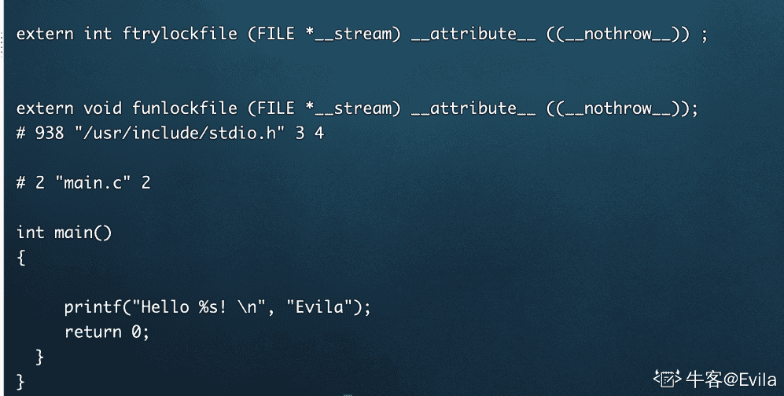
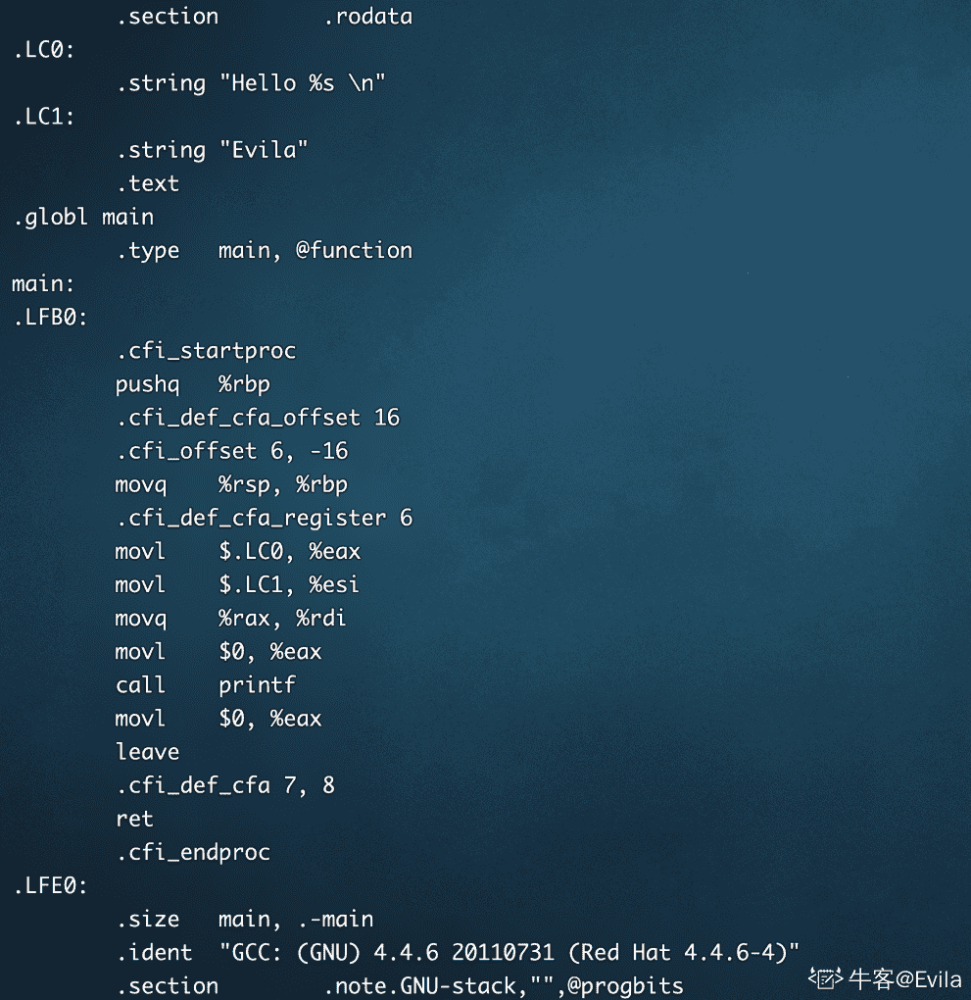
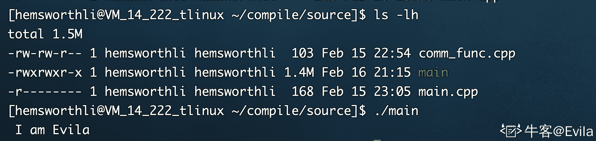
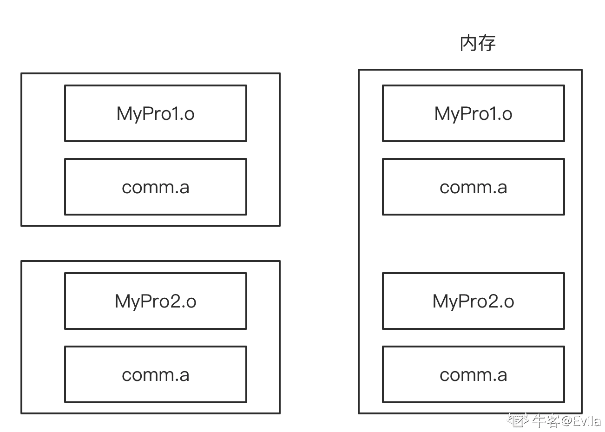
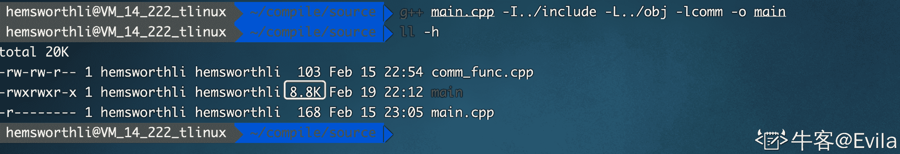
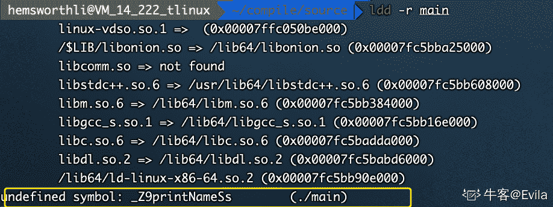
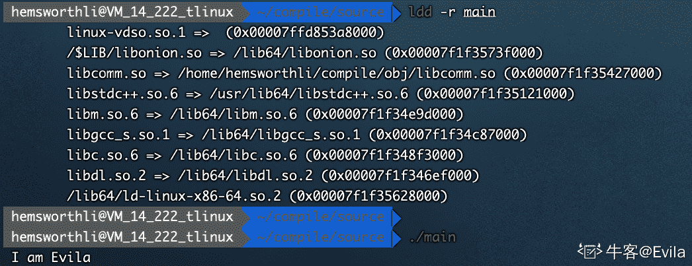

# 第三章 第 5 节 Linux C++编译、链接与调试

> 原文：[`www.nowcoder.com/tutorial/10094/912194a1cc834cb1b3a4ec70d998f140`](https://www.nowcoder.com/tutorial/10094/912194a1cc834cb1b3a4ec70d998f140)

# 1.编译与链接过程

在 Linux 系统使用 gcc/g++编译 C++程序，其过程可分为 4 个阶段： 

### 1.1 预处理

在预处理阶段做三件事：、

*   1.删除注释;
*   2.处理源文件中的#ifdef、#include 和#define 预处理命令;
*   3.将包含的头文件展开;

可使用 gcc -E 生成预处理后的中间文件*.i。 例如，有如下代码：

```cpp
#include <stdio.h>
#define MYNAME "Evila"
int main()
{
  // print Hello Evila!
  printf("Hello %s! \n", MYNAME);
  return 0;
} 
```

使用`gcc -E main.c -o main.i`生成预处理后的文件，打开生成的 main.i，可以看到<stdio.h>头文件展开，编写的注释被清理掉，宏在调用出被替换。 

### 1.2 编译过程

编译阶段继续处理预处理阶段的产物，即 main.i 文件，编译期主要进行语法分析和词法分析，将符号汇总到符号表后生成汇编文件。 使用`gcc -S main.i -o main.s`生成汇编文件： 

> 符号表是编译期产生的一个 hash 列表，包括了变量、函数以及调试等信息，可以通过 nm 命令查看符号表。词法分析时向符号表里注册符号，当有重复定义的时候会报错，因为符号表已经存在该符号。

### 1.3 汇编阶段

汇编阶段继续处理编译阶段的产物，即 main.s，汇编器会将汇编语言翻译成二进制的机器指令，并生成一份目标文件。 使用`gcc -c main.s -o main.o`生成二进制目标文件,在 Linux 系统下以 ELF 文件的形式存储。一个 gcc 指令会生成一个二进制目标文件。如果某个代码工程中包含多个.h+.cpp 文件时，会使用多个 gcc 指令进行编译，也生成了多个二进制目标文件。

#### 1.3.1 ELF 文件

ELF 文件（Executable Linkable Format）是一种文件存储格式，Linux 下的目标文件和可执行文件都按照该格式进行存储。ELF 文件以按段(section)的形式进行分段存储，其中代码编译后的指令放在代码段（code section），未初始化的全局变量和局部静态变量放到 bss 区，已初始化的全局变量和局部静态变量放到 data 区。ELF 的文件头记录了整个文件的属性信息，每个字段的含义可参考[ELF 文档](https://pdos.csail.mit.edu/6.828/2018/readings/elf.pdf)。

使用`readelf -h main.o`查看本例生成的 main.o 文件，可得：

```cpp
$ readelf -h main.o
ELF Header:
  Magic:   7f 45 4c 46 02 01 01 00 00 00 00 00 00 00 00 00 
  Class:                             ELF64
  Data:                              2's complement, little endian
  Version:                           1 (current)
  OS/ABI:                            UNIX - System V
  ABI Version:                       0
  Type:                              REL (Relocatable file)
  Machine:                           Advanced Micro Devices X86-64
  Version:                           0x1
  Entry point address:               0x0  // 程序的入口地址，这是没有链接的目标文件所以值是 0x00
  Start of program headers:          0 (bytes into file)  // 程序头的起始位置（非可执行文件为 0）
  Start of section headers:          328 (bytes into file) // 段表开始位置的首字节
  Flags:                             0x0
  Size of this header:               64 (bytes)  // 当前 ELF 文件头的大小，这里是 64 字节
  Size of program headers:           0 (bytes)  // 程序头大小（非可执行文件为 0）
  Number of program headers:         0 
  Size of section headers:           64 (bytes)  // 段表的长度（字节为单位）
  Number of section headers:         13  // 段表中项数，也就是有多少段
  Section header string table index: 10 
```

#### 1.3.2 段表及段(section)

ELF 文件由各种各样的段组成，段表中记录了各个段的信息，以数组形式存放。段表的起始位置，长度，个数分别由 ELF 文件头中的 Start of section headers，Size of section headers，Number of section headers 指出。

使用`readelf -S main.o`查看段表的详细信息如下：

```cpp
There are 13 section headers, starting at offset 0x148:

Section Headers:
  [Nr] Name              Type             Address           Offset
       Size              EntSize          Flags  Link  Info  Align
  [ 0]                   NULL             0000000000000000  00000000
       0000000000000000  0000000000000000           0     0     0
  [ 1] .text             PROGBITS         0000000000000000  00000040
       0000000000000022  0000000000000000  AX       0     0     4
  [ 2] .rela.text        RELA             0000000000000000  000005a8
       0000000000000048  0000000000000018          11     1     8
  [ 3] .data             PROGBITS         0000000000000000  00000064
       0000000000000000  0000000000000000  WA       0     0     4
  [ 4] .bss              NOBITS           0000000000000000  00000064
       0000000000000000  0000000000000000  WA       0     0     4
  [ 5] .rodata           PROGBITS         0000000000000000  00000064
       0000000000000011  0000000000000000   A       0     0     1
  [ 6] .comment          PROGBITS         0000000000000000  00000075
       000000000000002d  0000000000000001  MS       0     0     1
  [ 7] .note.GNU-stack   PROGBITS         0000000000000000  000000a2
       0000000000000000  0000000000000000           0     0     1
  [ 8] .eh_frame         PROGBITS         0000000000000000  000000a8
       0000000000000038  0000000000000000   A       0     0     8
  [ 9] .rela.eh_frame    RELA             0000000000000000  000005f0
       0000000000000018  0000000000000018          11     8     8
  [10] .shstrtab         STRTAB           0000000000000000  000000e0
       0000000000000061  0000000000000000           0     0     1
  [11] .symtab           SYMTAB           0000000000000000  00000488
       0000000000000108  0000000000000018          12     9     8
  [12] .strtab           STRTAB           0000000000000000  00000590
       0000000000000014  0000000000000000           0     0     1
Key to Flags:
  W (write), A (alloc), X (execute), M (merge), S (strings)
  I (info), L (link order), G (group), x (unknown)
  O (extra OS processing required) o (OS specific), p (processor specific) 
```

main.o 共有 13 个 Section：

*   .text 段保存代码编译后的指令，使用`objdump -s -d main.o`查看.text 段详细内容
*   .data 段保存已初始化的全局静态变量和局部静态变量，使用查看`objdump -x -s -d main.o`.data 段内容。
*   .rodata 段存保存只读数据，包括 const 修饰的变量和字符串常量，使用查看`objdump -x -s -d main.o`.rodata 段内容。
*   .symtab 段是符号表段，以数组结构保存符号信息（函数和变量的地址），例如(1)定义在目标文件中的全局符号，可以被其他目标文件引用;(2)在本目标文件中引用的全局符号，却不在本目标文件中定义，比如 pritnf。使用`readelf -s main.o`查看目标文件的符号表。

### 1.4 链接阶段

在 1.1 节编写的例子中，只有一个 main.c 文件，目前我们已经生成了目标文件 main.o。但是 main.o 可以直接执行吗？答案:不可以，因为在这个代码中并没有定义“printf”的函数实现，且在预处理中包含进去的“stdio.h”中也只有该函数的声明，而没有定义函数的实现。

**那么是在哪里实现的“printf”函数的呢？** 答：printf 函数的实现被打包到 libc.so.6 库文件中，gcc 会到系统默认的搜索路径“/usr/lib”下进行查找 libc.so.6 等库文件并执行链接。libc.so.6 库避免了重复的开发 printf 等函数，使用时只需要`include stdio.h`，并链接 libc.so.6 库到可执行文件即可。由于经过预处理、编译和汇编阶段生成的多个目标文件都是非可执行文件且是相互离散的，因此需要链接器将多个目标文件以及使用到的库文件进行合并，最终生成可执行文件。

链接器的主要工作可总结为以下 4 点： （1）合并各个目标文件的段内容； （2）调整合并后段的起始位置； （3）合并符号表，并进行符号分析； （4）进行符号重定位工作；

## 2.静态链接库

### 2.1 静态链接及其特点

静态链接是在链接期间将源文件使用到的库代码与编译生成的目标文件进行链接合并，生成的可执行文件。可执行文件是静态链接库与编译生成的目标文件集合，在运行时间与静态链接库再无关联。静态链接具有以下三个特点：

*   1.  静态链接会增大空间和资源的消耗，因为所有相关的目标文件与函数库被链接合成一个可执行文件
*   2.  如果静态库有升级或变动，可执行文件需要重新编译、链接
*   3.  程序在运行时与函数库再无关联，运行时无关环境是否具有需要的库，方便移植

### 2.2 制作静态库(.a)

静态链接库通常以 lib 作为前缀、.a 作为后缀。在 Linux 系统中使用 ar 命令将一组目标文件（.o)打包形成静态链接库，例如编写一个函数 printName，它接受一个 string 参数，功能是输出这个 string 参数：

```cpp
// comm_func.h
#include <string>
#include <iostream>
using std::string;
void printName(string name); 
```

```cpp
// comm_func.cpp
#include "comm_func.h"
void printName(string name) 
{
    std::cout<< " I am " << name << std::endl;
} 
```

可按照如下步骤将其制作成静态链接库：

*   1.  使用`gcc -c comm_func.cpp -o comm_func.o`命令将其编译为可重定向目标文件。注意，必须加-c，否则直接编译为可执行文件。
*   2.  使用`ar -rcs libcomm.a comm_func.o`命令将 comm_func.o 制作成静态库，静态库的命名规则是 lib 开头，.a 结尾。

### 2.3 使用静态库

经过上述两个步骤静态链接库已经制作成功，此时的项目目录如下所示：

```cpp
tree
.
├── include
│   └── comm_func.h
├── obj
│   ├── comm_func.o
│   └── libcomm.a
└── source
    ├── comm_func.cpp
    └── main.cpp

3 directories, 5 files 
```

为了使用刚刚生成的静态链接库，在之前编写的 main.cpp 中调用这个库函数:

```cpp
// main.cpp
#include <string>
using std::string;
#include "comm_func.h" // 必须要包含头文件
int main()
{
  printName("Evila");  // 调用静态库中的函数
  return 0;
} 
```

在编译 main.cpp 时，由于要使用静态链接库，需要指定以下四个参数：

*   1.指定静态链接库的搜索路径，-L 参数
*   2.指定静态库名，不需要 lib 前缀和.a 后缀，-l 参数
*   3.指定头文件搜索路径， -I 参数
*   4.指定静态链接的方式， -static

使用如下命令来对 main.cpp 进行编译和链接：`g++ -static main.cpp -I../include -L../obj -lcomm -o main`，生成了可执行文件 main。 可以发现，可执行文件 main 的文件大小达到了 1.4M，运行 main 发现程序正常执行符合预期。 

### 2.4 静态链接解析步骤

`g++ -static main.cpp -I../include -L../obj -lcomm -o main` 在这个过程中，使用到静态库 libcomm.a。由于 main.cpp 中使用了 libcomm.a 中的 printName 函数，因此链接时，会将 libcomm.a 中引用的代码“拷贝”到最终的可执行文件 main 中。 **特别注意，必须把-lcomm 放在 main.cpp 后面，即静态库需要放在引用它的位置的右边。因为静态库在链接时的解析过程如下：** **1、链接器从左往右扫描可重定位目标文件和静态库** **2、扫描 main.cpp 时，发现一个未解析的符号 printName，记住这个未解析的符号** **3、扫描 libcomm.a，找到了前面未解析的符号，提取相关代码** **4、最终没有任何未解析的符号，编译链接完成** **由于最终生成的可执行文件中已经包含了 printName 相关的二进制代码，因此这个可执行文件在一个没有 libcomm.a 的 linux 系统中也能正常运行。**

## 3.动态链接库

由于静态链接时将源文件引用的静态库打包进了可执行文件，在可执行文件启动时内存中就会存在引用到的静态库。并且，当不同的可执行文件静态链接了同一份静态库时，在内存中就会有同一个静态库的多个拷贝副本。



例如，静态库 comm.a 被链接到两个可执行文件中，当两个可执行文件加载到内存中时，内存中存在了 comm.a 库的多个拷贝副本。这对于内存资源来说无疑是一种浪费，能否让库文件在内存中只有一个实例，并供给多个引用它的可执行文件共享？

### 3.1 动态链接与动态链接库

动态链接并不在链接时将需要的二进制代码都“拷贝”到可执行文件中，而是仅仅“拷贝”一些重定位和符号表信息，这些信息可以在程序运行时完成动态链接库的内容映射到运行时相应进程的地址空间。linux 中通常以.so（shared object）作为后缀，使用-fPIC -shared 制作动态链接库，-fPIC -shared 表示生成位置无关代码，以便在只有一个副本的情况下供多个应用程序共享。

动态库的名字必须与 lib 开头，以.so 结尾。同样的，以制作静态库时的 comm_func.h 和 comm_func.cpp 源代码为例，使用如下命令将其制作成动态链接库： 若代码的目录按如下结构组织：

```cpp
tree
├── include
│   └── comm_func.h
├── obj
│   ├── comm_func.o
│   ├── libcomm.a
└── source
    ├── comm_func.cpp
    └── main.cpp

3 directories, 6 files 
```

*   使用`g++ comm_func.cpp -I../include -fPIC -shared -o ../obj/libcomm.so`命令将 comm_func.o 制作成动态链接库。

### 3.2 使用动态链接库

为了使用刚刚生成的动态链接库，同样的在之前编写的 main.cpp 中调用这个库函数:

```cpp
// main.cpp
#include <string>
using std::string;
#include "comm_func.h" // 必须要包含头文件
int main()
{
  printName("Evila");  // 调用静态库中的函数
  return 0;
} 
```

在编译 main.cpp 时，由于要使用动态链接库，需要指定以下四个参数：

*   1.指定动态链接库的搜索路径，-L 参数
*   2.指定动态库名，不需要 lib 前缀和.a 后缀，-l 参数
*   3.指定头文件搜索路径， -I 参数

使用如下命令来对 main.cpp 进行编译和链接：`g++ main.cpp -I../include -L../obj -lcomm -o main`，生成了可执行文件 main。 可以发现，可执行文件 main 的文件大小仅 8.8K。 

### 3.3 动态链接库加载

接上节，此时已经编译链接生成了可执行文件 main。在 Linux 下执行 main，得到找不到共享库的错误： 

使用 ldd 命令也可以发现可执行文件动态库链接存在问题： 

原因是：运行机的操作系统还未加载 libcomm.so 这个动态链接库，此时需要利用 ldconfig 命令将动态链接库为系统所共享。

ldconfig 命令的用途, 主要是在默认搜寻目录(/lib 和/usr/lib)以及动态库配置文件/etc/ld.so.conf 内所列的目录下, 搜索出可共享的动态链接库(格式如 lib*.so*), 进而创建出动态装入程序(ld.so)所需的连接和缓存文件。缓存文件默认为/etc/ld.so.cache, 此文件保存已排好序的动态链接库名字列表。

因此，需要在以下三个选项中选择一个将 libcomm.so 加载：

*   1.  将共享库文件移动到/lib 或/usr/lib 目录下，执行 ldconfig 命令。
*   2.  如果共享库文件安装到了/usr/local/lib 或其它"非/lib 或/usr/lib"目录下, 把共享库所在目录加入到共享库配置文件/etc/ld.so.conf 中，执行 ldconfig 命令。
*   3.  如果共享库文件安装到了其它"非/lib 或/usr/lib" 目录下, 但是又不想在/etc/ld.so.conf 中加路径(或者是没有权限加路径)。export 一个全局变量 LD_LIBRARY_PATH, LD_LIBRARY_PATH 指定了 loader 在哪些目录中可以找到共享库，然后运行程序的时候就会去这个目录中找共享库。例如，在我的开发机上，libcomm.so 所在的目录为`/home/hemsworthli/compile/obj+libcomm.so`,则可以在.bashrc 或.bash_profile 或 shell 里加入以下语句即可: `export LD_LIBRARY_PATH=/home/hemsworthli/compile/obj:$LD_LIBRARY_PATH`。

经过 ldconfig 后，再次使用 ldd 命令查看可执行文件的链接情况，发现没有链接失败的符号出现，执行 main 结果正常。 

## 4.GDB 调试指南

GDB（GNU Debugger）是 Linux 下的调试⼯具，可以调试 c、c++、objective-c、go、java、pascal 等语⾔。本节以 C 程序为例，介绍 GDB 启动调试的步骤和⽅式，具体内容分为以下几部分：

*   1.介绍哪些程序可以被 GDB 工具调试
*   2.GDB 调试可执行文件的命令
*   3.GDB 调试 core 文件的命令
*   4.设置断点命令
*   5.断点中断处查看变量
*   6.单步调试命令

### 4.1 可被 GDB 调试的程序

对于 C/C++程序来说，需要在编译时加上-g 参数，目的是保留调试信息，否则不能使⽤GDB 进⾏调试。 如果不是不知道可执行文件是否在编译时携带有-g 参数，如何判断⼀个⽂件是否带有调试信息呢？例如： 使用如下代码进行测试：

```cpp
#include <stdio.h>
int main()
{
    printf("Hello Evila!");
    return 0;
} 
```

```cpp
 $ gdb main
Reading symbols from /data/home_dir/hemsworthli/compile/source/main...(no debugging symbols found)...done. 
```

如果没有调试信息，会提示`no debugging symbols found`，如果有调试信息，会提示`Reading symbols from main...done.`

### 4.2 gdb 调试可执行文件

经过`g++ main.cpp -o main -g`编译出可执行文件 main 后，直接使用 gdb + main 命令进入 gdb 调试控制台：

```cpp
$ gdb main               
GNU gdb (GDB) Red Hat Enterprise Linux (7.2-50.el6)
...
...
Reading symbols from /data/home_dir/hemsworthli/compile/source/main...done.
(gdb) 
```

再输入 run，即程序开始运行。

```cpp
$ (gdb) run
Starting program: /data/home_dir/hemsworthli/compile/source/main 
Hello Evila!
Program exited normally. 
```

> 若程序需要输入参数，可在 run 命令后跟着输入的参数；也可以在 run 命令之前使用 set args 命令设置启动参数.

### 4.3 gdb 调试 core 文件

当程序 core dump 时，可能会产⽣core⽂件，core 文件会包含了程序运行时的内存，寄存器状态，堆栈指针，内存管理信息还有各种函数调用堆栈信息等，调试 core 文件是帮助定位程序问题的杀手锏。但前提是系统没有限制 core⽂件的产⽣。 可以使⽤命令 limit -c 查看：

```cpp
$ ulimit -c
0 
```

如果结果是 0，即使程序 core dump 了也不会有 core⽂件留下。 需要让 core⽂件能够产⽣，需要使用下面两个命令：

```cpp
ulimit -c unlimited #表示不限制 core⽂件⼤⼩
ulimit -c 10 #设置最⼤⼤⼩，单位为块，⼀块默认为 512 字节 
```

若有如下程序：

```cpp
#include <stdio.h>
int main()
{
    char *str = "hello Evila!";
    str[0] = 0；
    return 0;
}
编译完成后执行，发生段错误 core dumped
$ ./main
Segmentation fault (core dumped)
$ ls -a  有 core 文件产生
.  ..  core.main  main  main.cpp 
```

调试 core⽂件也很简单，直接使用 gdb+core.main 命令进行 gdb 控制台：

```cpp
gdb core.main 
GNU gdb (GDB) Red Hat Enterprise Linux 7.6.1-80.el7
Copyright (C) 2013 Free Software Foundation, Inc.
... ...
Core was generated by `./main'.
Program terminated with signal 11, Segmentation fault. 
```

接着使用 bt 命令查看堆栈信息，即可定位到 core dumped 所在的位置。

### 4.4 设置断点

在使用 GDB 调试时，可以在指定位置设置断点，程序运⾏到该断点位置将会“暂停”，这个时候我们就可以对程序进⾏更多的操作，⽐如查看变量内容，堆栈情况等等，以帮助我们调试程序。 例如，有如下代码：

```cpp
#include<stdio.h>
void printNum(int a)
{
    printf("printNum：%d\n", a);
}

void printStr(char* pStr) 
{
    printf("printStr: %s\n", pStr);
}

int main(int argc,char *argv[])
{
    int a = 0;
    printNum(a);
    printStr("Hello Evila");
    return 0;
} 
```

在编译时携带-g 参数生成可执行文件：`g++ main.cpp -o main -g`,使用 gdb 调试可执行文件 main：

*   根据行号设置断点：`b main.cpp 14`，该命令在 main.cpp 的第 14 行设置了断点
*   根据函数名设置断点:`b printNum`, 该命令在 printNum 函数入口处设置断点
*   根据字符匹配规则设置断点: `rbreak print*`,该命令会将所有以 print 为前缀的函数入口处设置断点
*   根据条件设置断点: `b main.cpp:14 if a == 0`,当 a=0 时，程序会在 14 行处停住
*   根据表达式值变化产⽣断点： `watch a`,让程序运⾏时，如果 a 的值发⽣变化则会停住
*   使用`info breakpoints`查看已设置的断点

```cpp
(gdb) info breakpoints
Num     Type           Disp Enb Address            What
1       breakpoint     keep y   0x00000000004005af in printNum(int) at main.cpp:4
2       breakpoint     keep y   0x00000000004005d1 in printStr(char*) at main.cpp:9
3       breakpoint     keep y   0x0000000000400488 <printf@plt>
4       breakpoint     keep y   0x0000000000400488 <printf@plt>
(gdb) 
```

可以发现 每个断点都有自己的编号，便于删除和禁用/启用断点：

*   启用和禁用断点：

```cpp
disable #禁⽤所有断点
disable bnum #禁⽤标号为 bnum 的断点
enable #启⽤所有断点
enable bnum #启⽤标号为 bnum 的断点
enable delete bnum #启动标号为 bnum 的断点，并且在此之后删除该断点 
```

*   清除断点：

```cpp
clear #删除当前⾏所有 breakpoints
clear function #删除函数名为 function 处的断点
clear filename:function #删除⽂件 filename 中函数 function 处的断点
clear lineNum #删除⾏号为 lineNum 处的断点
clear f:lename：lineNum #删除⽂件 filename 中⾏号为 lineNum 处的断点
delete #删除所有 breakpoints,watchpoints 和 catchpoints
delete bnum #删除断点号为 bnum 的断点 
```

### 4.5 查看变量

在启动调试以及设置断点之后，就到了非常关键的一步-查看变量。GDB 调试最大的目的之一就是走查代码，查看运行结果是否符合预期。既然如此，我们就不得不了解一些查看各种类型变量的方法，以帮助我们进一步定位问题。

同样的，使用如下程序讲述查看变量的方法：

```cpp
#include<stdio.h>
#include<stdlib.h>
int main()
{
    int a = 10; // 整型
    int i = 0;
    int b[] = {1,2,3,5};  // 数组
    char c[] = "Hello Evila"; // 字符数组
    /*申请内存，失败时退出*/    
    int *d = (int*)malloc(a*sizeof(int));
    if(NULL == d)
    {
        printf("malloc error\n");
        return -1;
    }
    /*赋值*/
    for(i=0; i < 10;i++)
    {
        d[i] = i;
    }
    free(d);
    d = NULL;
    float e = 8.5f;
    return 0;
} 
```

*   编译：

```cpp
g++ main.cpp -o main -g 
```

*   使用 gdb 调试 main，在 24 行设置断点:

```cpp
(gdb) b 24
Breakpoint 1 at 0x4006ee: file main.cpp, line 24. 
```

*   使用 run 命令启动程序：

```cpp
(gdb) run
Starting program: /data/home_dir/hemsworthli/compile/source/main 
Breakpoint 1, main () at main.cpp:24
24          return 0; 
```

此时程序启动，停在设置的断点 24 行处，此时我们可以查看变量值：

*   查看基本类型变量，数组，字符数组,使用 print（可简写为 p）打印变量内容:

```cpp
(gdb) p a
$1 = 10
(gdb) p b
$2 = {1, 2, 3, 5}
(gdb) p c
$3 = "Hello Evila"
(gdb) 
```

*   查看指针变量内容：

```cpp
(gdb) p d
$4 = (int *) 0x0  
(gdb) 
```

因为程序运行到了 24 行，此时指针 d 已经被赋值成了 NULL，若我们在 21 行也设置一个断点并重新运行：

```cpp
(gdb) p d
$1 = (int *) 0x601010
(gdb) 
```

gdb 支持指针解引用，即查看指针指向的变量值：

```cpp
(gdb) p *d
$2 = 0
(gdb) 
```

如果要查看数据的多个值，需要在数组名的后面跟上@并加上要打印的长度,或者@后面跟上变量值：

```cpp
(gdb) p *d@10
$4 = {0, 1, 2, 3, 4, 5, 6, 7, 8, 9}
(gdb) p *d@a   // 这里 a=10
$5 = {0, 1, 2, 3, 4, 5, 6, 7, 8, 9}
(gdb) 
```

### 4.6 按照特定格式打印变量

对于简单的数据，print 默认的打印方式已经足够了，它会根据变量类型的格式打印出来。但是有时候这还不够，我们需要查看变量在不同格式下的值。常见格式控制字符如下：

*   x 按十六进制格式显示变量。
*   d 按十进制格式显示变量。
*   u 按十六进制格式显示无符号整型。
*   o 按八进制格式显示变量。
*   t 按二进制格式显示变量。
*   a 按十六进制格式显示变量。
*   c 按字符格式显示变量。
*   f 按浮点数格式显示变量。

例如, 使用命令`p c`查看了字符串 c 的值：

```cpp
(gdb) p c
$7 = "Hello Evila"
(gdb) 
```

但是如果我们要查看它的十六进制格式打印呢？

```cpp
(gdb) p/x c
$8 = {0x48, 0x65, 0x6c, 0x6c, 0x6f, 0x20, 0x45, 0x76, 0x69, 0x6c, 0x61, 0x0}
(gdb) 
```

二进制：

```cpp
(gdb) p/t c
$11 = {1001000, 1100101, 1101100, 1101100, 1101111, 100000, 1000101, 1110110, 1101001, 1101100, 1100001, 0}
(gdb) 
```

### 4.7 单步调试命令

至此，已经了解了 GDB 调试启动，设置断点，查看变量的方法，而设置断点往往需要配合单步调试进行，以达到程序是指在我们的控制之下，按要求执行语句。

*   单步执行-next next 命令（可简写为 n）用于在程序断住后，继续执行下一条语句，如果后面跟上数字 n，则表示执行该命令 n 次，就达到继续执行 n 行的效果了。
*   单步进入-step 如果我们想跟踪函数内部的情况，可以使用 step 命令（可简写为 s），它可以单步跟踪到函数内部，但前提是该函数有调试信息并且有源码信息。
*   继续执行到下一个断点-continue 我们可能打了多处断点，或者断点打在循环内，这个时候，想跳过这个断点，甚至跳过多次断点继续执行该怎么做呢？可以使用 continue 命令（可简写为 c）或者 fg，它会继续执行程序，直到再次遇到断点处。
*   继续运行到指定位置-until 可以使用 until 命令 + 行号（可简写为 u）控制程序运行到制定代码行。
*   查看源码：list 命令（可简写为 l)，l 后面可以跟行号，表明要列出附近的源码；l 后面跟函数名，表明列出某个函数的源码；set listsize 命令支持修改 list 命令展示源码的行数；list 支持列出指定行之间的源码，也支持列出某个文件的源码