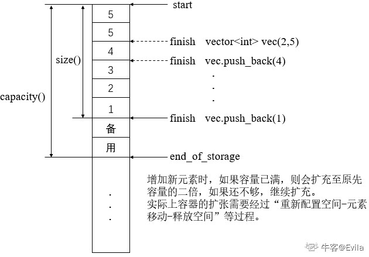
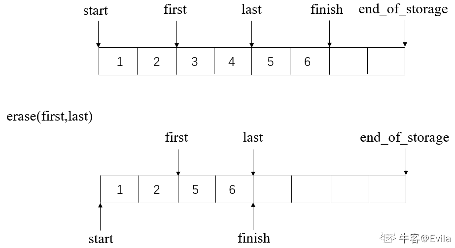
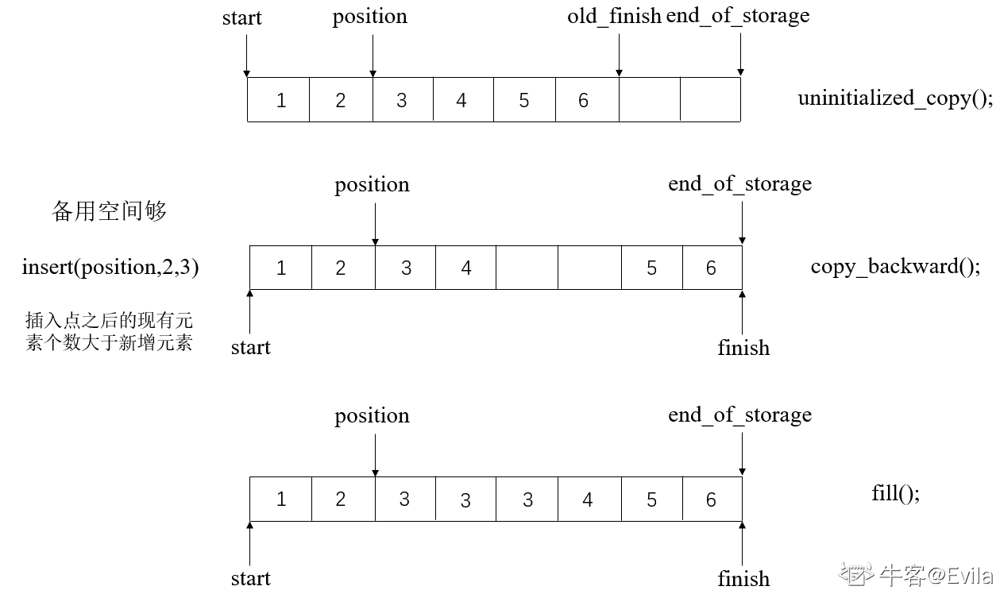
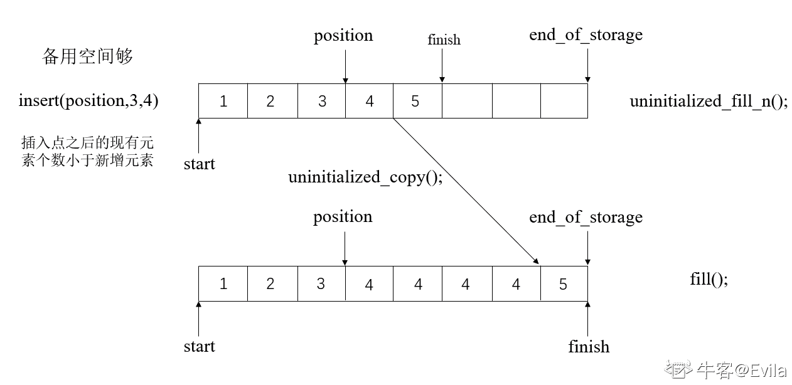
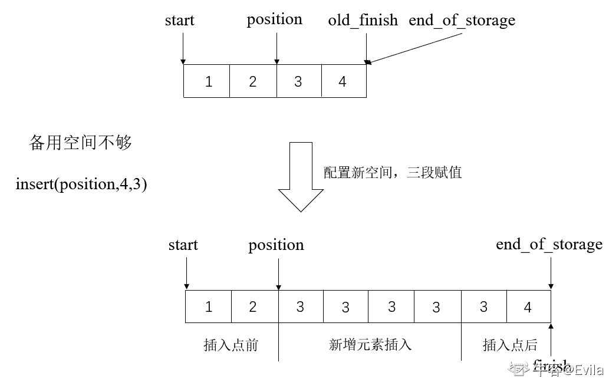
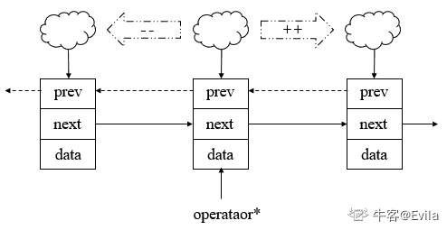
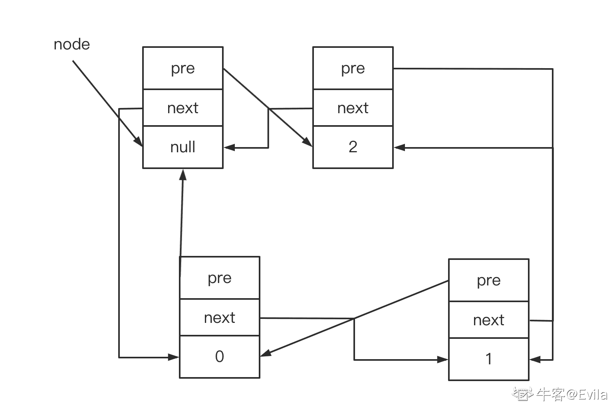
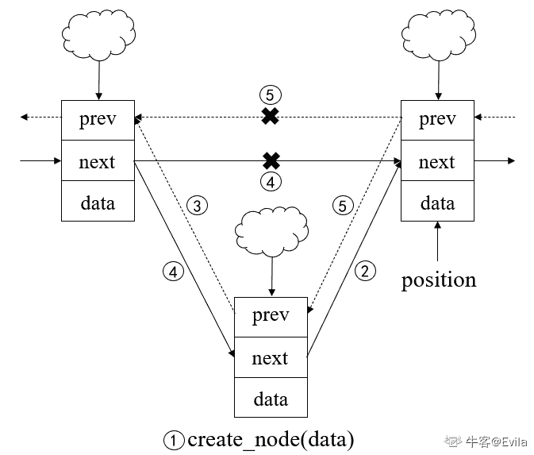
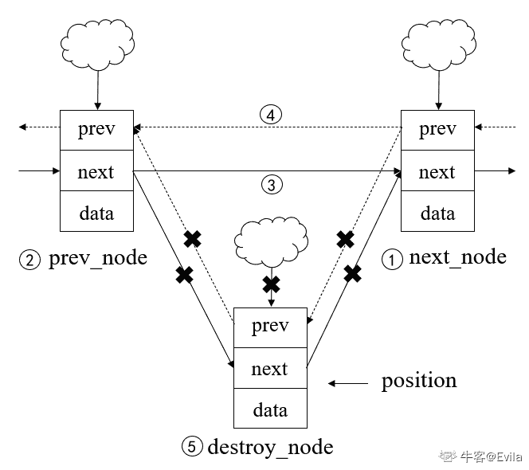

# 第四章 第 1 节 vector 与 list

> 原文：[`www.nowcoder.com/tutorial/10094/c56d5a90379249b0a8b82d9d27483975`](https://www.nowcoder.com/tutorial/10094/c56d5a90379249b0a8b82d9d27483975)

# 1.前言

C++标准模板库(standard template library, STL)不仅是一个**可复用**组件库，而且是一个包罗算法与数据结构的模板框架。 STL 已完全被内置到支持 C++的编译器中，无需额外安装，

STL 包括六大组件，可以互相组合套用：

*   1.  容器（containers）：各种数据结构的模板类，如 vector，list，deque，set，map 等用来存放数据。
*   2.  算法（algorithm）：sort，search，copy，erase 等模板函数，大部分算法都包含在头文件`<algorithm>`中，少部分位于头文件 `<numeric>` 中。
*   3.  迭代器（iterator）：容器与算法之间的胶合剂，也就是”泛型指针“。
*   4.  仿函数（functors）：如果一个类将 ‘()’ 运算符重载为成员函数，这个类就称为函数对象类，这个类的对象就是函数对象。由于该类对象的行为类似函数，又称为仿函数。
*   5.  配接器（adapters）：一种用来修饰容器、仿函数或者迭代器接口的东西。
*   6.  配置器（allocators）：负责内存空间配置与管理。

## 2\. vector 容器

vector 被称为向量容器，该容器擅长在尾部插入或删除元素，时间复杂度为 O(1)；而对于在 vector 容器头部或者中部插入或删除元素，则花费时间要长一些（移动元素需要耗费时间），时间复杂度为线性阶 O(n)。使用 vector 容器，需要包含`<vector>`，注意这里无扩展名。

### 2.1 vector 内存扩容策略

vector 属于**序列式容器(sequence_container)**：其中的元素都可序，但未必有序。

如图所示，vector 的内存模型与数组较为相似，但 vector 的内存模型是动态增长的线性空间，动态增长的实质是：需求空间超过当前可用空间后，不是在原空间之后接续新空间。这是因为线性空间后不一定有足够大小的空间，因此重新申请一块更大的空间来作为载体，然后复制已有数据到新申请的内存空间。



具体操作为：首先配置一块新空间，然后将元素从原空间搬到新的空间上，再把原空间释放。（涉及到了新空间的配置和旧空间的释放）

**新空间的大小为一般为原空间大小的二倍。注意：二倍增长并不是必然的，不同的编译环境可以有不同的实现，但若增长倍数小于 2 则可能会导致扩容频繁；增长倍数较大则可能导致申请了较大的空间而未使用，从而造成浪费。** 此外，vector 为了降低空间扩容的速度，在配置空间时留有一部分空间以便之后扩容，这就是 size()和 capacity()的区别。size()返回使用了多少空间，capacity()返回了配置了多少空间。当两者相等时说明 vector 容器已经满了，再插入元素需要扩容。

### 2.2 vector 迭代器

迭代器是行为类似指针的变量，相当于容器和算法之间的中介。迭代器可以指向容器中的某个元素，通过迭代器就可以读写它指向的元素。

如上图所示，两个迭代器 start 和 finish 来指向目前线性空间已使用的头和尾，以迭代器 end_of_storage 来指向当前配置空间的尾端。该图中扩容和迭代器变化步骤如下：

*   1.  vector vec(2,5)，即申请两个元素空间并赋值 5，此时 start 指向起始地址，finish 指向两元素空间末尾，end_of_storage 指向申请空间（两元素）末尾；
*   2.  当 push_back(4)时，原 2 个元素空间已满，申请二倍空间，复制 5，5 于新空间，并填入 4，此时由于空间重新分配，原迭代器失效，新 start 指向起始地址，finish 指向 4 之后，end_of_storage 指向申请空间（四个元素）末尾；
*   3.  push_back(3)时，原空间共有 4 个位置，已填入 3 个元素，3 加入后刚好填满；
*   4.  当 push_back(2)时，原 4 个元素空间已满，便申请一块 8 元素的新空间，再将 2 填入；
*   5.  再将 1 填入，此时仍有两个元素的空位以供备用； 所以 finish 和 end_of_storage 不是一个含义，finish 指的是使用空间的末尾，end_of_storage 是申请的空间的末尾。因此，使用 size()和 capacity()进行区分，size()的大小时 start 到 finish 的大小，capacity()的大小则是 start 到 end_of_storage 的大小。 此处需要注意的是，对 vector 的操作如果引起的**空间重新分配**，那么原 vector 的**所有迭代器**就都失效。

```cpp
class vector {
    ……
protected:
    iterator start;			 //当前已用空间的头部
    iterator finish;		    //当前已用空间的尾端
    iterator end_of_storage;	//当前配置空间的尾端
}; 
```

### 2.3 '[]'操作符

vector 可以像数组一样，支持使用'[]'操作符根据下标获取元素。简单来讲，vector 中元素大小固定，在知道 start 的基础上，我们只需要在其基础上进行地址偏移就能找到所需元素。（**经典面试题**：vector 的随机访问如何做到？）源码如下：

```cpp
reference operator[](size_type n){
    return *(begin() + n);
} 
```

### 2.4 迭代器的常用方法

vector 的所有操作都可以从源码中看出端倪，此处将常用操作源码总结：

> STL 中规定容器的区间遵循前闭后开原则，即容器中的一对迭代器 start 和 finish 标识的前闭后开区间，从 start 开始，直到 finish-1.迭代器 finish 所指的是“最后一个元素的下一位置”。这样定义的好处主要有两点：1\. 为“遍历元素时，循环的结束时机”提供一个简单的判断依据。只要尚未到达 end()，循环就可以继续下去; 2\. 不必对空区间采取特殊处理手段。空区间的 begin()就等于 end();

```cpp
class vector {
    ……
public:
    /**
     * begin()函数源码
     * 用于返回 start 迭代器
     **/
    iterator begin() {
        return start;
    }

    /**
     * end()函数源码
     * 用于返回 finish 迭代器
     **/
    iterator end() {
        // STL 容器的前闭后开原则，end 迭代器并不指向最后一个元素 而是最后一个元素的后面
        return finish;
    }

    /**
     * size()函数源码
     * 用于返回 start-end 的值——已保存的元素个数
     **/
    size_type size() const {  // 返回 start-end 的值 即已保存的元素个数
        return size_type(end() - begin());
    }

    /**
     * capacity()函数源码
     * 返回 end_of_storage - start 的值——vector 能够保存元素上限
     **/
    size_type capacity() const {  // 返回 end_of_storage - start 的值， 即 vector 能够保存元素上限
        return size_type(end_of_storage - begin());
    }

    /**
     * empty()函数源码
     * 通过判断 start 迭代器与 finish 迭代器是否相等，返回 vector 是否为空
     **/
    bool empty() const { 
        return begin() == end();
    }

    /**
     * []操作符重载
     * 实现根据下标取元素
     **/
    reference operator[](size_type n) {
        return *(begin() + n);
    }

    /**
     * front 函数源码
     * 根据 start 迭代器，返回第一个元素的值
     **/
    reference front() {  
        return *begin();
    }

    /**
     * back 函数源码
     * 根据 finish 迭代器，返回最后一个元素的值
     * 由于 finish 迭代器指向的是最后一个元素的后一个位置(STL 容器的前闭后开原则)，因此这里需要用 finish-1 获取最后一个元素的位置
     **/
    reference back() {  // 返回最后一个要素
        return *(end() - 1);
    }
}; 
```

此处需要注意的是，对 vector 的操作如果引起的**空间重新分配**，那么原 vector 的**所有迭代器**就都失效。因此，如果我们将 vector 的迭代器保存到变量中时，可能会因为空间重新分配导致该变量保存的迭代器失效，例如：

```cpp
#include <vector>
#include <iostream>
using namespace std;

int main()
{
    vector<int> vec;
    vec.push_back(0);
    auto iter = vec.begin();  // 使用变量保存迭代器
    cout<< *iter << endl;
    for(int i = 0; i < 10; i++)  // 可能会引起 vector 空间重新分配的代码段
    {
        vec.push_back(i);
    }
    cout<< *iter << endl;  // 原迭代器失效，此处异常中断
} 
```

### 2.5 vector 的常用元素操作方法

vector 元素操作方法很多，此处以常用的函数举例，并搭配空间管理加深理解。

#### 2.5.1 push_back(const T& x)

| 表头 | 说明 |
| :-- | :-- |
| 函数功能 | 将新元素插入 vector 的尾端，在插入时需要关注两种情况：即 vector 当前是否还有空间，如果有则直接在备用空间上构造元素，调整迭代器 finish；若没有，则需要扩充空间。 |
| 参数 | 1.需要加入的元素 |
| 返回值 | void |
| 时间复杂度 | 若 vector 有备用空间，则为 O(1)；否则需要扩充空间时，为 O(n) |

##### push_back 方法的源码如下：

```cpp
void push_back(const T& x) {
    if(finish != end_of_storage)
    {
        constrcut(finish,x);
        ++finish;
    }
    else
    {
        insert_aux(end(),x);
    }
} 
```

其中，insert_aux 函数涉及到了空间的重新配置问题，这里剖析该函数源码以加深过程理解。

##### insert_aux 方法的源码如下：

```cpp
template<class T>
void insert_aux(iterator position, const T& x) {
    if(finish != end_of_storage) {										
        // 有备用空间	
    }
    else {
        // 获取当前 vector 的元素个数
        const size_type old_size = size();  
        // 计算扩展后的 vector 空间
        // 若扩充前 vector 是空的，则配置申请一个元素的空间
        // 若扩充前 vector 非空，则按照二倍扩充原则进行扩充
        const size_type len = old_size != 0 ? 2 * old_size : 1;  

        // 分配器 allocator 配置新空间
        // new_start 和 new_finish 迭代器指向新分配的空间起点
        iterator new_start = data_allocator::allocate(len);  
        iterator new_finish = new_start;
        try {
            // 拷贝原 vector 中 start 到 position 区间的元素到 new_start 迭代器所指处 
            // push_back 函数中调用 insert_aux(end(),x)，因此 position 就是 finish 迭代器，这里就将原 vector 的所有元素拷贝过来
            // 执行后 new_finish 迭代器就指向了原 vector 的所有元素拷贝到新位置的末尾
            new_finish = uninitialized_copy(start,position,new_start);	
            // 在 new_finish 处构造新元素 x
            construct(new_finish,x);	
            // new_finish 向后移一个位置	
            ++new_finish;
            // 再将原 vector 的 position 到 finish 区间的元素拷贝到 new_finish 迭代器所指处		
            // push_back 函数中调用 insert_aux(end(),x)，因此 position 就是 finish 迭代器，这里元素区间是空										    
            new_finish = uninitialized_copy(position,finish,new_finish); 
        }
        catch(...) {
            // 异常时回滚
            destroy(new_start,new_finish);
            data_allocator::dellocate(new_start,len);
            throw;
        }
        // 析构并释放原 vector
        destroy(begin(),end());
        deallocate();
        // 为 start 和 finish 迭代器赋新值
        start = new_start;
        finish = new_finish;
        end_of_storage = new_start + len;
    }
} 
```

在源码中也可以看出，当空间重新配置时，原 vector 的所有迭代器也就失效了。

#### 2.5.2 pop_back()

| 函数项 | 说明 |
| :-- | :-- |
| 函数功能 | 删除尾端元素时，调整迭代器并释放即可，不需要空间分配 |
| 参数 | void |
| 返回值 | void |
| 时间复杂度 | O(1) |

##### pop_back 源码如下：

```cpp
 void pop_back() {
    --finish;		   //调整末端位置迭代器
    destroy(finish);	//释放尾端元素的资源
} 
```

#### 2.5.3 iterator erase(iterator first,iterator last)

| 函数项 | 说明 |
| :-- | :-- |
| 函数功能 | 用于删除 vector 容器中的一段区间的元素 |
| 参数 | 1.迭代器：iterator first 2.迭代器：iterator last |
| 返回值 | 指向删除的区间起点迭代器 |
| 时间复杂度 | O(n) |

##### erase()源码如下：

```cpp
// 删除某段元素 参数为需要删除段的迭代器起点和终点
iterator erase(iterator first,iterator last) {
    iterator i = copy(last, finish, first);	//将后面的元素前移
    destroy(i,finish);						//释放其后元素
    finish = finish - (last - first);		//调整迭代器
    return first;
} 
```

#### 2.5.4 iterator erase(iterator position)

| 函数项 | 说明 |
| :-- | :-- |
| 函数功能 | 用于删除 vector 容器中的一个元素 |
| 参数 | 1.迭代器：iterator position |
| 返回值 | 指向被删除元素位置迭代器 |
| 时间复杂度 | O(n) |

##### erase()源码如下：

```cpp
// 删除某个元素 参数为需要删除的元素迭代器
iterator erase(iterator position) {	
    if(position + 1 != end()) {
        copy(position + 1,finish,position); // 将 position 后的元素整体向前移动
    }
    --finish;  // 迭代器前移
    destroy(finish);  
    return position;
} 
```

 上图为删除一段元素的示例图，可以看出，删除元素的迭代器会发生变化，删除位置之后的迭代器需重新调整。

#### 2.5.5 void insert(iterator position, size_type n, const T& x)

| 函数项 | 说明 |
| :-- | :-- |
| 函数功能 | 在指定位置 position 前插入 n 个值为 x 的元素,返回指向这个元素的迭代器, |
| 参数 | 1.迭代器：iterator position 2.插入元素的个数 3.插入元素的值 |
| 返回值 | void |
| 时间复杂度 | O(n) |

##### 由于 vector 中的元素顺序存储，所以随机插入元素的操作相对比较麻烦：

```cpp
void insert(iterator position, size_type n, const T& x)
{
    if(n != 0)
    {
        if(size_type(end_of_storage - finish) >= n) {  // vector 当前备用空间大于 n 时
            T x_copy = x;
            const size_type elems_after = finish - position;  // 计算需要移动元素的个数
            iterator old_finish = finish;
            if(elems_after > n) {  // 如果需要移动的元素个数 大于插入的元素数量
                // 将 finish-n 到 finish 区间内的数据拷贝到 finish 后 
                // 注意：这里只拷贝了倒数 n 个元素 而不是 elems_after 个元素
                uninitialized_copy(finish - n,finish,finish);  
                finish += n;  // 更新 finish 迭代器，此时 finish 的位置为插入 n 个元素后的为位置
                // 再将 position 到 old_finish 区间的元素移动到 old_finish 后
                copy_backward(postion,old_finish - n,old_finsh);
                // 最后 在 position 后填充 n 个 x 元素
                fill(position,position + n,x_copy);
                // 可参考下图情况 1
            }
            else {  // 如果需要移动的元素个数 小于插入的元素数量
                // 在 finish 后 填充 n - elems_after 个元素，
                uninitialized_fill_n(finish,n - elems_after, x_copy); 
                finish += n - elems_after;  // 调整 finish 此时 finish 的位置不是最终的位置
                //  将 position 到 old_finish 区间内的元素拷贝到 finish 后
                uninitialized_copy(position,old_finish,finish);
                finish += elems_after;  // 继续调整 finish 
                fill(position,old_finish,x_copy);  // 将 position 到 old_finish 区间内填充为 x
                // 可参考下图情况 2
            }
        }
        else {  // vector 当前备用空间小于 n 时
            const size_type old_size = size();
            const size_type len = old_size + max(old_size,n);

            // 配置新空间（同上）
            iterator new_start = data_allocator::allocate(len);				
            iterator new_finish = new_start;
            // 分三段复制到新 vector
            {
                //插入点之前的元素复制到新 vector
                new_finish = uninitialized_copy(start,position,new_start);	
                //新增元素填入	
                new_finish = uninitialized_fill_n(new_finish,n,x);		
                // 插入点之后的元素复制到新 vector		
                new_finish = uninitialized_copy(position,finish,new_finish);	
            }
            // 析构并释放原 vector
            destroy(begin(),end());
            deallocate();
            // 调整迭代器
            start = new_start;
            finish = new_finish;
            end_of_storage = new_start + len;
            // 可参考下图情况 3
        }
    }
} 
```

**情况 1：**



**情况 2：**



**情况 3：**



## 3.list 容器

### 3.1 list 内存模型

list 容器是双向循环链表，同样是序列式容器(sequence_container)，list 动态增删是每插入和删除一个元素就配置和删除一个元素的空间，因此不像 vector 一样有备用的空间。根据链表的特点，list 应该有三个属性，自身的值、上一个节点的位置、下一个节点的位置。

```cpp
template<class T>
struct __list_node {
    typedef void* void_pointer;
    void_pointer prev;	// 上一个节点位置
    void_pointer next;	// 下一个节点位置
    T data;				// 节点的值
}; 
```



list 节点的关联是通过其前后节点的指针来描述的，与别的元素无关。所以插入插入/删除操作都只需建立/销毁与前序节点和后序节点的联系即可。因此，对于 list 来说，只需要一个指针，便可以完整表示整个链表,其源码如下所示：

```cpp
template<class T>
class list {
protected:
    typedef __list_node<T> list_node;
public:
    typedef list_node* link_type;
    typedef __list_iterator<T,T&,T*> iterator;
protected:
    link_type node;
}; 
```

为了遵循 STL 容器的前闭后开原则，list 容器用一个头结点（尾结点）来作为链表的开始或终止,该节点是空白节点，不存储元素；我们只需要让指针 node 指向该空白结点，list 便可视为“前闭后开”。



### 3.2 list 的容器迭代器

由于 list 的节点除了要存储数据和关联节点，还需要适配容器常用的动作，例如递增、递减等；因此普通的节点指针无法满足需求，迭代器需要进行进一步的封装。

迭代器对应到源代码就可以看出端倪：

```cpp
struct __list_iterator {
    reference operator*() const {
        // 重载 "*"操作符，用于通过迭代器取出节点元素		
        return (*node).data;
    }
    pointer operator->() const {		
        // 重载"->"操作符，用于通过迭代器操作元素的成员
        return &(operator*());
    }
    self& operator++() {
        // 迭代器向后移动 返回移动前的迭代器 后缀自增
        node = (*node).next;
        return *this;
    }
    self operator++(int) {
        // 迭代器向后移动 返回移动后的迭代器	前缀自增		
        self tmp = *this;
        ++*this;  // 依靠后缀自增实现
        return tmp;
    }
    self& operator--() {	
        // 后缀自减
        node = (*node).prev;
        return *this;
    }
    self operator--(int) {    
        // 前缀自减
        self tmp = *this;
        --*this;  // 依靠后缀自减实现
        return tmp;
    }
}; 
```

可以看到，list 的迭代器需要进行特定的封装处理后才能执行迭代器的功能。同样，由于头结点/尾节点的存在，迭代器也可以完成很多操作：

```cpp
iterator begin() {
    return *node.next;	 // 头结点的下一节点是开始
}
iterator end() {
    return node;		   // 尾端的空白空白节点
}
bool empty() const {
    return node->next==node;	// 判断头结点后是否是非空节点
}
size_type size() const {
    size_type result=0;
    distance(begin(), end(), result);	// distance 为 STL 算法，可视为遍历函数，每遍历一个节点便将 result++
    return result;
}
reference front() {
    return *begin();
}
reference back() {
    return *(--end());
} 
```

list 的元素操作不会引起其他的元素空间重新分配，**因此迭代器不会失效**。

### 3.3 list 的元素操作源码剖析

list 的元素增删操作较为简单：

#### 3.3.1 push_back()

| 函数项 | 说明 |
| :-- | :-- |
| 函数功能 | 用于在 list 容器尾部插入一个元素，借助 insert 方法实现 |
| 参数 | 1.插入的元素实例 |
| 返回值 | 空 |
| 时间复杂度 | O(1) |

```cpp
void push_back(const T& x) {
    insert(end(),x);
} 
```

#### 3.3.2 insert()

| 函数项 | 说明 |
| :-- | :-- |
| 函数功能 | 用于在 list 容器中插入一个元素 |
| 参数 | 1.插入元素的位置 2.插入的元素实例 |
| 返回值 | 空 |
| 时间复杂度 | O(1) |

```cpp
iterator insert(iterator position,const T& x) {
    link_type tmp = create_node(x);	// 创建一个新的节点
    tmp->next = position.node;		 // 建立此节点与插入位置节点关系，插入位置节点为其下一节点
    tmp->prev = position.node->prev;   // 建立此节点与插入位置上一节点关系，此节点上一个节点为原位置节点上一节点
    (link_type(position.node->prev))->next = tmp;  // 原位置节点上一节点此时的下一节点为此节点
    position.node->prev = tmp;	     // 原位置节点的上一节点变为此节点
    return tmp;
} 
```

可以看到，插入时，由于前后均为双指针的关系，在调整时需要调整四个指针指向，注意顺序。 

#### 3.3.3 erase()

| 函数项 | 说明 |
| :-- | :-- |
| 函数功能 | 用于删除 list 容器中的元素 |
| 参数 | 1.删除元素的位置 |
| 返回值 | 删除元素下一个元素的迭代器 |
| 时间复杂度 | O(1) |

```cpp
iterator erase（iterator position）{
    link_type next_node = link_type(position.node->next);
    link_type prev_node = link_type(position.node->prev);
    prev_node->next = next_node;
    next_node->prev = prev_node;
    destroy_node(position.node);
    return iterator(next_node);
} 
```

和 insert 类似的，erase 在删除元素时需要获取该节点的前、后结点，并将前节点的 next 指向后节点，即将被删除的点从链表中断开。 

#### 3.3.4 其他操作借助 insert 或 erase 方法实现

```cpp
void push_back(const T& x) {
    insert(end(),x);
}
void push_front(const T& x) {
    insert(begin(),x);
}
void pop_front() {
    erase(begin());
}
void pop_back() {
    iterator tmp = end();
    erase(--tmp);
} 
```

## 4\. 面试热点

### 4.1 vector 和 list 的区别

【出现频度】★★★★

【难度】☆☆

【参考答案】

*   1.vector 和数组类似，拥有一段连续的内存空间。当插入新的元素时，vector 当前拥有的内存空间不够插入元素，通常以两倍重新申请一块更大的内存，并将原来的元素拷贝过去。由于 vector 的元素是连续存储的，因此随机访问非常高效，时间复杂度为 O(1)；但插入或删除元素时，会引起其他元素整体移动，时间复杂度为 O(n);
*   2.list 是双向循环链表，各元素的内存空间是不连续的。只能通过指针访问数据，所以 list 的随机存取非常没有效率，要遍历才能做到，时间复杂度为 O(n)；但可以高效地进行插入和删除，(不需要拷贝和移动数据，只需要改变指针的指向就可以了)，时间复杂度为 O(1)。

**需要高效的随机存取，而不在乎插入和删除的效率，选 vector。 需要大量的插入和删除，而不关心随机存取，则使用 list。**

### 4.2 反转链表

【出现频度】★★★★

【难度】☆☆☆

参考此链接[反转链表](https://www.nowcoder.com/jump/super-jump/word?word=%E5%8F%8D%E8%BD%AC%E9%93%BE%E8%A1%A8)。

### 4.3 合并链表

【出现频度】★★★★

【难度】☆☆☆

参考此链接：[合并两个排序链表](https://leetcode-cn.com/problems/he-bing-liang-ge-pai-xu-de-lian-biao-lcof/)。

### 4.4 vector、list 迭代器失效问题

【出现频度】★★★

【难度】☆☆☆☆

**vector：**

*   1.  当删除一个元素时(erase/pop_back)，其后的所有元素的迭代器都会失效，因为 vector 是连续存储的一段空间，所以当对其进行 erase 操作时，其后的每一个元素都会向前移一个位置。
*   2.  当插入(insert/push_back)一个元素后，如果引起了 vector 扩容，进行空间重新分配，则此时 first 和 end 操作返回的迭代器都会失效。
*   3.  当插入(insert/push_back)一个元素后，如果未引起扩容，空间未重新分配，指向插入位置之前的元素的迭代器仍然有效，但指向插入位置之后元素的迭代器全部失效。

**list：**

增加任何元素都不会使迭代器失效。删除元素时，除了指向当前被删除元素的迭代器外，其它迭代器都不会失效。

## vector 与 list 容器总结

| 表头 | vector | list |
| --- | --- | :-: |
| 底层结构 | 一段连续的内存 | 双向循环链表（头结点） |
| 随机访问 | 支持随机访问，效率 O(1) | 不支持随机访问，效率 O(N) |
| 插入和删除 | 任意位置插入和删除效率低，需要搬移元素，时间复杂度为 O(N)，插入时有可能需要扩容，拷贝元素，释放旧空间 | 任意位置插入和删除效率高，不 需要搬移元素，时间复杂度为 O(1) |
| 空间利用率 | 底层为连续空间，不容易造成内存碎片，空间利用率 高，缓存利用率高 | 底层节点动态开辟，小节点容易 造成内存碎片，空间利用率低， 缓存利用率低 |
| 迭代器 | 原生态指针 | 对原生态指针(节点指针)进行封装 |
| 使用场景 | 需要高效存储，支持随机访问，插入及删除删除较少 | 大量插入和删除操作，随机访问较少 |