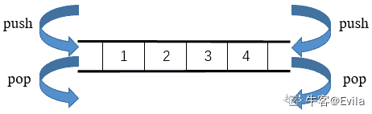
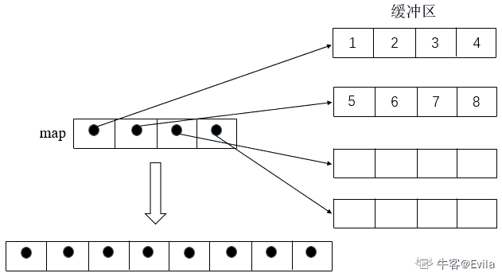
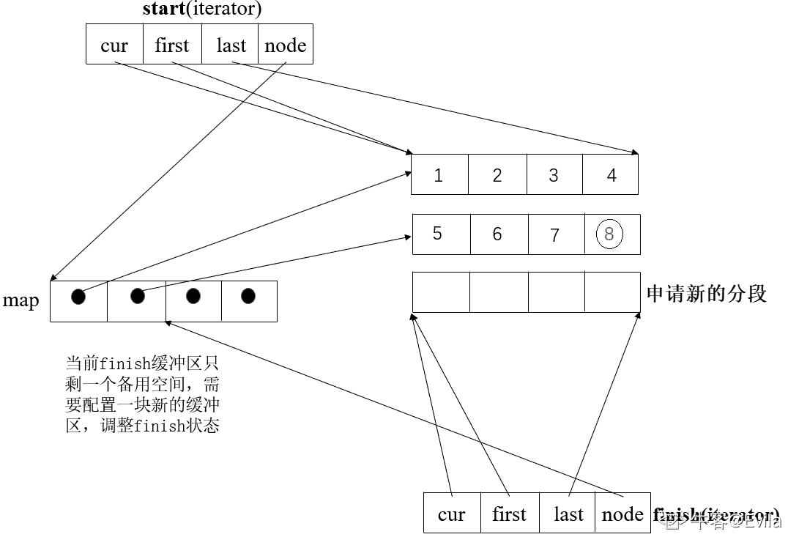
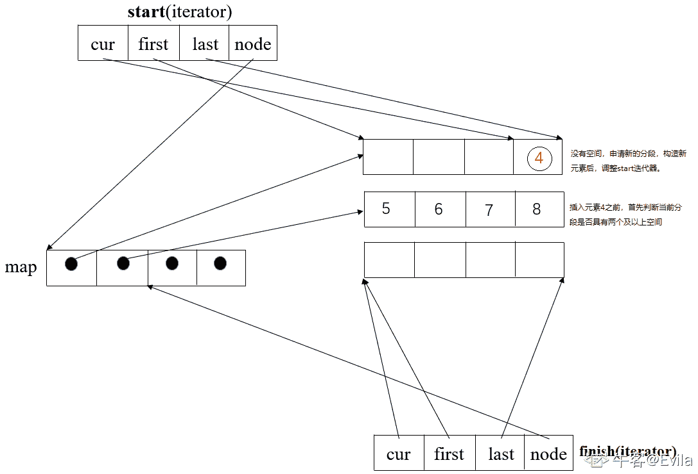
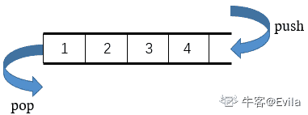

# 第四章 第 2 节 stack 与 queue

> 原文：[`www.nowcoder.com/tutorial/10094/0c0c7068e3cf48f4bc21f0b77e477b1d`](https://www.nowcoder.com/tutorial/10094/0c0c7068e3cf48f4bc21f0b77e477b1d)

# 1\. deque——双向队列容器

### 1.deque 的内存模型

如图 1-1 所示，deque 的内存模型与 vector 极为相似，是一种双向开口的连续线性容器。由于 deque 可在头尾两端进行元素的插入和删除操作，因此被称为双向队列。vector 虽然也可在头部进行此操作，但需要将所有元素向后移动，因此效率很差；而 deque 可在常数时间复杂度在头部进行元素的插入和删除。

 **图 1-1 deque 的前后插入图解**

stack 和 queue 是在 deque 的基础上进行了包装，实际调用的也是 deque 的函数接口。因此，首先对 deque 容器进行深入的剖析。

### 1.2 deque 中控器

不难发现，deque 与 vector 最本质的差别在于，vector 的内存增长只能向后增长，而 deque 可以双向增长。为了实现双向增长，deque 以动态地分段连续空间组合而成，随时可以增加一段新的空间并链接起来。这赋予了 deque 没有容量限制的特性，同时分段连续空间较之 vector 少了所谓的新旧空间配置和释放问题，可以灵活配置空间。但随之而来的就是复杂的中央控制，来对多个 deque 的分段枢纽管理。

因此，deque**逻辑上来看是连续空间**，其实是**分段连续空间**，通过**中控器**将各个分段进行链接，从而造成这种整体连续假象。

如图 1-2 所示：map 作为 deque 的中控器，管理了 4 段连续空间，使得用户感知不到分段，而是整体连续。

 **图 1-2 deque 的中控器图解**

### 1.3 deque 迭代器

deque 作为连续分段空间，如何维持迭代器的连续性，需要对`operator++`与`operator--`两个运算进行特殊处理：

 **图 1-3 deque 的迭代器图解**

如图 1-3 所示，deque 迭代器 iterator 包含四个要素，cur 指向当前分段的现行元素，first 指向当前分段缓冲区的头部，last 指向当前分段缓冲区的尾部，node 指向当前的 map 节点。

*   1.  首先，通过迭代器中的 node 成员判断出缓冲区在中控器的位置;
*   2.  其次，通过迭代器中的 cur 成员判断出当前元素在分段缓冲区的位置；
*   3.  最后，在进行`operator++`与`operator--`时进行顺序移动或跳跃动作。

以上图举例，当 4 要`operator++`到 5 时，由于 4 已经在当前缓冲区的尾部，所以需先通过中控器 map 先找到下一节点，然后切换到下一节点进行操作。

#### deque 迭代器源码如下所示：

```cpp
struct __deque_iterator {
    ……
    T *cur;						// 指向当前分段缓冲区的现行元素指针
    T *first;   				   // 指向当前分段缓冲区的头部指针
    T *last;				   	// 指向当前分段缓冲区的尾部指针
    map_pointer node;			  // 指向中控器节点的指针

    /**
     * 缓冲区切换函数
     * 参数为中控器节点指针
     */
    void set_node(map_pointer new_node) {
        node = new_node;  // 中控器指针指向新缓冲区
        first = *new_node;									// first 指向当前缓冲区的头部
        last = first + difference_type(buffer_size());		// last 指针指向缓冲区尾部 头部+缓冲区大小=当前缓冲区的尾部
    }

    // 实现解引用操作符 返回 cur 指针的指向对象
    reference opeartor*() const {
        return *cur;
    }

    // 实现解指针操作成员方法 依靠解引用操作符
    pointer operator->() const {
        return &(operator*());
    }

    // 实现前缀自增操作符
    self& operator++() {
        ++cur;							// cur 指针指向下一元素
        if(cur == last)				   // 如果到达此缓冲区末尾
        {
            set_node(node + 1);		   // 切换至下一缓冲区
            cur = first;				  // cur 指针设置为新缓冲区的头部
        }
        return *this;
    }

    // 实现后缀自增操作符
    self operator++(int) {				
        self tmp = *this;
        ++*this;   // 借助前缀自增操作符实现
        return tmp;
    }

    // 实现前缀自减操作符
    self& operator--() {
        if(cur == first)				// 如果此时在缓冲区的头部
        {
            set_node(node - 1);		 // 切换到上一缓冲区的末尾
            cur == last;				
        }
        --cur;						  // 向前移动一个元素
        return *this;
    }

    // 实现后缀自减操作符
    self operator--（int）{				// 后置式
        self tmp = *this;
        --*this;
        return tmp;
    }
}; 
```

上述代码为迭代器的实现，deque 容器维护了 start 和 finish 两个迭代器，start 指向第一个分段缓冲区的第一个元素；finish 指向最后分段缓冲区的最后一个元素的下一位置。

```cpp
class deque {
    iterator start;		 // 开始迭代器，指向首部分段缓冲区，其中 cur 指向头部元素
    iterator finish;		// 结束迭代器，指向尾部分段缓冲区，其中 cur 指向尾部元素后面的一个元素

    map_pointer map;		// 中控器指针

    size_type map_size;	 // 标识 map 内有多少个分段缓冲区

    iterator begin() {	  // 获取首部分段缓冲区迭代器
        return start;
    }

    iterator end() {		// 获取尾部分段缓冲区迭代器的后一位置
        return finish;
    }

    size_type size() {	  // 通过迭代器的减法操作计算 deque 中的元素个数
        return finish - start;
    }

    bool empty() const {	// 起点==终点则为空
        return finish == start;
    }
}; 
```

### 1.4 deque 的元素操作源码剖析

#### 1.4.1 尾插 push_back()

| 函数项 | 说明 |
| :-- | :-- |
| 函数功能 | 用于在 deque 容器尾部插入一个元素 |
| 参数 | 1.待插入的元素 |
| 返回值 | void |
| 时间复杂度 | O(1) |

由于 deque 的可以在首尾添加元素，也就是两端的内存都需要进行管理。先看一下尾部的内存管理：

```cpp
void push_back(const value_type& t) {
    // finish 迭代器指向中控器的最后一个分段缓冲区
    if(finish.cur != finish.last - 1) {		// 如果尾部分段缓冲区还有大于 2 个空间，即当前节点指针非 last-1 时
        construct(finish.cur,t);		   	// 在当前节点构造元素
        ++finish.cur;				      	// 调整 finish 迭代器 cur 指针向后移 
    }
    else {
        push_back_aux(t);				  	// 如果尾部分段缓冲区没有足够空间 则需要新增缓冲区
    }
}

// 向中控器扩展缓冲区
void push_back_aux(const value_type& t) {
    value_type t_copy = t;						
    reserve_map_at_back();			   	// 判断 map 尾部是否还有能力增加新的分段
    // 此时，finish 迭代器指向当前中控器的最后一个分段缓冲区
    *(finish.node + 1) = allocate_node();	// finish.node+1 则在尾部向后再申请一个新分段缓冲区
    __STL_TRY {
        construct(finish.cur,t_copy);		// 在当前节点构造插入的对象
        finish.set_node(finish.node + 1);	// 改变 finish 迭代器，指向新的尾部分段缓冲区
        finish.cur = finish.first;		   // 调整 finish 的 cur 节点为 first 节点
    }
    catch(...) {
        // 异常则全部回滚
        ......
        throw;
    }
}

// 向中控器尾部预留分段缓冲区
void reserve_map_at_back(size_type nodes_to_add = 1)
{
    if(nodes_to_add + 1 > map_size - (finish.node - map))  // 若中控器 map 尾端的节点备用空间不足，则必须重新分配一个中控器 map
        reallocate_map(nodes_to_add,false); 
} 
```

如图所示：在进行尾插元素 8 时，首先判断当前分段缓冲区最后有两个及以上备用空间，若有空间则直接在当前分段构造元素，调整迭代器即可。否则需要向中控器申请增加分段缓冲区：



#### 1.4.2 头插 push_front()

| 函数项 | 说明 |
| :-- | :-- |
| 函数功能 | 用于在 deque 容器头部插入一个元素 |
| 参数 | 1.待插入的元素 |
| 返回值 | void |
| 时间复杂度 | O(1) |

```cpp
void push_front(const value_type& t) {
    if(start.cur != start.first) {			 // 判断头部分段是否有两个及以上备用空间
        construct(start.cur - 1,t);			// 有备用空间，直接构造元素
        --start.cur;					   	// 调整迭代器状态
    }
    else {
        push_front_aux(t);					 // 没有备用空间，申请新分段
    }
}

void push_front_aux(const value_type& t) {
    value_type t_copy = t;
    reserve_map_at_front();			     // 判断 map 头部是否有能力增加新的分段
    *(start.node - 1) = allocate_node();	// 申请新的分段缓冲区
    __STL_TRY {
        start.set_node(start.node - 1);	 // 改变 start 迭代器指向新节点
        start.cur = start.last - 1;		 // 设定 start 迭代器状态
        construct(start.cur,t_copy);		// 构建新元素
    }
    catch(...) {
        // 异常则全部回滚
        ......
        throw;
    }
}
void reserve_map_at_front(size_type nodes_to_add = 1){
    if(nodes_to_add > start.node - map)  // 若 map 前端的节点备用空间不足，则必须从新换一个 map
        reallocate_map(nodes_to_add,true); 
} 
```



#### 1.4.3 删除元素

##### 1.4.3.1 pop_back() & pop_front()

| 函数项 | 说明 |
| :-- | :-- |
| 函数功能 | 用于在 deque 容器头部和尾部删除一个元素 |
| 参数 | void |
| 返回值 | void |
| 时间复杂度 | O(1) |

```cpp
void pop_back() {
    if(finish.cur != finish.first) {		// 如果最后的分段缓冲区不只一个元素
        --finish.cur;					   // 调整迭代器
        destroy(finish.cur);				// 释放对象
    }
    else {									 // 如果最后的分段只有一个元素
        pop_back_aux();						// 需要对分段缓冲区空间的释放，此处不再细讲解，为上述的逆过程
    }
}
void pop_front() {
    if(start.cur != start.last - 1) {		  // 如果第一缓冲区不只有一个元素
        destroy(start.cur);					// 直接释放元素
        ++start.cur;				   		// 调整迭代器
    }
    else {					         		// 需要释放分段空间
        pop_front_aux();
    }
} 
```

##### 1.4.3.2 erase()

| 函数项 | 说明 |
| :-- | :-- |
| 函数功能 | 清除 first, last) 区间内的所有元素 |
| 参数 | iterator first:删除区间的起点迭代器 ,iterator last:删除区间的终点迭代器 |
| 返回值 | 返回删除区间的起点迭代器 |
| 时间复杂度 | O(n) |

```cpp
iterator erase(iterator first,iterator last) {
    if(first == start && last == finish) {									//整个 deque 空间的清除
        clear();															  //直接调用 clear 方法
        return finish;
    }
    else {
        difference_type n = last - first;									// 清除区间的长度
        difference_type elems_before = first - start;						// 清除区间前方元素个数
        if(elems_before < (size() - n) / 2) {								// 如果前方元素比较少
            copy_backward(start,first,last);								 // 向后移动前方元素（覆盖清除区间）
            iterator new_start = start + n;								  // 标记新起点
            destroy(start,new_start);										// 消除冗余元素

            for(map_pointer cur = start.node; cur < new_start.node; ++cur) {  //释放冗余缓冲区
                data_allocator::deallocate(*cur,buffer_size());
            }	
            start = new_start;												// 设定新起点
        }
        else 
        {																    // 如果清除区间后方元素比较少
            copy(last,finish,first);									  	// 前移后方元素
            iterator new_finish = finish - n;								 // 标记新尾点
            destroy(new_finish,finish);									   // 消除冗余元素

            for(map_pointer cur = new_finish.node; cur <= finish.node; ++cur) {   // 释放冗余缓冲区
                data_allocator::deallocate(*cur,buffer_size());
            }
            finish = new_finish;											    // 设定新尾点
        }
        return start + elems_before;
    }
} 
```

| 函数项 | 说明 |
| :-- | :-- |
| 函数功能 | 清除 position 所指向的元素 |
| 参数 | iterator position: 被删除元素的迭代器 |
| 返回值 | 返回指向删除元素下一位置的迭代器 |
| 时间复杂度 | O(n) |

```cpp
iterator erase(iterator position) {
    iterator next = position;
    ++next;
    difference_type elems_before = position - first;                     // 清除区间前方元素个数
    if(elems_before < (size() - n) / 2) {                                // 如果前方元素比较少
            copy_backward(start,position,next);                                 // 向后移动前方元素（覆盖清除区间）
            pop_front();
    }
    else {                                                                // 如果清除区间后方元素比较少
            copy(next,finish,position);                                          // 前移后方元素
            pop_back();
    }
    return start + elems_before;
} 
```

##### 可以看到，在清除元素时，由于两端均可以进行移动，所以 deque 采取了清除区间左右两侧元素较少的一侧进行移动的策略，然后将多余的空间释放。

#### 1.4.4 insert()

| 函数项 | 说明 |
| :-- | :-- |
| 函数功能 | 在 position 后插入元素 |
| 参数 | iterator position: 插入元素的位置，const value_type& x：插入元素的值 |
| 返回值 | 返回指向插入的元素迭代器 |
| 时间复杂度 | O(n) |

```cpp
iterator insert(iterator position,const value_type& x) {
    if(position.cur == start.cur) {			// 如果是插入最前端，则
        push_front(x);						 // 交给 push_front()
        return start;
    }
    else if(position.cur == finish.cur) {	// 插入最后端，则
        push_back(x);						// 交给 push_back()
        iterator tmp = finish;
        --tmp;
        return tmp;
    }
    else {
        return insert_aux(positon,x);		// 需要元素移动
    }
}
iterator insert_aux(iterator pos,const value_type& x) {
    difference_type index = pos - start;	   // 插入点之前的元素个数
    value_type x_copy = x;
    if(index < size() / 2) {				   // 如果插入点之前元素少
        push_front(front());				   // 在最前端加入与第一元素同值的一个元素，目的是改变 start 迭代器位置，方便之后计算
        iterator front1 = start;			   // 标记开头
        ++front1;
        iterator front2 = front1;			  // 标记原开头
        ++front2;
        pos = start + index;				   // 由于 start 已变化，所以重新标记 pos 位置
        iterator pos1 = pos;				   // 记录 pos 位置
        ++pos1;
        copy(front2,pos1,front1);			  // 将元素前移，空出 pos 位置
    }  
    else {							 		// 如果插入点之后元素少
        push_back(back());					 // 最后端加入与最后元素同值的一个元素，改变 finish 迭代器位置，为之后计算
        iterator back1 = finish;			   // 标记此时 finish 位置
        --back1;
        iterator back2 = back1;				// 标记原 finish 位置
        --back2;
        pos = start + index;			   	// 标记 pos 位置
        copy_backward(pos,back2,back1);		// 元素后移，空出 pos 位置
    }
    *pos = x_copy;				 			// pos 位置赋值
    return pos;
} 
```

可以看到，插入时也选取元素少的一端移动，这也是 deque 独特的操作手法所在。

## 2.stack 容器适配器(adapter)

### 2.1 stack 内存模型

stack 是一种先进后出的数据结构，它只有一个出口，因此它的操作也很简单，只能动最后一个元素，推入、弹出、获得最顶端元素，无法获取顶端以外的别的元素，因此也无法遍历。

以某种既有容器作为底部结构，将其接口进行一定修改，使之符合“先进后出”的特性，便可形成一个 stack。deque 作为一个两端开口的数据结构，若是以 deque 为底部结构并封闭其头部端口，便是 stack，因此 STL 以 deque 为 stack 的底部结构，其功能接口依靠 deque 提供能力，因此 stack 是”修改 deque 接口，形成自身特性“，被称为容器适配器 adapter。

![图片说明### 2.2 stack 的源码剖析```cpptemplate <class T, class Sequence = deque<T>>class stack {    Sequence c;				// deque 作为底层容器    // 借用 deque 完成容器元素的操作    bool empty() const {        return c.empty();    }    size_type size() const {        return c.size();    }    reference top() {        return c.back();    }    // 开放末端进行 push 和 pop 操作，达到后进先出的效果，对应到 deque 就是在尾端进行操作    void push(const value_type& x) {        c.push_back(x);    }    void pop() {        c.pop_back();    }}; ```不难看出，借助 deque 的实现，stack 的实现变的十分简单。### 2.3 stack 迭代器 stack 只有一个出口，正如上述，无法进行遍历，因此也没有随机访问能力，**不需要提供迭代器**。## 3\. queue 容器适配器### 3.1 queue 内存模型 queue 是一种先进先出的数据结构，有两个出口，且只允许前端取出元素，后端插入元素，与 stack 不同的是，它能获得两个元素，一个最先进去的，一个最后进去的，其余元素均无法获取。

同样，queue 也是一种容器适配器，以 deque 为底部结构，并封闭其前端的入口和尾端的出口。

### 3.2 queue 的源码剖析

```cpp
template <class T, class Sequence = deque<T>>
class queue {
    Sequence c;			// 以 duque 为底层容器
    // 借用 deque 完成容器元素的操作
    bool empty() const {
        return c.empty();
    }
    size_type size() const {
        return c.size();
    }
    reference front() {
        return c.front();
    }
    reference back() {
        return c.back();
    }
    // queue 为前端出后端入，封装 deque 的接口
    void push(const value_type& x) {
        c.push_back(x);		// deque 的尾端入
    }
    void pop() {
        c.pop_front();		// deque 的头端出
    }
};
与 stack 类似的，借助 deque 的实现，queue 的实现变的十分简单。 
```

### 3.3 queue 迭代器

queue 所有元素都符合”先进先出“的条件，不提供遍历功能，也没有迭代器。

## 4\. 面试热点

### 4.1\. vector 和 deque 的区别

【出现频度】★★★

【难度】☆☆

【参考答案】

1.  deque 两端均能在常数时间完成 l 插入和删除工作，vector 在头部插入元素需要进行后面元素的移动。
2.  deque 的迭代器需要在不同的缓冲区跳转，较之 vector 的迭代器更麻烦。（也可从内存分配上：vector 是连续线性空间，deque 是伪连续线性空间）
3.  deque 除了两端，在任何位置插入和删除都会使原所有迭代器失效。

### 4.2 deque 的底部实现

【出现频度】★★★

【难度】☆☆☆☆

【参考答案】 主要答出以下几点:

1.  内存模型：伪连续线性空间，通过中控器 map 进行分段管理
2.  迭代器的运算：迭代器移动时涉及分段的跳转
3.  元素操作：插入、删除相关方法的实现、复杂度等

### 4.3 stack 和 queue 容器的联系与区别

【出现频度】★★★

【难度】☆☆

【参考答案】

| 表头 | stack | queue |
| --- | :-: | :-: |
| 底层结构 | deque | deque |
| 随机访问 | 不支持 | 不支持 |
| 插入和删除 | 只能在尾端进行插入和删除操作 | 只能在头部删除，尾部插入 |
| 迭代器 | 无 | 无 |
| 使用场景 | 先进后出 | 先进先出 |