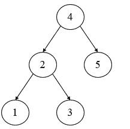
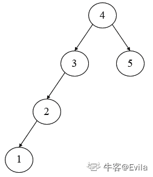
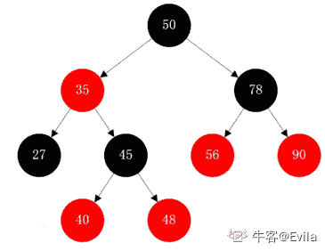
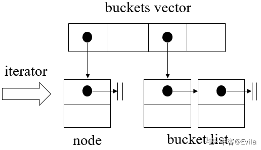
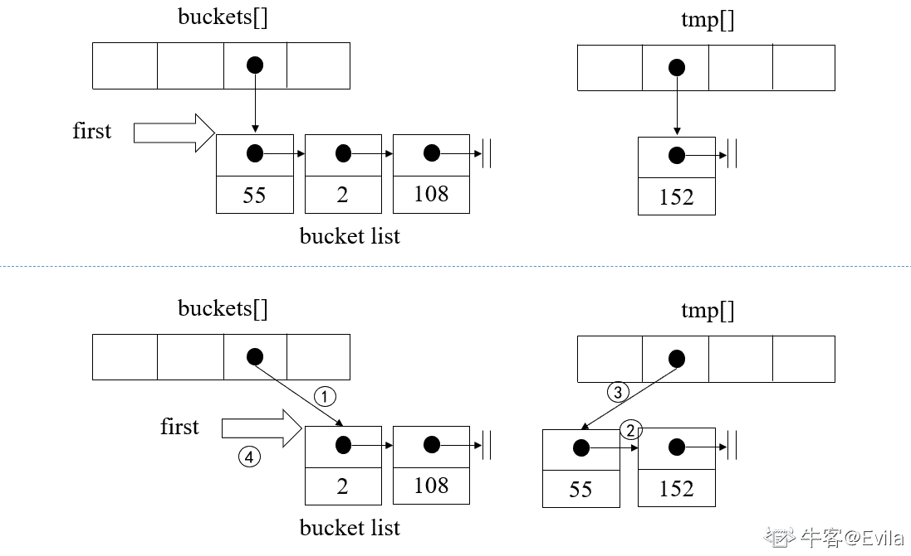

# 第四章 第 3 节 set、map 与 unordered_set、unordered_map

> 原文：[`www.nowcoder.com/tutorial/10094/f21af46e8d3941f9b541447698233d08`](https://www.nowcoder.com/tutorial/10094/f21af46e8d3941f9b541447698233d08)

# 1\. 前言

本文介绍 set、map 与 unordered_set、unordered_map 这四个容器，此类容器为关联式容器，主要是 set（集合）和 map（映射表）两大类。所谓关联式容器，即每笔数据都有一个键值（key）和一个实值（value），当元素被插入关联式容器中时，容器内部结构便会以键值大小，按照某中特定规则将元素放置在适当位置。关联式容器不存在头尾概念，因此也不会有 push_back()、pop_front()等操作。

### 2\. RB-tree

关联式容器的内部结构一般是一个 balanced binary tree（平衡二叉树），以便获得良好的搜寻效率。**RB-tree**（红黑树）也是一种特殊的平衡二叉树，被广泛应用于 STL 的关联式容器中。

提到**RB-tree**，首先就需要了解二叉树、二叉搜索树、平衡二叉搜索树的概念:

*   1.如图 1.1 所示：二叉树树由父子节点组成，树的最上端为根节点，每个节点可以最多有左右两个子节点，有子节点即为父节点，否则为叶子节点。



##### 图 1.1 二叉树示意图

*   2.二叉搜索树是特殊的二叉树，它满足：任何节点的键值一定**大于其左子树**中每一节点的键值，并**小于其右子树**中的每一个节点的键值。以上图为例，4 大于其左子树上的所有节点，小于其右子树上的节点，2 大于左子树上的节点，小于右子树上的节点，所以此树是一个二叉搜索树。二叉搜索树通过**中序遍历**即可得到一个有序的排列，因此，二叉搜索树可提供**对数时间 O(lgn)**平均时间复杂度的元素插入和访问。但二叉搜索树存在某个分支过长的情况,如图 1.2 所示,该二叉搜索树由于某个分支较长,其搜索元素的时间复杂度可能会退化成 O(n).



##### 图 1.2 非平衡二叉搜索树示意图

*   3.平衡二叉搜索树是特殊的二叉搜索树，它在满足二叉搜索树的前提下，还需要满足：任何节点的左右子树高度差最多为 1，从而保证了二叉搜索树的高度平衡;平衡二叉树由于其左右子树平衡的性质,因此其元素的搜索时间复杂度为**对数时间 O(lgn)**。

*   4.**RB-tree**不仅是一个平衡二叉搜索树，而且还满足以下规则： |RB-tree 规则| |:--| |每个节点不是红色就是黑色| |根节点为黑色| |如果节点为红，其子节点必须为黑| |任一节点至叶子节点的任何路径，所含黑节点数必须相同|



为了保持高度平衡，二叉树需要需要通过旋转等操作进行自我调整。由于红黑树的旋转算法较为复杂，这里只是对红黑树满足的规则进行简要介绍，不对红黑树的旋转算法做过多梳理。通过上述几个规则的保证，使红黑树能够保持一定的平衡，又不需要过度进行旋转调整。

### 2.1 RB-tree 迭代器

通过内存模型，我们可以知道，RB-tree 的迭代器至少要保证能指向树的节点(node)，且能支持按中序遍历的前进和后退动作，从而实现有序的遍历容器中的元素。

STL 中将树型结构容器的迭代器此分为两层，先设计了基础迭代器，然后再派生出子类进行特性封装。

基础迭代器中最重要的便是定义了迭代器在二叉搜索树中如何进行前进和后退; 众所周知,二叉搜索树的中序遍历结果是一个有序的列表，基础迭代器的前进和后退就是定义了中序遍历的前进和后退的一个步骤。

```cpp
// 基础迭代器
struct __rb_tree_base_iterator {
    ……
    /**
     * 二叉树中序遍历前进
     **/
    void increment()
    {
        if(node->right != 0)						   // 如果有右子节点）
        {
            node = node->right;						// 就向右走
            while(node->left != 0)					 // 然后一直沿左子树走到底
                node = node->left;					 // 走到底的左子节点前进到达的节点
        }
        else										   //如果没右子节点
        {
            __rb_tree_node_base* y = node->parent;	  // 找出父节点
            while(node == y->right)					 // 如果现在的节点本身就是父节点的右子节点
            {	
                node = y;							   // 一直向上找，直到不为右子节点
                y = y->parent;
            }
            if(node->right != y)					    // 如果此时的右子节点不是此时的父节点
                node = y;							   // 父节点就是下一节点
        }
    }

    /**
     * 二叉树中序遍历后退
     **/
    void decrement()
    {
        if(node->color == red && 					   // 如果是红节点，且
           node->parent->parent == node)			    // 父节点的父节点等于自己
        {
            node=node->right;					   	// 右子节点便是上一节点
        }
        else if(node->left != 0)					    // 如果有左子节点
        {
            __rb_tree_node_base* y = node->left;	    // 令 y 为左子节点
            while(y->right != 0)				    	// 若 y 有右子节点，
            {
                y = y->right;						   // 走到底
            }
            node = y;								   // 就是上一节点
        }
        else										    // 既不是根节点，也没有左子节点
        {
            __rb_tree_node_base* y = node->parent;	  // 找出父节点
            while(node == y->left)					  // 当 node 自身为左子节点时
            {
                node = y;
                y = y->parent;						  // 继续上溯至不为左子节点
            }
            node = y;								   // 就是上一节点
        }
    }
};
// rb_tree 的迭代器
struct __rb_tree_iterator : public __rb_tree_base_iterator
{
    ……
    // ++和--只需要调用 base 中的接口函数即可
    self& operator++()
    {
        increment();
        return *this;
    }
    self operator++(int)
    {
        self tmp = *this;
        increment();
        return tmp;
    }
    self& operator--()
    {
        decrement();
        return *this;
    }
    self operator--(int)
    {
        self tmp = *this;
        decrement();
        return tmp;
    }
}; 
```

### 2.3 RB-tree 的元素操作

红黑树的核心就是其有序性，所以元素操作本质上还是在有序的基础上进行的。

#### 2.3.1 插入操作

插入是红黑树的核心操作，其难点在于如何在插入后仍然保持红黑树的多个规则不被破坏：

| 函数项 | 说明 |
| :-- | :-- |
| 函数功能 | 用于在 RB-tree 中插入一个节点，它的 key 值是 v，若 v 已存在树中，则插入失败 |
| 参数 | 1.const Value& v，待插入的元素，key 值为 v |
| 返回值 | pair<iterator,bool>，返回插入指向插入节点的迭代器，以及插入是否成功 |
| 时间复杂度 | O(lgn) |
| 算法介绍 | 插入操作首先通过其值的大小来判断插入左侧或者右侧，然后调整指针加入红黑树。红黑树的平衡调整由于较为复杂，读者可自行翻阅学习 |

```cpp
pair<iterator,bool> insert_unique(const Value& v) 
{
    link_type y = header;
    link_type x = root();										  // 从根节点开始
    bool comp = true;
    while(x != 0) 
    {												              // 寻找合适的插入点
        y = x;													 // 记录此时节点
        comp = key_compare(KeyOfValue()(v),key(x));				// v 键值是否小于当前节点键值
        x = comp ? left(x) : right(x);						 	// 小于则左走，大于则右走（二叉搜索树的特性，左边节点小于父节点）
    }															  // 退出循环时，y 节点为插入点的父节点，插入点必为叶子节点
    iterator j = iterator(y);									  // 迭代器 j 指向其父节点
    if(comp) 
    {												 	         // 如果 comp 为真，则说明比父节点小，插入左侧  
        if(j == begin())									   	// 如果父节点是最左节点
            return pair<iterator,bool>(__insert(x,y,v),true);	  // 直接插入，x 为插入点，y 为父节点，v 为插入值
        else
            --j;												   // 否则调整 j
    }
    if(key_compare(key(j.node),KeyOfValue()(v)))				   // 新键值不与既有节点键值重复，则插入操作
        return pair<iterator,bool>(__insert(x,y,v),true);
    return pair<iterator,bool>(j,false);						   // 进行到此处，则说明有重复键值，不插入新值
}
// 真正的插入操作，x 为插入点，y 为父节点，v 为插入值
iterator __insert(RB_tree_node* x,RB_tree_node* y,const Value& v) 
{
    link_type x = (link_type) x_;
    link_type y = (link_type) y_;
    link_type z;

    if(y == header || x != 0 || key_compare(KeyOfValue()(v),key(y))) 
    {	 
        // 当父节点为 header 或者节点不为红色或者小于当前节点,左插
        z = create_node(v);												// 创造节点
        left(y) = z;													   // 父节点的左孩子为此节点
        if(y == header) 
        {												                  // 如果父节点为 header
            root() = z;													// 此节点即为根节点
            rightmost() = z;											   // 本身就是左右极值
        }
        else if(y == leftmost()) 
        {										                          // 如果父节点是原树左极点
            leftmost() = z;												// 此节点插入父节点左侧，成为左极点
        }
    }
    else 
    {																 
        z = create_node(v);												// 创造节点
        right(y) = z;													  // 父节点右孩子为此节点
        if(y == rightmost())											   // 如果父节点是原树右极值
            rightmost() = z;											   // 此节点插入其右侧，成为右极点
    }
    parent(z) = y;														 // 设定新节点的父节点
    left(z) = 0;														   // 设定新节点的左子节点
    right(z) = 0;														  // 设定新节点的右子节点
    																	   // 节点颜色会在重新平衡中设定调整
    __rb_tree_rebalance(z,header->parent);								 // 重平衡
    ++node_count;														  // 增加节点数
    return iterator(z);													// 返回新增节点
} 
```

#### 2.3.2 查找操作

| 函数项 | 说明 |
| :-- | :-- |
| 函数功能 | 用于在 RB-tree 中查找节点 |
| 参数 | 1.const Value& v：查找的元素，key 值为 v |
| 返回值 | iterator：返回查找到元素的迭代器 |
| 时间复杂度 | O(lgn) |

```cpp
iterator find(const Key& k) 
{
    link_type y = header;
    link_type x = root();

    while(x != 0) 
    {
        if(!key_compare(key(x),k))										// 如果 x 值大于 k，则
            y = x,x = left(x);											// 向左走
        else
            x = right(x);												 // 否则向右走
    }
    iterator j = iterator(y);											 // 迭代器 j 指向 y 节点
    return (j == end() || key_compare(k,key(j.node))) ? end() : j;		// 如果 j 为 end()，或者不存在此节点，返回 end()；否则 j 即为搜寻到的节点
} 
```

红黑树精髓便在左右判断上，也是二叉搜索树的重点特性：

```cpp
struct __rb_tree_node_base {
    bool color;							// 红 0 黑 1,false||true
    __rb_tree_node_base* parent;		   // 父节点
     __rb_tree_node_base* left;			// 左节点
     __rb_tree_node_base* right;		   // 右节点

    static  __rb_tree_node_base* minimum( __rb_tree_node_base* x)
    {
        while(x->left != 0)				 // 一直朝左走，便可以找到极小值，二叉搜索树的特性
        {
            x = x->left;
        }
        return x;
    }
    static  __rb_tree_node_base* maximum( __rb_tree_node_base* x)
    {
        while(x->right != 0)			    // 一直朝右走，便可以找到极大值，二叉搜索树的特性
        {
            x = x->right;
        }
        return x;
    }
}; 
```

### 2.4 RB-tree 的特殊设计

为了支持 STL 容器的`前闭后开`原则,RB-tree 中为树的根节点设计了一个父节点，名为 header 节点，header 节点具有以下特性：

*   1.header 节点与 root 节点互为父节点
*   2.headr 节点的 left 指向全树最小节点，用 leftmost 表示，同时它也是 begin 节点。
*   3.header 节点的 right 指向全树最大节点，用 rightmost 表示。

```cpp
template<......>
class rb_tree
{
typedef rb_tree_node*	link_type;
typedef size_t		   size_type;
......
protected:
	size_type	node_count;		// 追踪记录树的大小
	link_type	header;			// 根节点的父节点
	Compare		key_compare;	 // 节点间的键值比较准则，是个仿函数对象

protected:
	//RB 树初始化时，会对 header 节点进行初始化
	void init()
	{
		header = get_node();			  // 产生一个节点空间，令 header 指向它
		color(header) = __rb_tree_red;	// 令 header 为红色，用来区分 header 和 root

		root ( ) = 0;
		leftmost() = header;
		rightmost() = header;	//初始时候 设置 header 的左右子节点为自己
	}

	// 以下三个函数用来方便取得 header 的成员
	link_type& root() const { return (link_type&) header->parent; }  // root 节点是 header 的父节点
	link_type& leftmost() const { return (link_type&) header->left; }  
	link_type& rightmost() const { return (link_type&) header->right; }

	iterator begin() { return leftmost(); }	// 红黑树的按序起点为最左节点处
	iterator end() { return header; }		  // 红黑树的按序终点为 header 所指处

	Compare key_comp() const { return key_compare; }
}; 
```

## 3\. set 容器

### 3.1 set 内存模型

set 容器是关联式容器，它的 key 与 value 相同，set 中的所有元素都会按照元素的 key 被自动排序，且 set 的插入方法依赖于 RB-tree 的 insert_unique 方法，因此不允许有两个元素相同。

既然是有序，那么其底层自然而然就是**RB-tree**了，红黑树自身操作很稳定，插入和删除的效率也较高，所以 set 的所有操作基本都是调用红黑输的接口。

### 3.2 set 迭代器

set 容器的迭代器，也依赖于红黑树的迭代器的实现。

> 需要注意的是，不能通过迭代器来改变 set 的元素值，因为 set 的元素值就是键值，键值改变会引起 set 的结构变化。 set 的迭代器失效问题：当进行元素的插入和删除操作时，除被删除节点外，所有迭代器依然有效。

## 4\. map 容器

### 4.1 map 内存模型

map 同样以红黑树作为其底层结构，与 set 不同的是，map 中红黑树的节点谁由键和值组成一个 pair，pair 的第一元素为键值，第二元素为实值，map 中的所有元素会按照元素的键值进行排序。同样的，map 的插入方法依赖于 RB-tree 的 insert_unique 方法，不允许元素具有相同的键。

### 4.2 map 迭代器

同样的，map 容器的迭代器，也依赖于红黑树的迭代器的实现。

> 不能通过迭代器改变 map 的键值，因为会打乱排序结构。但以 pair 形式存在的第二元素实值却可以通过迭代器进行改变，因为不会影响到排序。 map 的迭代器失效问题：当进行元素的插入和删除操作时，除被删除节点外，所有迭代器依然有效。

### 4.3 set & map 迭代器失效案例

set & map 中被删除的节点迭代器会失效。

```cpp
#include <iostream>
#include <string>
#include <map>

using namespace std;

int main()
{
    map<int, string> myMap;
    myMap.insert(pair<int, string>(1, "Evila"));
    myMap.insert(pair<int, string>(2, "Evilaa"));
    myMap.insert(pair<int, string>(3, "Evilaaa"));

    // 错误写法
    for(auto iter = myMap.begin(); iter != myMap.end(); ++iter)
    {
        if(iter->first == 2)
        {
            myMap.erase(iter);  // 当执行了该行代码后 iter 指向的节点被释放了 iter 迭代器就失效了 因此在 for 循环再次执行时 ++iter 便会导致异常
        }
    }
    // 正确写法 
    // 注意,这里 for 循环语句没有对迭代器进行++操作
    for(auto iter = myMap.begin(); iter != myMap.end(); )
    {
        if(iter->first == 2)
        {
            // 删除元素后 erase 返回删除元素迭代器的下一位置
            iter = myMap.erase(iter);
        }
        else
        { 
            // 不删除元素时候 对迭代器++
            ++iter;
        }
    }
    return 0;
} 
```

## 5\. hashtable

*   在 vector 和 list 容器中，查找元素的时间复杂度为 O(n);

*   红黑树赋予了 set 和 map 中元素有序、能够在 O(lgn)时间复杂度下实现查找操作。

*   有没有一种结构，能够实现常数时间复杂度的查找元素呢？ 答：hashtable（散列表）查找、插入、删除等操作上能实现“常数时间”O(1)。

### 5.1 hashtable 实现原理

通过散列函数，将所有数据（尤其是大数）映射到“大小可接受之索引”。举个例子：假设 x 是任意整数，maxsize 是我们接受的最大索引，那么我们就可以将 “x%maxsize” 当作散列函数，这样就可以将所有数映射到我们可接受区间内。

这样带来的问题就是元素的碰撞，亦成为“哈希冲突”。解决哈希冲突有很多办法，视具体情况而定。

1.  线性探测法：循序往下寻找，直到找到可置位置，假设位置 H 已被占用，就寻找 H+1,H+2……H+i。
2.  二次探测：假设位置 H 已被占用，寻找 H+1 的平方，+2 的平方，以平方搜寻。
3.  开链法：在元素中维护一个 list，将冲突元素链起来存储。
4.  再散列法：准备多个散列函数，当第一个散列函数冲突时，便使用预备散列函数。

STL 便是以开链法来解决哈希冲突。



如上图所示，hashtable 的各节点不一定是一个元素，按 STL 的说法，我们称为桶节点。bucket 维护一个 linked list，并不是 STL 的 list，而是自己维护 hash table node。

```cpp
struct __hashtable_node
{
    __hashtable_node* next;
    value val;
}; 
```

所以，hashtable 以 vector 维护自己的 bucket 聚合体，以 linked list 进行桶节点的维护。

### 5.2 hashtable 迭代器

从上述可知，hashtable 需要维护两个关系，一个桶列表的关系，一个桶中节点 lie b 的关系，所以迭代器需要维护两个指针：

```cpp
struct __hashtable_iterator {
    node* cur;			// 迭代器目前所指节点
    hashtable* ht;		// 容器的连接关系
}; 
```

整个寻值流程可以从迭代器的前进操作中看出端倪：

```cpp
iterator& operator++() {
    const node* old = cur;									// 先存储旧值
    cur = cur->next;										  // 如果桶中存在下一个节点就下寻一个节点
    if(!cur)											  	// 没有 或者 是桶节点的最后一个节点了
    { 
        size_type bucket = ht->bkt_num(old->val);			 // 找到当前 bucket 在 vector 中的位置（bkt_num 可通过 value 找到当前在哪个 bucket 内）
        while(!cur && ++bucket < ht->buckets.size())		  // 如果存在下一个 bucket，定位到 vector 的下一个 bucket
            cur = ht->buckets[bucket];						// 切换到下一个 bucket
    }
    return *this;
} 
```

> 需要注意的是，hashtable 的迭代器没有后退操作（operator--()）。

### 5.3 hashtable 元素操作

由上述原理介绍可知：hashtable 的表格是以 bucket 为单位来进行管理的，所以操作元素的重要一步就是检查是否需要重建，以 insert 举例。

```cpp
pair<iterator, bool> insert_unique(const value_type& obj) {
    resize(num_elements + 1);				// 判断是否需要重建
    return insert_unique_noresize(obj);		// 插入
}
// 重建的标准是拿元素个数（将新增元素计入后）与 vector 的大小来比较，如果前者大于后者就进行重建
// 可以推断出，每个 bucket(list)的最大容量与 buckets vector 的大小是相同的
void resize(size_type num_elements_hint) {
    const size_type old_n = bucket.size();									 // 原 bucket 的大小
    if(num_elements_hint > old_n) {											// 需要重建
        const size_type n = next_size(num_elements_hint);					  // 此函数功能是选定下一个大小
        if(n > old_n) {		
            vector<node*, A> tmp(n,(node*) 0);								 // 设立新的 vector
            __STL_TRY {														// 处理旧 bucket
                for(size_type bucket = 0;bucket < old_n; ++bucket) {		   // 每个 bucket 依次处理
                    node* first = buckets[bucket];					 		// 找出指向节点的串行的起始节点
                    while(first) {											 // 当不到节点末尾
                        size_type new_bucket = bkt_num(first->val, n);		 // 大小成了 n，找出节点落在哪个新 bucket 内
                        // 此四步为具体操作，见下图
                        buckets[bucket] = first->next;						// 1.令旧 bucket 指向对应串行的下一节点，因 first 节点已摘除
                        first->next = tmp[new_bucket];						// 2.3.将当前节点插入到新 bucket，使其
                        tmp[new_bucket] = first;							  // 成为对应串行的第一个节点
                        first = buckets[bucket];							  // 4.回到旧 bucket 所指待处理串行，等待下一轮处理
                    }
                }
                buckets.swap(tmp);											// 对调新旧 bucket，离开时释放 tmp 内存
            }
        }
    }
}
pair<iterator, bool> insert_unique_noresize(const value_type& obj) {
    const size_type n = bkt_num(obj);										// 找到对应 bucket 位置
    node* first = buckets[n];												// first 指向当前串行头部
    for(node* cur = first;cur;cur = cur->next) {							 // 如果当前 bucket[n]已经被占用，进入链表寻找自己位置
        if(equals(get_key(cur->val),get_key(obj))) {						 // 如已经有重复元素，则不插入
            return pair<iterator,bool>(iterator(cur,this),false);			// 直接返回
        }
    }
    node* tmp = new_node(obj);											   // 新节点产生
    tmp->next = first;													   // 令新节点成为
    buckets[n] = tmp;														// 链表的第一个节点
    ++num_elements;														  // 增加节点个数
    return pair<iterator,bool>(iterator(tmp,this),true);
} 
```



上述为不允许重复键值，还有一种是允许重复键值，重建表格操作一致，只不过在插入时操作变化：

```cpp
pair<iterator,bool> insert_equal_noresize(const value_type& obj) {
    const size_type n = bkt_num(obj);										// 找到对应 bucket 位置
    node* first = buckets[n];												// first 指向当前串行头部
    for(node* cur = first;cur;cur = cur->next) {							 // 如果当前 bucket[n]已经被占用，进入链表寻找自己位置
        if(equals(get_key(cur->val),get_key(obj))) {						 // 如已经有重复元素，则直接插入
            node* tmp = new_node(obj);									   // 产生新节点
            tmp->next = cur->next;									   	// 将新节点插入当前位置之后
            cur->next = tmp;
            ++num_elements;
            return iterator<tmp,this>;
        }
    }
    node* tmp = new_node(obj);												// 新节点产生
    tmp->next = first;														// 令新节点成为
    buckets[n] = tmp;														 // 链表的第一个节点
    ++num_elements;														   // 增加节点个数
    return pair<iterator,bool>(iterator(tmp,this),true);
} 
```

其中有一个值得琢磨的函数：bkt_num 是如何知道元素落脚到哪一个 bucket 的，看源码：

```cpp
// 版本 1：接受实值和 bucket 个数
size_type bkt_num(const value_type& obj,size_t n) {
    return bkt_num_key(get_key(obj),n);
}
// 版本 2：接受实值
size_type bkt_num(const value_type& obj) const {
    return bkt_num_key(get_key(obj));
}
// 版本 3：接受键值
size_type bkt_num_key(const key_type& key) const {
    return bkt_num_key(key,bucket.size());
}
// 版本 4：接受键值和 bucket 个数
size_type bkt_num_key(const key_type& key,size_t n) const {
    return hash(key) % n;
} 
```

可以看到，通过四个版本的函数来完成元素值的 bucket 落脚对应，这也是 hash 的特性导致。

## 6\. unordered_set

### 6.1 unordered_set 内存模型

unordered_set 以 hashtable 为底层结构，其内存模型与 hashtable 一致。

unordered_set 和 set 一样，键值就是实值，但 set 有自动排序功能，unordered_set 没有。

### 6.1 unordered_set 迭代器

同样是依赖于 hashtable，需要注意的是，我们不能通过迭代器来改变 unordered_set 的元素值，因为 set 的元素值就是键值，键值改变会引起其结构变化。

#7\. unordered_map

### 7.1 unordered_map 内存模型

同样的，unordered_map 以 hashtable 为底层结构，其内存模型与 hashtable 一致。

unordered_map 和 map 一样，可以根据键值搜寻实值，但 map 有自动排序功能，unordered_map 没有。

### 7.2 unordered_map 迭代器

同样是依赖于 hashtable，不能通过迭代器来改变 unordered_map 的节点键值，但可以改变节点的 value 值。

unordered_set 的迭代器失效问题：当进行元素的插入和删除操作时，除被删除节点外，所有迭代器依然有效。

## 8\. 面试热点

### 8.1 set、map 的底层实现 && unordered_set、unordered_map 的底层实现

【出现频度】★★★★

【难度】☆☆☆

【参考答案】

*   1.  set、map 的底层依靠红黑树实现，需要对红黑树的基本性质、元素操作的方法、时间复杂度有较为深入的认识。
*   2.  unordered_set、unordered_map 的底层依靠哈希表实现，哈希表无法对元素进行排序，但能够加快元素的查找、插入或删除速度。
*   3.  红黑树和哈希表各有特点，在编码时依靠使用场景选择，例如需要元素按序排列时毫无疑问应选择红黑树结构；

### 8.2 红黑树的特点

【出现频度】★★★★

【难度】☆☆☆

【参考答案】 见上文红黑树，主要答出二叉平衡搜索树的性质、红黑树的节点关系及颜色。

### 8.3 set 和 unordered_set、map 和 unordered_map 的区别和联系

【出现频度】★★★★

【难度】☆☆☆

【参考答案】

*   1.  节点结构不同：set 和 unordered_set 的元素只有一个值，键值即为实值。map 和 unordered_map 都有一对值：键值和实值，通过键值来搜寻实值。
*   2.  底层实现不同，set 和 map 为红黑树，unordered_set 和 unordered_map 为哈希表。前者支持自动排序功能，后者不支持。
*   3.  查找、插入、删除等操作，哈希表优于红黑树，当有排序要求的时候，使用 set 和 map 效率更高。

### 8.4 如何解决哈希冲突

【出现频度】★★★

【难度】☆☆☆

【参考答案】

*   1.  线性探测法：循序往下寻找，直到找到可置位置，假设位置 H 已被占用，就寻找 H+1,H+2……H+i。
*   2.  二次探测：假设位置 H 已被占用，寻找 H+1 的平方，+2 的平方，以平方搜寻。
*   3.  开链法：在元素中维护一个 list，将冲突元素链起来存储。
*   4.  再散列法：准备多个散列函数，当第一个散列函数冲突时，便使用预备散列函数。

### 8.5 数据结构与算法题中的使用

【出现频度】★★★★★

【难度】☆☆☆☆

此处注意几种的区别即可。当题中需要有元素的排序等操作时，set 和 map 会更好一点。想优化搜寻时间的，一般用哈希表。

力扣 349T：[两个数组的交集](https://leetcode-cn.com/problems/intersection-of-two-arrays/)

力扣 692T：[前 K 个高频单词](https://leetcode-cn.com/problems/top-k-frequent-words/description/)

## 最后总结：

| 表头 | set | map | unordered_set | unordered_map |
| --- | :-: | :-: | :-: | :-: |
| 底层结构 | 红黑树 | 红黑树 | 哈希表 | 哈希表 |
| 排序 | 自动排序 | 自动排序 | 不支持 | 不支持 |
| 查询时间 | log(n) | log(n) | O(1)->平均 O(n)->最坏 | O(1)->平均 O(n)->最坏 |
| 插入、删除时间 | log(n)+Rebalance | log(n)+Rebalance | O(1)->平均 O(n)->最坏 | O(1)->平均 O(n)->最坏 |
| 使用场景 | 单元素、排序 | pair<key,value>，排序 | 单元素、不要求排序 | pair<key,value>，不排序 |