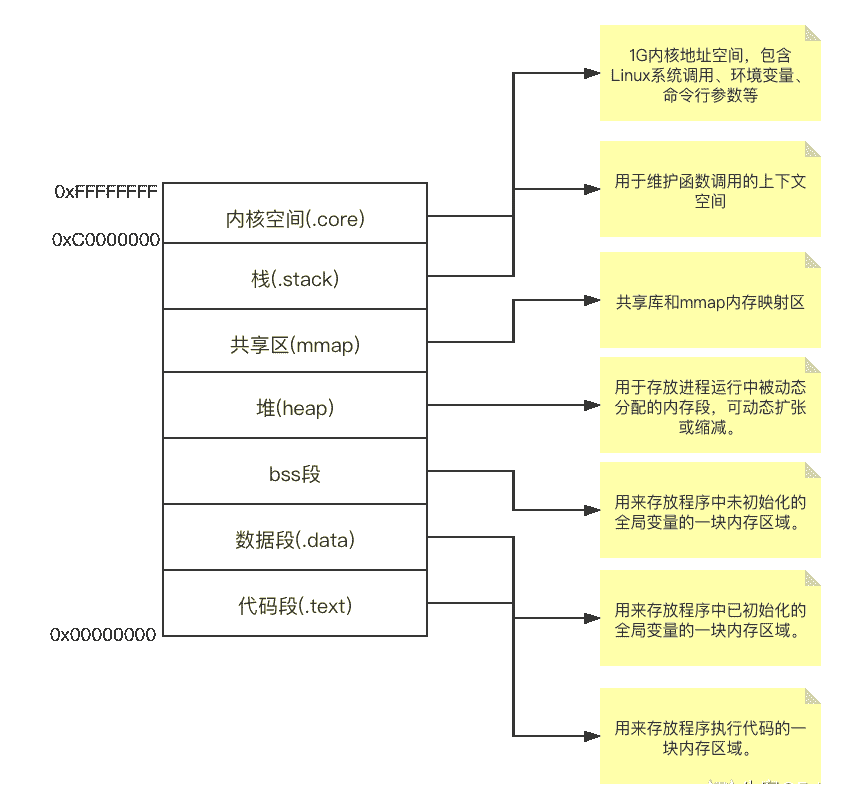
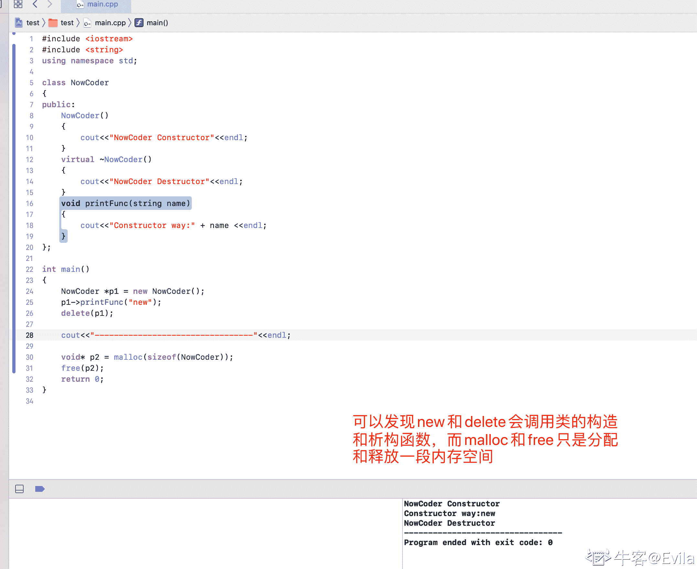
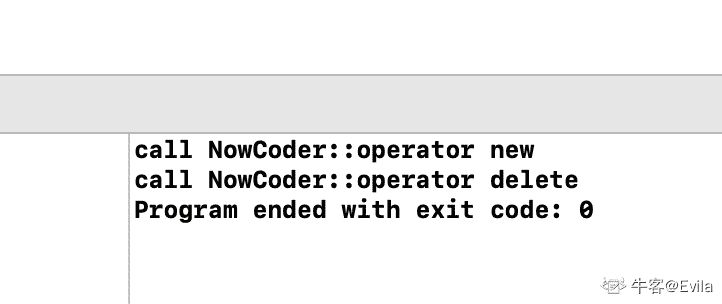

# 第五章 第 1 节 C++内存结构与智能指针

> 原文：[`www.nowcoder.com/tutorial/10094/a304dde5cfa24023a1702166d904447e`](https://www.nowcoder.com/tutorial/10094/a304dde5cfa24023a1702166d904447e)

# 1.C++内存管理

> 这是一个老生常谈的话题，内存管理是 C++程序员应学习的基础能力，同时也是校招、社招面试中让候选人头疼的问题。掌握内存管理的 C++程序员可以从中获得了更好的性能，更大的自由；但稍有不慎则会内存泄漏、core dump。因此，本篇文章从介绍 C++内存管理入手，介绍 C++程序员应该掌握的内存管理基础知识，进一步的介绍智能指针的概念以及 shared_ptr 的使用方法。

### 1.1 C++内存分配(内存分区)



如图所示：C++进程的内存空间被分为：

*   栈：用于维护函数调用的上下文空间，包括：程序临时创建的局部变量，也就是“{}”中定义的变量（不包括 static 声明的变量）; 函数调用时，编译器会将调用处的运行状态压栈，再将调用函数的返回地址、调用函数的参数、调用函数定义的临时变量依次压栈；由于栈的先进后出特点，所以栈特别方便用来保存/恢复调用现场。栈内存分配运算置于处理器的指令集中，效率很高，但是分配的内存容量有限，可用 ulimit -s 查看。
*   堆：用于存放进程运行中被动态分配的内存段，C++程序中使用 malloc 申请的空间在堆上，因此它的大小并不固定，可动态扩张或缩减。进程调用 malloc 函数分配内存时，新分配的内存就被动态添加到堆上；进程调用 free 函数释放内存时，被释放的内存从堆中被剔除，若未调用 free 释放，则会导致内存泄漏；因此，堆空间的操作给了 C++程序很大的自由。
*   .bss 段(Block Started by Symbol)：用来存放程序中未初始化的全局变量、静态变量（局部+全局）以及所有被初始化为 0 的全局变量或静态变量。
*   .data 段：用来存放程序中已初始化的全局变量/静态变量的内存区域。
*   .text 段：用来存放程序执行代码的一块内存区域，该内存区域通常属于只读。text 段也称为代码段，包括只读存储区和文本区，只读存储区存储一些常量（常量字符串和#define 定义的常量，这些常量不可以被寻址），文本区存储程序的执行代码。
*   mmap：存储动态链接库以及调用 mmap 方法进行内存映射的存储区域。

### 1.2 栈区与堆区的区别

至此，已经了解了 C++进程的内存分区以及各个分区存放内容和性质。对于 C/C++程序来说，栈区和堆区是程序函数调用和变量内存使用的主要区域，那么栈区和堆区有什么区别呢？

*   内存分配方式：栈由编译器自动进行动态分配与释放，是“先进后出”的连续内存存储结构，分配和回收效率较高。堆由 malloc/delete 系统调用进行动态分配与释放，由程序主动申请并主动释放，是非连续的存储结构，分配和回收效率较低，容易产生内存碎片。
*   内存分配响应：若栈剩余空间大于申请空间，则系统分配，否则抛栈溢出的异常；操作系统将堆空间划分为不连续的内存块，并按链式结构存储所有内存块，收到内存申请时遍历该链表，并返回第一个内存块空间大于所申请空间的堆结点，大于申请大小的多余部分将重新放入空闲链表。
*   内存生长方式：栈是向低地址扩展的数据结构，因为栈顶地址和栈的最大容量是预先设定好的，可获得的空间较为有限；堆是向高地址扩展的数据结构，因为链表的遍历方式是由低到高，堆的大小受限于系统中的虚拟内存。

### 1.3 new/delete 与 malloc/free 的相同与异同

new/delete operator 是 C++内建的操作符,不能修改它的行为，new operator 只做两件事：(1)调用 operator new 函数分配一块足够大、原始的、未命名的内存空间；(2) 调用对象的构造函数。 通常情况下，operator new 以标准 C 的 malloc()方法实现内存申请，operator delete 比标准 C 的 free()方法实现内存释放。但 operator new/delete 可以看做普通的函数，它可以根据不同的内存申请和释放策略被重载。 new/delete 与 malloc/free 的不同之处可总结为以下几点：

*   参数：new 申请内存分配时无需指定内存块的大小，而 malloc 需显式指定内存块大小。

```cpp
void *operator new(size_t size); 
void operator delete(void *p);
void *malloc(size_t __size);
void free(void *); 
```

*   返回值类型：若分配成功，new 返回对象类型的指针，malloc 返回 void*类型指针；若分配失败，new 抛出异常，malloc 返回 NULL。

*   分配方式：new/delete operator 调用参数类型的构造/析构函数；malloc/free 不会。

> new 操作符的执行过程：1\. 调用 operator new 分配内存 ； 2\. 调用构造函数生成类对象； 3\. 返回相应类型指针。

*   属性和操作上：new/delete 可以对其进行重载以获得更大的内存操作自由度；malloc/free 是 C 语言的系统函数，其本质是调用 brk/sbrk 系统调用。 一个 new/delete 和 malloc/free 的代码示例： 案例中，定义一个类 NowCoder,在构造函数和析构函数中打印相应的日志。在 main 函数中，分别使用 new/detele 和 malloc/free 去创建和删除 NowCoder 对象。 

##1.4 重载 operator new/delete

> 对于 C++程序员来说，动态的申请和释放堆内存使得程序具有更大的内存自由度；但无论是使用 new/delete，还是使用 malloc/free，始终是操作系统在堆中寻找内存空间进行内存分配和释放；这也使得堆内存具有分配/回收效率低，存在内存碎片等缺点。C++程序员可以通过重载 new/delete 操作符，将内存申请和释放的操作由编写的程序控制，而非操作系统去管理，这也是 C++内存池的基本思想。因此，本节介绍如何重载 operator new/delete，内存池在下一节继续介绍。

如下述代码所示：首先，在类 NowCoder 中重载了 operator new/delete，使其首先打印一句话，再调用 malloc 申请内存，并返回 malloc 申请的内存地址。由于类内部定义了 operator new，那么在执行 new operator 时，会调用类内部定义的 operator new，而不是全局的。如果重载了全局的 operator new/delete，那么该进程在进行 new/delete 时都将调用程序员定义的 operator new/delete, 这也就给予了 C++程序员极大的内存管理自由度。

```cpp
#include <iostream>
#include <string>
using namespace std;
class NowCoder
{
public:
    NowCoder() {}
    void* operator new(size_t size)
    {
        cout << "call NowCoder::operator new" << endl;
        return malloc(size);
    }
    void operator delete(void* p)
    {
        cout << "call NowCoder::operator delete" << endl;
        return free(p);
    }
private:
    int a;
};
int main()
{
    NowCoder* example1 = new NowCoder();
    delete example1;
} 
```

运行结果为： 

## 2.智能指针概述

内存泄漏：指因为疏忽或错误造成程序未能释放已经不再使用的内存的情况。内存泄漏并不是指内存在物理上的消失，而是应用程序分配某段内存后，因为设计错误，失去了对该段内存的控制，因而造成了内存的浪费。对于堆内存来说，若 C++程序员使用 new/malloc 申请了一段内存后，忘记使用 delete/free 进行内存释放，那么就会导致申请的内存不被该程序进程控制，从而导致堆内存泄漏。

为了保护堆内存，使得 C++程序员避免因疏忽而忘记释放堆内存，C++标准库提供了一套智能指针用于管理在堆上分配的内存，它将普通的指针封装为一个栈对象，这使得智能指针的表现与普通指针类似，并且当智能指针对象的生存周期结束后，会在智能指针的析构函数中释放掉该指针管理的内存，从而防止内存泄漏。

C++标准库提供了 4 个智能指针，分别是：auto_ptr,unique_ptr,shared_ptr,weak_ptr,其中后三个为 C++11 的新特性，并且 auto_ptr 在 C11 后被弃用。

### 2.1 unique_ptr

unique_ptr 是独占式智能指针，实现了唯一拥有的语义，它保证一个实例对象同一时间只能有一个 unique_ptr 指向该对象 在 C++11 的标准库中定义了智能指针 unique_ptr，该类是一个模板类，T 指得是托管对象的类型，D 指得是 deleter 类型，默认为 default_deleter(在 unique_ptr 析构时调用)。

```cpp
#include <memory>
#include <string>
template <class T, class D = default_delete<T>> 
class unique_ptr;
unique_ptr<string> p1(new string("I am Evila."));  // p1 是一个 unique_ptr 实例，它指向了一个 string 对象

unique_ptr<string> p2；
p2 = p1； // 不允许，尝试复制 p1 时在编译时报错 
```

p1 将托管对象所有权转移给 p2 不能进行简单的赋值，因为可能会留下悬挂的 p1 仍然指向托管对象，从而失去了独占的语义。C++标准库提供了 std::move()函数，去转移 unique_ptr 的所有权。

```cpp
unique_ptr<string> p1(new string("I am Evila."));  // p1 是一个 unique_ptr 实例，它指向了一个 string 对象
unique_ptr<string> p2；
p2 = move(p1); 
```

### 2.2 shared_ptr

shared_ptr 是共享式智能指针，实现了共享式的管理概念，即多个 shared_ptr 可以指向同一个对象。 在 C++11 的标准库中定义了智能指针 shared_ptr，该类是一个模板类，T 指得是托管对象的类型，D 指得是 deleter 类型，默认为 default_deleter(在 shared_ptr 析构时调用)。

```cpp
#include <memory>
template <class T, class D = default_delete<T>>
class shared_ptr; 
```

例如：

```cpp
string *s1 = new string("s1");
shared_ptr<string> ps1(s1);  // shared_ptr 托管了 string 类型,即 ps1 为指向 string 类型变量的指针
shared_ptr<string> ps2(new string("s2")); // 与上句等价 
```

由于多个 shared_ptr 可以指向同一个对象，因此该对象只有在最后一个指向它的 shared_ptr 销毁时才能析构。

为了实现共享，shared_ptr 内部存在一个计数的机制来管理指向对象的共享数量(use_count()可以查看)。

shared_ptr 的常用方法如下所示：

*   use_count(): 返回引用计数的数量
*   reset(): 放弃托管对象的所有权，引用计数减 1
*   get(): 返回指向对象的地址空间
*   swap(): 交换两个 shared_ptr 托管对象

### 2.3 weak_ptr

weak_ptr 是一种不控制对象生命周期的智能指针，它指向一个 shared_ptr 管理的对象。是 shared_ptr 的小弟，它的出现是为了解决解决 shared_ptr 的循环引用问题。weak_ptr 本身也是一个模板类，但是不能直接用它来定义一个智能指针的对象，只能配合 shared_ptr 来使用，可以将 shared_ptr 的对象赋值给 weak_ptr，weak_ptr 对象的构造和析构不会引起引用计数的增加或减少。

weak_ptr 主要有 lock、swap、reset、expired、operator=、use_count 几个成员函数，与 shared_ptr 相比多了 lock、expired 函数，但是却少了 get 函数，operator* 和 operator->等函数。

#### 2.3.1 shared_ptr 的循环引用

若定义了这样的两个类，类 A 中有指向类 B 对象的 shared_ptr 指针，同样的类 B 中也有指向类 A 对象的 shared_ptr 指针

```cpp
class B;  // 前向声明
class A
{
public:
    A() { cout << "A() construct! " << endl; }
    ~A() { cout << "~A() destruct! " << endl; }
    void set_ptr(shared_ptr<B>& ptr) { ptrB = ptr; }
    void b_use_count() { cout << "b use count : " << ptrB.use_count() << endl; }
    void show() { cout << "this is class A!" << endl; }
private:
    shared_ptr<B> ptrB;
};

class B
{
public:
    B() { cout << "B() construct! " << endl; }
    ~B() { cout << "~B() destruct! " << endl; }
    void set_ptr(shared_ptr<A>& ptr) { ptrA = ptr; }
    void a_use_count() { cout << "a use count : " << ptrA.use_count() << endl; }
    void show() { cout << "this is class B!" << endl; }
private:
    shared_ptr<A> ptrA;
}; 
```

根据上节我们已经了解了 shared_ptr 的引用计数机制，当有多个 shared_ptr 对象指向同一个目标对象时，shared_ptr 内部的引用计数会增加。当前类 A 和类 B 中都有对方的 shared_ptr 指针，若我们在使用时创建了类 A 和类 B 对象的 shared_ptr，会发生如下情况：

```cpp
int main()
{
    shared_ptr<A> ptrA(new A()); 
    shared_ptr<B> ptrB(new B());
    cout << "a use count : " << ptrA.use_count() << endl;  // 1
    cout << "b use count : " << ptrB.use_count() << endl;  // 1
    ptrA->set_ptr(ptrB);
    ptrB->set_ptr(ptrA);  // 循环引用产生 
    cout << "a use count : " << ptrA.use_count() << endl;  // 2
    cout << "b use count : " << ptrB.use_count() << endl;  // 2
    return 0;
} 
```

即我们只创建了一个类 A 和类 B 的对象(new 语句)，并用 shared_ptr 托管。在循环引用产生之前，类 A 和类 B 对象被引用次数都为 1，但是当循环引用产生之后，类 A 和类 B 对象被引用次数都为 2。此时，尽管 main 函数结束，ptrA 和 ptrB 的生命周期结束，引用次数各-1，那么类 A 和类 B 对象被引用次数变为 1，而不是 0，从而类 A 和类 B 的对象都不会去析构。

##### 解决循环引用的办法就是将类 A 或类 B 中的任意一个成员变量改为 weak_ptr 对象，因为 weak_ptr 不会增加引用计数，使得引用环被破坏，可以正常在对象生命周期结束时调用析构函数。

#### 2.3.2 weak_ptr 的 lock 和 expired 方法

因为 weak_ptr 对象不能主动构造去指向托管的对象，且不会改变 shared_ptr 的引用次数，因此 weak_ptr 需要 lock 和 expired 函数去检测和获取对象。

*   expired 函数来检测 weak_ptr 所指向的对象是否已经被释放，如果已经释放, 返回 true; 否则返回 false。
*   lock 函数用于获取所管理的对象的强引用(shared_ptr)。通常，在调用 lock()之前需要先调用 expired 函数去检查对象析构情况，如果 expired()返回 true,那么 lock()函数会返回一个空的 shared_ptr 对象; 否则返回一个指向 weak_ptr 托管对象的 shared_ptr 对象。因此，可以发现在 lock()成功时会延长 shared_ptr 对象的生命周期,因为它新增了一个引用计数。

在 weak_ptr 的帮助下，我们对上节中的例子进行修改, 即类 A 中的成员使用 weak_ptr 替代，有效的解决了循环引用带来的内存问题。

```cpp
class B;  // 前向声明
class A
{
public:
    A() { cout << "A() construct! " << endl; }
    ~A() { cout << "~A() destruct! " << endl; }
    void set_ptr(shared_ptr<B>& ptr) { ptrB = ptr; }
    void b_use_count() { cout << "b use count : " << ptrB.use_count() << endl; }
    void show() { cout << "this is class A!" << endl; }
private:
    weak_ptr<B> ptrB;
};

class B
{
public:
    B() { cout << "B() construct! " << endl; }
    ~B() { cout << "~B() destruct! " << endl; }
    void set_ptr(shared_ptr<A>& ptr) { ptrA = ptr; }
    void a_use_count() { cout << "a use count : " << ptrA.use_count() << endl; }
    void show() { cout << "this is class B!" << endl; }
private:
    shared_ptr<A> ptrA;
}; 
```

#3.深入剖析 shared_ptr

### 3.1 make_shared

在 C++11 的标准库中定义了 make_shared()函数, 这个函数作用帮助构造一个 shared_ptr 对象并将其返回。通常情况下，使用 make_shared 初始化 shared_ptr 对象。

```cpp
#include <memory>
shared_ptr<string> ps1 = make_shared<string>("hello world"); 
```

### 3.2 使用 make_shared 的优点

1.  提高性能 我们已经了解到 shared_ptr 是共享式智能指针类，其内部需要维护指向托管对象的指针和管理指向托管对象的智能指针数量。当我们使用普通指针或使用 new 来构建 shared_ptr 对象时，shared_ptr 对象内部需要单独的分配控制块来进行计数控制，因此这种方式构建 shared_ptr 需要申请内存两次(1.构建智能指针对象；2.构建计数控制块)。而使用 make_shared 时，make_shared 会申请一块内存同时存放智能指针对象和计数控制块，使得内存分配减少到一次。另外，使用 make_shared 消除了一些控制块需要记录的信息，潜在地减少了程序的总内存占用。
2.  减少异常 例如在函数调用时，将 shared_ptr 的右值作为实参传递：

```cpp
class NowCoder;  // 前文定义的类
// func 函数声明，第一个参数是 shared_ptr，
void func(shared_ptr<NowCoder> ptr, 其他参数);  
// func 函数调用
func(shared_ptr<NowCoder>(new NowCoder), 其他参数)); // 潜在的资源泄露 
```

编译器把源代码翻译到目标代码时，运行期函数的参数必须在函数被调用前被估值。并且，由于在 func 函数调用时，未使用 make_shared 去构建 shared_ptr 对象，因此 new NowCoder 和构造 shared_ptr 是被分开成 2 步的。那么在调用 func 之前，需要对 new NowCoder、构造 shared_ptr 和其他参数进行估值，而且顺序是随机的。这可能会导致出现这样的顺序：new NowCoder、其他参数、构造 shared_ptr，当评估其他参数时出现异常，那么会导致 NowCoder 对象没办法托管给 shared_ptr 对象，从而造成内存泄漏。

### 3.3 share_ptr 的简易实现

1.  定义引用计数器

```cpp
class Counter
{
public:
    Counter() : shared_counter(0) {}  // 利用初始化列表初始计数为 0
    int shared_counter;  // share_ptr 的引用计数
} 
```

2.  实现 shared_ptr

```cpp
// shared_ptr 定义为模板类，它可以托管任意类型的对象
template <class T>
class shared_ptr
{
public:
    // 在构造函数中进行托管关系绑定
    shared_ptr(T *p = nullptr) : _ptr(p)
    {
        cnt = new Counter();
        if (p)
        {
            cnt->shared_counter = 1;
        }
        cout << "shared_ptr construct, count:" << cnt->shared_counter << endl;
    }
    // 析构函数中释放托管关系
    virtual ~shared_ptr()
    {
        reset();
    }
    // 重载赋值'='运算符，使 shared_ptr 可以像普通指针一样进行赋值
    shared_ptr<T> &operator=(shared_ptr<T> &ptr)
    {
        if (this != &ptr)
        {
            (ptr.cnt)->shared_counter++;  // 引用计数++
            cout << "assign construct " << (ptr.cnt)->shared_counter << endl;
            cnt = ptr.cnt;
            _ptr = ptr._ptr;
        }
        return *this;
    }
    // 重载解引用'*'运算符，使 shared_ptr 可以像普通指针一样解引用
    T &operator*()
    {
        return *_ptr;
    }
    // 重载'->'运算符，使 shared_ptr 可以像普通指针一样访问指向对象的成员
    T *operator->()
    {
        return _ptr;
    }
    // 获取指向当前对象的 shared_ptr 引用数
    int use_count()
    {
        return cnt->shared_counter;
    }
    // 获取真正的指针变量
    T * get()
    {
        return _ptr;
    }
protected:
    // 释放引用关系，当引用计数为 0 时，释放托管对象的内存空间
    void reset()
    {
        cnt->shared_counter--;
        cout << "reset " << cnt->shared_counter << endl;
        if (cnt->shared_counter <= 0)
        {
            delete _ptr;  // 释放托管对象
        }
    }
private:
    T *_ptr;  // 私有数据成员 指向托管对象的指针
    Counter *cnt; // 引用计数器
}; 
```