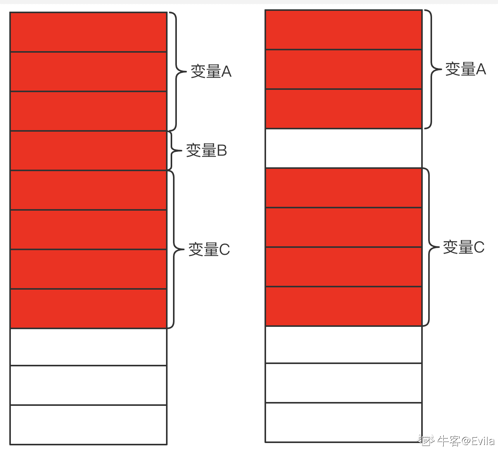
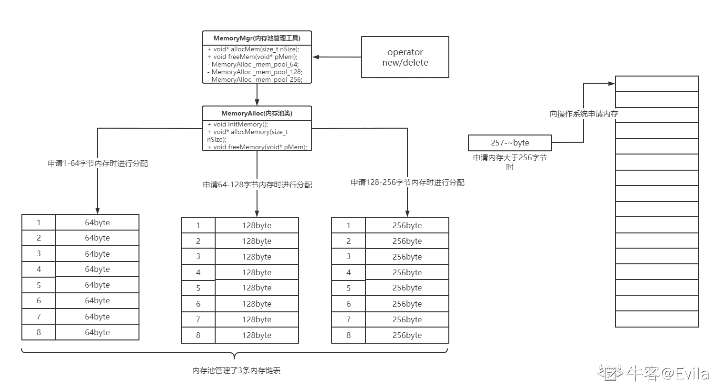

# 第五章 第 2 节 内存池的设计与实现

> 原文：[`www.nowcoder.com/tutorial/10094/553db4b8c5ee4008856c096dbb05ae67`](https://www.nowcoder.com/tutorial/10094/553db4b8c5ee4008856c096dbb05ae67)

#1.内存碎片 在 C++内存管理一章中介绍到，内存分区中堆区由 C++进程主动申请和释放，堆内存的管理具有内存申请大小任意、即时分配和释放的特点。因此，频繁的堆内存申请与释放会产生空闲的内存块以小且不连续方式出现在任意位置，这些不可用的空闲内存被称作内存碎片。

### 1.1 内碎片

操作系统的内存分配方式一般起始于可被 4、8 或 16 整除的内存位置(视处理器体系结构而定)，内存分配算法仅能把预定大小的内存块分配。因此当某个程序申请一个 23 字节的内存块时，因为没有刚刚好 23 字节的内存块，所以可能会获得 32 字节、64 字节等更大一点的字节空间。将程序申请所需内存大小增加到相对内存块而产生的多余空间就叫内碎片。

**内碎片是已经被分配出去（能明确指出属于哪个进程）的内存空间大于请求所需的内存空间，这部分多分配的不能被利用的内存空间就是内碎片。**

### 1.2 外碎片

外部碎片是当已分配内存块之间出现未被使用的较小内存块时，这部分较小内存块还没有分配出去（不属于任何进程），但是由于大小而无法分配给申请内存空间的内存空闲块。

如下图所示：有 8 个内存块被分配给了 3 个变量，其中变量 A 分配 3 个内存块，变量 B 分配 1 个内存块，变量 C 分配 4 个内存块。此时，变量 B 生命周期结束，内存空间被释放。但如果后续的所有进程运行过程中，存在申请的内存块数量为 1 个，那么可以在变量 A 和变量 B 之间的这个内存块会被分配。但如果申请的内存块数量始终都大于 1 块，那么变量 A 和变量 B 之间的这个内存块永远得不到使用，也就是外碎片。



# 2.C++内存池设计与实现

### 2.1 内存池设计原理

内存池的设计原理可归纳为一次性或较少次的从系统中申请足够大小的内存空间，并自定义内存分块、申请与释放的策略，由程序管理该程序所有变量的内存分配与释放。内存池可以在一定程度上提升内存资源管理的效率(减少堆内存申请与释放)，并极大程度的避免内存碎片的产生。因此，对于 7*24 小时运行的程序原则上应该使用内存池进行内存管理。

内存池的首要设计目标为：(1)简单；(2)高效；(3)针对性强；

其概念模型如下图所示：

*   内存池的设计也是将内存分块，内存块单位大小可按业务调整。内存块通过链式连接，不同单位大小的内存块相连组成了多个内存块链表。
*   内存池在进程启动时，首先向操作系统申请一大片内存空间，并初始化为设计好的多个内存块链表。
*   在程序运行过程中，内存池接收到分配内存的请求，首先判断内存申请的大小，选择大于等于申请内存空间的内存块链表进行快速分配并响应内存申请。
*   内存池接收到内存释放请求时，根据释放内存所在地址，快速判断所在的内存块链表，将该内存块清空并恢复到链表中等待被分配(此时需要内存块头部存储其所归属的内存链表信息)。
*   因此，链式内存池的设计最重要的优点在于高效和简单，在内存分配时不需要做过多的计算应该分配在哪里，而是直接查找对应的内存链，再查找链内的空闲块分配即可。内存释放时，直接将内存块清空并将内存块恢复到链表中。



### 2.2 内存池的意义

程序在运行过程中不可避免的会产生内存碎片，对于后台常驻的 server 进程要想长期运行一周、一个月或者更久，由系统进行内存管理会产生一系列不可控制的情况发生。

内存池应该被设计成与服务相匹配的内存管理机制，使得程序员可以有能力管理内存，避免内存碎片的产生，使程序长期稳定、高效运行。

### 2.3 内存池实现步骤

*   Step1: 编写内存块头部类，用于封装内存块的基本属性，相当于实现链表的结点

```cpp
class MemoryAlloc; // 内存池类前向声明
class MemoryBlock
{
public:
	MemoryBlock()
	{
		pAlloc = nullptr;
		pNext = nullptr;
	}
	~MemoryBlock() {}
public:
	// 内存块编号
	int nID;
	// 引用次数
	int nRef;
	// 所属内存池的指针 相当于所属链表的指针
	MemoryAlloc* pAlloc;
	// 下一块位置
	MemoryBlock* pNext;
	// 是否在内存池中
	bool bPool;
}; 
```

*   Step2: 使用模板类编写内存池类，便于在声明内存池对象时，利用模板初始化成员变量的做法。

```cpp
template<size_t nBlockSize, size_t nSize>
class MemoryAlloc 
{
    protected:
    	MemoryBlock* _pHead;	// 内存块头部结点指针
    	size_t _nBlockSize;	// 内存块的单元大小
    	size_t _nSize;	// 内存块的数量
    	char* _pBuff;	// 内存池首地址
    public:
    	MemoryAlloc()  //  构造函数初始化
    	{
    		_pBuff = nullptr;
    		_pHead = nullptr;
    		_nBlockSize = nBlockSize;
    		_nSize = nSize;
    	}
    	~MemoryAlloc()
    	{
    		if(_pBuff)  //  析构函数释放资源
    		{
                    free(_pBuff);
                }
    		_pBuff = nullptr;
    		_pHead = nullptr;
    		_nBlockSize = 0;
    		_nSize = 0;
    	}
    	// 初始化内存池
    	void initMemory();

    	// 分配内存
    	void* allocMemory(size_t nSize);

    	// 释放内存
    	void freeMemory(void* pMem);
}; 
```

内存池类的成员变量包括内存块的头结点指针、内存块的单元大小(16 字节、32 字节、64 字节等等)、内存块的数量等，相当于链表中的头结点指针、链表结点的大小和结点数量。内存池类的成员方法包括初始化方法、分配内存方法和释放内存方法。接下来依次实现这三个方法：

*   1.实现初始化内存池 initMemory()

```cpp
void MemoryAlloc::initMemory()
{
    if (_pBuff)
    {
        return;
    }
    // 为内存池向系统申请内存，此处计算出该内存池共需要多大的内存资源
    // 内存池的概念图表达了：内存块的整体由头部信息+实际内存块空间组成，其中 _nBlockSize 是内存块空间，MemoryBlock 是内存块的头部信息
    // 因此，一个内存块所需要的整体内存空间=_nBlockSize + sizeof(MemoryBlock)
    size_t size = _nSize * (_nBlockSize + sizeof(MemoryBlock));
    // 利用 malloc 向系统申请该内存池需要的全部资源
    _pBuff = (char*)malloc(size); 

    // 申请到系统内存资源后，将其切割成多个内存块，并按链表的方式管理
    // 首先初始化头结点
    _pHead = (MemoryBlock*)_pBuff;  // 头结点指针等于内存池首地址
    _pHead->nID = 0;
    _pHead->bPool = true;
    _pHead->nRef = 0;
    _pHead->pAlloc = this;  // 内存块所属的内存池指针赋值
    _pHead->pNext = nullptr;

    // 循环 nSize-1 次，构造 nSize-1 个内存块节点
    for (int i = 1; i < _nSize; i++)
    {
        // 计算出下一个内存块的地址
        MemoryBlock* pTemp = (MemoryBlock*)((char*)_pBuff + (sizeof(MemoryBlock) + _nBlockSize) * i);
        // 赋值内存块的属性
        pTemp->bPool = true;
        pTemp->nID = i;
        pTemp->nRef = 0;
        pTemp->pAlloc = this;
        pTemp->pNext = nullptr;
        // 将前序结点的 next 指向当前节点
        _pHead->pNext = pTemp;
        _pHead = pTemp;
    }
    _pHead = (MemoryBlock*)_pBuff;    // 头部回到内存池首地址
} 
```

*   2.  分配内存方法 allocMemory(size_t nSize)实现，该方法的参数是需要分配的内存大小，返回值为分配成功的内存地址

```cpp
void* MemoryAlloc::allocMemory(size_t nSize)
{
    if (!_pBuff)
    {
        // 如果内存池还未初始化 先初始化
        initMemory();
    }
    MemoryBlock* pReturn = nullptr;
    if (!_pHead)    // 内存池没有空闲块可用时 向操作系统申请内存
    {
        pReturn = (MemoryBlock*)malloc(nSize + sizeof(MemoryBlock));
        pReturn->bPool = false;  // 不在内存池中
        pReturn->nID = -1;
        pReturn->nRef = 1;
        pReturn->pAlloc = nullptr;
        pReturn->pNext = nullptr;
    }
    else
    {
        pReturn = _pHead;  // 当头结点指针非空时，直接将头结点作为分配的空间返回
        _pHead = _pHead->pNext; // 头节点指向下一个空间内存块
        pReturn->nRef++;  // 内存块引用次数+1
    }
    xPrintf("allocMem: %lx,id=%d, size=%d\n", pReturn, pReturn->nID, nSize);
    // 注意：这里的返回值不是 pReturn，而是 pReturn + sizeof(MemoryBlock)
    // 原因还是内存块的整体由头部信息+实际内存块空间组成，而用户申请分配内存的变量只需要实际的内存空间，并不需要关心内存块的头部信息
    // 因此需要将 pReturn 向后偏移 sizeof(MemoryBlock)个字节返回
    return ((char*)pReturn + sizeof(MemoryBlock));
} 
```

*   3.释放内存方法 freeMemory(void* pMem), 该方法的参数是需要释放的内存地址，返回值为空

```cpp
void MemoryAlloc::freeMemory(void* pMem)
{
    // 同样的，用户在释放内存时的实参一定是内存块的实际内存空间，即不包含内存块头部的部分，
    // 因此这里需要将用户的实参向前偏移一个内存块头部大小的地址进行释放
    MemoryBlock* pBlock =  (MemoryBlock*)((char*)pMem - sizeof(MemoryBlock));
    if (--pBlock->nRef != 0)
    {
        // 引用次数减 1 
        // 如果该内存块引用次数不等于 0 直接返回
        return;
    }
    if (pBlock->bPool == true)    
    {
        // 如果内存块在内存池中，将该内存块作为头节点重新加入到链式管理中
        pBlock->pNext = _pHead;
        _pHead = pBlock;
    }
    else  
    {
        // 释放的内存块在内存池外，即系统申请的内存
        // 直接调用 free 释放资源
        free(pBlock);
        return;
    }
} 
```

根据以上的实现，作出如下关键点总结：

1.  内存块的整体包含：头部信息 + 实际存储空间
2.  内存池在初始化时，一次性向操作系统申请计算出的所需总空间大小，随后将申请的空间切割成多个内存块进行链式管理
3.  内存分配时，判断头结点是否为空，当头结点不为空时，将头结点作为分配的空间并返回头节点指针向后偏移内存块头部信息(sizeof(MemoryBlock))的地址。若头结点为空，则意味着该内存池已被分配完，需要向操作系统申请资源，并设置好头部信息后返回。
4.  内存释放时，首先将释放的地址向前偏移内存块头部信息(sizeof(MemoryBlock))的地址，以得到该内存块的头部信息；判断该内存块是否属于内存池，属于内存池的内存块不会真正的调用 free 方法归还给操作系统，而是将被释放的内存块作为头结点，之前的头结点则作为释放节点的 next 重新管理。

因此，以上实现的内存池的头结点若非空，则可以将头结点立刻分配返回，符合内存池设计时的简单、高效的特点。此外，内存池类以模版的方式实现，方便在实例化对象时快速初始化成员变量，可以依据业务特点，实例化多个不同内存块大小内存池对象，符合内存池设计的针对性强特点。 例如：

```cpp
MemoryAlloc<16, 1000> memPool16;  // 内存块逻辑空间为 16 字节，数量为 1000 个
MemoryAlloc<32, 1000> memPool32;  // 内存块逻辑空间为 32 字节，数量为 1000 个
MemoryAlloc<64, 5000> memPool64;  // 内存块逻辑空间为 64 字节，数量为 5000 个 
```

## 3\. 设计内存管理工具

在定义并初始化了内存池后，需要将内存池的分配和释放方法隐藏起来，因此，需要设计一个内存管理工具，帮助我们在程序设计过程中不感知内存分配和释放的策略。

### 3.1 单例模式的内存管理工具类

内存管理工具类将多个内存池对象进行封装管理，在申请和回收内存请求方法中快速调用适配的内存池对象执行分配和释放内存操作。

```cpp
const int MAX_MEMORY_SIZE = 1024;
class MemoryMgr
{
 public:
    static MemoryMgr& Instance()
    {
    	static MemoryMgr mgr;
    	return mgr;
    }
    // 申请内存方法
    void* allocMem(size_t nSize);

    // 释放内存方法
    void freeMem(void* pMem);
 private:
    MemoryMgr()
    {
        init_map(0, 64, &_mem_pool_64);
        init_map(65,128, &_mem_pool_128);
        init_map(129,256, &_mem_pool_256);
        init_map(257, 512, &_mem_pool_512);
        init_map(513, 1024, &_mem_pool_1024);
    }
    ~MemoryMgr()
    {

    }
 private:
    void init_map(int nBegin,int nEnd, MemoryAlloc* pMem_pool)    // 初始化内存池映射数组
    { 
        for (int i = nBegin; i <= nEnd; i++)
        {
            _szAlloc[i] = pMem_pool;
        }
    }
private:
    MemoryAlloc<64, 1000> _mem_pool_64; 

    MemoryAlloc<128, 1000> _mem_pool_128;

    MemoryAlloc<256, 1000> _mem_pool_256;

    MemoryAlloc<512, 1000> _mem_pool_512;

    MemoryAlloc<1024, 1000> _mem_pool_1024;

    MemoryAlloc* _szAlloc[MAX_MEMORY_SIZE + 1]; // 内存池的映射数组 存储了每个内存字节申请对应的内存池对象指针
}; 
```

在 MemoryMgr 类中，定义了 5 个内存池对象，内存块单元大小分别是 64 字节、128 字节、256 字节、512 字节和 1024 字节，可按照业务的使用调整。为了能够快速计算用户所申请的内存资源应该适配哪个内存池对象，在 MemoryMgr 类定义了内存池的映射数组，数组的大小是管理的所有内存池对象中最大内存块大小，本案例中为 1024 字节，可按业务调整。而且，实现了将内存块大小与内存池对象映射起来的方法-init_map()，在该方法中以内存池的映射数组的下标作为内存块大小，数组值为对应的内存池对象指针。有了这个映射关系，可以通过内存池的映射数组的下标快速获取到使用该下标内存块单元大小的内存池对象。

*   1.申请内存方法的实现

```cpp
void* MemoryMgr::allocMem(size_t nSize)
{
    if (nSize > MAX_MEMORY_SIZE)
    {
        // 如果申请的内存大小大于定义的最大内存池管理的内存块大小，则不在内存池中分配此请求
        // 转而从操作系统从申请，与内存池资源耗尽时做法类似
        MemoryBlock* pReturn = (MemoryBlock*)malloc(nSize + sizeof(MemoryBlock));
        pReturn->bPool = false;
        pReturn->nID = -1;
        pReturn->nRef = 1;
        pReturn->pAlloc = nullptr;
        pReturn->pNext = nullptr;
        xPrintf("allocMem: %lx,id=%d, size=%d\n", pReturn, pReturn->nID, nSize);
        return ((char*)pReturn + sizeof(MemoryBlock));
    }
    else
    {
        // 符合使用内存池分配时 通过内存池的映射数组快速获取适配的内存池对象 并调用内存池的 allocMemory 方法进行内存分配
        return _szAlloc[nSize]->allocMemory(nSize);
    }
    return nullptr;
} 
```

*   2.释放内存方法的实现

```cpp
void MemoryMgr::freeMem(void* pMem)
{
    // 同样的，将需要释放的内存地址向前偏移，得到内存块头部信息
    MemoryBlock* pBlock = (MemoryBlock*)((char*)pMem - sizeof(MemoryBlock));
    xPrintf("freeMem: %lx,id=%d\n", pBlock, pBlock->nID);
    // 根据 bPool 成员判断该内存块属于是否属于内存池
    if (pBlock->bPool == true)
    {
        // 属于内存池的内存块，根据成员 pAlloc 获取到所属内存池的对象指针，调用 freeMem 方法释放内存
        pBlock->pAlloc->freeMem(pMem);
    }
    else
    {
        // 不属于内存池的内存块，当引用次数为 0 时 调用 free 释放内存
        if (--pBlock->nRef == 0)
        {
            free(pBlock);
        }
    }
} 
```

此外，本例中内存管理工具类按照单例模式设计，将其构造函数私有化，并提供获取唯一对象的静态接口，接口中创建静态的对象，并返回该静态对象的引用，静态对象在程序生命周期都存在。

### 3.2 重载全局 new/delete 操作符

```cpp
void* operator new(size_t nSize)
{
    return MemoryMgr::instance().allocMem(nSize);
}
void operator delete(void* pMem)
{
    MemoryMgr::instance().freeMem(pMem);
}
void* operator new[](size_t nSize)
{
    return MemoryMgr::instance().allocMem(nSize);
}
void operator delete[](void* pMem)
{
    MemoryMgr::instance().freeMem(pMem);
} 
```

由于我们重载的是全局 new/delete 操作符，在用到这份代码的程序中，new 和 delete 操作都将使用重载的版本(除了类中也重载过 new/delete 操作符)，从而使用内存管理工具类来进行内存的申请和释放。

至此，通过实现内存块头部类、内存池类、内存管理类和重载全局的 new/delete 操作符，实现了程序中的 new 和 delete 操作将通过内存池来管理。

本节介绍的内存池的实现较为简单，是比较容易理解、开发和改进的基础版本。感兴趣的同学，可以继续探索如何动态扩容、如何自动适配业务频繁的内存申请等。此外，关于单例模式的介绍本节只是一带而过，关于单例模式的完整写法、懒汉和饿汉模式、线程安全机制需要同学们查阅其他资料深入了解。