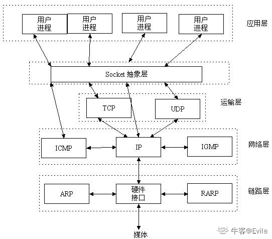
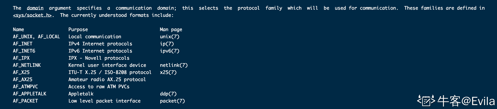
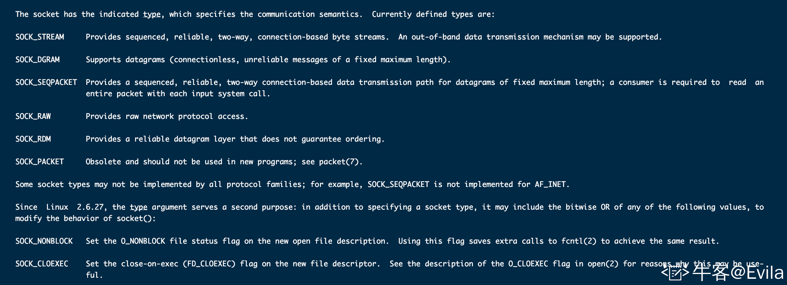
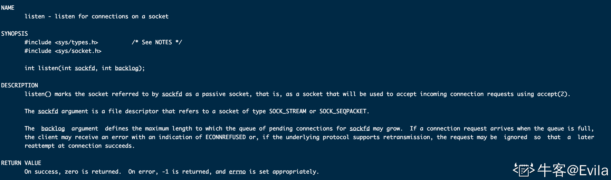
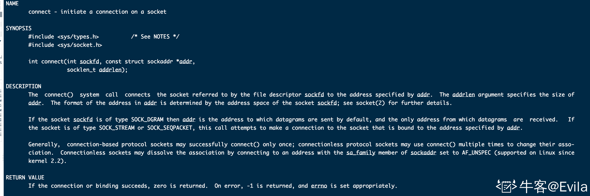
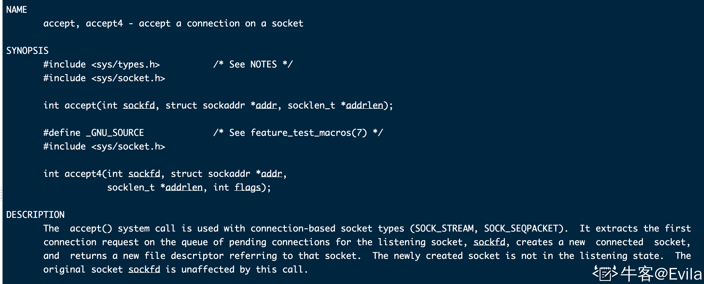
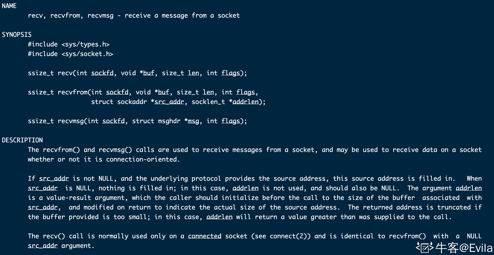
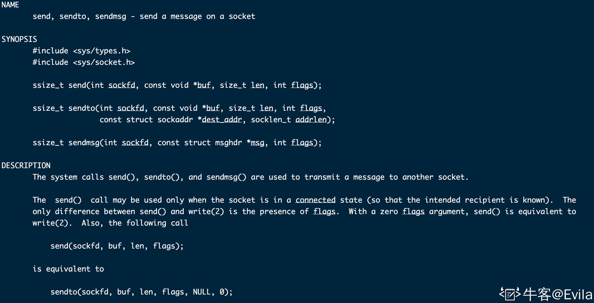
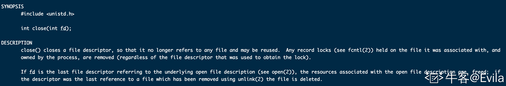
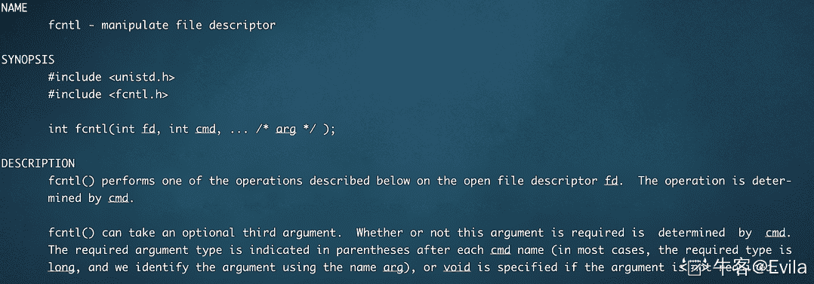

# 第六章 第 1 节 使用 C++ Socket 函数库搭建简易服务器

> 原文：[`www.nowcoder.com/tutorial/10094/c96c232d43604a36a2dfbb4de68cf8b6`](https://www.nowcoder.com/tutorial/10094/c96c232d43604a36a2dfbb4de68cf8b6)

本文介绍了 Linux C++的 socket api 一系列方法，以及如何使用 Linux C++的 socket api 搭建较为简易的服务器与客户端；并在 5-2 篇文章中将 socket api 的方法与 tcp 连接的状态进行深入剖析；最后在 5-3 章中继续深入剖析网络编程的技巧、方法与模型。

# 1\. Socket

### 1.1 Socket 基本概念

Socket，又叫套接字，是网络编程中的一个抽象概念，可简单的理解为 socket 标识一个网络连接。

互联网中的两个进程想要建立 TCP/UDP 连接，需要双方的 ip 地址+端口号，网络协议栈中由网络层提供的 ip 地址用于标识主机(网卡)，传输层协议提供的端口号用于标识进程；有了双方的 ip+port+协议类型便可以唯一确定一个网络连接。

> 因此，Socket 由五元组唯一确定 {protocol,src_addr,src_port,dest_addr,dest_port}，其中 protocol 指定了是 TCP 还是 UDP 连接，其余参数分别指定了源地址、源端口、目标地址、目标端口。

如下图所示：Socket 是在应用层和传输层之间的一个抽象层，它把传输层和网络层复杂的操作抽象为几个简单的接口供应用层调用以实现进程在网络中通信。



### 1.2 Socket 与文件描述符

众所周知，在 Unix 和 Linux 操作系统中具有一切皆文件的思想。在 Linux 系统中建立一个 Socket 网络连接，可以抽象理解为系统内核空间的文件进行“打开-读写-关闭”动作，即客户端建立一个 Socket 相当于声明一个文件指针；连接服务器相当于 fopen 文件；向服务器发送数据相当于 fwrite 文件；接收服务端数据相当于 fread 文件；关闭连接相当于 fclose 文件；因此，这片独有的内核空间可被抽象理解为文件。

总结：Socket 能够唯一标识一个网络连接，可将其抽象为文件指针，指向内核空间(一个文件)。Socket 等价于内核的一个文件描述符，客户端与服务器建立 TCP 连接后，双方各持有一个 socket 指向内核空间；客户端向服务器发送数据时，数据由客户端网络协议栈层层包装为字节流后发送到服务器的内核中，服务器进程通过 socket 指向的内核空间获取该数据。

## 2\. C++ Socket API

### 2.1 socket()函数

Linux C++中的 socket API 包含在 sys/types.h 和 sys/socket.h 这两个头文件中，socket()函数就是创建网络通信的标识并返回一个文件描述符。

```cpp
int socket(int domain, int type, int protocol) ; 
```

*   第一个参数 domain 是网络连接协议簇的标识，通常为 AF_INET 和 AF_INET6，即 ipv4 和 ipv6 的网络连接。协议族决定了 socket 的地址类型，如 AF_INET 决定了要用 ipv4 地址（32 位的）与端口号（16 位的）的组合、AF_UNIX 决定了要用一个绝对路径名作为地址。 
*   第二个参数 type 是网络通信的语义类型，对于 TCP 连接通常选择 SOCK_STREAM，字节流语义。 
*   第三个参数是与语义类型相匹配的特定协议，TCP 连接使用 IPPROTO_TCP,UDP 连接使用 IPPTOTO_UDP。 注意：type 和 protocol 不是可以随意组合的，如 SOCK_STREAM 不可以跟 IPPROTO_UDP 组合。当 protocol 为 0 时，会自动选择 type 类型对应的默认协议。 -返回值：系统分配的套接字 id。 

### 2.2 bind()函数

通过 socket()函数已经获得了一个套接字，我们指定了这个套接字的协议簇，语义类型和协议，但还未赋予其具体的地址。因此，需要调用 bind()函数将一个特定地址绑定到 socket 上。

```cpp
int bind(int sockfd, const struct sockaddr *addr, socklen_t addrlen); 
```

*   sockfd: socket 套接字，通过 socket()创建得到。
*   addr: 将 sockfd 绑定的协议地址，一个 const struct sockaddr 指针。该参数与创建 socket 时的协议簇相关联： -1\. AF_INET 即 ipv4 时：int 变量(4Byte)能表示一个 ip 地址

```cpp
struct sockaddr_in {
    sa_family_t    sin_family; /* address family: AF_INET */
    in_port_t      sin_port;   /* port in network byte order */
    struct in_addr sin_addr;   /* internet address */
};
/* Internet address. */
struct in_addr {
    uint32_t       s_addr;     /* address in network byte order */
}; 
```

-2.AF_INET6 即 ipv6 时：16length 字符串表示 ip 地址

```cpp
struct sockaddr_in6 { 
    sa_family_t     sin6_family;   /* AF_INET6 */ 
    in_port_t       sin6_port;     /* port number */ 
    uint32_t        sin6_flowinfo; /* IPv6 flow information */ 
    struct in6_addr sin6_addr;     /* IPv6 address */ 
    uint32_t        sin6_scope_id; /* Scope ID (new in 2.4) */ 
};
struct in6_addr { 
    unsigned char   s6_addr[16];   /* IPv6 address */ 
}; 
```

-addrlen：地址结构体的长度

### 2.3 listen()函数

当在第二步完成对 socket 的地址绑定后，服务端需要调用 listen()来监听 socket，处于监听状态下的 socket 便可以接受客户端的连接、断开请求。 

如 listen 函数的帮助手册所示：

```cpp
int listen(int sockfd, int backlog); 
```

*   sockfd: socket 套接字，通过 socket()和 bind()得到。
*   backlog: socket 的未完成连接队列长度，在后续的文章中详细讨论。
*   返回值： 监听成功返回 0，否则返回小于 0。

### 2.4 connect()函数

 connect()函数顾名思义，由主动 socket 向被动 socket 发起连接请求，因此 connect 函数中的 socket 被称为主动 socket，同理 listen 函数处理后的 socket 为被动 socket。

如 connect 的帮助手册所示:

```cpp
int connect(int sockfd, const struct sockaddr *addr, socklen_t addrlen); 
```

*   sockfd: 主动 socket，即客户端向服务器通信的 socket；注意不是被动 socket。
*   addr: 与 bind()函数的地址一致，为服务端 socket 的地址。
*   addrlen: 地址长度。
*   返回值: 连接成功返回 0，否则返回值小于 0。

> 注意：man 手册对 connect()函数返回值的描述，If the connection or binding succeeds, zero is returned. 为什么 bind()会出现在 connect 返回值描述中呢？因为对于客户端来说，它的 socket 不需要主动进行 bind()调用去绑定一个端口，在 connect()调用时候系统会隐形执行 bind()，绑定的地址为：系统分配的端口和本机的 ip。

### 2.5 accept()函数

accept()函数是用于面向基于连接的套接字类型（SOCK_STREAM，SOCK_SEQPACKET）使用，它为处于监听状态的 sockfd 提取其未连接队列上的第一个连接请求，使其成为一个新的已连接套接字，并返回为其新创建的文件描述符。



```cpp
int accept(int sockfd, struct sockaddr *addr, socklen_t *addrlen); 
```

*   sockfd: listen 状态的被动套接字；
*   addr: 连接到 listen sockfd 的客户端地址指针；
*   addrlen: 地址长度
*   返回值：成功建立连接返回大于 0 的正整数代表内核创建的 sockfd，异常时返回-1；

> 关于 connect、accept 函数与 tcp 连接状态的关系，在 5-2 章中做详细讲述。

### 2.6 recv()函数



recv()函数用于从面向连接的套接字中获取消息，此外 recvfrom()和 recvmsg()无论是否面向连接，都可以用来获取消息。

```cpp
 ssize_t recv(int sockfd, void *buf, size_t len, int flags); 
```

*   sockfd: accept()建立连接后返回用于通信的 sockfd;
*   buf: 接受消息存放的消息结构；
*   len: 消息结构的大小；
*   flags: 一系列消息接收特性的或运算，例如：MSG_DONTWAIT 非阻塞 recv 等，默认可传 0；
*   返回值：返回接收到消息字节长度，如果异常产生返回值小于 0；
*   一些常见的错误包括：EAGAIN 一般为非阻塞 socket 出现接收阻塞或超时；EINTR 通常为接收操作被信号中断。

### 2.7 send()函数

 send()函数用于发送消息到 sockfd，且 sockfd 为为已连接状态；

```cpp
 ssize_t send(int sockfd, const void *buf, size_t len, int flags); 
```

*   sockfd: 建立连接后分配的 socket 的文件描述符；
*   buf：发送数据的具体内容；
*   len: 发送数据的长度;
*   flags: 0 或多个标志位或运算得到的特性，例如：MSG_DONTWAIT 或者 MSG_NOSIGNAL 当对方 socket 断开连接时，在面向字节流的套接字上针对错误不发送 SIGPIPE。
*   返回值：成功时 返回发送的字节数；异常时 返回值小于 0

### 2.8 close()函数



close()用于关闭一个文件描述符，不仅仅可用于网络套接字的关闭，也可以用于普通文件读写。

注意：帮助手册的最后一段话：如果文件描述符的引用最后一次被关闭，那么就会释放文件相关的资源。这里会涉及网络编程中 服务器与客户端优雅断开连接的问题，在后续的文章中进行详细讨论。

*   fd: 被关闭的文件描述符
*   返回值：正常返回 0，异常情况下返回值小于 0，例如：EBADF 无效的 fd， EINTR close()被信号中断；

### 2.9 fcntl()函数



函数原型：

```cpp
 #include <unistd.h>
       #include <fcntl.h>

       int fcntl(int fd, int cmd, ... /* arg */ ); 
```

阻塞和非阻塞的区别在于调用某个函数时，这个函数是否会导致我们的进程进入卡在这休眠状态，直到唤醒它的条件到达。因此，在阻塞 I/O 下，网络请求一般效率会比较低，我们经常需要将 I/O 模式设置成非阻塞。

fcntl()函数用于根据文件描述符和操作来获取/修改文件的特性，cmd 参数设置为 F_SETFL，设置给 arg 描述符状态标志是：O_NONBLOCK。非阻塞 I/O 在 read()调用没有可读取的数据,或者如果 write()没有空间时,read 或 write 调用返回-1 或 EAGAIN 错误。

### 2.10 select()、poll()与 epoll()函数

select/poll/epoll 函数都是 I/O 多路复用的实现。

I/O 多路复用使得一个进程可以监视多个文件描述符，select 和 poll 函数通过轮询套接字列表，来获取需要读写请求的套接字列表；epoll()获取有读或者写事件响应的文件描述符进行读写操作，epoll()是 linux 内核提供的高效监听大量套接字的方法。

实际业务场景中，服务器与客户端一般是 1 对多或多对多的连接。以服务器为例，它可以接受多个客户端的连接，即服务器需要管理多个套接字，也就是负责监听的服务器进程或线程会采用 select()、poll()的方式去轮询这些套接字，或者可以使用 epoll()模式进行时间响应处理。

### 2.11 select()

`int select(int n, fd_set *readfds, fd_set *writefds, fd_set *exceptfds, struct timeval *timeout);` select 允许应用程序监视一组文件描述符，等待一个或者多个描述符成为就绪状态，从而完成 I/O 操作。

##### 特点：

*   fd_set 是位图数组，数组大小使用 FD_SETSIZE 宏定义，每一个数组元素都能与一打开的文件描述符建立联系，所以只能监听少于 FD_SETSIZE 数量的文件描述符(fd 的最大值必须<FD_SETSIZE, 默认为 1024)。有三种类型的描述符类型：readset、writeset、exceptset，分别对应读、写、异常条件的描述符集合。
*   timeout 为超时参数(纳秒单位)，调用 select 会一直阻塞直到有描述符的事件到达（有数据 可读、可写、或者有 except）或者等待的时间超过 timeout。当 select 函数返回后，可以通过遍历 fdset，来找到事件就绪的描述符。
*   成功调用返回结果大于 0，出错返回结果为-1，超时返回结果为 0。

##### 缺点：

*   select 支持的文件描述符数组大小默认是 1024 个，不利于超过 1024 个文件描述符的管理

*   每次调用 select 都需要把 fdset 从用户态拷贝到内核态(因为事件响应需要到内核去完成)，且在内核遍历传递进来的所有 fdset

*   select 返回后仍需要轮询所有监听的 socket，因为 select 函数并不知道哪个监听的 socket 触发了事件 示例代码：

```cpp
fd_set fd_in，fd_out; 
// Reset the sets 将集合清空
FD_ZERO( &fd_in );
// 将 sock1 注册到 fd_set 中
FD_SET( sock1, &fd_in );
// 将 sock2 注册到 fd_set 中
FD_SET( sock2, &fd_in );
// 将 sock3 注册到 fd_set 中
FD_SET( sock3, &fd_in );
// select 函数的时间戳结构体
struct timeval tv;
// 设置超时时间为 10 seconds
tv.tv_sec = 10;
tv.tv_usec = 0;
// 调用 select
int ret = select( largest_sock + 1, &fd_in, &fd_out, NULL, &tv );
if ( ret == -1 ) 
{
// report error and abort
}
else if ( ret == 0 ) 
{
// 超时 没有 socket 有事件响应
}  	
else
{
// select 返回值大于 0 说明有事件响应
	if ( FD_ISSET( sock1, &fd_in ) )
	{	
        // 轮询 socket 集合，判断哪个 socket 保留在 fdset 中，
        // FD_ISSET()返回 true 时表示 sock1 的内核缓冲区处于高电位状态，即可读事件触发
	}
} 
```

### 2.12 poll()

```cpp
int poll(struct pollfd *fds, unsigned int nfds, int timeout); 
```

与 select 使用的 3 个 fdset 不同的是，poll 方法使用 pollfd 的结构体链表来管理需要监听的文件描述符。

pollfd 结构体的实现如下：

```cpp
struct pollfd {
    int fd; /* file descriptor */
    short events; /* requested events to watch */
    short revents; /* returned events witnessed */
}; 
```

pollfd 结构包含了要监视的事件和发生的事件(POLLIN | POLLOUT)，由于 poll 通过链表的方式管理，因此 pollfd 并没有最大数量限制。 和 select 函数一样，poll 返回后，需要轮询 pollfd 链表来获取就绪的描述符。

##### 特点：

*   每次调用 poll 都需要把 pollfd 集合从用户态拷贝到内核态，当链表中元素过多时消耗会较大

*   当 poll 返回后，仍需要轮训 pollfd 链表才能获取到具体响应事件的文件描述符

*   poll 返回后，若有事件响应的文件描述符没有进行相应的读写操作，那么下次再调用 poll 时该文件描述符仍会响应事件

*   较 select 相比解决了文件描述符限制的问题

##### 示例代码

```cpp
int fd_list[10];  // 假设服务端已连接 connfd 有 10 个
struct pollfd fds[10];  // 这里为了简写 没有使用链表 用数组代替
for(int i = 0;i < 10;i++)
{
    fds[i].fd = fd_list[i];
    fds[i].events = POLLIN;
}
// Wait 1 seconds
int ret = poll( &fds, 2, 1000);

if ( ret == -1 )
{
// 返回 -1 报错 
}
else if ( ret == 0 )
{
// 超时 无时间响应
}
else
{
// 返回大于 0  遍历链表
	for(int i = 0; i < 10;i++)
	{
		if ( fds[i].revents & POLLIN )
		{
			fds[i].revents = 0;
			read(fds[i].fd,recvbuf,sizeof(recvbuf));
		}
	}
} 
```

### 2.13 epoll()

epoll 是 Linux 内核为处理大批量文件描述符而作了改进的 poll，是 Linux 下多路复用 IO 接口 select/poll 的增强版本，它能显著提高程序在大量并发连接中只有少量活跃的情况下的系统 CPU 利用率。epoll 强大的原因在于： select 和 poll 分别以数组和链表的形式将文件描述符注册到内核中监听事件，它们共同的缺点是在调用 select()和 poll()函数时，需要将 fd 数组或链表拷贝到内核，内核需要线性遍历这个 fd 数组或链表。另一方便，当 select 和 poll 函数有事件响应返回时，应用进程无法知道具体响应事件的文件描述符都有哪些，因此需要轮训注册到内核中的文件描述符集合得到有事件响应的。与 select 和 poll 不同的是：

*   1.epoll 在调用 epoll_wait 之前，首先将监测的 fd 注册到内核中，并在内核中建立一颗红黑树用于管理注册到内核的 fd。这使得，epoll_wait 在调用时无需像内核拷贝文件描述符列表，且内核在得到 fd 的事件响应时通过红黑树可以快速返回。
*   2.当 epoll_wait 返回后，应用进程在获取事件的时，应用进程无须遍历整个被侦听的文件描述符集合，只要遍历那些被内核 IO 事件异步唤醒而加入响应队列的文件描述符即可。

与 epoll 相关的 API 共涉及 3 个函数：

#### 1\. epoll_create

```cpp
int epoll_create(int size); 
```

epoll_create 函数创建一个 epoll 句柄，参数 size 表明内核要监听的描述符数量。调用成功时返回一个 epoll 句柄描述符，失败时返回-1。

#### 2\. epoll_ctl

```cpp
int epoll_ctl(int epfd, int op, int fd, struct epoll_event *event)； 
```

epoll_ctl 为事件注册函数，也可以理解为将需要托管的 fd 注册到内核的 epoll 管理结构中。 该函数的参数解释如下：

*   epfd 表示 epoll 句柄
*   op 表示 fd 操作类型，有如下 3 种 EPOLL_CTL_ADD 注册新的 fd 到 epfd 中 EPOLL_CTL_MOD 修改已注册的 fd 的监听事件 EPOLL_CTL_DEL 从 epfd 中删除一个 fd
*   fd 表示托管的文件描述符
*   event 为内核监听的事件结构体，其结构如下：

```cpp
struct epoll_event {
    __uint32_t events; /* Epoll events */
    epoll_data_t data; /* User data variable */
};
typedef union epoll_data {
    void *ptr;
    int fd;
    __uint32_t u32;
    __uint64_t u64;
} epoll_data_t; 
```

epoll_event 结构体的定义如上所示，分为 events 和 data 两个部分。其中，events 为事件宏的位集合，可是用或运算来注册多个事件到内核，即：EPOLLIN|EPOLLET; data 是一个联合体，一般用于传递参数到内核，data 的作用较为灵活，在 epoll_wait 后提供例子参考。 事件宏的定义包括：

| 宏 | 描述 |
| :-- | :-- |
| EPOLLIN | 表示对应的文件描述符可以读（包括对端 SOCKET 正常关闭）； |
| EPOLLOU | 表示对应的文件描述符可以写； |
| EPOLLPRI | 表示对应的文件描述符有紧急的数据可读（这里应该表示有带外数据到来）； |
| EPOLLERR | 表示对应的文件描述符发生错误； |
| EPOLLHUP | 表示对应的文件描述符被挂断； |
| EPOLLET | 将 EPOLL 设为边缘触发(Edge Triggered)模式，这是相对于水平触发(Level Triggered)来说的。 |
| EPOLLONESHOT | 只监听一次事件，当监听完这次事件之后，如果还需要继续监听这个 socket 的话，需要再次把这个 socket 加入到 EPOLL 队列里 |

#### 3\. epoll_wait

```cpp
int epoll_wait(int epfd, struct epoll_event * events, int maxevents, int timeout); 
```

epoll_wait 函数等待监听事件的就绪，成功时返回就绪的事件数目，调用失败时返回-1，等待超时未响应返回 0。 epoll_wait 函数的参数解析：

*   （1）epfd 是 epoll 句柄
*   （2）events 表示从内核得到的就绪事件集合，从内核回传出有事件响应的 event
*   （3）maxevents 告诉内核监听的 events 集合大小，不能大于 epoll_wait 时的 size 参数
*   （4）timeout 表示等待的超时时间

#### 4\. 示例代码

```cpp
struct Connection
{
    int getSocket() 
    {
        return this->fd;
    }
    void handleReadEvent() 
    {
        // 封装处理逻辑
    }
    int fd;
};

int main()
{
  // 创建 epoll 句柄	一个进程一般只维护一个 epoll 句柄即可
  int epoll_fd = epoll_create( 0xCAFE );
  // 初始化 epoll event 结构体
  struct epoll_event ev = { 0 };
  // void*字段，能关联任意类型，这里存储的是 Connection 的封装类实例
  connfd* pConnection1 = new Connection();
  pConnection1.fd = 1234;
  ev.data.ptr = pConnection1;
  // 装载 socket 的关注事件
  ev.events = EPOLLIN | EPOLLONESHOT;
  // 将描述符添加到监视列表中。
  if ( epoll_ctl( epollfd, EPOLL_CTL_ADD, pConnection1->getSocket(), &ev ) != 0 )
  // report error
  // 20 个事件
    struct epoll_event pevents[ 20 ];
  // 等待 10 秒，检索少于 20 个 epoll event 并将它们存储到 epoll event 数组中
  int ret = epoll_wait( epoll_fd, pevents, 20, 10000 );
  // 检查 epoll 的执行结果
  if ( ret == -1 ) 
  {
    // 上报错误和异常
  } 
  else if ( ret == 0 )
  {
    // 超时 没有任何事件响应
  }
  else
  {
    // 检查关注的事件
    for ( int i = 0; i < ret; i++ )
    {
        // pevents 为有事件响应的集合，我们在 epoll_ctl 注册时，epoll_data 字段使用的是 connfd 结构体指针，因此我们可以通过该指针获取到响应的 socket
      if ( pevents[i].events & EPOLLIN )
      {
        Connection * c = (Connection*) pevents[i].data.ptr;
        c->handleReadEvent();
      }
    }
  }
} 
```

#### 5.水平触发与边缘触发

epoll 除了提供 select/poll 那种 IO 事件的水平触发（Level Triggered）外，还提供了边缘触发（Edge Triggered）。

*   (1)水平触发（Level Trigger）：默认工作模式，即当 epoll_wait 检测到某描述符事件就绪并通知应用程序时，应用程序可以不立即处理该事件；下次调用 epoll_wait 时，会再次通知此事件。
*   (2)边缘触发（Edge Trigger）： 当 epoll_wait 检测到某描述符事件就绪并通知应用程序时，应用程序必须立即处理该事件。如果不处理，下次调用 epoll_wait 时，不会再次通知此事件。（以 EPOLLIN 事件为例，在 ET 模式下，最初内核缓冲区为空，当有数据流进来时，触发 EPOLLIN 事件。电位从低->高，触发。但是如果不处理该事件，也就是不将缓冲区内的数据取走，那么电位一直处于高电平状态，下次再调用 epoll_wait 时，ET 模式下判断不是从低->高的变化，因此不响应事件。同理，EPOLLOUT 就是内核缓冲区从满到有空余才触发，如果一直是空余则不触发）。

#### 6.select、poll 和 epoll 总结

|  | select | poll | epoll |
| :-- | :-- | :-- | :-- |
| 操作方式 | 轮询 | 轮询 | 回调 |
| 内核管理方式 | 数组 | 链表 | 红黑树 |
| I/O 效率 | 时间复杂度为 O(n) | 时间复杂度为 O(n) | 时间复杂度 O(1) |
| 最大连接数 | 1024 | 无上限 | 无上限 |
| fd 拷贝 | 每次调用 select，都需要把 fd 集合从用户态拷贝到内核态 | 每次调用 poll，都需要把 fd 集合从用户态拷贝到内核态 | 调用 epoll_ctl 时拷贝进内核并保存，之后每次调用 epoll_wait 不拷贝 |