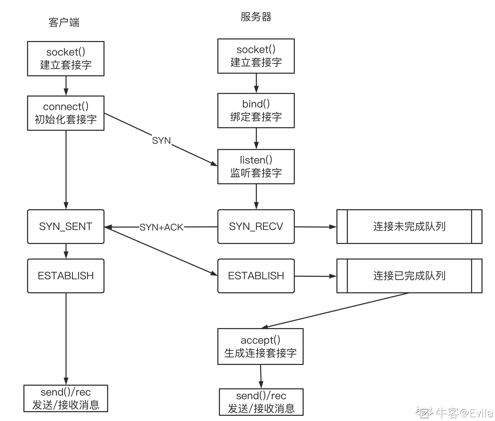
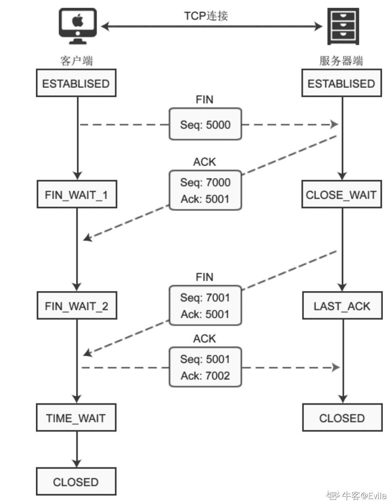

# 第六章 第 2 节 Socket 系统调用与 TCP 状态转换

> 原文：[`www.nowcoder.com/tutorial/10094/ed8012291c6b41a3b92bb14b065b7035`](https://www.nowcoder.com/tutorial/10094/ed8012291c6b41a3b92bb14b065b7035)

网络连接（TCP/UDP）和断开的过程较为复杂，涉及了许多状态，在 5-1 章中介绍了有关 socket 函数库后，我们需要思考 socket 的 API 函数：socket()、bind()、listen()、connect()、accept()、send()、recv() 和网络连接(TCP/UDP)和断开的过程如何联系起来？

#1\. Socket 编程与 TCP3 次握手连接过程剖析 先上图：socket api 执行各个流程对应的 TCP 建立连接时 3 次握手的过程 

### 1.1 进行网络连接前的准备工作——客户端

如图所示，客户端在进行网络连接的准备工作较为简单，只是调用 socket()函数生成用于网络连接的套接字。

> 注意：为了进行 TCP 连接，在调用 socket()时指定 type 参数为 SOCK_STREAM、protocol 参数为 IPPROTO_TCP。

### 1.2 进行网络连接前的准备工作——服务器

同样的，在进行网络连接前，服务器也需要调用 socket()函数生成用于网络连接的套接字。此外，服务器为了接受客户端的连接请求，需要额外进行以下两步：

*   1.  调用 bind()函数将服务器所在的地址(**ip 地址和端口"addr:port"**)绑定到 socket 上；
*   2.  调用 listen()来监听 bind()函数处理后的套接字，处于监听状态下的 socket 便可以接受客户端的连接、断开请求。

绑定了地址和端口的套接字就有了源地址和源端口(对服务器自身来说是源)，再加上通过配置文件中指定的协议类型，socket 建立连接需要的五元组中就有了其中 3 个要素。即：{protocal,src_addr,src_port}

### 1.3 TCP 连接过程与 socket 函数

在建立 TCP 连接之前的 socket 都处于 CLOSE 状态。一般的 TCP 连接的过程具体如下：

*   1.listen()函数就是监听已经通过 bind()绑定了 ip_addr+port 的套接字的。监听之后，套接字就从 CLOSE 状态转变为 LISTEN 状态。
*   2.TCP 连接的发起是由客户端调用 connect()函数开始的，connect()函数的作用是向某个已监听的套接字发起连接请求，也就是发起 TCP 的三次握手中第一次携带 SYN 标志的请求。调用 connect()后，客户端处于 SYN_SENT 状态。
*   3.服务端处于 LISTEN 状态的 socket 在接收到客户端发送的 SYN 信号后，回复 SYN+ACK,随后进入 SYN_RECV 状态。此时，连接被放置到连接未完成队列中，下文详述。
*   4.客户端处于 SYN_SEND 状态的 socket 在接收到服务端回复的 SYN+ACK 后，再次回复 ACK，随后进入 ESTABLISH 状态。
*   5.服务端在接收到客户端回复的 ACK 后，进入 ESTABLISH 状态，连接放置到连接已完成队列中，下文详述。

### 1.4 连接未完成队列(syn queue)

客户端发起 connect()到处于 LISTEN 状态的服务器后，进入 TCP 三次握手过程。 **服务端通常使用 select()、poll()或者 epoll()进行 I/O 复用管理，在服务端的线程监听的过程时，它等待到有数据(连接请求，SYN 信息)写入到它所监听的 socket 缓冲区中(recv buffer)，此时内核被唤醒(注意不是 app 进程被唤醒，因为 TCP 三次握手和四次挥手是在内核空间由内核完成的，不涉及用户空间)；内核唤醒后将 SYN 数据拷贝到某一处内核缓冲区(kernel buffer)中进行处理(比如判断 SYN 是否合理)，再准备 SYN+ACK 数据(数据需要从 kernel buffer 中拷入 send buffer 中，再拷入网卡传送出去)。此时会在连接未完成队列(syn queue)中为这个连接创建一个新项目，并设置为 SYN_RECV 状态。**

### 1.5 连接完成队列(established queue)

**当客户端回复的 ACK 到达服务器后，内核再次被唤醒，内核判断这次写入的数据是 ACK 信息(第三次握手)，表示是某个客户端对服务端内核发送的 SYN 的回应，于是将数据(ACK 数据)拷入到 kernel buffer 中进行处理后，把连接未完成队列中对应的项目移入连接已完成队列(established queue)，并设置为 ESTABLISHED 状态。**

**如果这次接收的不是 ACK，则肯定是 SYN，也就是新的连接请求，于是和上面的处理过程一样，放入连接未完成队列。**

**对于已经放入已完成队列中的连接，将等待内核通过 accept()函数进行消费(由用户空间进程发起 accept()系统调用，由内核完成消费操作)，只要经过 accept()过的连接，连接将从已完成队列中移除，也就表示 TCP 已经建立完成了，两端的用户空间进程可以通过这个连接进行真正的数据传输了，直到使用 close()或 shutdown()关闭连接时的 4 次挥手，中间再也不需要内核的参与。**

### 1.6 accept()函数

accpet()函数的作用是读取已完成连接队列中的第一项(读完就从队列中移除)，并对此项生成一个用于后续连接的套接字描述符，假设使用 connfd 来表示。有了新的连接套接字，进程/线程就可以通过这个连接套接字和客户端进行数据传输。 accept()工作的两种模式：

*   1、prefork 模式 每个子进程既是监听者，又是工作者，每个客户端发起连接请求时，子进程在监听时将它接收进来，并释放对监听套接字的监听，使得其他子进程可以去监听这个套接字。多个来回后，终于是通过 accpet()函数生成了新的连接套接字，于是这个子进程就可以通过这个套接字专心地和客户端建立交互，当然，中途可能会因为各种 io 等待而多次被阻塞或睡眠。prefork 模式效率是低的，仅仅考虑从子进程收到 SYN 消息开始到最后生成新的连接套接字这几个阶段，这个子进程一次又一次地被阻塞。当然，可以将监听套接字设置为非阻塞 IO 模式，只是即使是非阻塞模式，它也要不断地去检查状态。
*   2、worker/event 模式 每个子进程中都使用了一个专门的监听线程和 N 个工作线程，也可以理解为生产者-消费者模型，生产者负责监听，将连接成功的 socket 放入到消费者线程的处理队列中；消费者线程则处理连接成功后的数据发送和接收工作。这样监听者和工作者就分开了，在监听的过程中，工作者可以仍然可以自由地工作。worker/event 模式比 prefork 模式性能高的，主要是因为 prefork 模式处理监听、连接和网络收发业务的耦合性太大，一旦某个环节出现了阻塞则直接影响其它业务的运行。worker/event 模式将监听和工作分离，解耦合使得各个业务之间影响不大，当然多线程也有帮助提高效率，但不是关键。

当监听者发起 accept()系统调用的时候，如果已完成连接队列中没有任何数据，那么监听者会被阻塞。当然，可将套接字设置为非阻塞模式，这时 accept()在得不到数据时会返回 EWOULDBLOCK 或 EAGAIN 的错误。可以使用 select()或 poll()或 epoll 来等待已完成连接队列的可读事件。

### 1.7 TCP 连接双方：send buffer、recv buffer

**每个 tcp 连接的两端都会关联一个套接字，该套接字又作为文件描述符指向的一块内核空间(视为文件)。**当服务端收到了 ack 消息后，就表示三次握手完成，和客户端的这个 tcp 连接已经建立好。连接建立好的 socket 会放在 listen()打开的已完成队列中等待 accept()的消费。**这时 tcp 连接在服务端所关联的套接字是处于监听状态的 listen 套接字。**

**当已完成队列中的 tcp 连接被 accept()消费后，这个 tcp 连接就会关联 accept()所指定的套接字，并分配一个新的文件描述符。也就是说，经过 accept()之后，这个连接和 listen 套接字已经没有任何关系了，并且 accept()会分配新的套接字关联 TCP 连接**

从客户端调用 connect()到服务端调用 accept()函数，客户端与服务端建立的 TCP 连接为双方都分配了套接字，套接字可视为文件描述符，它对应了内核空间中的一段内存 buffer；由于 TCP 协议是面向字节流的传输协议，要通过 TCP 连接发送出去的数据都先拷贝到 send buffer，可能是从用户空间进程的 app buffer 拷入的，也可能是从内核的 kernel buffer 拷入的，拷入的过程是通过 send()函数完成的。

最终数据是通过网卡流出去的，所以 send buffer 中的数据需要拷贝到网卡中。由于一端是内存，一端是网卡设备，可以直接使用 DMA(Direct Memory Access,直接存储器访问,外部设备不通过 CPU 而直接与系统内存交换数据的接口)的方式进行拷贝，无需 CPU 的参与。也就是说，send buffer 中的数据通过 DMA 的方式拷贝到网卡中并通过网络传输给 TCP 连接的另一端：接收端。

当通过 TCP 连接接收数据时，数据肯定是先通过网卡流入的，然后同样通过 DMA 的方式拷贝到 recv buffer 中，再通过 recv()函数将数据从 recv buffer 拷入到用户空间进程的 app buffer 中。

> send buffer 和 recv buffer 由操作系统内核进行管理，因此当我们从用户空间发送数据时，需要经历数据从用户空间写入到内核空间；但是系统也存在从内核态发送数据的情况，例如回复 ACK 报文时，这时数据从内核的某个 buffer 写入到 send buffer 中。

### 1.8 send()和 recv()函数

send()函数是将数据从 app buffer 复制到 send buffer 中(当然，也可能直接从内核的 kernel buffer 中复制)，recv()函数则是将 recv buffer 中的数据复制到 app buffer 中。

这两个函数都涉及到了 socket buffer，但是在调用 send()或 recv()时，发送端的 buffer 中是否有数据、接收端的 buffer 中是否已满而导致不可写是需要考虑的问题。不管哪一方，只要不满足条件，调用 send()/recv()时进程/线程会被阻塞(假设套接字设置为阻塞式 IO 模型)。当然，可以将套接字设置为非阻塞 IO 模型，这时在 buffer 不满足条件时调用 send()/recv()函数，调用函数的进程/线程将返回错误状态信息 EWOULDBLOCK 或 EAGAIN。

buffer 中是否有数据、是否已满而导致不可写，可以使用 select()/poll()/epoll 去监控对应的文件描述符(对应 socket buffer 则监控该 socket 描述符)，当满足条件时，再去调用 send()/recv()就可以正常操作了。

# 2\. Socket 编程与 TCP4 次挥手过程剖析

### 2.1 TCP 断开连接的过程

TCP3 次握手建立连接后的双方处于 ESTABLISED 状态，以客户端主动断开为例，TCP4 次挥手过程如下： 

*   1.  与断开连接相关的 socket api 函数有 close()和 shutdown()函数，二者都可用来关闭连接。以客户端主动断开为例，当客户端调用 close() / shutdown()函数后，向服务器发送 FIN 数据包，进入 FIN_WAIT_1 状态。

> FIN 是 Finish 的缩写，表示完成任务需要断开连接。

*   2.  服务器收到数据包后，检测到设置了 FIN 标志位，知道要断开连接，于是向客户端发送“确认包”，进入 CLOSE_WAIT 状态。 注意：服务器收到请求后并不是立即断开连接，而是先向客户端发送“确认包”，告诉它我知道了，我需要做完未完成的事情才可以断开。
*   3.  客户端收到“确认包”后进入 FIN_WAIT_2 状态，等待服务器准备完毕后再次发送数据包。
*   4.  等待片刻后，服务器准备完毕，可以断开连接，于是再主动向客户端发送 FIN 包，告诉它我准备好了，断开连接吧。然后进入 LAST_ACK 状态。
*   5.  客户端收到服务器的 FIN 包后，再向服务器发送 ACK 包，告诉它你断开连接吧。然后进入 TIME_WAIT 状态。
*   6.  服务器收到客户端的 ACK 包后，就断开连接，关闭套接字，进入 CLOSED 状态。

### 2.2 socket 关闭后的异常情况

TCP 是全双工的通信机制已经概述过了，全双工连接分为读通道和写通道，如果这两个通道都关闭了，则这个连接不能继续通信。

（1）若服务器和客户端建立连接后，客户端调用了 close()，关闭了自身的 socket 文件描述符, 此时会发送 FIN 报文给服务器，客户端不能再通过 socket 发送和接收数据。当服务器接收到 FIN 后，根据 4 次挥手的过程，服务端还可以向客户端发送数据(send())。send()调用只负责把数据交给 TCP 发送缓冲区就可以成功返回了，所以不会出错。 （2）此时，由于客户端已经调用 close()关闭了 socket，因此在收到数据后应答一个 RST 段，表示客户端已经不能接收数据，RST 会将连接重置，服务端收到 RST 报文后无法立刻通知应用层，只把这个状态保存在 TCP 协议层。 （3）如果服务端再次调用 send()发数据给客户端，由于 TCP 协议层已经处于 RST 状态了，因此不会将数据发出，而是发一个 SIGPIPE 信号给应用层，SIGPIPE 信号的缺省处理动作是终止程序。

### 2.3 close()与 shutdown()函数的区别

#### 2.3.1 close()函数

```cpp
#include <unistd.h>
 int close(int fd); 
```

实际上，close()函数减少本进程对 socket 的引用次数，当引用次数为 0 时，socket 才被真正的关闭；若引用次数不为 0 时，连接还是未断开的，用这个 socket 的其它进程还能读或写这个 socket。

在多进程的并发场景，假设**客户端**有两个进程：父进程和子进程，子进程是在父进程和服务器建立连接之后 fork 出来的，因此客户端的 socket 的引用次数+1。我们期望实现这样的功能： （1）子进程将数据写入套接字后 close，并退出。 （2）服务端接收完数据，直到检测到 EOF(接收到 FIN 标志)，关闭连接并退出。 （3）父进程读取完服务端响应的数据，也退出。 如果子进程使用 close 的话，并不会发生 4 次挥手的过程，只是引用计数减 1，服务端是接收不到 EOF 的(客户端是不会发送 FIN 的)，也就不会关闭连接执行到我们规定的第三步。因此，close()函数并非优雅的关闭 socket 方法。

#### 2.3.2 shutdown()函数

```cpp
 #include <sys/socket.h>
 int shutdown(int sockfd, int how); 
```

**shutdown 可以选择关闭某个方向或者同时关闭两个方向：

*   shutdown how = 0 or how = 1 or how = 2 (SHUT_RD or SHUT_WR or SHUT_RDWR)，后两者可以保证对等方接收到一个 EOF 字符（即发送了一个 FIN 段），不管其他进程是否已经打开了这个套接字。而 close 不能保证，只有当某个 sockfd 的引用计数为 0，close 才会发送 FIN 段，否则只是将引用计数减 1 而已。

所以，如果是调用 shutdown how = 1 ，则意味着往一个已经发送出 FIN 的套接字中写是允许的，接收到 FIN 段仅代表对方不再发送数据，但对方还是可以读取数据的，可以让对方可以继续读取缓冲区剩余的数据。

shutdown()和 close()的主要区别：

*   1.  对应的系统调用不同
*   2.  shutdown()只能用于套接字文件，close()可以用于所有文件类型
*   3.  shutdown()只是关闭连接，并没有释放文件描述符，close()可以
*   4.  shutdown()不能用于 TCP_CLOSE 状态的套接字，否则会返回 ENOTCONN 错误
*   5.  shutdown()可以选择关闭读通道或写通道，close()不能。

## 3\. 面试热点

### 3.1 TCP 服务器端口数和客户端的最大连接数之间的关系

【出现频度】★★★

【难度】☆☆☆☆☆

【参考答案】 关于 TCP 服务器最大并发连接数有一种误解就是“因为端口号上限为 65535,所以 TCP 服务器理论上的可承载的最大并发连接数也是 65535”。

**先说结论：对于 TCP 服务端进程来说，他可以同时连接的客户端数量并不受限于可用端口号。并发连接数受限于 linux 可打开文件数，这个数是可以配置的，可以非常大，所以实际上受限于系统性能。**

TCP 在建立连接之前，服务端首先会创建一个 socket，并绑定一个端口 port 和主机 IP。客户端在连接之前，也会创建一个 socket，并由系统随机分配一个端口号 port，并绑定了主机 IP。于是双方三次握手结束后，服务端的已完成队列(established queue)存储了三次握手成功的客户端 socket，等待服务端调用 accept()消费。

于是，一个困惑的问题就产生了。当服务端 accept 一个请求后，生成的新的 socket 到底使用的是什么端口呢（系统会默认给其分配一个空闲的端口号？）如果是一个空闲的端口，那一定不是服务端 socket 绑定的端口了。

再回想计算机网络的协议架构，TCP 和 UDP 同属于传输层，共同架设在 IP 层（网络层）之上。而 IP 层主要负责的是在节点之间（End to End）的数据包传送，这里的节点是一台网络设备，比如计算机。因为 IP 层只负责把数据送到节点，而不能区分上面的不同应用，所以 TCP 和 UDP 协议在其基础上加入了端口的信息，端口于是标识的是一个节点上的一个应用。TCP 协议还加入了更加复杂的传输控制，比如滑动的数据发送窗口（Slice Window），以及接收确认和重发机制，以达到数据的可靠传送。

因此，如果一个程序创建了一个 socket，并让其监听 80 端口，其实是向 TCP/IP 协议栈声明了其对 80 端口的占有。以后，所有目标是 80 端口的 TCP 数据包都会转发给该程序（这里的应用程序，因为使用的是 Socket 编程接口，所以首先由 Socket 层来处理）。所谓 accept 函数，其实抽象的是 TCP 的连接建立过程。accept 函数返回的新 socket 其实指代的是本次创建的连接，而一个连接是包括两部分信息的，一个是源 IP 和源端口，另一个是目标 IP 和目标端口。**所以，accept 可以产生多个不同的 socket，而这些 socket 里包含的目标 IP 和目标端口是不变的，变化的只是源 IP 和源端口。**这些 socket 目标端口就可以都是 80，而 Socket 层还是能根据源/目标对来准确地分辨出 IP 数据包和 socket 的归属关系，从而完成对 TCP/IP 协议的操作封装！

### 3.2 介绍 TCP：传输控制协议

【出现频度】★★★★★

【难度】☆☆☆

【参考答案】 网络中数据交换需要按照一定的规则，而这种规则就是协议。只有按照约定的规则，双方之间才能正确地进行数据交换。TCP 就是这些协议的一种，它提供一种面向连接的，可靠的字节流服务。

面向连接：两个使用 TCP 的应用在交换数据之前必须先建立一个 TCP 连接

可靠的：TCP 有很多机制来尽可能的保证数据不丢失。例如：滑动窗口协议、拥塞控制算法等

字节流：不区分是 ASCII 字符还是二进制数据，数据解释交给应用层

在这里补充一些计算机网络的基础知识：

### 3.3 TCP 建立连接为什么要三次握手

【出现频度】★★★★★

【难度】☆☆☆

【参考答案】 这几乎是面试中必问的一个问题。一个 TCP 连接是全双工的，即数据在两个方向上能同时传输。因此，建立连接的过程也就必须确认双方的收发能力都是正常的。

四次握手是否可以呢？完全可以！但是没有必要！在服务端收到 SYN 之后，它可以先回 ACK，再发送 SYN，但是这两个信息可以一起发送出去，因此没有必要。

两次握手是否可以呢？想象这样一种情况，客户端发起了一个连接请求在网络中滞留了很长时间，以至于在连接建立好且断开连接后，它才到达服务端，此时如果采用两次握手，那么服务端就会认为这个报文是新的连接请求，于是建立连接，等待客户端发送数据，但是实际上客户端根本没有发出建立请求，也不会理睬服务端，因此导致服务端空等而浪费资源。

为什么服务器会认为这个迟到的报文是新的连接请求？因为如果采用两次握手机制，那么服务端无法通过 SYN 来判断这是一个迟到或者重复的报文，还是正常到达的报文，但是对于三次握手，即便出现这样的情况，也不会在服务端建立起真正的连接。

### 3.4 关于 TIME_WAIT 状态的说明

【出现频度】★★★★★

【难度】☆☆☆

【参考答案】 客户端最后一次发送 ACK 包后进入 TIME_WAIT 状态，而不是直接进入 CLOSED 状态关闭连接，这是为什么呢？

TCP 是面向连接的传输方式，必须保证数据能够正确到达目标机器，不能丢失或出错，而网络是不稳定的，随时可能会毁坏数据，所以机器 A 每次向机器 B 发送数据包后，都要求机器 B”确认“，回传 ACK 包，告诉机器 A 我收到了，这样机器 A 才能知道数据传送成功了。如果机器 B 没有回传 ACK 包，机器 A 会重新发送，直到机器 B 回传 ACK 包。

客户端最后一次向服务器回传 ACK 包时，有可能会因为网络问题导致服务器收不到，服务器会再次发送 FIN 包，如果这时客户端完全关闭了连接，那么服务器无论如何也收不到 ACK 包了，所以客户端需要等待片刻、确认对方收到 ACK 包后才能进入 CLOSED 状态。那么，要等待多久呢？

数据包在网络中是有生存时间的，超过这个时间还未到达目标主机就会被丢弃，并通知源主机。这称为报文最大生存时间（MSL，Maximum Segment Lifetime）。TIME_WAIT 要等待 2MSL 才会进入 CLOSED 状态。ACK 包到达服务器需要 MSL 时间，服务器重传 FIN 包也需要 MSL 时间，2MSL 是数据包往返的最大时间，如果 2MSL 后还未收到服务器重传的 FIN 包，就说明服务器已经收到了 ACK 包。