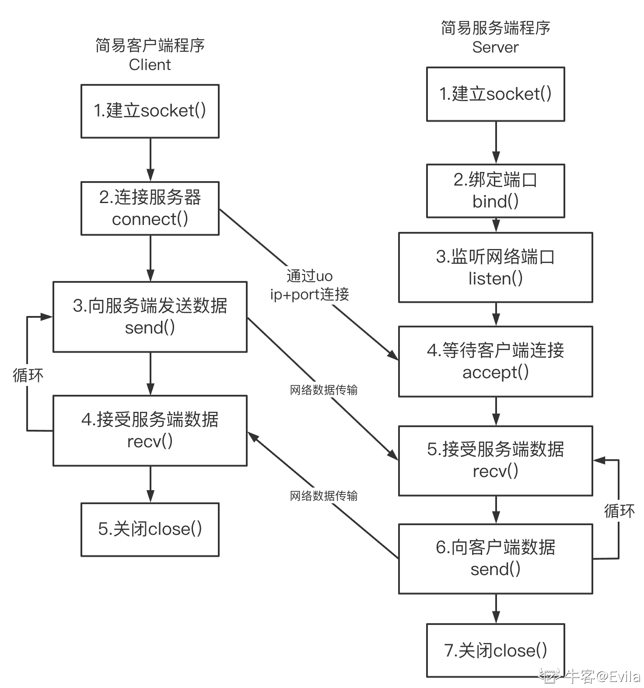
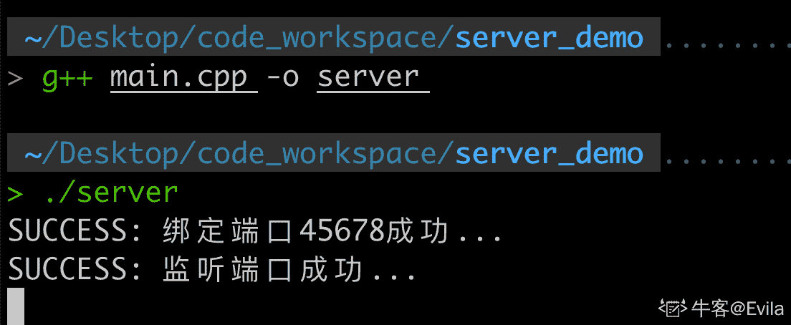
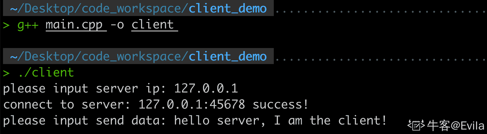
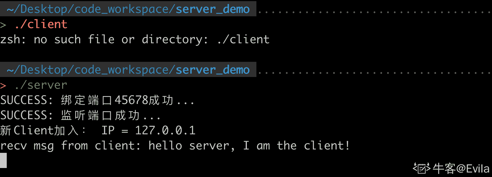

# 第六章 第 3 节 网络编程中的 I/O 多路复用

> 原文：[`www.nowcoder.com/tutorial/10094/7ab8b92de1ba43e98c830c0e98212d87`](https://www.nowcoder.com/tutorial/10094/7ab8b92de1ba43e98c830c0e98212d87)

# 1\. 编写简易客户端与服务端程序



### 1.1 服务端构建流程

如上图所示，使用 Socket API 建立简易的 TCP 服务端过程为：

*   1.  建立一个 socket()
*   2.  绑定接受客户端连接的端口 bind()
*   3.  监听网络端口 listen()
*   4.  等待接受客户端连接 accept()
*   5.  向客户端发送一条数据 send()
*   6.  接收客户端发送的数据 recv()
*   7.  关闭 socket()

### 1.2 服务端源码

```cpp
//
// Created by Evila on 2021/6/27.
//

#include <stdio.h>
#include <stdlib.h>
#include <string.h>
#include <errno.h>
#include <unistd.h>
#include <sys/types.h>
#include <sys/socket.h>
#include <netinet/in.h>
#include <arpa/inet.h>
#include<iostream>
using namespace std;

int main(int argc, char** argv)
{
		//	1\. 建立一个 Socket
		// 参数 ipv4 面向字节流的 tcp 协议
		int _sock = socket(AF_INET, SOCK_STREAM, IPPROTO_TCP);
		if( _sock < 0)
		{
				cout << "create socket error: " << strerror(errno) << "%s(errno: " << errno << endl;
				exit(0);
		}

		//	2\. 绑定端口 45678
		sockaddr_in _sin = {};    // sockaddr_in 为网络地址的结构体
		_sin.sin_family = AF_INET;  // 设置协议类型
		int _port = 45678;
		_sin.sin_port = htons(_port); // 设置协议源端口号
		// 计算机数据表示存在两种字节顺序：
		// 网络字节顺序(Network Byte Order, NBO)与主机字节顺序（Host Byte Order, HBO)
		// NBO 是大端模式(big-endian)，也就是整数的高位字节存放在内存的低地址处
		// 在网络上使用统一的网络字节顺序，可以避免兼容性问题
		// 而主机字节序与 CPU 或操作系统相关, 无法统一; 因此使用 htons()将主机字节序转换成网络字节序
		_sin.sin_addr.s_addr = htonl(INADDR_ANY); // 协议源地址 随机 ip
		if (bind(_sock, (sockaddr*)&_sin, sizeof(_sin)) == -1)  //sockaddr 不利于编码
		{
				cout << "ERROR: 绑定用于接受客户端连接的网络端口失败..." << endl;
				exit(0);
		}
		else
		{
				cout << "SUCCESS: 绑定端口" << _port << "成功..." << endl;
		}

		//	3\. 监听网络端口 listen
		if (listen(_sock, 5) == -1) // 第二个参数 backbag 为连接为完成队列长度
		{
				cout << "ERROR: 监听用于接受客户端连接的网络端口失败..." << endl;
				exit(0);
		}
		else
		{
				cout << "SUCCESS: 监听端口成功..." << endl;
		}

		//	4\. 等待接受客户端连接 accept
		sockaddr_in _clientAddr = {};
		int cliendAddrLen = sizeof(_clientAddr);
		int _clientSock = -1; // 初始化无效的 socket 用来存储接入的客户端

		char msgBuf[] = "Hello, I'm Server";
		char recvBuff[2048];

		// 这里为了方便测试 只接受 10 次连接就关闭
		int n = 10;
		while (n--)
		{
				// 当客户端接入时 accept 函数会得到客户端的 socket 地址和长度
				_clientSock = accept(_sock, (sockaddr*)&_clientAddr, (socklen_t *)&cliendAddrLen);
				if (-1 == _clientSock) //接受到无效接入
				{
						cout << "ERROR: 接受到无效客户端 SOCKET..." << endl;
						continue;
				}
				else
				{
						//inet_ntoa 将 ip 地址转换成可读的字符串
						cout << "新 Client 加入： IP = " << inet_ntoa(_clientAddr.sin_addr) << endl;
						//	5\. 向客户端发送数据 send()
						send(_clientSock, msgBuf, strlen(msgBuf) + 1, 0); // +1 是为了把\0 算进去
				}

				int recvLen = recv(_clientSock, recvBuff, 2048, 0);
				recvBuff[recvLen] = '\0';   // 设置字符串结束符
				cout << "recv msg from client: " << recvBuff << endl;
		}

		// 7\. 关闭 socket
		close(_sock);
		return 0;
} 
```

### 1.3 编译并运行

使用 g++命令编译并生成可执行文件 server，执行后该进程阻塞在 accept()函数处。 

### 1.4 客户端源码

```cpp
//
// Created by Evila on 2021/6/27.
//

#include <stdio.h>
#include <stdlib.h>
#include <string.h>
#include <errno.h>
#include <sys/types.h>
#include <sys/socket.h>
#include <netinet/in.h>
#include <arpa/inet.h>
#include <unistd.h>
#include <iostream>
#include <string>
using namespace std;

int main(int argc, char** argv)
{
		// 1\. 建立一个 Socket
		int _sock = socket(AF_INET, SOCK_STREAM, IPPROTO_TCP);
		if (_sock < 0)
		{
				cout << "create socket error: " << strerror(errno) << "%s(errno: " << errno << endl;
				exit(0);
		}

		// 2\. 设置请求连接的 server 地址
		sockaddr_in _sevrAddr = {};    // sockaddr_in 为网络地址的结构体
		_sevrAddr.sin_family = AF_INET;
		int port = 45678;
		_sevrAddr.sin_port = htons(port);

		string server_ip;
		cout << "please input server ip: ";
		cin >> server_ip;

		if (inet_pton(AF_INET, server_ip.c_str(), &_sevrAddr.sin_addr) <= 0)
		{
				cout <<"inet_pton error for " << server_ip << endl;
				exit(0);
		}

		// 3\. 连接服务端
		int ret = connect(_sock, (struct sockaddr*)&_sevrAddr, sizeof(_sevrAddr));
		if (ret < 0)
		{
				cout << "connect error: " << strerror(errno) << "errno: " << errno << endl;
				exit(0);
		}
		else
		{
				cout << "connect to server: " << server_ip << ":" << port << " success!" << endl;
		}

		// 4\. 向服务端发送数据
		string sendData;
		cout << "please input send data: ";
		getchar();
		getline(cin, sendData);
		if(send(_sock, sendData.c_str(), sendData.length(), 0) < 0)
		{
				cout << "send msg error: " << strerror(errno) << "errno: " << errno << endl;
				exit(0);
		}

		close(_sock);
		exit(0);
} 
```

### 1.5 编译并运行

首先编译客户端代码，并运行可执行文件： 

输入服务端的 ip 地址为: 127.0.0.1，在成功建立连接后，向服务端发送数据。

此时服务端进程也打印了相关日志： 

## 2\. 网络粘包

在上一章中介绍了，tcp 连接建立后，send()和 recv()函数会使用两个内核空间，也叫做发送/接收缓冲区；recv()/send()实际上并不立即向网络中传输数据，而是先将数据写入缓冲区中，再由 TCP 协议将数据从缓冲区发送到目标机器。一旦将数据写入到缓冲区，函数就可以成功返回，不管它们有没有到达目标机器，也不管它们何时被发送到网络，这些都是 TCP 协议负责的事情。

因此，当我们调用 send()发送数据时，数据有可能刚被写入缓冲区就发送到网络，也可能在缓冲区中不断积压，多次写入的数据被一次性发送到网络，这取决于当时的网络情况、当前线程是否空闲等诸多因素，不由程序员控制。

以下三种现象都是粘包：

*   1.  发送端: 发送的数据量小,并且间隔短。
*   2.  接收端：一次性读取了两次数据的内容。
*   3.  接收端：没有接收完整报文内容或接收的内容另一个报文粘在一起。 粘包问题本质是因为 TCP 是字节流协议，原始数据之间是没有边界，接收方不知道消息之间的界限所造成的。

### 2.1 粘包解决方案——发送和接收定义传输报文固定长度

发送方和接收方设置每个完整报文都有固定长度，该方案缺点较为明显：

*   1.  若报文长度设置较大，则可能会造成浪费；即通信报文实际只有小部分有效数据。
*   2.  若报文长度设置较小，则会产生大量通信报文；降低通信效率。

### 2.2 粘包解决方案——消息包之间定义明确结束标志

发送方和接收方之间约定，每个完整的通信报文都有特有的结束标志，例如'\n','$'等。

### 2.3 粘包解决方案——定义报文头部(头部包含整个报文长度)

### 本节完整代码可访问：链接：[`share.weiyun.com/sXC5irhh`](https://share.weiyun.com/sXC5irhh) 密码：f74ygi

#### 2.3.1 定义消息头部

```cpp
// 数据类型枚举
enum MsgType {
		Login = 0,
		Logout = 1,
		others = 2,
};
//消息头
class MsgHeader
{
public:
		MsgHeader() {
				_msg_length = sizeof(MsgHeader);
				_msg_type = others;
		}

		short _msg_length;           // 数据长度 最大支持 32767 字节
		MsgType _msg_type;          // 消息类型
};
/**
 * 定义登陆消息 继承于消息头
 * 接受两个参数 用户名和密码
 */
class LoginMsg : public MsgHeader {
public:
		LoginMsg(string username, string passwd) {
				_msg_type = Login;
				username = _user_name;
				passwd = _passwd;
		}

		~LoginMsg() {}

public:
		string _user_name;
		string _passwd;
}; 
```

#### 2.3.2 封装数据发送函数

```cpp
//发送数据
void TcpSocket::SendData(int client_sock, MsgHeader* header)
{
		//要发送的数据长度
		int nSendlen = header->_msg_length;

		//要发送的消息 header 指向的是消息对象 它继承于 MsgHeader
		const char* pSendData = (const char*)header;

		while (true)
		{
				if (_lastSendPos + nSendlen >= RECV_BUFF_SIZE)
				{
						//若要发送的数据 大于当前发送缓冲区能容纳的长度 则计算可以拷贝的数据长度
						int nCpyLen = RECV_BUFF_SIZE - _lastSendPos;

						//将这部分数据先拷贝到发送缓冲区
						memcpy(_szSendBuf + _lastSendPos, pSendData, nCpyLen);

						//剩余数据位置 需要发送的数据进行偏移
						pSendData += nCpyLen;

						//剩余未发送的数据长度
						nSendlen -= nCpyLen;

						// 将发送缓冲区一次性全部发送
						send(client_sock, _szSendBuf, RECV_BUFF_SIZE, 0);

						// 尾部偏移归 0 目的是为了循环发送未发送完的包
						_lastSendPos = 0;
				}
				else
				{
						// 若要发送的数据 小于当前发送缓冲区能容纳的长度 则直接将该数据写入到发送缓冲区中
						memcpy(_szSendBuf + _lastSendPos, pSendData, nSendlen);

						// 发送缓冲区尾部偏移向后移动
						_lastSendPos += nSendlen;
						nSendlen = 0;

						// 退出循环
						break;
				}
		}
} 
```

#### 2.3.3 封装数据接收函数：

```cpp
// 封装 recv 方法 按照包头包体的方式接受网络数据包
void TcpSocket::RecvData() {
		// 读取消息 全部读取到接收缓冲区中
		int nlen = recv(_sock, _szRecvBuf, RECV_BUFF_SIZE, 0);
		cout << "nlen = " << nlen << endl; //打印出接收到的数据长度

		if (nlen <= 0)
		{
				//客户端退出
				cout << "客户端:Socket = " << _sock << " 与服务器断开连接，任务结束" << endl;
		}

		char msg[RECV_BUFF_SIZE];
		//接收缓冲区尾部偏移量
		_lastRecvPos += nlen;
		//当前接收的消息长度大于数据头部长度时 表明已经有一个消息头接受到 循环处理粘包
		while (_lastRecvPos >= sizeof(MsgHeader))
		{
				MsgHeader* header = (MsgHeader*)_szRecvBuf;   //取出包头信息
				if (_lastRecvPos >= header->_msg_length)
				{
						//若当前尾部偏移量大于这个包的长度 则处理剩余缓冲区数据的长度
						int nSize = header->_msg_length;

						// 处理该消息
						OnNetMsg(header);

						//将剩余消息 前移方便下一次处理
						memcpy(_szRecvBuf, _szRecvBuf + nSize, _lastRecvPos - nSize);

						//尾部移动
						_lastRecvPos = _lastRecvPos - nSize;
				}
				else
				{
						//剩余数据不够一条完整消息时 退出循环
						break;
				}
		}
} 
```

## 3\. 使用 epoll 管理网络 I/O

在 5-1 文章中介绍了 epoll 的概念、用法以及相对 select、poll 的区别，相信大家已经对 epoll 有一定的了解，这里我们继续改造将 epoll 引入到 server 代码中，进行高效的管理客户端的连接以及网络数据 I/O。

我们在 main 函数中做如下改造，使得 server 进程在无限循环中只关注 epoll 相关的事件，当有事件响应时再去处理。

```cpp
int RegisterSock(TcpSocket *pSocket, int event, int epoll_fd)
{
	// epoll event 结构体
	struct epoll_event ev = { 0 };
	ev.data.ptr = pSocket;
	// 装载 socket 的关注事件
	ev.events = event;

	return epoll_ctl(epoll_fd, EPOLL_CTL_ADD, pSocket->GetSock(), &ev );
} 
```

```cpp
TcpSocket listen_socket;

// 1\. 初始化 socket
listen_socket.InitSock();

// 2\. 绑定地址
listen_socket.BindAddress(45678);

// 3\. 监听端口
listen_socket.Listen();

// 4\. 创建 epoll 对象
int epoll_fd = epoll_create(0xCAFE);

// 5\. 向 epoll 注册 listen sock 的 in 和 out 事件
int ret = RegisterSock(&listen_socket, EPOLLIN | EPOLLOUT, epoll_fd);

// 无限循环 epoll_wait 等待事件响应
while(true) 
{
    // 等待 10 秒，检索少于 20 个 epoll event 并将它们存储到 epoll event 数组中
    int ret = epoll_wait(epoll_fd, pevents, 20, 1000);

    // 检查 epoll 的执行结果
    if ( ret == -1 )
    {
        // 上报错误和异常
    }
    else if ( ret == 0 )
    {
        // 超时 没有任何事件响应
        continue;
    }
    else
    {
        // 检查关注的事件
        for ( int i = 0; i < ret; i++ )
        {
            // pevents 为有事件响应的集合，我们在 epoll_ctl 注册时，
            // epoll_data 字段使用的是 TcpSocket 结构体指针,因此我们可以通过该指针获取到响应的 socket
            if ( pevents[i].events & EPOLLIN )
            {
                TcpSocket* pTcpSocket = (TcpSocket*) pevents[i].data.ptr;
                if (pTcpSocket->GetSock() == listen_socket.GetSock())
                {
                    // 如果服务端的 listen socket 响应 EPOLLIN 表明有客户端连接
                    // 调用 Accept()接受连接
                    int client_sock = pTcpSocket->Accept();
                    client_queue.push(TcpSocket(client_sock));
                    // 将新增的客户端连接注册到 epoll
                    RegisterSock(&(client_queue.front()), EPOLLIN | EPOLLOUT, epoll_fd);
                }
                else
                {
                    // 客户端 socket 响应 处理响应消息
                    pTcpSocket->RecvData();
                }
            }
        }
    }
} 
```

### 本节代码链接：[`share.weiyun.com/UrvEVvqM`](https://share.weiyun.com/UrvEVvqM) 密码：xfkk4w

### 最后，本文旨在帮助入门网络编程这片宏大的技术天地，相信你已经对网络编程有一定认识和实践，相信你仍会继续探索网络编程的相关技巧，例如利用多线程技术、内存池、对象池技术、Reactor 模型等提高 server 的高并发处理能力。同时推荐阅读书籍《Unix 网络编程》、《UNIX 环境高级编程》、《Linux 多线程服务端编程：使用 muduo C++ 网络库》、《从零开始学架构》。