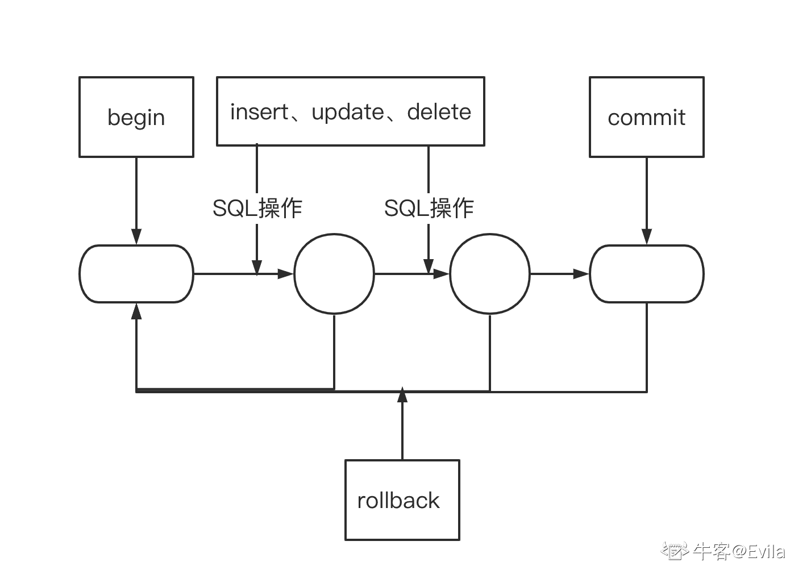
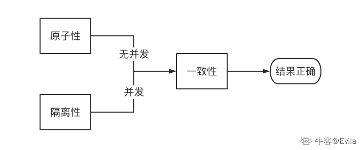
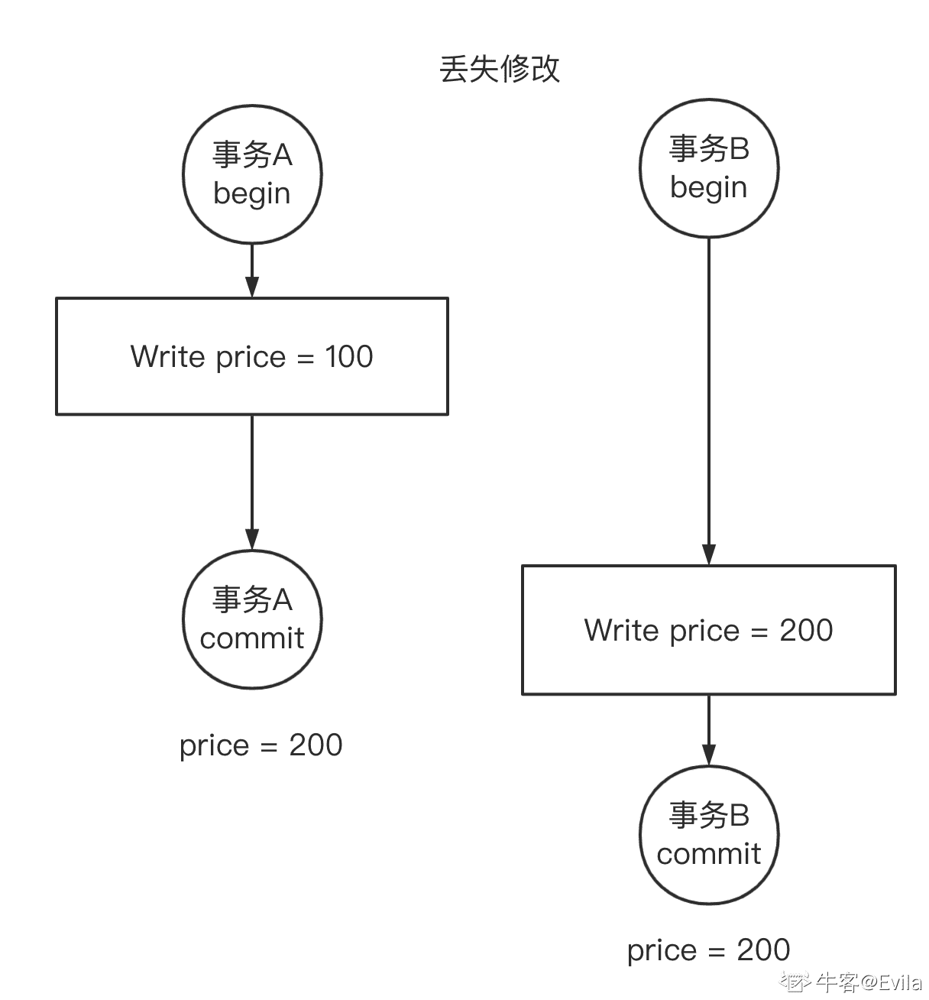
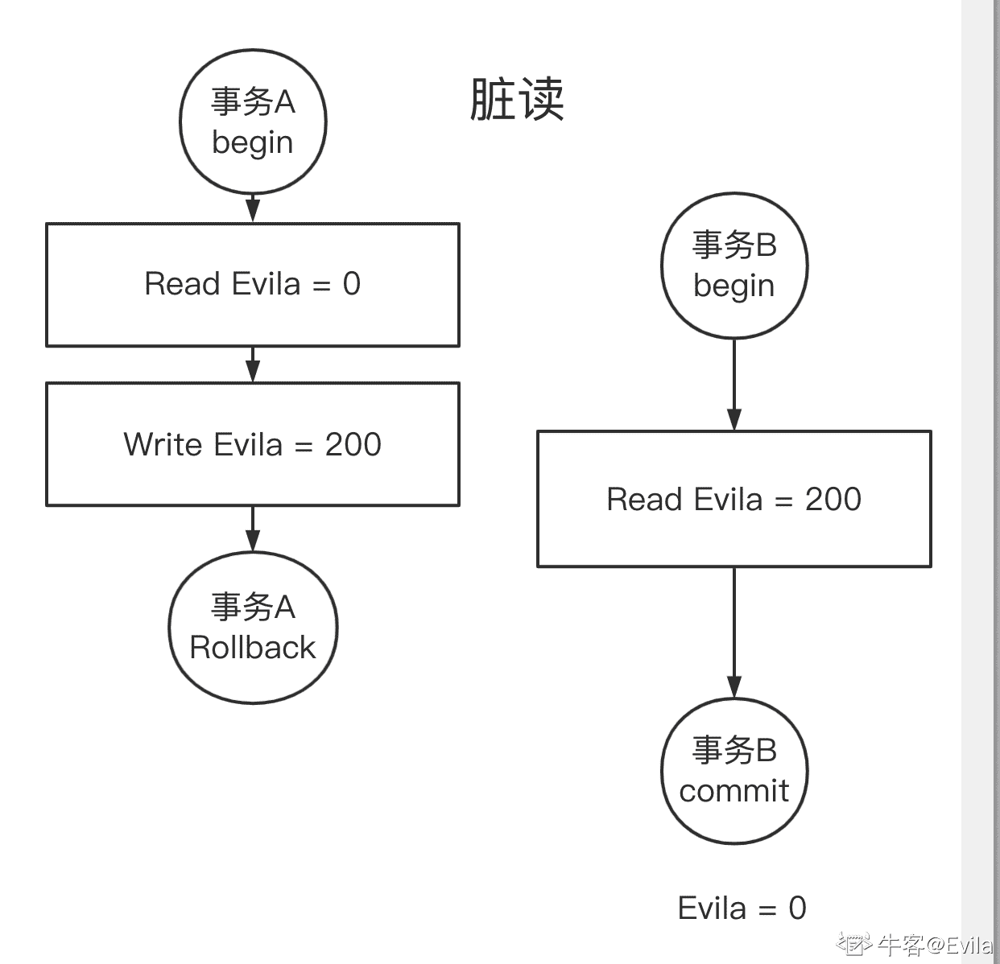
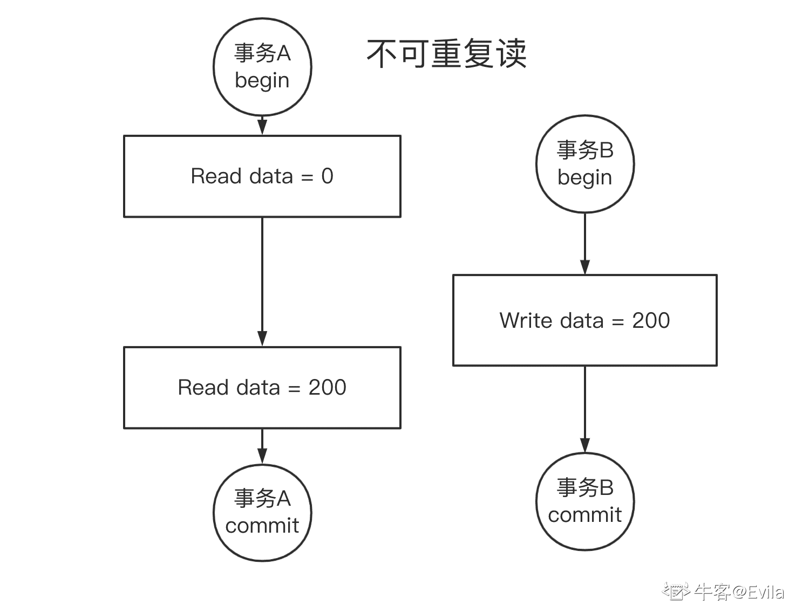
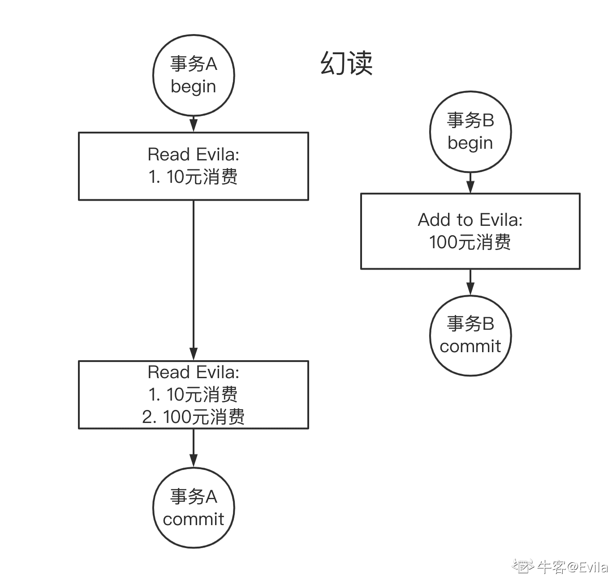
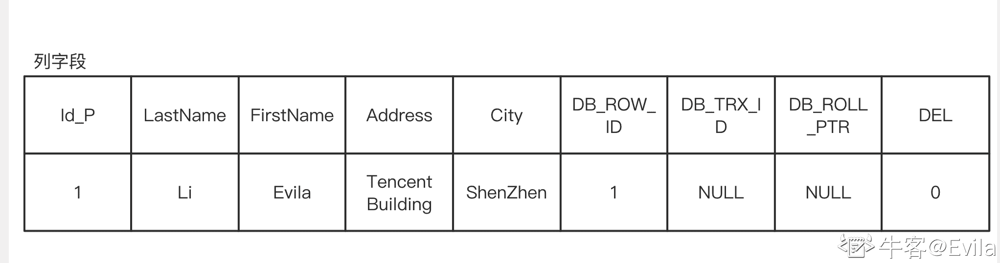
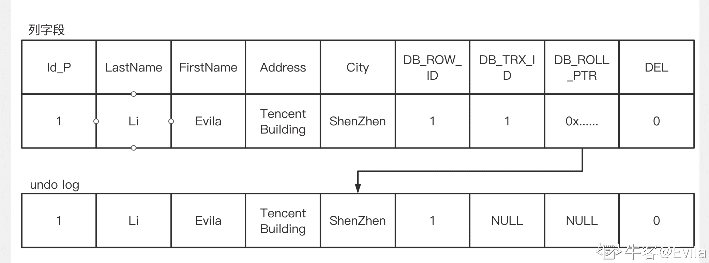
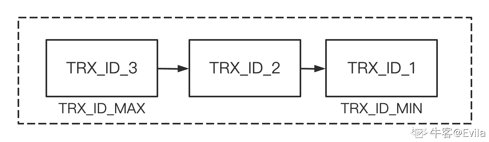

# 第七章 第 1 节 MySQL 的存储引擎与 Innodb 事务

> 原文：[`www.nowcoder.com/tutorial/10094/fdd991d3d59c4e5c92dbda5a6e8fee8e`](https://www.nowcoder.com/tutorial/10094/fdd991d3d59c4e5c92dbda5a6e8fee8e)

# 1\. 前言

首先非常感谢读到第六章的同学，可能看到这章的目录你会产生一个疑问：前五章内容都是围绕 C++程序设计讲述的有关内容，为什么第六章是讲 MySQL 数据库，而不是操作系统和计算机网络等内容呢？

我认为原因主要有两点：

*   1.  专刊的篇幅有限，且作者的能力和精力有限。
*   2.  为什么选择数据库？首先，我认为数据库原理的掌握是后台开发不可或缺的，应该深入学习 MySQL 数据库的实现原理、工作机制、产品特性并适动手实践。其次，对于操作系统和计算机网络的一些原理和特性介绍的资料较为全面和丰富，且在专刊的前五章中或多或少的有一些涉及和讲解。但我在这里需要提醒大家，操作系统和计算机网络相关的知识掌握也非常重要，需要同学们参考 1-2 节的知识图谱，主动去搜寻学习资料并掌握相关内容。

## 2\. 事务

在关系型数据库中，事务通常是多个 SQL 指令的集合操作。如下图所示：事务的一个完整周期包括：begin-开启事物、commit-提交事务、rollback-回滚事务。 

### 2.1 事务的四个特性

事务必须满足 4 个条件，也叫事务的 4 个特性（ACID）:

*   1.原子性（Atomicity） 事务被视为不可分割的最小单元，事务的所有操作要么全部提交成功，要么全部失败回滚到事务开始之前。MySQL 的数据库管理系统通过回滚日志(undo log)来实现原子性，回滚日志记录着事务所执行的修改操作，若需要回滚则反向执行这些修改操作。
*   2.一致性（Consistency） 数据库在事务执行前后都保持一致性状态，一致性是对数据可见性的约束，保证在一个事务中的多次操作的数据中间状态对其他事务不可见的。这些中间状态，是过渡状态，与事务的开始状态和事务的结束状态是不一致的。
*   3.隔离性（Isolation） 数据库允许多个并发事务同时对数据进行读写和修改，隔离性可以防止多个事务并发执行时由于交叉执行而导致数据的不一致。事务隔离分为不同级别，包括读未提交（Read uncommitted）、读提交（read committed）、可重复读（repeatable read）和串行化（Serializable）。
*   4、持久性（Durability） 一旦事务提交，则其所做的修改将会永远保存到数据库中。即使系统发生崩溃，事务执行的结果也不能丢失。

需要强调的是： (1)原子性和一致性的侧重点不同：原子性关注状态，要么全部成功，要么全部失败，不存在部分成功的状态。而一致性关注数据的可见性，中间状态的数据对外部不可见，只有最初状态和最终状态的数据对外可见。 (2)只有满足一致性，事务的执行结果才是正确的：

*   在无并发的情况下，事务串行执行，隔离性一定能够满足。此时只要能满足原子性，就一定能满足一致性。
*   在并发的情况下，多个事务并行执行，事务不仅要满足原子性，还需要满足隔离性，才能满足一致性。



### 2.2 事务控制语句

在 MySQL 数据库的 Innodb 引擎下，使用以下语句操作和控制事务：

*   1.使用 BEGIN,COMMIT，ROLLBACK 来开启、提交和回滚事务 BEGIN——开始一个事务 ROLLBACK——事务回滚 COMMIT——事务提交
*   2.SAVEPOINT identifier, 允许在事务中创建一个保存点，在数据库事务处理中实现“子事务”（subtransaction），一个事务中可以有多个 SAVEPOINT
*   3.ROLLBACK TO identifier 把事务回滚到保存点；
*   4.RELEASE SAVEPOINT identifier 删除一个事务的保存点
*   5.SELECT @@tx_isolation 查看当前事务的隔离级别
*   6.SET TRANSACTION 用来设置事务的隔离级别，InnoDB 存储引擎提供事务的隔离级别有 READ UNCOMMITTED、READ COMMITTED、REPEATABLE READ 和 SERIALIZABLE
*   7.SET AUTOCOMMIT=0 禁止自动提交。当 AUTOCOMMIT=1 时是自动提交的状态，也就是一条 SQL 语句执行完会默认执行一次 COMMIT，也就不受我们自己事务命令的控制。因此，需要 SET AUTOCOMMIT=0 设置成禁止自动提交。

#### 事务测试：

```cpp
MySQL [(none)]> CREATE DATABASE TESTDB;  // 创建数据库 TESTDB
Query OK, 1 row affected (0.00 sec)

MySQL [(none)]> use TESTDB;  // 选择数据库 TESTDB
Database changed

MySQL [TESTDB]> CREATE TABLE transaction_test( pri_id int(5)) engine=innodb;  // 创建表 transaction_test 存储引擎指定为 innodb
Query OK, 0 rows affected (0.05 sec) 

MySQL [TESTDB]> desc transaction_test;  // transaction_test 表结构为一个 pri_id 字段，类型为 int
+--------+--------+------+-----+---------+-------+
| Field  | Type   | Null | Key | Default | Extra |
+--------+--------+------+-----+---------+-------+
| pri_id | int(5) | YES  |     | NULL    |       |
+--------+--------+------+-----+---------+-------+
1 row in set (0.00 sec)

MySQL [TESTDB]> SET AUTOCOMMIT=0;   // 禁止事务自动提交
Query OK, 0 rows affected (0.00 sec)

MySQL [TESTDB]> select * from transaction_test;  // 当前为空表
Empty set (0.00 sec)

MySQL [TESTDB]> begin;   // 开启事务
Query OK, 0 rows affected (0.00 sec)

MySQL [TESTDB]> insert into transaction_test value(0);  // 插入元素 0
Query OK, 1 row affected (0.00 sec)

MySQL [TESTDB]> insert into transaction_test value(1);  // 插入元素 1
Query OK, 1 row affected (0.00 sec)

MySQL [TESTDB]> commit;  // 提交事务
Query OK, 0 rows affected (0.00 sec)

MySQL [TESTDB]> select * from transaction_test;
+--------+
| pri_id |
+--------+
|      0 |
|      1 |
+--------+
2 rows in set (0.00 sec)

MySQL [TESTDB]> begin;  // 开启事务
Query OK, 0 rows affected (0.00 sec)

MySQL [TESTDB]> insert into transaction_test value(10);   // 插入元素 10
Query OK, 1 row affected (0.00 sec)

MySQL [TESTDB]> rollback;  // 回滚事务
Query OK, 0 rows affected (0.00 sec)

MySQL [TESTDB]> select * from transaction_test;  // 因为回滚所以元素 10 没有插入
+--------+
| pri_id |
+--------+
|      0 |
|      1 |
+--------+
2 rows in set (0.00 sec) 
```

## 3\. 隔离级别和并发一致性问题

ACID 中的一致性描述的是一个最理想的事务应该怎样的，是一个强一致性状态，如果要做到这点，需要使用排它锁把事务排成一队，即串行化(Serializable)的隔离级别，这样性能就大大降低了。现实是骨感的，所以隔离性设置了不同隔离级别来打破一致性原则，来获取更好的性能。

### 3.1 读未提交（READ UNCOMMITTED）

读未提交（READ UNCOMMITTED）是低的隔离级别。在读未提交级别下，事务能够读取到其他事务“未提交”的数据，从而引发丢失修改、脏读和不可重复读的问题。

#### 3.1.1 丢失修改

丢失修改指一个事务 A 的更新操作被另外一个事务 B 的更新操作替换，从而导致事务 A 的修改丢失了。 例如：

*   1.商家 A 将某个商品定价为 100 元，A 开启事务先修改并提交生效；
*   2.随后，商家 B 也开启事务并对该商品的定价进行修改 200 元，但未提交事务；
*   3.此时，B 尽管未提交事务仍然影响了商品的价格的展示；



#### 3.1.2 脏读

脏读数据指并发执行的事务下，当前事务可以读到另外事务未提交的数据。 例如：牛妹转账给 Evila200 元作为奖励。

*   1.  首先，牛妹开启事务并修改了 Evila 的账户余额+200，但牛妹未提交事务；
*   2.  此时 Evila 开启事务并查看账户发现多了 200 元，便提交事务结束操作；
*   3.  牛妹经过清算觉得 200 奖励在上周给过了，于是牛妹回滚了事务；
*   4.  最终，Evila 的账户没有增加 200 元，但 Evila 以为增加了。



### 3.2 读已提交(READ COMMITTED)

读已经提交（READ COMMITTED）是高于读未提交的隔离级别。在读未已提交级别下，事务只能够读取到其他事务“提交”的数据，但并不能解决并发事务时引起的不可重复读问题。

#### 3.2.1 不可重复读

不可重复读指在一个事务内多次读取同一个数据得到不同的结果。 例如： 事务 A 和 B 并发读写同一份数据，

*   1.  事务 A 首先读取了数据的值，在 A 读取后，另一事务 B 修改了该数据并提交了事务；
*   2.  在事物 B 提交后，事物 A 再次读取该数据；
*   3.  由于事务 B 的修改，事务 A 的两次读取的数据不一致。



### 3.3 可重复读（REPEATABLE READ）

可重复读（REPEATABLE READ）是在读已提交级别下隔离性更强的等级。可以避免读已提交级别下产生的事务内读取同一个数据结果不一致问题（不可重复读问题），这是因为在可重复读（REPEATABLE READ）级别下，同一个事务内的查询都是事务开始时刻一致的，即快照查询，因此无论在事务中是否有其他事务对数据进行了修改，都不会影响本事务的查询结果。 可重复读（REPEATABLE READ）也是 InnoDB 引擎的默认级别。但可重复读级别下仍然具有幻读的并发不一致问题：

#### 3.3.1 幻读

幻读是事务中读取范围数据时，发现前后多次读取到的范围数据数目发生变化，本质上也属于不可重复读。 例如：

*   1.牛妹开启事务，想要查询 Evila 的消费账单；
*   2.在事务中，牛妹查询发现 Evila 有一笔 10 元的消费；
*   3.此后，Evila 开启事务，增加了一笔 100 元的消费，并提交；
*   4.牛妹再次查询账单，发现 Evila 有两笔消费记录，即同一个事务内本次查询结果和上次查询结果不一致。



### 3.4 串行化(SERIALIZABLE)

串行化(SERIALIZABLE)是隔离性最强的等级，强制事务串行执行，失去并发性能，造成事务执行效率降低。由于事务是串行执行的，因此对于脏读、不可重复度、幻读的问题都可以避免。

### 3.5 隔离级别能解决并发一致性问题

| 表头 | 脏读 | 不可重复读 | 幻读 |
| :-- | :-- | :-- | :-- |
| 读未提交(READ UNCOMITTED) | × | × | × |
| 读已提交(READ COMITTED) | √ | × | × |
| 可重复读（REPEATABLE READ） | √ | √ | × |

## 4\. 多版本并发控制(Multi-Version Concurrency Control，MVCC)

### 4.1 MVCC 的基本思想

多版本并发控制（Multi-Version Concurrency Control, MVCC）是 MySQL 的 InnoDB 存储引擎实现隔离级别的实现机制，用于实现提交读和可重复读这两种隔离级别。多个事务并发读操作没有互斥关系，但是读和写操作存在互斥关系。MVCC 利用多版本机制，可以有效的处理读-写冲突，能够做不加锁且非阻塞并发读。

MVCC 实现的基本思想：写操作只更新最新的版本快照，而读操作读旧版本快照，从而消除了读和写操作的互斥关系。在提交读和可重复读隔离级别下，事务进行读取操作时，为了解决脏读和不可重复读问题，MVCC 规定只能读取已经提交的快照。当然一个事务可以读取自身未提交的快照，这不算是脏读。

### 4.2 MVCC 的实现机制

[参考 MySQL 官网的介绍](https://dev.mysql.com/doc/refman/5.7/en/innodb-multi-versioning.html)： 为了维护数据的多个版本快照，MySQL 的 Innodb 引擎增加了系统版本号的概念，系统版本号是一个递增的数字，每开启一个新的事务，系统版本号就会自动递增。此外，Innodb 为每个数据行记录维护了三个隐藏的列+是否删除的标志位：

*   1.DB_TRX_ID：写操作事务 ID：事务的修改操作（DELETE、INSERT、UPDATE）会为数据行新增一个版本快照，该字段记录了创建或最后一次修改该记录的事务 ID
*   2.DB_ROLL_PTR：回滚指针，指向记录的上一个版本快照；快照存储在 Undo 日志中，Undo 日志通过 DB_ROLL_PTR 将记录的所有版本快照连接。
*   3.DB_ROW_ID：隐藏的记录自增主键，当由 innodb 产生聚集索引时，聚集索引会包括这个行 ID 的值。
*   4.DEL:DELETE 被视为一种 UPDATE，若记录被 DELETE，则 DEL 标志被置为 1。

#### 4.2.1 Undo 日志

undo log 是采用段(segment)的方式来记录逻辑操作，数据的快照被存储于 Undo log 的 rollback segment(回滚段)，每个回滚段中有 1024 个 undo log segment。

Undo log 可分为两类：

*   1.insert undo log：事务在 insert 记录时产生的 undo log, 只在当前事务回滚时需要，并且在事务提交后可以被立即丢弃。
*   2.update undo log：可分为 delete 和 update 操作，其中 delete 操作实际上不会直接删除，而是将 delete 对象打上 delete flag，最终的删除操作是 purge 线程完成的。 update 分为两种情况：(1)update 的列如果不是主键列，在 undo log 中直接反向记录是如何 update 的；(2)update 的列如果是主键列，update 分两部执行：先删除该行，再插入一行目标行。

##### 举个例子：

*   1.  首先，创建一个测试用的数据表，并设置事务自动提交(set autocommit = 1), 表的结构如下：

```cpp
MySQL [test]> desc Persons;
+-----------+--------------+------+-----+---------+-------+
| Field     | Type         | Null | Key | Default | Extra |
+-----------+--------------+------+-----+---------+-------+
| Id_P      | int(11)      | YES  |     | NULL    |       |
| LastName  | varchar(255) | YES  |     | NULL    |       |
| FirstName | varchar(255) | YES  |     | NULL    |       |
| Address   | varchar(255) | YES  |     | NULL    |       |
| City      | varchar(255) | YES  |     | NULL    |       |
+-----------+--------------+------+-----+---------+-------+
5 rows in set (0.00 sec) 
```

*   2.执行 Insert 语句插入一条记录(自动提交事务)：`INSERT INTO Persons VALUES(1,"Li","Evila","Tencent Building","ShenZhen");` 此时 DB_ROW_ID 是 1，DB_TRX_ID 和 DB_ROLL_PTR 假设为 NULL，DEL 为 0。



*   3.执行 Update 语句修改 FirstName(自动提交事务):`UPDATE Persons SET FirstName='牛妹' WHERE Id_P=1;`，在 UPDATE 执行时，首先将原数据拷贝到 undo log 中作为旧记录；然后执行修改操作；最后递增 DB_TRX_ID，DB_ROLL_PTR 赋值为 undo log 中拷贝的副本地址。



以此类推，当事务中执行了 update 操作后，undo log 会记录数据修改前的旧版本快照，并以链表的方式关联，链首节点是上一个版本的旧记录，链尾就是最早的旧记录。

#### 4.2.2 ReadView——读视图

ReadView 是事务在进行快照读时产生的当前时刻活跃的事务视图，由于 DB_TRX_ID 是单调递增的，因此 DB_TRX_ID 越大表明事务开启的时间越新。ReadView 用来判断当前事务能够看到 undo log 中哪个版本的数据，即判断快照对与当前事务的可见性。

##### 例如，若有 3 个事务并发读写数据，且 3 个事务均为提交属于活跃事务；此时，系统的 ReadView 为如下情况：



当前活跃的事务对于数据多版本的可见性，遵循如下算法：

*   1.将活跃事务想要查询或修改数据的最新记录(链表首部节点)中的 DB_TRX_ID 取出，与 ReadView 中活跃事务的 ID 去对比；
*   2.若数据快照的 DB_TRX_ID < TRX_ID_MIN，表示该数据行快照均是在当前 ReadView 中所有未提交事务之前进行更改的，则可以使用
*   3.若数据快照的 DB_TRX_ID > TRX_ID_MAX，表示该数据行快照均是在 ReadView 中事务启动之后被更改的，因此不可使用
*   4.若 TRX_ID_MIN <= DB_TRX_ID <= TRX_ID_MAX，需要根据隔离级别再进行判断：提交读：如果 DB_TRX_ID 在 TRX_IDs 列表中，表示该数据行快照对应的事务还未提交，则该快照不可使用。否则表示已经提交，可以使用。可重复读：都不可以使用。 若链表节点不符合可见性，那就通过 DB_ROLL_PTR 回滚指针去取出 Undo Log 中的 DB_TRX_ID 再比较，即遍历链表的 DB_TRX_ID（从链首到链尾，即从最近的一次修改查起），直到找到满足特定条件的 DB_TRX_ID, 那么这个 DB_TRX_ID 所在的旧记录就是当前事务能看见的最新版本。

## 5.Next-Key Locks

### 5.1 快照读与当前读

*   1.当前读 当前读是一种对操作所扫描的数据记录索引上加锁的操作，是悲观锁（访问数据之前先锁住数据）的实现。`select ... lock in share mode`、`select ... for update`、`update`、`insert`、`delete`操作都属于当前读的动作，它们读取的是记录的最新版本，并且在运行时对数据记录进行加锁，以保证读取时其他并发事务不能并发的修改当前记录。

*   2.快照读 不加锁的 select 操作就是快照读，在读已提交和可重复读隔离级别下依靠 MVCC 机制实现，串行隔离级别下的快照读会退化成当前读。

### 5.2 再谈幻读

幻读指的是在一个事务 A 中执行了一个当前读操作，另外一个事务 B 在事务 A 的扫描区间内 insert 了一条记录并提交事务，这时事务 A 再执行当前读操作时，出现了幻行。比如在事务 A 中执行快照读`select * from test where id<10` 结果集为（1,2,3），这时在 B 中对 test 表插入了一条记录 4，这时在 A 中重新查询结果集就是(1,2,3,4)，结果和事务 A 在第一次查询出来的结果集不一致。

因此在可重复读（REPEATABLE READ）隔离级别下，MVCC 无法解决幻读问题。

##### 为此，Innodb 使用 MVCC + Next-Key Locks 的解决方案：

*   1.行锁 （Record locks） 锁定一个记录上的索引，而不是记录本身。如果表没有设置索引，InnoDB 会自动在主键上创建隐藏的聚簇索引。
*   2.间隙锁 （Gap locks） 锁定索引之间的间隙，但是不包含索引本身。
*   3.Next-Key Locks 是行锁+间隙锁的结合，不仅锁定一个记录上的索引，也锁定索引之间的间隙。 例如：某个数字整形列的索引包含：10, 11, 13, and 20，那么就需要锁定以下区间： (-∞, 10] (10, 11] (11, 13] (13, 20] (20, +∞) 因此，Next-Key Locks 可以防止间隙内有新数据被插入，防止已存在的数据，更新成间隙内的数据。

##### 举例：一个数据表的具有上文所展示的索引，假设索引所在的列名为 id。

*   事务 1 执行： `select * from table_name where id = 15 for update;`
*   事务 2 执行： `insert into table_name values(14); 阻塞` `insert into table_name values(16); 阻塞` `insert into table_name values(22); 成功` `insert into table_name values(12); 成功` 在上例中，事务 1 执行当前读，next-key lock 将 id=15 的记录加行锁，且根据间隙锁的性质，15 向左取最靠近的索引值是 13，向右取最靠近的索引值是 20，因此会话 1 的间隙锁范围是(13,15),(15,20)。