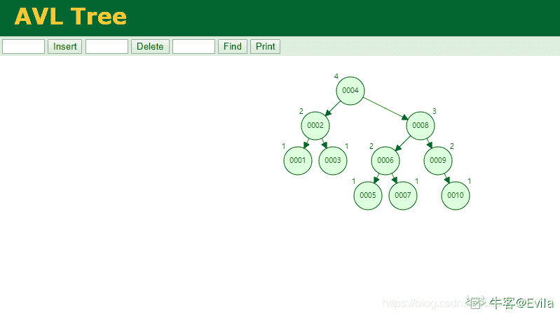

# 第七章 第 2 节 MySQL 索引及其底层结构

> 原文：[`www.nowcoder.com/tutorial/10094/707b31b78dc04aefb32977703e9c5404`](https://www.nowcoder.com/tutorial/10094/707b31b78dc04aefb32977703e9c5404)

# 1\. MySQL 索引与底层实现

对于数据量庞大的 MySQL 库表来说，若没有建立表索引，对表中数据的删改查等操作需要对全表进行扫描，其时间复杂度为 O(n),效率降低。

而索引的建立可以有效降低对表元素操作的时间复杂度；

索引类似于字典中的目录，通过字典的拼音目录，我们可以快查询到需要的内容；同样的，索引是对 MySQL 数据表建立的目录，当对数据进行删改查操作时，通过扫描索引来快速获得目标数据所在的真实映射。

通过学习数据结构我们可以认识到，实现索引与数据间快速映射的结构有多种实现，例如哈希表、二叉搜索树以及多种二叉搜索树的变种。目前，MySQL 中实现索引所采用的底层结构为 B+树，那么 B+树有什么特征，才能够脱颖而出被 MySQL 选中呢？

### 1.1 哈希表

哈希表（Hash table，也叫散列表），根据关键值（key-value）直接进行访问的数据结构。

它通过把 key 映射到表中的一个位置来访问记录，以加快查找速度。这个映射函数被叫做散列函数，存放记录的数据叫做散列表。关于哈希表的详细介绍，可移步到[第 3-3 章 5.1 节](https://blog.nowcoder.net/n/8c6518f603da47a3974e0739ab6d6a62)。

那么用哈希表作索引的优点在于可直接按 key 进行查找，效率较高 O(1); 但缺点也比较明显，不能进行范围查找。

### 1.2 AVL 树

平衡二叉搜索树（Self-balancing binary search tree）又被称为 AVL 树（得名于其发明者的名字 Adelson-Velskii 以及 Landis），AVL 树具有二叉搜索树的性质，同时维持高度平衡，避免因某一子树的高度不平衡使得搜索效率退化为 O(n)。

平衡二叉树递归定义如下：

*   1.  左右子树的高度差小于等于 1
*   2.  其每一个子树均为平衡二叉树

下图为 10 个节点的 AVL 树，其节点的值为 1-10： 

如果现在要查找 10： （1）第一次与根 4 相比，大于 4； （2）第二次与 8 相比，大于 8； （3）第三次与 9 相比，大于 9； （4）第四次与 10 行比，等于 10 比较了 4 次得到查找结果；AVL 树的查询效率为 O(lgn),其查询效率显然是低于哈希表的；

但是由于 AVL 树是有序的，因此其范围查找会比哈希表高效： 如果现在需要查找大于 4 的元素，哈希表只能通过 4 快速映射到对应元素，想要查询 key 大于 4 的元素，只能扫描全表；而 AVL 的范围查询效率十分高校，通过 O(lgn)的是件复杂度查询到 key=4 的节点，递归取出右子树及父节点的右子树获得范围查询结果。

### 1.3 B 树与 B+树

#### 1.3.1 B 树

B 树其结构与 AVL 树非常相似，最大区别在于 B 树的节点中可以包含多个元素，即平衡多路查找树结构。

B 树具有以下特点：

*   1.  每个节点最多有 m-1 个关键字，称为 m 阶
*   2.  根节点最少可以只有 1 个关键字
*   3.  非根节点至少有 m/2 个关键字
*   4.  每个节点中的关键字都按照从小到大的顺序排列，每个关键字的左子树中的所有关键字都小于它，而右子树中的所有关键字都大于它。
*   5.  所有叶子节点都位于同一层
*   6.每个节点都存有索引和数据，也就是对应的 key 和 value。

为了维护上述规则，B 树的生成、插入和删除算法也较为复杂，**这里不对 B 树生成和旋转方法做介绍。**

如下图所示： 

其中 6 和 8 元素、9 和 10 元素存储在了同一个 B 树节点中；正是因为 B 树的节点可以存储多个元素，B 树的高度要低于 AVL 树。

当我们需要查找 10 元素时，尽管元素比较次数仍为 4 次，但只需要 3 次对索引树的磁盘或内存 I/O 操作。

#### 1.3.2 B+树

B+树是对 B 树的变种，二者的不同点在于：

*   1.  B+树区分非叶子节点和叶子节点，非叶子节点只存储 key，不存储 value。叶子节点同时存储 key 和 value。在节点存储单元固定时，B+树每个非叶子节点所能保存的 key 数量多于 B 树。
*   2.  B+树叶子节点保存了非叶子节点的所有 key 的指针，所有数据地址必须要到叶子节点才能获取到。所以每次数据查询的次数都一样；
*   3.  B+树的所有非叶子节点都下沉成为叶子节点，每个叶子结点都存有相邻叶子结点的指针，叶子节点按照 key 自小而大顺序连接。

如图所示：10 个元素生成 B+树的结构 

#### 1.3.3 B+树的优势是什么？

实际上，索引是需要占用存储单元的，当一个表的数据行越多，对应的索引文件也就会越大；索引需要存储在磁盘中，不能够存储在内存中；所以在选择索引的数据结构时应该考虑哪种结构适合从磁盘 I/O；

通过上述的分析可知，B 树和 B+树是多路 AVL 树，二者的高度一般会低于 AVL 树，从而查找的磁盘 I/O 效率会高于 AVL 树；

通常 B+树的非叶子节点不存储数据（只存储键值），只有叶子节点才存储数据（表的行信息或者表行的地址）；而 B 树的非叶子节点和叶子节点都会存储数据，会导致非叶子节点中存储的索引值会少于 B+树；因此 B 树的高度会比 B+树高，平均查找的 I/O 效率低。另外，B+树的叶子节点有指向相邻叶子节点的指针，提高了范围查找的效率。

Mysql 中 MyISAM 和 Innodb 引擎使用 B+树作为索引结构，非叶子节点不存储数据，叶子节点存储数据，一个非叶子节点内能存储更过的 key 值，树的度变大，I/O 效率增加。

## 2\. 聚簇与非聚簇 B+树索引

通过第一节我们认识到，B+树作为索引的非叶子节点不存储数据，只存储索引值，仅在叶子节点存储索引值+数据。按照 B+树叶子结点存储数据的方式区分，叶子结点存储行记录的存储地址时为非聚簇索引，叶子结点存储行记录的数据时为聚簇索引。

以下表的学生信息表为例，详细的讲解聚簇和非聚簇索引的特点与区别，以学号作为主键：

| student_id | name | sex | height |
| :-- | :-- | :-- | :-- |
| 15 | Evila | 0 | 180 |
| 20 | Evilb | 0 | 175 |
| 50 | Evilc | 1 | 178 |
| 51 | Evild | 1 | 172 |
| 52 | Evile | 1 | 173 |
| ... |  |  |  |

### 2.1 MyISAM 引擎中的非聚簇索引

非聚簇索引的示意图如下图所示：

 MYISAM 的非聚簇索引，B+树叶子结点中存放的是数据所在的地址，因此除了建立索引所需要的查找磁盘 I/O 外，取数据时还需要一次地址映射的磁盘 I/O。此外，主键索引和辅助索引无明显区别。

### 2.2 InnoDB 引擎中的聚簇索引

相对的是，在 InnoDB 引擎中 B+树以聚簇索引的形式构造，主键索引的 B+输叶子结点中数据区域存储的是数据行记录，辅助索引 B+树叶子结点数据区域存储主键的值。 


*   InnoDB 中的主键索引和行数据是绑定在一起的，也意味着 InnoDB 的一个表一定要有主键索引；如果没有手动建立主键索引，Innodb 会查看有没有唯一索引，如果有则选用唯一索引作为主键索引，如果没有唯一索引，会默认建立一个隐藏的主键索引。

*   因此，Innodb 的主键索引比 MyISAM 的主键索引查询效率要高，少了一次最后取数据的磁盘 I/O。在使用 Innodb 引擎时，最好手动建立主键索引，尽量利用主键索引查询。

*   此外，辅助索引的叶子结点存储的是主键值，因此通过辅助索引搜索记录时，会先得到该记录对应的主键值，再搜索主键索引树从而获得相对应的行数据信息。

## 3.索引的选择原则

### 3.1 索引选择性

为了衡量索引扫描与全表扫描哪个性能更优，定义索引选择性的概念，索引选择性是：不重复的索引值和表记录数的比值，其取值范围是【0—1】。

以第二节中构建的学生信息表为例，其中有一个性别列，这个列的包含选项就两个：男/女。那么，若以性别这一列创建索引的话，假设表中有一万条记录，那么索引的选择性为万分之二，通过该索引的查询与全表扫描的效率相似，基本没有起到优化查询的意义。如果是主键索引，由于主键 id 是唯一的，因此主键索引的选择性为 1，索引价值最大，可以直接根据索引定位到数据。

因此，索引选择性得分越高，索引的价值越大；选择性越低，说明这列索引的重复值过多。

### 3.2 联合索引

一般的，在 where 条件后用的列通常适合建立索引来增加查询效率，但索引并不是越多越好的。根据索引选择性，有时只在某一列上建立索引，可能它的选择性很低，通过该列索引并不能把查询的范围高效率的缩小。因此，建立联合索引是一个好的方式。联合索引是一个有序元组<a1, a2, …, an>，其中各个元素均为数据表的一列。

通过构建联合索引，可以极大的提高索引选择性的得分。以第二节中构建的学生信息表为例，以<name、sex、height>三列建立联合索引，同样的它们会按照 B+树的规则建立索引树。


### 3.3 前缀索引

尽管通过联合索引能够有效提高索引选择性，但联合索引由于 B+树中的 key 变大，同样会增大索引文件的大小和维护开销。

前缀索引，用列的部分前缀代替整个列作为索引的 key，当前缀长度合适时，可以做到既使得前缀索引的选择性接近全列索引，同时减少索引 key 节点的长度。

例如，以<left(name,5)、sex、height>三列建立联合索引，其中第一列取 5 个长度的前缀。

> 注意，为了兼顾索引选择性和索引节点的长度，去前缀索引时的长度是非固定的。前缀索引不能用于`ORDER BY`和`GROUP BY`操作。

### 3.4 最左前缀原则

最左前缀匹配原则：在扫描联合索引树时会遵守最左前缀匹配原则，即最左优先，在检索数据时从联合索引的最左边开始匹配。产生最左匹配原则的原因是创建联合索引的 B+树时，首先会对联合索引的最左边第一个字段排序，在第一个字段的排序基础上，然后在对第二个字段、第三个字段进行排序。

例如，有如下查询语句：

*   1.  `select * from table_name where name='Evila' and sex='0' and height='180';` 结论：用到了联合索引，并且 sql 语句中索引的顺序可以不与联合索引声明的顺序一致，因为一般数据库会进行索引优化。
*   2.  `select * from table_name where name='Evila';` `select * from table_name where name='Evila' and sex='0';` `select * from table_name where name='Evila' and sex='0' and height='180';` 结论：从最左边开始连续匹配，用到了索引
*   3.`select * from table_name where sex='0';` `select * from table_name where height='180';` `select * from table_name where sex='0' and height='180';` 结论：不符合最左匹配原则，查询没有用到索引，而是全表扫描。

*   4.  `select * from table_name where name='Evila' and height='180';` 结论：用到了 name 列的索引，但没有用到 sex 列的索引，因此 height 列的索引也没有用到

组合索引（姓名、性别、身高）等效于（姓名、性别、身高）、（姓名、性别）以及（姓名）三个索引。基于最左前缀原则，应尽量避免创建重复的索引，例如，创建了（姓名、性别、身高）索引后，就无需再建立姓名子段的单独索引。

### 3.5 Explain 执行计划

`Explain` + 一个 sql 语句可以返回一个表，告知此 sql 语句数据读取操作的类型，哪些索引可以使用，哪些索引实际使用了，表之间的引用，每张表有多少行被优化器查询等信息。在 `select` 语句之前增加 `explain` 关键字，MySQL 会在查询上设置一个标记，执行查询时，会返回执行计划的信息，而不是执行这条 SQL（如果 from 中包含子查询，仍会执行该子查询，将结果放入临时表中）。

explain 返回的信息如下：

```cpp
mysql> explain select ... from ...;

+----+-------------+-------+------------+------+---------------+------+---------+------+------+----------+-------+

| id | select_type | table | partitions | type |possible_keys | key  | key_len | ref  | rows | filtered | Extra |

+----+-------------+-------+------------+------+---------------+------+---------+------+------+----------+-------+ 
```

#### 3.5.1 type 字段

type 字段是 sql 语句的访问类型，是判断 sql 语句是否高效的重要依据。 type 字段的取值如下：

*   1.system: 表中只有一条数据
*   2.const: 针对主键或唯一索引的等值查询扫描，最多只返回一行数据。const 为常量级时间花费，表示速度非常快。
*   3.eq_ref: 出现在多表 join 查询，表示前表的每个结果都唯一匹配到后表的一行结果，并且查询的比较操作时等于,效率较高。
*   4.ref: 表示对于非唯一活非主键索引，或用到了最左前缀原则的联合查询。
*   5.range: 表示使用索引进行范围查询，通过索引字段范围获取表中的数据，通常出现在判断条件是<>,>,>=,<,<=,IS NULL, BETWEEN, IN()等操作中。
*   6.index, 表示索引表全表扫描。
*   7.ALL：表示全表扫描，性能最差的查询。 type 字段的值从高效到低效的顺序依次是：`system >const > eq_ref > ref > range > index > ALL`。

#### 3.5.2 key 和 key-len 字段

key 字段表示当前查询真正用到的索引列标识。key_len 表示使用了索引的字节长度，通过该字段可以评估联合索引是否被全部使用。

ken_len 的计算具有如下规则：

*   1.字符类型列，字符长度与编码相关，latin1 占用 1 个字节，gbk 占用 2 个字节，utf8 占用 3 个字节； char(n)=n 个字符的字节数，varchar(n)=char(n) + 2
*   2.数值类型，TINYINT:1 字节，SMALLINT：2 字节，MEDIUMNT：3 字节，INT：4 字节，BIGINT：8 字节

#### 3.5.3 Explain 案例解析

我们将学生信息表进行改造，

| student_id(INT) | name(varchar 50) | from_date(date_time) | sex(TINYINT) | height(SMALLINT) |
| :-- | :-- | :-- | :-- | :-- |

将 student 表的主键设置为<student_id, name, from_date>联合索引。

```cpp
SHOW INDEX FROM student.stu_info;
+--------+------------+----------+--------------+-------------+-----------+-------------+------+------------+
| Table | Non_unique | Key_name | Seq_in_index | Column_name | Collation | Cardinality | Null | Index_type |
+--------+------------+----------+--------------+-------------+-----------+-------------+------+------------+
| titles | 0 | PRIMARY | 1 | student_id | A | NULL | | BTREE |
| titles | 0 | PRIMARY | 2 | name | A | NULL | | BTREE |
| titles | 0 | PRIMARY | 3 | from_date | A | 443308 | | BTREE |
+--------+------------+----------+--------------+-------------+-----------+-------------+------+------------+ 
```

##### (1) 规则 1：索引列全列匹配

```cpp
EXPLAIN SELECT * FROM student.stu_info WHERE student_id='15' AND name='Evila' AND from_date='1986-06-26';
+----+-------------+--------+-------+---------------+---------+---------+-------------------+------+-
| id | select_type | table | type | possible_keys | key | key_len | ref | rows | Extra |
+----+-------------+--------+-------+---------------+---------+---------+-------------------+------+-
| 1 | SIMPLE | titles | const | PRIMARY | PRIMARY | 59 | const,const,const | 1 | | 
+----+-------------+--------+-------+---------------+---------+---------+-------------------+------+- 
```

key 字段对应结果是 PRIMARY，key_len=59。这表明，此 sql 查询语句用到了主键索引，索引的长度是 59。

根据 key_len 的计算规则，student_id 是 int 占 4 字节，name 是 varchar(50),占 52 字节，拉丁字符编码;from_date 是日期类型，占 3 字节。因此 59 = 4 + 52 + 3，此 sql 查询按照联合索引中所有列进行精确匹配（这里精确匹配指“=”或“IN”匹配）时，用到了全部的主键索引。

##### (2) 规则 2：最左前缀匹配

```cpp
EXPLAIN SELECT * FROM student.stu_info WHERE student_id='15';
+----+-------------+--------+------+---------------+---------+---------+-------+------+----
| id | select_type | table | type | possible_keys | key | key_len | ref | rows | Extra |
+----+-------------+--------+------+---------------+---------+---------+-------+------+----
| 1 | SIMPLE | titles | ref | PRIMARY | PRIMARY | 4 | const | 1 | |
+----+-------------+--------+------+---------------+---------+---------+-------+------+---- 
```

当查询条件精确匹配索引的左边连续一个或几个列时，如<student_id>或<student_id, name>，索引可以被用到，但是只能用到一部分，即条件所组成的最左前缀。如本查询只用到了 student_id 字段，key_len=4 字节长度。

##### (3) 规则 3：查询条件用到了索引中列的精确匹配，但是中间某个条件未提供

```cpp
EXPLAIN SELECT * FROM student.stu_info WHERE student_id='15' AND from_date='1986-06-26';
+----+-------------+--------+------+---------------+---------+---------+-------+------+-----
| id | select_type | table | type | possible_keys | key | key_len | ref | rows | Extra |
+----+-------------+--------+------+---------------+---------+---------+-------+------+-----
| 1 | SIMPLE | titles | ref | PRIMARY | PRIMARY | 4 | const | 1 | Using where |
+----+-------------+--------+------+---------------+---------+---------+-------+------+----- 
```

此时索引使用情况和情况二相同，因为 name 未提供，所以查询只用到了索引的第一列，而后面的 from_date 虽然也在索引中，但是由于 name 不存在而无法和左前缀连接(无法通过第二个索引缩减查询范围)，因此需要对结果进行扫描过滤 from_date（这里由于 student_id 唯一，所以不存在扫描）。

##### （4）规则 4：模糊匹配的通配符不在前缀出现

```cpp
EXPLAIN SELECT * FROM student.stu_info WHERE student_id='10001' AND name LIKE 'Senior%';
+----+-------------+--------+-------+---------------+---------+---------+------+------+----
| id | select_type | table | type | possible_keys | key | key_len | ref | rows | Extra |
+----+-------------+--------+-------+---------------+---------+---------+------+------+----
| 1 | SIMPLE | titles | range | PRIMARY | PRIMARY | 56 | NULL | 1 | Using where |
+----+-------------+--------+-------+---------------+---------+---------+------+------+---- 
```

由于通配符未出现在 name 字段的左侧，因此 name 字段仍可以用来筛选。本次查询 type 为 range，key_len=56。

##### （5）规则 5：范围查询(范围查询后面的列将无法使用索引)

```cpp
EXPLAIN SELECT * FROM student.stu_info  WHERE student_id < '50' and name='Evila';
+----+-------------+--------+-------+---------------+---------+---------+------+------+-----
| id | select_type | table | type | possible_keys | key | key_len | ref | rows | Extra |
+----+-------------+--------+-------+---------------+---------+---------+------+------+-----
| 1 | SIMPLE | titles | range | PRIMARY | PRIMARY | 4 | NULL | 16 | Using where |
+----+-------------+--------+-------+---------------+---------+---------+------+------+----- 
```

范围列可以用到索引（必须是最左前缀），但是范围列后面的列无法用到索引。同时，索引最多用于一个范围列，因此如果查询条件中有两个范围列则无法全用到索引。

##### （6）规则 6：用 explain 可能无法区分范围索引和多值匹配，因为在 type 中这两者都显示为 range。同时，用了“between”并不意味着就是范围查询。

```cpp
EXPLAIN SELECT * FROM student.stu_info
WHERE student_id BETWEEN '15' AND '50'
AND name='Evila'
AND from_date BETWEEN '1986-01-01' AND '1986-12-31';
+----+-------------+--------+-------+---------------+---------+---------+------+------+-------------+
| id | select_type | table | type | possible_keys | key | key_len | ref | rows | Extra |
+----+-------------+--------+-------+---------------+---------+---------+------+------+-------------+
| 1 | SIMPLE | titles | range | PRIMARY | PRIMARY | 59 | NULL | 16 | Using where |
+----+-------------+--------+-------+---------------+---------+---------+------+------+-------------+ 
```

看起来是用了两个范围查询，但作用于 student_id 上的“BETWEEN”实际上相当于“IN”，也就是说 student_id 实际是多值精确匹配。可以看到这个查询用到了索引全部三个列。

##### （7）规则 7：查询条件中含有函数或表达式，无法使用索引

```cpp
EXPLAIN SELECT * FROM student.stu_info WHERE student_id='15' AND left(name, 3)='Evi";
+----+-------------+--------+------+---------------+---------+---------+-------+------+-----
| id | select_type | table | type | possible_keys | key | key_len | ref | rows | Extra |
+----+-------------+--------+------+---------------+---------+---------+-------+------+-----
| 1 | SIMPLE | titles | ref | PRIMARY | PRIMARY | 4 | const | 1 | Using where |
+----+-------------+--------+------+---------------+---------+---------+-------+------+----- 
```

由于使用了函数 left，则无法为 name 列应用索引扫描，而规则 4 中用 LIKE 通配符可以。

```cpp
EXPLAIN SELECT * FROM student.stu_info WHERE student_id - 1='14';
+----+-------------+--------+------+---------------+------+---------+------+--------+-------
| id | select_type | table | type | possible_keys | key | key_len | ref | rows | Extra |
+----+-------------+--------+------+---------------+------+---------+------+--------+-------
| 1 | SIMPLE | titles | ALL | NULL | NULL | NULL | NULL | 443308 | Using where |
+----+-------------+--------+------+---------------+------+---------+------+--------+------- 
```

显然这个查询等价于查询 student_id 为 15 的函数，但是由于查询条件是一个表达式，MySQL 无法为其使用索引。