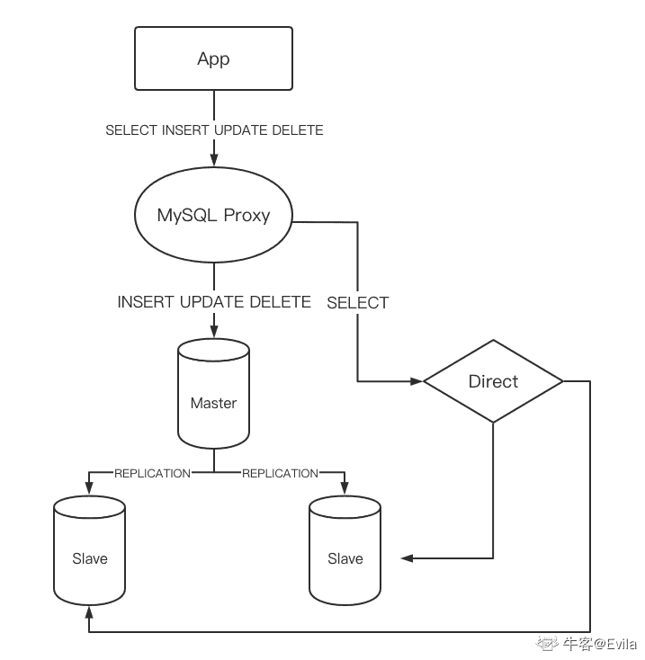

# 第七章 第 3 节 MySQL 分库分表与集群管理

> 原文：[`www.nowcoder.com/tutorial/10094/c96fa08141bb48038d364720074294d5`](https://www.nowcoder.com/tutorial/10094/c96fa08141bb48038d364720074294d5)

# 1\. 为什么需要分库分表？

关系型数据库，表中管理的数据以行记录为单元。当一张表的数据达到上千万条时，随之带来的是更高的磁盘、IO、系统开销，更复杂的索引维护，以及性能上的瓶颈。而一台服务的资源终究是有限的，因此需要对数据库和表进行合理拆分，从而使其更好的提供数据服务。

分库分表的目的在于：减小数据库的负担，提高数据库的效率，缩短查询时间。另外，因为分库分表这种改造是可控的，底层还是基于数据库管理系统，因此整个数据库的运维体系以及相关基础设施都是可重用的。

##### 分库概念：一个系统的多张数据表，存储到多个数据库实例中；

##### 分表概念：对于一张多行(记录)多列(字段)的二维数据表，分两种分表操作：

*   （1） 垂直分表: 竖向切分，不同分表存储不同的字段，可以把不常用或者大容量、或者不同业务的字段拆分出去； 优点：可以实现热数据和冷数据的分离，将不经常变化的数据和变动较大的数据分散再不同的库/表中。 缺点：没有解决数据量大带来的性能损耗，读写压力依旧很大。
*   （2） 水平分表(复杂): 横向切分，按照特定分片算法，不同分表存储不同的记录。例如根据年份来拆分不同的数据库。每个数据库结构一致，但是数据得以拆分，每个子表记录数量得到降低，从而提升性能。 优点：单库（表）的数据量得以减少，提高性能。提高了系统的稳定性和负载能力。切分出的表结构相同，应用程序只需要做子表的映射即可。 缺点：数据分片在扩容时需要迁移。数据库维护成本增加。

## 2\. 主从复制，读写分离

高并发业务服务器端，如果将对数据库的读和写都放在同一个数据库实例中，无疑是低效率的。因为读、写操作会涉及到锁的竞争，尤其是写操作，通常一个事务进行写操作时，其它并发的事务则会因为排他锁而阻塞。而在实际的业务作业中，对数据库的操作总是读多写少的，并且读的效率也高于写操作。因此，将数据库架构设计成主从集群，读写业务分离，对于高并发的数据访问是高效的解决方法。

主从架构除了带来支持高并发的优点，还使得 MySQL 数据库具有高可用的能力。主从架构中，若主服务器宕机，从服务器可以快速顶替，使得服务器具有高可用、容灾能力。

### 2.1 主从架构

如图所示为 3 个节点的主从架构的基本示意图，3 个 MySQL 集群中 1 个节点为主库(Master)，2 个节点为从节点(Slave):

*   1.主库负责接收用户的写操作，并通过更新二进制日志 BINLOG 通知从库更新数据。
*   2.从库主要负责用户的读操作(分担主服务器的读写压力)，并且负责重放 Master 的写操作(即复制主库做的写操作)，从而保证集群数据一致性、高可用、实现容灾能力。
*   3.Proxy: sql 语句代理，对读写操作请求的 SQL 指令进行路由，使得读写分离。
*   4.Direct: 负载均衡组件, 对 Mysql Proxy 分发得读操作，按照一定得一致性哈希等算法进行分发至后端的从库。

### 2.2 MySQL 数据复制过程解析(Replication)

MySQL 的数据复制(Replication)过程是将一个 MySQL 实例中的数据复制到另一个 MySQL 实例中。

MySQL 的复制（replication）是一个异步的复制，从一个 MySQLinstace（Master）复制到另一个 MySQLinstance（Slave）。Replication 功能的出现能够非常方便将某一数据库中的数据复制到多台服务器中的数据里实例中，从而实现数据备份、主从热备、数据库集群等功能。且整个过程是异步进行的，复制的延时非常小，有效的提高了数据库的处理能力，提高了数据安全性等。

整个复制操作主要由三个进程完成的，其中两个进程在 Slave 服务器上（Sql 进程和 IO 进程），另外一个进程在 Master 服务器（IO 进程）上。

要实施复制，首先必须打开 Master 端的 bin-log 功能，整个复制过程实际上就是 Slave 从 Master 端获取该日志然后再在自己端完全顺序的执行日志中所记录的各种操作。复制的基本过程如下：

*   （1）Slave 端的 I/O 进程与 Master 端的 I/O 进程建立连接，Slave 请求监控 bin-log 日志，当发现 bin-log 日志发生变化后请求获取指定位置的 bin-log 文件的日志内容，
*   （2）Master 接收到来自 Slave 的 IO 进程的请求后，通过负责复制的 IO 进程根据请求信息读取指定日志指定位置之后的日志信息，返回给 Slave 的 IO 进程。返回信息中除了日志所包含的信息之外，还包括本次返回的信息已经到 Master 端的 bin-log 文件的名称以及 bin-log 的位置；
*   （3）Slave 的 IO 进程接收到信息后，将接收到的日志内容依次添加到 Slave 端的 relay-log 文件的最末端，并将读取到的 Master 端的 bin-log 的文件名和位置记录到 master-info 文件中，以便在下一次读取的时候能够清楚的告诉 Master“我需要从某个 bin-log 的某个位置开始往后的日志内容，请发给我”；
*   （4）Slave 的 Sql 进程检测到 relay-log 中新增加了内容后，会马上解析 relay-log 的内容成为在 Master 端真实执行时候的那些可执行的内容，并在自身执行

### 2.3 MySQL 主从复制模式

*   1.  异步复制（Asynchronous replication），即主库(Master)在执行完客户端提交的事务后会立即将结果返给给客户端，主库(Master)并不关心从库(Slave)是否已经复制了本次的写操作。异步复制效率较高，因为主库不关心从库的操作。但缺点也较为明显，即主从的数据一致性无法保障，从而影响高可用和容灾能力。
*   2.  全同步复制（Fully synchronous replication），即主库(Master)执行完一个事务后不会立即返回客户端执行结果，而是等待所有的从库都执行了该事务才返回给客户端。全同步复制能够保证主从的数据一致性，但缺点是主库完成一个事务的时间会被拉长，性能降低。
*   3.  半同步复制（Semisynchronous replication），介于全同步复制与全异步复制之间的方式，主库(Master)只需要等待至少一个从库(Slave)收到主库执行的事务修改并复制动作的应答，而不需要等待所有从库给主库反馈。半同步复制能够很大程度上提高效率，同时保证主从的数据一致性。

### 2.4 bin-log 记录方式

*   1.基于 SQL 语句的复制（statement based replication），Master 端将每一条会修改数据的 SQL 记录下来，Slave 端在复制的时候会根据二进制文件重新执行相同的 SQL。这种模式的优点是 Master 端不需要记录每一行数据的变化(只记录 sql query 的执行动作)，二进制日志文件量小，IO 成本低，速度快。缺点是从库需要执行主库相同的 SQL，就需要额外的知道每条语句执行的上下文信息，以保证该相同的操作在 Slave 端执行时能够得到和 Master 同样的结果。且并非所有的 SQL 语句都能被复制，当 SQL 操作不确定或操作较为复杂时可能导致从库执行失败。
*   2.基于行记录的复制（row based replication），该模式的主要流程是，MySQL 二级制日志文件会将每一行数据修改都记录下来，然后在 Slave 端进行同样的修改。这种模式的优点是：日志文件不需要将 SQL 语句执行的上下文记录下来，只是记录哪一条数据修改了，修改成什么样子了。相较于基于 SQL 语句的复制，基于行记录的复制在任何情况都可以被复制，是相对安全可靠的复制方式。 缺点是 bin-log 的存储成倍增加。例如：执行 alter table 之类的语句的时候，由于表结构修改，每条记录都发生改变，那么该表每一条记录都会记录到日志中。这样就大增加了复制过程的 IO 成本，导致速度下降、性能下降。
*   3.混合方式复制(mixed based replication), 该模式结合了之前两种模式的优点，规避了二者的缺点。在该模式下，MySQL 会根据执行的每一条语句来区分记录日志文件的格式。举例说明，当涉及到复杂的存储过程时，采用 Row Level，规避 Statement Level 存在的某些场景无法复制的问题；当涉及到 Alter table 等操作时，采用 Statement Level 来规避 Row Level 带来的日志量巨大的问题。

### 2.5 全局事务标识(Global Transaction Identifier —— GTID)

GTID 是唯一的标识符，由 UUID(MySQL server 中的全局唯一标识) + 事务 id 组成，一个事务对应一个 GTID。GTID 自动添加到事务的头部，并写入到 bin-log 中。GTID 使得追踪和复制事务变得简单，而且能从宕机中快速恢复,如果主库(Master)宕机了，那么从库(Slave)要有顶替成为主库(Master)的方法。同理，如果宕机的机器恢复了，那么要有回到集群的方法。

以 2.1 节图中的 3 节点 MySQL 集群为例，假如已有 MySQL 集群是 A 为 Master，B 和 C 为 Slave。此时 A 宕机了，需要从 B 和 C 中重新选择一个 Master。replication 机制是异步或半同步复制，若复制模式为半同步复制，可以通过 GTID 快速选择与 Master 保持一致的 Slave 成为新的 Master；若复制方式为异步复制，那么 B 和 C 中的数据不一定包含了全部的 A 的数据，且 B 和 C 的数据也有可能不一致。此时若选择 B 为新的 Master，根据 GTID 可以追踪到 B 和 C 中已完成的事务，从而将 C 中已完成的且 B 中为完成的数据迁移到 B 中。