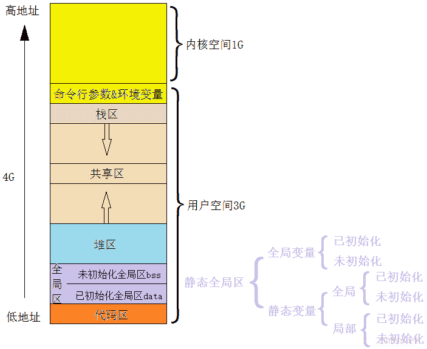

# 第一章 第 7 节 C++内存-2

> 原文：[`www.nowcoder.com/tutorial/10069/b8deade640c54d59af446a05ec9402fe`](https://www.nowcoder.com/tutorial/10069/b8deade640c54d59af446a05ec9402fe)

#### 1.2.5 初始化为 0 的全局变量在 bss 还是 data

**参考回答**

BSS 段通常是指用来存放程序中未初始化的或者初始化为 0 的全局变量和静态变量的一块内存区域。特点是可读写的，在程序执行之前 BSS 段会自动清 0。

#### 1.2.6 什么是内存泄露，内存泄露怎么检测？

**参考回答**

**什么是内存泄露？**

简单地说就是申请了一块内存空间，使用完毕后没有释放掉。（1）new 和 malloc 申请资源使用后，没有用 delete 和 free 释放；（2）子类继承父类时，父类析构函数不是虚函数。（3）Windows 句柄资源使用后没有释放。

**怎么检测？**

第一：良好的编码习惯，使用了内存分配的函数，一旦使用完毕,要记得使用其相应的函数释放掉。

第二：将分配的内存的指针以链表的形式自行管理，使用完毕之后从链表中删除，程序结束时可检查改链表。

第三：使用智能指针。

第四：一些常见的工具插件，如 ccmalloc、Dmalloc、Leaky、Valgrind 等等。

#### 1.2.7 请简述一下 atomoic 内存顺序。

**参考回答**

有六个内存顺序选项可应用于对原子类型的操作：

1.  memory_order_relaxed：在原子类型上的操作以自由序列执行，没有任何同步关系，仅对此操作要求原子性。

2.  memory_order_consume：memory_order_consume 只会对其标识的对象保证该对象存储先行于那些需要加载该对象的操作。

3.  memory_order_acquire：使用 memory_order_acquire 的原子操作，当前线程的读写操作都不能重排到此操作之前。

4.  memory_order_release：使用 memory_order_release 的原子操作，当前线程的读写操作都不能重排到此操作之后。

5.  memory_order_acq_rel：memory_order_acq_rel 在此内存顺序的读-改-写操作既是获得加载又是释放操作。没有操作能够从此操作之后被重排到此操作之前，也没有操作能够从此操作之前被重排到此操作之后。

6.  memory_order_seq_cst：memory_order_seq_cst 比 std::memory_order_acq_rel 更为严格。memory_order_seq_cst 不仅是一个"获取释放"内存顺序，它还会对所有拥有此标签的内存操作建立一个单独全序。

除非你为特定的操作指定一个顺序选项，否则内存顺序选项对于所有原子类型默认都是 memory_order_seq_cst。

#### 1.2.8 内存模型，堆栈，常量区。

**参考回答**



**内存模型（内存布局）：**

如上图，**从低地址到高地址，一个程序由代码段、数据段、** **BSS** **段组成。**

1.  **数据段：**存放程序中已初始化的全局变量和静态变量的一块内存区域。

2.  **代码段：**存放程序执行代码的一块内存区域。只读，代码段的头部还会包含一些只读的常数变量。

3.  **BSS** 段：存放程序中未初始化的全局变量和静态变量的一块内存区域。

4.  可执行程序在运行时又会多出两个区域：堆区和栈区。

    **堆区：**动态申请内存用。堆从低地址向高地址增长。

    **栈区：**存储局部变量、函数参数值。栈从高地址向低地址增长。是一块连续的空间。

5.  最后还有一个**文件映射区**，位于堆和栈之间。

**堆 heap** ：由 new 分配的内存块，其释放由程序员控制（一个 new 对应一个 delete）

**栈 stack** ：是那些编译器在需要时分配，在不需要时自动清除的存储区。存放局部变量、函数参数。

**常量存储区** ：存放常量，不允许修改。

#### 1.2.9 简述 C++中内存对齐的使用场景

**参考回答**

内存对齐应用于三种数据类型中：**struct/class/union**

struct/class/union 内存对齐原则有四个：

1.  数据成员对齐规则：结构(struct)或联合(union)的数据成员，第一个数据成员放在 offset 为 0 的地方，以后每个数据成员存储的起始位置要从该成员大小或者成员的子成员大小的整数倍开始。

2.  结构体作为成员:如果一个结构里有某些结构体成员,则结构体成员要从其内部"最宽基本类型成员"的整数倍地址开始存储。(struct a 里存有 struct b,b 里有 char,int ,double 等元素,那 b 应该从 8 的整数倍开始存储)。

3.  收尾工作:结构体的总大小，也就是 sizeof 的结果，必须是其内部最大成员的"最宽基本类型成员"的整数倍。不足的要补齐。(基本类型不包括 struct/class/uinon)。

4.  sizeof(union)，以结构里面 size 最大元素为 union 的 size，因为在某一时刻，union 只有一个成员真正存储于该地址。

**答案解析**

1.  **什么是内存对齐？**

    那么什么是字节对齐？在 C 语言中，结构体是一种复合数据类型，其构成元素既可以是基本数据类型（如 int、long、float 等）的变量，也可以是一些复合数据类型（如数组、结构体、联合体等）的数据单元。在结构体中，**编译器为结构体的每个成员按其自然边界（alignment）分配空间。**各个成员按照它们被声明的顺序在内存中顺序存储，第一个成员的地址和整个结构体的地址相同。

    为了使 CPU 能够对变量进行快速的访问，变量的起始地址应该具有某些特性，**即所谓的“对齐”，比如 4 字节的 int 型，其起始地址应该位于 4 字节的边界上，即起始地址能够被 4 整除**，也即“对齐”跟数据在内存中的位置有关。如果一个变量的内存地址正好位于它长度的整数倍，他就被称做自然对齐。

    比如在 32 位 cpu 下，假设一个整型变量的地址为 0x00000004(为 4 的倍数)，那它就是自然对齐的，而如果其地址为 0x00000002（非 4 的倍数）则是非对齐的。现代计算机中内存空间都是按照 byte 划分的，从理论上讲似乎对任何类型的变量的访问可以从任何地址开始，但实际情况是在访问特定类型变量的时候经常在特定的内存地址访问，这就需要各种类型数据按照一定的规则在空间上排列，而不是顺序的一个接一个的排放，这就是对齐。

2.  **为什么要字节对齐？**

    需要字节对齐的根本原因在于 CPU 访问数据的效率问题。假设上面整型变量的地址不是自然对齐，比如为 0x00000002，则 CPU 如果取它的值的话需要访问两次内存，第一次取从 0x00000002-0x00000003 的一个 short，第二次取从 0x00000004-0x00000005 的一个 short 然后组合得到所要的数据，如果变量在 0x00000003 地址上的话则要访问三次内存，第一次为 char，第二次为 short，第三次为 char，然后组合得到整型数据。

    而如果变量在自然对齐位置上，则只要一次就可以取出数据。一些系统对对齐要求非常严格，比如 sparc 系统，如果取未对齐的数据会发生错误，而在 x86 上就不会出现错误，只是效率下降。

    各个硬件平台对存储空间的处理上有很大的不同。一些平台对某些特定类型的数据只能从某些特定地址开始存取。比如有些平台每次读都是从偶地址开始，如果一个 int 型（假设为 32 位系统）如果存放在偶地址开始的地方，那么一个读周期就可以读出这 32bit，而如果存放在奇地址开始的地方，就需要 2 个读周期，并对两次读出的结果的高低字节进行拼凑才能得到该 32bit 数据。显然在读取效率上下降很多。

3.  **字节对齐实例**

    ```cpp
    union example {  
        int a[5];  
        char b;  
        double c;  
    };  
    int result = sizeof(example);  
    /*
    如果以最长 20 字节为准，内部 double 占 8 字节，这段内存的地址 0x00000020 并不是 double 的整数倍，只有当最小为 0x00000024 时可以满足整除 double（8Byte）同时又可以容纳 int a[5]的大小，所以正确的结果应该是 result=24
    */

    struct example {  
        int a[5];  
        char b;  
        double c;  
    }test_struct;
    int result = sizeof(test_struct);  
    /*
    如果我们不考虑字节对齐，那么内存地址 0x0021 不是 double（8Byte）的整数倍，所以需要字节对齐，那么此时满足是 double（8Byte）的整数倍的最小整数是 0x0024，说明此时 char b 对齐 int 扩充了三个字节。所以最后的结果是 result=32
    */

    struct example {  
        char b;  
        double c;  
        int a;  
    }test_struct;  
    int result = sizeof(test_struct);  
    /*
    字节对齐除了内存起始地址要是数据类型的整数倍以外，还要满足一个条件，那就是占用的内存空间大小需要是结构体中占用最大内存空间的类型的整数倍，所以 20 不是 double（8Byte）的整数倍，我们还要扩充四个字节，最后的结果是 result=24
    */
    ```